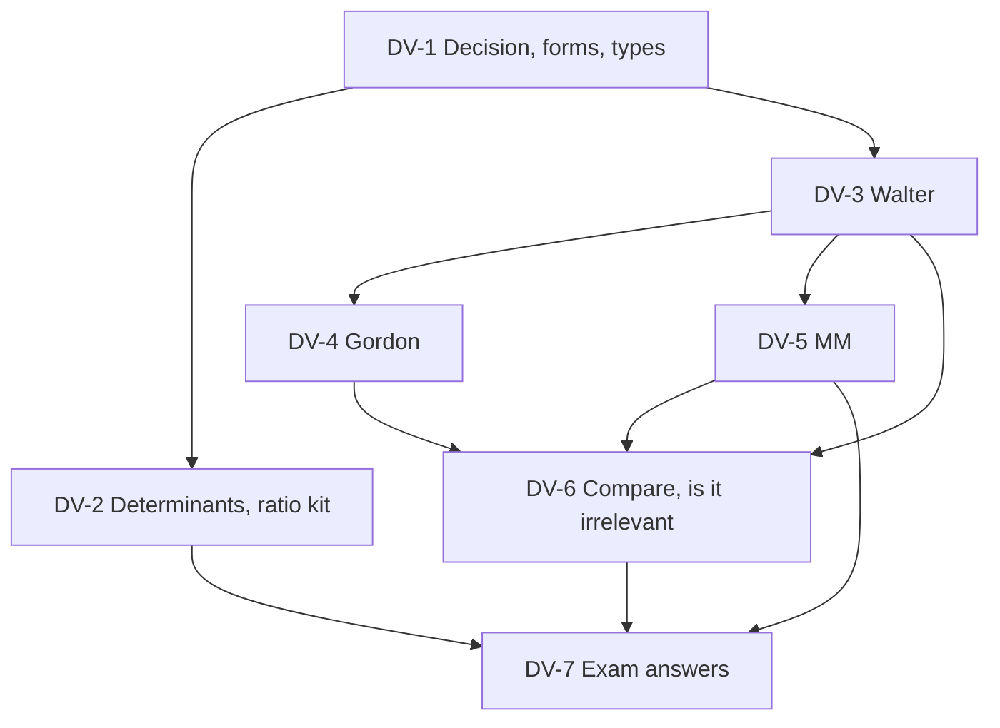

# SFM Unit 2: Dividend Theory and Policy, node map

The course plan gives a 1-hour, 30-mark paper: two of three 5-mark answers plus one 20-mark case. The vault formula sheet records CIA3 as covering Units IV and V only, so Units I and II are more likely tested at the end-semester exam **[VERIFY the date and scope with faculty]**. For this unit the case is most likely the three models run on one data set, ending in a payout recommendation. The class notes cover the dividend decision, Walter and MM only (**faculty class material**); Gordon, Lintner, determinants, bonus and buyback are textbook method. Where your class note and the textbook differ, the corrections are called out in DV-3 (Walter formula brackets) and DV-5 (the MM price explanation).

## Nodes

| Node | Topic | Deps | Minutes | Exam focus |
|---|---|---|---|---|
| DV-1 | Dividend Decision Forms and Policy Types | none | 35 | yes |
| DV-2 | Determinants and Dividend Analysis in Practice | DV-1 | 35 | yes |
| DV-3 | Walter Model | DV-1 | 35 | yes |
| DV-4 | Gordon Model | DV-3 | 35 | yes |
| DV-5 | Modigliani-Miller Irrelevance Approach | DV-3 | 40 | yes |
| DV-6 | Comparing the Models and Is Dividend Policy Irrelevant | DV-3, DV-4, DV-5 | 35 | yes |
| DV-7 | Unit 2 Exam Answers | DV-2, DV-5, DV-6 | 35 | yes |

Total reading time: about 250 minutes.

## Dependency graph

## Headline numbers to know

- Walter (E ₹10, k 10%): growth firm r 15% prices 150, 137.50, 125, 112.50, 100 at 0 to 100% payout; normal 100 throughout; declining 80 to 100.
- Gordon (same data): growth firm 200 at 50% payout, 120 at 75%, 100 at 100%; 25% and 0% invalid (br ≥ k).
- MM class example: P0 ₹80, ke 10%, D1 ₹4: P1 ₹84 with dividend, ₹88 without; ₹84 + ₹4 = ₹88.
- MM ICAI example: firm value ₹1,00,00,000 for D1 ₹5 and ₹0 (new shares 14,286 and 9,091).
- Lintner: 4.50, 5.25, 4.625 for EPS 10, 12, 8 (target 50%, c 0.5).
- Case (E ₹12, k 12%, r 15%): Walter 125.00 to 100.00; Gordon 133.33 at 50%; recommend 25% to 50% payout.
