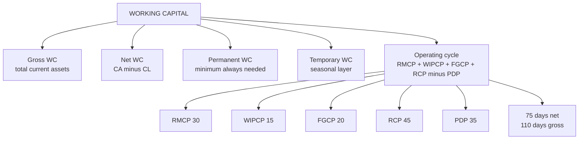

# WC-1: Working Capital Basics

Covers: gross and net working capital, permanent and temporary working capital, and the operating cycle with a worked example. This is **(textbook)** material. The faculty's own cycle (cash, inventory, sales, receivables) is in WC-6.

## Where this fits in CIA3

CIA3 is 1 hour, 30 marks. Section A is two of three questions at 5 marks, Section B is one 20-mark case. This node is the vocabulary for everything else in Unit III. A likely 5-mark question here: "Define operating cycle and explain its use" (skeleton in WC-7).

## Core definitions

- **Gross working capital** = total current assets.
- **Net working capital** = current assets − current liabilities.
- **Permanent (fixed) working capital** = the minimum level of current assets needed at all times, even in the slowest season.
- **Temporary (variable) working capital** = the seasonal or fluctuating part above the permanent level.

Permanent WC behaves like a fixed asset in how it should be funded (long-term money). Temporary WC rises and falls, so short-term money suits it. WC-2 builds the three financing approaches on exactly this split.

## Operating cycle

**Operating cycle (days) = RMCP + WIPCP + FGCP + RCP − PDP**

| Term | Meaning | Days |
|---|---|---|
| RMCP | Raw material conversion period (stock held) | 30 |
| WIPCP | Work-in-progress conversion period | 15 |
| FGCP | Finished goods conversion period | 20 |
| RCP | Receivables collection period | 45 |
| PDP | Payables deferral period | 35 |

A shorter cycle means less working capital is needed. Cash is tied up between paying suppliers and collecting from customers.

**Terminology note (textbook background).** The formula above nets off PDP, so the 75 days is strictly the *net* operating cycle, also called the cash conversion cycle. Many textbooks (Khan & Jain, Pandey) call RMCP + WIPCP + FGCP + RCP = 110 days the *gross* operating cycle and the version with PDP deducted the net cycle. The vault note treats the two as the same once PDP is netted. In the exam, write the formula in the form your teacher used, and say whether you are quoting gross or net.

## Worked example, laid out as the exam answer

**Question (illustrative data):** RMCP 30, WIPCP 15, FGCP 20, RCP 45, PDP 35 days. Find the operating cycle and say what it means.

1. Formula: operating cycle = RMCP + WIPCP + FGCP + RCP − PDP.
2. Substitute: 30 + 15 + 20 + 45 − 35.

| Stage | Days | Running total |
|---|---|---|
| Raw material held | 30 | 30 |
| Work in progress | 15 | 45 |
| Finished goods held | 20 | 65 |
| Receivables collected | 45 | 110 |
| Less payables deferred | (35) | **75** |

3. Check: 110 − 35 = 75. (Gross cycle 110 days, net cycle 75 days.)

**Decision line and interpretation:** the operating cycle is **75 days**, so the firm funds 75 days of operating cost from its own sources between paying suppliers and collecting from customers. Cut any stage and the funding need falls: faster stock turnover (RMCP, FGCP), shorter production (WIPCP), tighter collection (RCP), or longer supplier credit (PDP). Each day cut releases one day of operating cost.

## What to remember

- Gross WC = current assets. Net WC = current assets − current liabilities.
- Permanent WC is the floor that never goes away. Temporary WC is the seasonal layer above it.
- Operating cycle = RMCP + WIPCP + FGCP + RCP − PDP, in days.
- Worked example: 30 + 15 + 20 + 45 − 35 = 75 days (gross 110 without PDP).
- A shorter cycle means a smaller funding need. Name one action per stage.
- Say whether your figure is gross or net when you quote it.

## Concept map

## Flashcards
Q: What is gross working capital?
A: Total current assets.

Q: What is net working capital?
A: Current assets minus current liabilities.

Q: What is the difference between permanent and temporary working capital?
A: Permanent is the minimum level of current assets needed at all times. Temporary is the seasonal or fluctuating part above it.

Q: Write the operating cycle formula.
A: RMCP + WIPCP + FGCP + RCP − PDP, in days.

Q: Operating cycle with RMCP 30, WIPCP 15, FGCP 20, RCP 45, PDP 35?
A: 30 + 15 + 20 + 45 − 35 = 75 days (110 days before deducting PDP).

Q: What do RMCP, WIPCP, FGCP, RCP and PDP stand for?
A: Raw material conversion period, work-in-progress conversion period, finished goods conversion period, receivables collection period, payables deferral period.

Q: Why does a shorter operating cycle reduce working capital needs?
A: Less time passes between paying for inputs and collecting cash, so less money is tied up in stock and debtors.

Q: Which stage of the cycle does supplier credit lengthen, and what effect does it have?
A: PDP. A longer PDP shortens the net cycle and reduces the funds the firm must supply.

## Sources
- Vault note: `SFM CIA3 - Unit III Working Capital Finance` (section 1)
- Next node: [[SFM Unit 3 - WC-2 Financing of Working Capital]]
- [[SFM Unit 3 - Working Capital MOC (Node Map)]]
