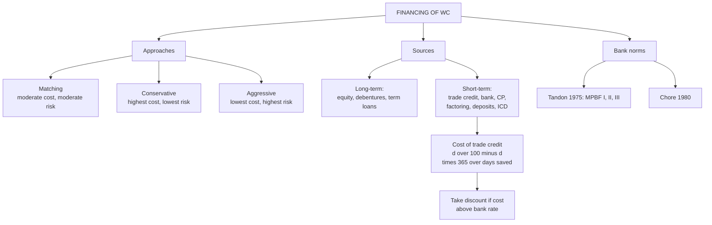

# WC-2: Financing of Working Capital

Covers: matching, conservative and aggressive financing, the sources of working capital finance, the cost of trade credit (cash discount forgone) with a worked example, and the Indian bank lending norms. All content is **(textbook)**, not taken from class.

## Where this fits in CIA3

Likely 5-mark questions: "Matching vs conservative vs aggressive financing" and "Cost of trade credit" (skeletons in WC-7). A short numeric on trade credit is a safe 5-marker.

## Three financing approaches

| | Matching (hedging) | Conservative | Aggressive |
|---|---|---|---|
| Permanent current assets | Long-term funds | Long-term funds | Long-term funds |
| Temporary current assets | Short-term funds | Long-term funds (part of it) | Short-term funds |
| Part of permanent CA on short-term funds | None | None | Yes |
| Cost | Moderate | Highest | Lowest |
| Risk (liquidity, refinancing) | Moderate | Lowest | Highest |
| Idle funds in slack season | Little | Yes | None |

Rule of thumb: match the maturity of the funding to the life of the asset. Aggressive earns more because short-term rates are usually lower, but the firm must keep renewing the loan, so refinancing and liquidity risk are highest.

## Sources of working capital finance

**Long-term:** owners' equity and retained earnings; long-term debt (debentures, term loans). These fund permanent WC.

**Short-term:**
- **Trade credit**: supplier credit; free if no discount is lost, costly if a cash discount is forgone.
- **Bank finance**:
  - *Cash credit*: a drawing limit against stock and debtors; interest charged on the amount actually used.
  - *Overdraft*: withdraw beyond the balance in a current account up to a sanctioned limit.
  - *Bill discounting*: bank pays the bill amount less discount now; collects from the drawee at maturity.
  - *Working capital loan*: fixed amount for a fixed period.
- **Commercial paper (CP)**: unsecured short-term promissory note issued by highly rated companies; cheaper than bank credit.
- **Factoring**: sale of receivables to a factor who advances cash, collects and may bear credit risk.
- **Public deposits**: short- and medium-term deposits from the public, regulated. [VERIFY current limits and eligibility under Companies Act deposit rules]
- **Inter-corporate deposits (ICDs)**: short-term loans between companies, usually with surplus cash on one side.

## Cost of trade credit (cash discount forgone)

**Annualised cost = [d / (100 − d)] × [365 / (credit period − discount period)]**

d = cash discount in percent. If the question says 360-day year, use 360.

### Worked example, laid out as the exam answer

**Question:** terms 2/10 net 30. The firm can borrow from a bank at 14%. Should it take the discount?

1. Terms: d = 2, discount period 10 days, credit period 30 days. Days saved by forgoing = 30 − 10 = 20.
2. Formula: (2 / 98) × (365 / 20).
3. Compute: 0.020408 × 18.25 = **37.24% p.a.** (on a 360-day year: 0.020408 × 18 = 36.73%).

| Terms | Discount % | Credit − discount period | Cost of forgoing | Bank rate | Action |
|---|---|---|---|---|---|
| 2/10 net 30 | 2 | 20 days | 37.24% | 14% | Take discount, borrow, pay on day 10 |
| 2/10 net 60 | 2 | 50 days | 14.90% | 14% | Take discount, borrow (gain 0.90%) |

For 2/10 net 60: 0.020408 × (365 / 50) = 0.020408 × 7.3 = 14.90%.

**Decision line and interpretation:** forgoing the discount costs 37.24%, far above the 14% bank rate, so **take the discount and borrow to pay on day 10**. Under 2/10 net 60 the cost of forgoing falls to 14.90%, which only just exceeds 14%, so the bank loan still wins but by a thin margin. A small rise in the bank rate would reverse the answer. Rule: take the discount when the cost of forgoing it exceeds the cost of short-term borrowing.

## Indian bank working capital norms (historical)

- **Tandon Committee (1975)**: stressed lending on the basis of a projected need, the borrower's own margin, and the **maximum permissible bank finance (MPBF)** methods I, II and III, which differ in how much of the funding the borrower provides from long-term sources.
- **Chore Committee (1980)**: pushed for the second method, quarterly information and discipline in cash credit use.
- [VERIFY] The MPBF framework was formally relaxed in 1997 and banks now assess WC needs on their own (turnover method for smaller limits, cash budget for larger). Treat the above as history and cite it only if the question asks.

**Correction to the vault note.** The vault says "25% of CA under method I". The textbook position is: **Method I**, borrower contributes 25% of the *working capital gap* (CA − CL), giving a current ratio of about 1.18; **Method II**, borrower contributes 25% of *total current assets*, current ratio 1.33; **Method III**, borrower contributes 25% of current assets *excluding core current assets*. [VERIFY against your textbook]

*Illustrative check:* CA 100, other current liabilities 40. Gap = 60. Method I MPBF = 0.75 × 60 = 45 (current ratio 100 / 85 = 1.18). Method II MPBF = 0.75 × 100 − 40 = 35 (current ratio 100 / 75 = 1.33).

## What to remember

- Matching: short-term funds for temporary CA, long-term for permanent. Conservative: safest, costliest. Aggressive: cheapest, riskiest.
- Sources: trade credit, cash credit, overdraft, bill discounting, WC loan, CP, factoring, public deposits, ICDs.
- Cost of trade credit = d/(100 − d) × 365/(credit period − discount period).
- 2/10 net 30 costs 37.24% p.a. and 2/10 net 60 costs 14.90%. Compare with the bank rate.
- Take the discount if the cost of forgoing it exceeds the borrowing rate.
- Tandon, Chore and MPBF are history. Mention only if asked.

## Concept map

## Flashcards
Q: Which financing approach funds temporary current assets with short-term money and permanent with long-term?
A: The matching (hedging) approach.

Q: Which approach has the highest cost and lowest risk?
A: Conservative: long-term funds also finance part of temporary current assets, so there are idle funds in slack season.

Q: Which approach carries the highest risk and lowest cost, and why?
A: Aggressive: short-term funds finance part of permanent current assets, so the firm must keep refinancing.

Q: Write the cost of trade credit formula.
A: [d / (100 − d)] × [365 / (credit period − discount period)].

Q: Cost of forgoing 2/10 net 30?
A: (2/98) × (365/20) = 37.24% p.a. (36.73% on a 360-day year).

Q: Cost of forgoing 2/10 net 60, and what is the decision against a 14% bank loan?
A: 14.90%. It exceeds 14%, so take the discount and borrow, though only by a thin margin.

Q: Difference between cash credit and overdraft?
A: Cash credit is a drawing limit against stock and debtors. Overdraft lets a current account go below zero up to a sanctioned limit.

Q: What is bill discounting?
A: The bank pays the bill amount less discount now and collects from the drawee at maturity.

Q: What is commercial paper?
A: An unsecured short-term promissory note issued by highly rated companies, cheaper than bank credit.

Q: What did the Tandon Committee introduce?
A: Lending based on projected need and the borrower's own margin, through the maximum permissible bank finance (MPBF) methods I, II and III.

Q: In Tandon Method II, how much does the borrower contribute?
A: 25% of total current assets, giving a current ratio of 1.33. Method I is 25% of the working capital gap.

## Sources
- Vault note: `SFM CIA3 - Unit III Working Capital Finance` (section 2)
- Textbook method: Prasanna Chandra, I M Pandey, Khan & Jain
- Next node: [[SFM Unit 3 - WC-3 Optimum Cash Balance Baumol and Miller-Orr]]
- [[SFM Unit 3 - Working Capital MOC (Node Map)]]
