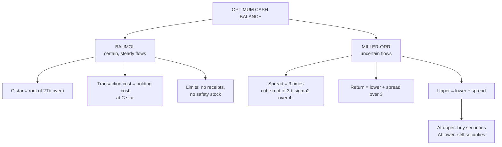

# WC-3: Optimum Cash Balance, Baumol and Miller-Orr

Covers: the Baumol model for steady cash flows and the Miller-Orr model for uncertain flows, each with a worked example, their assumptions and limitations, and when to use which. All content is **(textbook)**. The class cash budget (Arjun Enterprises Part A) is in WC-6.

## Where this fits in CIA3

A formula-driven 5-mark sum or a component of the 20-mark case. The 5-mark "Baumol vs Miller-Orr" skeleton is in WC-7. Learn both formulas and one numeric each.

## Baumol model (inventory approach to cash)

**C\* = √(2 × T × b / i)**

- T = total cash needed for the period
- b = fixed cost per transaction (selling securities or borrowing)
- i = opportunity cost of holding cash (interest rate per period)
- C\* = optimum amount raised each time

Total cost = (T / C) × b + (C / 2) × i. At C\* the two parts are equal.

**Assumptions:** cash outflow is steady and predictable; no cash receipts during the period; constant transaction cost; constant opportunity cost; no minimum safety stock.

**Limitations:** real cash flows are uneven and uncertain; ignores receipts; the cost of a transaction is not always fixed; no allowance for a safety balance.

### Worked example, laid out as the exam answer

**Question (illustrative):** T = ₹6,00,000 a year, b = ₹150 per transaction, i = 10% a year. Find the optimum cash balance.

1. Formula: C\* = √(2Tb / i).
2. C\* = √(2 × 6,00,000 × 150 / 0.10) = √(1,80,00,00,000) = **₹42,426**.
3. Transactions per year = 6,00,000 / 42,426 = 14.14 (about 14).

| Cost | Working | ₹ |
|---|---|---|
| Transaction cost | 14.14 × 150 | 2,121 |
| Holding cost | (42,426 / 2) × 0.10 | 2,121 |
| **Total cost** | | **4,243** |

4. Check: the two costs are equal at C\*, as they must be. Try C = ₹60,000: 10 × 150 + 30,000 × 0.10 = 1,500 + 3,000 = ₹4,500, which is higher.

**Decision line and interpretation:** raise ₹42,426 each time, about 14 times a year, at a total cost of ₹4,243. Raising a larger amount saves transaction fees but costs more in idle cash. The model holds only if outflows are steady with no receipts, so for a firm with volatile flows move to Miller-Orr.

## Miller-Orr model (uncertain, fluctuating flows)

Two control limits and a return point.

- **Spread = 3 × (¾ × b × σ² / i)^(1/3)**
- **Return point = Lower limit + Spread / 3**
- **Upper limit = Lower limit + Spread**

σ² = variance of **daily** net cash flows. i = **daily** interest rate (annual rate / 365 or 360, whichever the question gives). The lower limit is set by management as the safety minimum.

Spread widens with higher transaction cost and higher variance, and narrows with a higher interest rate.

### Worked example, laid out as the exam answer

**Question (illustrative):** b = ₹100, standard deviation of daily net cash flow σ = ₹1,000, daily interest rate 0.04%, lower limit ₹20,000. Find the control limits and the action rules.

1. Variance σ² = 1,000² = 10,00,000. Daily rate i = 0.0004.
2. Inside the bracket: ¾ × 100 × 10,00,000 / 0.0004 = 1.875 × 10¹¹. Cube root = 5,724.
3. Spread = 3 × 5,724 = **₹17,171**.

| Item | Working | ₹ |
|---|---|---|
| Lower limit | given | 20,000 |
| Return point | 20,000 + 17,171 / 3 | **25,724** |
| Upper limit | 20,000 + 17,171 | **37,171** |

4. Action rules: if cash touches ₹37,171, buy securities worth 37,171 − 25,724 = **₹11,447** (back to 25,724). If cash falls to ₹20,000, sell securities worth 25,724 − 20,000 = **₹5,724**.

**Decision line and interpretation:** keep cash between ₹20,000 and ₹37,171, returning to ₹25,724 whenever a limit is hit. Do nothing inside the band. The return point sits one third of the spread above the lower limit, not in the middle, so the upper limit is further away than the lower one.

## Baumol vs Miller-Orr

| | Baumol | Miller-Orr |
|---|---|---|
| Cash flows | Certain, steady outflow | Random, fluctuating |
| Controls | One: order size C\* | Two limits and a return point |
| Inputs | T, b, i | b, σ², i, lower limit |
| Best for | Predictable cash needs | Volatile cash needs |

## What to remember

- Baumol: C\* = √(2Tb/i). Total cost = (T/C) × b + (C/2) × i, and the two parts are equal at C\*.
- Baumol example: ₹6,00,000, ₹150, 10% gives C\* ₹42,426, about 14 transactions, total cost ₹4,243.
- Baumol assumes steady outflow, no receipts, fixed costs, no safety stock.
- Miller-Orr: spread = 3 × (¾ b σ² / i)^(1/3); return = lower + spread/3; upper = lower + spread.
- Miller-Orr example: spread ₹17,171, return ₹25,724, upper ₹37,171. Use the daily variance and the daily rate.
- Spread widens with b and σ², narrows with i.

## Concept map

## Flashcards
Q: Write the Baumol formula and define each term.
A: C* = √(2Tb/i). T is total cash needed, b is cost per transaction, i is the opportunity cost of holding cash.

Q: What is true of transaction cost and holding cost at C* in the Baumol model?
A: They are equal.

Q: Baumol with T = ₹6,00,000, b = ₹150, i = 10%: what are C*, transactions and total cost?
A: C* = ₹42,426; about 14 transactions (14.14); total cost ₹4,243 (2,121 + 2,121).

Q: Name the main assumptions and limitations of Baumol.
A: Steady predictable outflow, no receipts, constant costs, no safety stock. Real flows are uneven and uncertain.

Q: Write the Miller-Orr spread, return point and upper limit.
A: Spread = 3 × (¾ × b × σ² / i)^(1/3); return = lower + spread/3; upper = lower + spread.

Q: In Miller-Orr, which variance and which interest rate do you use?
A: The variance of daily net cash flows and the daily interest rate.

Q: Miller-Orr with b = ₹100, σ² = 10,00,000, i = 0.04% a day, lower limit ₹20,000: what are the limits?
A: Spread ₹17,171, return point ₹25,724, upper limit ₹37,171.

Q: What does the firm do when cash hits the upper limit, and when it hits the lower limit?
A: Upper: buy securities to return to the return point (₹11,447 in the example). Lower: sell securities to return (₹5,724).

Q: How does the Miller-Orr spread change with b, σ² and i?
A: It widens with higher b and higher σ², and narrows with higher i.

Q: When should you use Baumol and when Miller-Orr?
A: Baumol for predictable cash needs, Miller-Orr for volatile cash flows.

## Sources
- Vault note: `SFM CIA3 - Unit III Working Capital Finance` (section 3)
- Textbook method: Prasanna Chandra, I M Pandey, Khan & Jain
- Next node: [[SFM Unit 3 - WC-4 Receivables Management and Credit Policy]]
- [[SFM Unit 3 - Working Capital MOC (Node Map)]]
