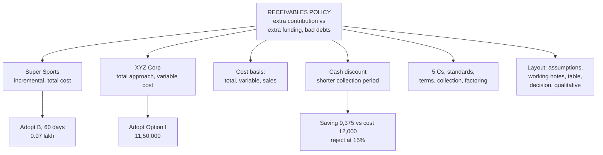

# WC-4: Receivables Management and Credit Policy

Covers: the two **(class)** credit policy problems (Super Sports, XYZ Corporation), the choice of cost basis for investment in debtors, the 5 Cs, credit terms and collection, factoring, a cash discount example, and the generic layout for any credit-policy case. The two class problems are faculty material. The cost-basis note, the 5 Cs, factoring and the cash discount example are **(textbook)**. This is the most likely 20-mark case.

## Where this fits in CIA3

The 20-mark case is almost certainly a credit policy evaluation, as in the two class problems. Learn the layout cold. Receivables policy trades off **extra sales and contribution** against **extra investment in debtors, bad debts and collection cost**. Decide using incremental profit. The cost of credit is a cost of capital on the money tied up in debtors, not just interest paid.

## Class problem 1: Super Sports (incremental approach, investment at TOTAL cost) (class)

**Data.** Sales ₹50 lakh at 30 days credit. Variable cost 80% of sales, fixed cost ₹6 lakh p.a., required pre-tax return 20%. 360-day year.

| Policy | Present | A | B | C | D |
|---|---|---|---|---|---|
| Credit period (days) | 30 | 45 | 60 | 75 | 90 |
| Sales (₹ lakh) | 50 | 56 | 60 | 62 | 63 |

**Method:** debtors turnover = 360 ÷ collection period; total cost = VC + FC; average investment in debtors = total cost ÷ turnover; additional investment vs present; cost @ 20%; incremental contribution = Δsales × 20% (contribution margin = 1 − 0.80); incremental profit = incremental contribution − cost of additional investment.

| (₹ lakh) | Present 30d | A 45d | B 60d | C 75d | D 90d |
|---|---|---|---|---|---|
| Sales | 50 | 56 | 60 | 62 | 63 |
| Debtors turnover | 12 | 8 | 6 | 4.8 | 4 |
| Total cost (0.8 × sales + 6) | 46.00 | 50.80 | 54.00 | 55.60 | 56.40 |
| Average investment in debtors | 3.83 | 6.35 | 9.00 | 11.58 | 14.10 |
| Additional investment | - | 2.52 | 5.17 | 7.75 | 10.27 |
| Cost of additional investment @ 20% | - | 0.50 | 1.03 | 1.55 | 2.05 |
| Incremental sales | - | 6 | 10 | 12 | 13 |
| Incremental contribution @ 20% | - | 1.20 | 2.00 | 2.40 | 2.60 |
| **Incremental profit** | - | **0.70** | **0.97** | **0.85** | **0.55** |

Check on unrounded figures: A 0.697, B 0.967, C 0.850, D 0.547, so the table rounds to 0.70, 0.97, 0.85, 0.55. (Recomputed: every line of the table agrees.)

**Decision line and interpretation: adopt Policy B (60 days)**, highest incremental profit at ₹0.97 lakh. **Highest sales is not the best policy.** Policy D has the most sales but its extra investment (₹10.27 lakh, costing ₹2.05 lakh) eats most of the extra contribution (₹2.60 lakh), leaving ₹0.55 lakh. Beyond 60 days each extra step adds less contribution than it costs in funding.

## Class problem 2: XYZ Corporation (total approach, investment at VARIABLE cost, with bad debts) (class)

**Data.** Credit sales ₹50,00,000, receivables turnover 4, bad debts ₹1,50,000. Required return 25% on investment in receivables; variable cost 70% of sales (contribution 30%).

- Option I: sales ₹60,00,000, turnover 3, bad debts ₹3,00,000.
- Option II: sales ₹67,50,000, turnover 2.4, bad debts ₹4,50,000.

**Method:** average receivables = sales ÷ turnover; investment = average receivables × 70%; cost = investment × 25%; final contribution = contribution (30% of sales) − bad debts − cost of investment.

| (₹) | Present | Option I | Option II |
|---|---|---|---|
| Credit sales | 50,00,000 | 60,00,000 | 67,50,000 |
| Turnover | 4 | 3 | 2.4 |
| Average receivables (sales ÷ turnover) | 12,50,000 | 20,00,000 | 28,12,500 |
| Investment (× 70%) | 8,75,000 | 14,00,000 | 19,68,750 |
| Cost of investment @ 25% | 2,18,750 | 3,50,000 | 4,92,187.50 |
| Contribution (30% of sales) | 15,00,000 | 18,00,000 | 20,25,000 |
| Less bad debts | 1,50,000 | 3,00,000 | 4,50,000 |
| Less cost of investment | 2,18,750 | 3,50,000 | 4,92,187.50 |
| **Final contribution** | **11,31,250** | **11,50,000** | **10,82,812.50** |

**Decision line and interpretation: adopt Option I** (₹11,50,000). It beats Present by ₹18,750 and Option II by ₹67,187.50. Option II adds the most sales but its bad debts (₹4,50,000) and funding cost (₹4,92,187.50) overwhelm the extra contribution, so it falls ₹48,437.50 below Present.

Incremental cross-check for Option I against Present: extra contribution 3,00,000 − extra bad debts 1,50,000 − extra cost of investment 1,31,250 = **₹18,750**. Both approaches give the same answer.

## Which cost basis? (textbook)

> **Which cost basis for investment in debtors?**
> - **Total cost** (VC + FC): use when fixed cost is given and the question signals it, as in Super Sports.
> - **Variable cost only**: the ICAI and most textbooks' default, because fixed costs do not change with the credit policy and so are not an *incremental* investment.
> - **Sales value**: rare; only if the question says so.
> - **Always state the basis as an assumption.**
>
> Check: Super Sports on a variable-cost basis (investment = 0.8 × sales ÷ turnover) gives incremental profit A 0.75, B 1.07, C 1.00, D 0.75. **B still wins**, so the decision is unchanged here. (Variable-cost investments: 3.33 / 5.60 / 8.00 / 10.33 / 12.60.)

The class answer for Super Sports is the total-cost version. Give that in the exam; mention the variable-cost version as a note. (Recomputed: variable-cost increments A 0.747, B 1.067, C 1.000, D 0.747.) Note that the XYZ problem in class uses a variable-cost investment but starts from average receivables at sales value, so read the question and copy the class method for that data shape.

## The 5 Cs of credit

Character (willingness to pay), Capacity (ability to repay from cash flows), Capital (financial strength), Collateral (security offered), Conditions (economic and industry environment).

## Credit terms and collection

- **Credit terms**: credit period (e.g. net 30) and cash discount (e.g. 2/10 net 30).
- **Credit standards**: how strict the screening is. Tighter standards lower bad debts and receivables but lose sales.
- **Collection policy**: reminders, calls, legal action, factoring. More effort cuts collection period and bad debts but costs money.
- **Factoring**: the factor buys receivables, advances up to about 80% immediately, and collects from the customer. *With recourse*, the seller bears the bad debt; *without recourse*, the factor does, for a higher fee. Cost = factor commission plus interest on the advance, set against savings in collection cost and bad debts.

## Cash discount policy (change in collection period)

Question pattern: offer a discount; some customers take it, so the average collection period falls; compare the saving with the cost of the discount.

### Worked example, laid out as the exam answer

**Question (illustrative):** credit sales ₹12,00,000 a year (360-day year), variable cost 75% of sales, present collection period 60 days, required return 15%. Offer 2/10 net 60; 50% of customers take the discount, the rest still pay on day 60.

1. Assumptions: investment at variable cost (75%); 360 days; no change in sales or bad debts.
2. New average collection period = 0.5 × 10 + 0.5 × 60 = **35 days**.
3. Receivables: before 12,00,000 × 60 / 360 = ₹2,00,000; after 12,00,000 × 35 / 360 = ₹1,16,667.
4. Investment at 75%: before ₹1,50,000, after ₹87,500; fall ₹62,500.

| Item | ₹ |
|---|---|
| Saving in cost of funds (62,500 × 15%) | 9,375 |
| Cost of discount (12,00,000 × 50% × 2%) | (12,000) |
| **Net effect** | **(2,625)** |

**Decision line and interpretation:** net effect is −₹2,625, so **reject** the discount at 15%. At 20% the saving would be ₹12,500 and the gain ₹500, so the answer depends on the required return. If the discount also raises sales, add the incremental contribution on the extra sales and the investment on those sales.

## Generic layout for any credit-policy evaluation

1. State assumptions: cost basis, days in year, whether bad debts or collection cost change, tax ignored.
2. Compute for each policy: sales, turnover (days in year ÷ period), average receivables.
3. Investment in receivables (stated cost basis).
4. Cost of investment at the required return.
5. Contribution (or total profit) less bad debts, discount, collection cost, cost of investment.
6. **Incremental approach**: compare each policy against the present on increments. **Total approach**: compute final profit for each and rank. Both give the same decision.
7. Decision, then qualitative factors.

## What to remember

- Super Sports (total-cost basis): incremental profit A 0.70, B 0.97, C 0.85, D 0.55 lakh. Adopt B (60 days).
- Super Sports investment: 3.83 / 6.35 / 9.00 / 11.58 / 14.10 lakh. On a variable-cost basis B still wins (1.07).
- XYZ: final contribution Present ₹11,31,250, Option I ₹11,50,000, Option II ₹10,82,812.50. Adopt Option I.
- Highest sales is not the best policy. Extra contribution must beat extra funding cost and bad debts.
- Always state the cost basis (total, variable or sales) as an assumption.
- Cash discount: new collection period × sales gives new receivables; compare the funding saving with the discount cost.

## Concept map

## Flashcards
Q: Super Sports: which policy is best and why?
A: B (60 days), incremental profit ₹0.97 lakh. D has the highest sales but only ₹0.55 lakh.

Q: Super Sports average investment in debtors per policy (total cost)?
A: ₹3.83 / 6.35 / 9.00 / 11.58 / 14.10 lakh for Present, A, B, C, D.

Q: Super Sports incremental profit for A, B, C, D?
A: 0.70, 0.97, 0.85 and 0.55 lakh (unrounded 0.697, 0.967, 0.850, 0.547).

Q: Super Sports method: how is investment in debtors computed?
A: Total cost (0.8 × sales + 6 lakh) divided by debtors turnover (360 ÷ collection period).

Q: Super Sports on a variable-cost basis?
A: Incremental profit A 0.75, B 1.07, C 1.00, D 0.75 lakh. B still wins.

Q: XYZ Corporation: which option, and what are the final contributions?
A: Option I at ₹11,50,000. Present is ₹11,31,250 and Option II ₹10,82,812.50.

Q: Final contribution formula in XYZ's layout?
A: 30% of sales − bad debts − 25% × (70% × sales ÷ turnover).

Q: By how much does XYZ Option I beat Present, and what is the incremental check?
A: ₹18,750 = extra contribution 3,00,000 − extra bad debts 1,50,000 − extra cost of investment 1,31,250.

Q: Which cost basis for investment in debtors?
A: Total cost when fixed cost is given and signalled, variable cost as the ICAI default, sales value only if told. Always state it.

Q: What are the 5 Cs of credit?
A: Character, Capacity, Capital, Collateral, Conditions.

Q: What is the difference between factoring with recourse and without recourse?
A: With recourse the seller bears the bad debt. Without recourse the factor bears it, for a higher fee.

Q: Cash discount 2/10 net 60, 50% take it, sales ₹12,00,000, 75% variable cost, 15% return: net effect?
A: New collection period 35 days; saving ₹9,375 against discount cost ₹12,000; net −₹2,625, reject.

Q: List the steps of the generic credit-policy layout.
A: Assumptions; sales, turnover and average receivables; investment at stated cost basis; cost at required return; contribution less bad debts, discount, collection cost and funding cost; incremental or total comparison; decision and qualitative factors.

## Sources
- Faculty class material: Super Sports and XYZ Corporation problems
- Textbook method: Prasanna Chandra, I M Pandey, Khan & Jain, ICAI
- Vault note: `SFM CIA3 - Unit III Working Capital Finance` (section 4)
- Next node: [[SFM Unit 3 - WC-5 Inventory EOQ and Stock Levels]]
- [[SFM Unit 3 - Working Capital MOC (Node Map)]]
