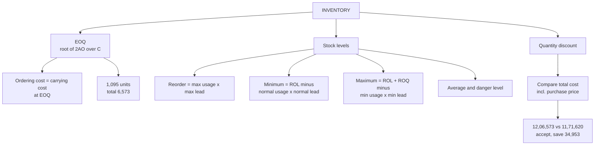

# WC-5: Inventory, EOQ and Stock Levels

Covers: the EOQ formula with a worked example, the five stock levels (reorder, minimum, maximum, average, danger), and the quantity discount decision. All content here is **(textbook)**. The class version of stock levels and EOQ (Arjun Enterprises Parts C and D) is in WC-6, and the faculty notation EOQ = √(2AB/S) is noted there.

## Where this fits in CIA3

A formula-heavy 5-mark sum, or one part of the integrated 20-mark case. The 5-mark skeleton "EOQ and stock levels" is in WC-7.

## EOQ

**EOQ = √(2AO / C)**

- A = annual requirement (units)
- O = ordering cost per order
- C = carrying cost per unit per year

At EOQ, ordering cost equals carrying cost. If carrying cost is a percentage of price, C = price × percentage. Assumptions: constant demand, constant costs, instant delivery, no stock-outs.

### Worked example, laid out as the exam answer

**Question (illustrative):** A = 24,000 units, O = ₹150, C = ₹6 per unit a year.

1. EOQ = √(2 × 24,000 × 150 / 6) = √12,00,000 = **1,095 units** (1,095.45).
2. Orders per year = 24,000 / 1,095.45 = 21.9.

| Cost | Working | ₹ |
|---|---|---|
| Ordering cost | 21.9 × 150 | 3,286 |
| Carrying cost | (1,095 / 2) × 6 | 3,286 |
| **Total (ordering + carrying)** | | **6,573** |

3. Rounding note: with the whole-number EOQ of 1,095, ordering cost is 21.918 × 150 = 3,288 and carrying cost is 547.5 × 6 = 3,285. The two parts differ by ₹3 but still sum to ₹6,573. The vault's equal ₹3,286 figures use the unrounded EOQ of 1,095.45.

**Decision line and interpretation:** order **1,095 units about 22 times a year** at a relevant cost of ₹6,573. A bigger lot saves ordering cost but costs more to carry, and the total is lowest where the two are equal.

## Stock levels

**Data (illustrative):** maximum usage 600 units a day, normal usage 400, minimum usage 200; lead time maximum 8 days, normal 6, minimum 4; ROQ = 1,200 units.

| Level | Formula | Value |
|---|---|---|
| Reorder level | Max usage × max lead time | 600 × 8 = **4,800** |
| Minimum level | ROL − (normal usage × normal lead time) | 4,800 − 2,400 = **2,400** |
| Maximum level | ROL + ROQ − (min usage × min lead time) | 4,800 + 1,200 − 800 = **5,200** |
| Average stock | Minimum level + ½ ROQ | 2,400 + 600 = **3,000** |
| Danger level | Normal (average) usage × emergency lead time | 400 × 2 days = **800** (emergency lead time assumed 2 days) |

**Assumption flag:** the question gives no emergency lead time. The 2 days is assumed. In the exam, state "emergency lead time assumed as 2 days" in your assumptions, or use the fallback your teacher gave.

Alternative average stock: (min + max) / 2 = (2,400 + 5,200) / 2 = 3,800. The class used **minimum level + ½ ROQ** in the Arjun case (WC-6), so default to that and mention (min + max)/2 only as a note. [VERIFY which version faculty prefers] The danger-level formula varies by textbook (some use average usage × emergency lead time); state the one you use.

## Quantity discount decision

Compare **total cost** (purchase + ordering + carrying) at EOQ against total cost at the discount quantity. Carrying cost is a percentage of the price actually paid, so it falls out of the discount price.

### Worked example, laid out as the exam answer

**Question (illustrative):** A = 24,000 units, O = ₹150, price ₹50, carrying cost 12% of price. Supplier offers ₹48.50 per unit for orders of 2,000 or more.

1. At ₹50: C = 12% × 50 = ₹6; EOQ = √(2 × 24,000 × 150 / 6) = 1,095.
2. At ₹48.50: C = 12% × 48.50 = ₹5.82; order size 2,000.

| | At EOQ (₹50) | At 2,000 (₹48.50) |
|---|---|---|
| Order size | 1,095 | 2,000 |
| Purchase cost | 12,00,000 | 11,64,000 |
| Ordering cost | 3,286 | 1,800 |
| Carrying cost | 3,286 | 5,820 |
| **Total cost** | **12,06,573** | **11,71,620** |

3. Workings for the discount column: ordering 24,000 / 2,000 × 150 = 1,800; carrying (2,000 / 2) × 5.82 = 5,820; purchase 24,000 × 48.50 = 11,64,000.
4. Saving = 12,06,573 − 11,71,620 = **₹34,953** (34,952.67 unrounded).

**Decision line and interpretation: accept the discount.** The purchase saving of ₹36,000 is far larger than the extra carrying and ordering cost of about ₹1,047 (rise of 2,534 in carrying less 1,486 saved in ordering). Reject only if the extra stock risks obsolescence or storage limits not captured in the 12%.

## What to remember

- EOQ = √(2AO/C). At EOQ ordering cost = carrying cost.
- Example: A 24,000, O ₹150, C ₹6 gives EOQ 1,095 and total ordering plus carrying cost ₹6,573.
- ROL = max usage × max lead. Min = ROL − normal usage × normal lead. Max = ROL + ROQ − min usage × min lead.
- Example levels: ROL 4,800, minimum 2,400, maximum 5,200, average 3,000 by min + ½ ROQ (3,800 by (min + max)/2), danger 800.
- Danger level uses an emergency lead time the question may not give. State the assumption.
- Quantity discount: compare total cost including purchase price. Example saves ₹34,953, so accept.

## Concept map

## Flashcards
Q: Write the EOQ formula and define each term.
A: EOQ = √(2AO/C). A is annual requirement, O is cost per order, C is carrying cost per unit per year.

Q: What is true of ordering cost and carrying cost at EOQ?
A: They are equal.

Q: EOQ for A = 24,000, O = ₹150, C = ₹6?
A: 1,095 units; about 21.9 orders; total ordering plus carrying cost ₹6,573.

Q: If carrying cost is 12% of price and price is ₹50, what is C?
A: ₹6 per unit a year.

Q: Reorder, minimum and maximum level formulas?
A: ROL = max usage × max lead; Min = ROL − normal usage × normal lead; Max = ROL + ROQ − min usage × min lead.

Q: Stock levels for max/normal/min usage 600/400/200, lead 8/6/4 days, ROQ 1,200?
A: ROL 4,800; minimum 2,400; maximum 5,200; average 3,000 (min + ½ ROQ).

Q: What are the two ways to compute average stock?
A: Minimum level + ½ ROQ gives 3,000 (the class default); (Min + Max) / 2 gives 3,800. Use the one the question or class states.

Q: What is the danger level, and what assumption does it need?
A: Usage × emergency lead time. In the example 400 × 2 = 800, with the 2 days assumed since the question did not give it.

Q: How do you decide on a quantity discount?
A: Compare total cost (purchase + ordering + carrying) at EOQ with total cost at the discount quantity, using carrying cost at the discount price.

Q: Quantity discount example: which total cost is lower and by how much?
A: At 2,000 units for ₹48.50: ₹11,71,620 against ₹12,06,573 at EOQ, a saving of ₹34,953. Accept.

## Sources
- Vault note: `SFM CIA3 - Unit III Working Capital Finance` (section 5)
- Textbook method: Prasanna Chandra, I M Pandey, Khan & Jain, ICAI
- Next node: [[SFM Unit 3 - WC-6 Integrated Working Capital and Arjun Case]]
- [[SFM Unit 3 - Working Capital MOC (Node Map)]]
