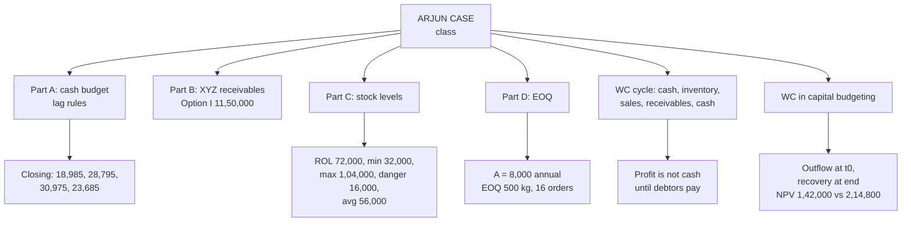

# WC-6: Integrated Working Capital and the Arjun Case

Covers: the **(class)** Arjun Enterprises case (cash budget, receivables, stock levels, EOQ), the faculty's working capital cycle, and the **(textbook)** link between working capital and capital investment (NPV with a working capital outflow). This is the shape the 20-mark case may take, so each part must be fast and exact.

## Where this fits in CIA3

The Arjun case is a single integrated problem in four parts. Part B is the XYZ problem again (WC-4), Part C uses the stock level formulas (WC-5), Part D is EOQ (WC-5). Part A, the cash budget, is new and is done by lag rules.

## Class case: Arjun Enterprises (class)

### Part A: Cash budget, January to April 2005

Opening cash ₹15,000 on 1 January. Credit sales collected after 2 months; purchases paid after 2 months; wages paid on the 1st of the next month; manufacturing, administration and selling expenses each paid one month later. Dividend ₹10,000 in April. Plant ₹5,000 on 15 January. Building bought 1 March, instalments of ₹2,000 a month paid in March and April.

Monthly data (₹):

| | Nov | Dec | Jan | Feb | Mar | Apr |
|---|---|---|---|---|---|---|
| Credit sales | 30,000 | 35,000 | 25,000 | 30,000 | 35,000 | 40,000 |
| Purchases | 15,000 | 20,000 | 15,000 | 20,000 | 22,500 | 25,000 |
| Wages | 3,000 | 3,200 | 2,500 | 3,000 | 2,400 | 2,600 |
| Manufacturing exp. | 1,150 | 1,225 | 990 | 1,050 | 1,100 | 1,200 |
| Administration exp. | 1,060 | 1,040 | 1,100 | 1,150 | 1,220 | 1,180 |
| Selling exp. | 500 | 550 | 600 | 620 | 570 | 710 |

**Lag rules (working notes):**
- Receipts in month M = credit sales of month M − 2 (Jan collects Nov; Apr collects Feb).
- Purchase payments in month M = purchases of month M − 2.
- Wages paid in month M = wages of month M − 1.
- Manufacturing, admin and selling expenses paid in month M = that expense of month M − 1.
- Capital items (plant, building instalments) and dividend fall in the month they occur.

**Cash budget:**

| (₹) | Jan | Feb | Mar | Apr |
|---|---|---|---|---|
| Opening balance | 15,000 | 18,985 | 28,795 | 30,975 |
| Receipts: collections from debtors | 30,000 | 35,000 | 25,000 | 30,000 |
| **Cash available** | **45,000** | **53,985** | **53,795** | **60,975** |
| Payments: purchases | 15,000 | 20,000 | 15,000 | 20,000 |
| Wages | 3,200 | 2,500 | 3,000 | 2,400 |
| Manufacturing expenses | 1,225 | 990 | 1,050 | 1,100 |
| Administration expenses | 1,040 | 1,100 | 1,150 | 1,220 |
| Selling expenses | 550 | 600 | 620 | 570 |
| Plant | 5,000 | - | - | - |
| Building instalment | - | - | 2,000 | 2,000 |
| Dividend | - | - | - | 10,000 |
| **Total payments** | **26,015** | **25,190** | **22,820** | **37,290** |
| **Closing balance** | **18,985** | **28,795** | **30,975** | **23,685** |

(Recomputed: every cell and total agrees.)

**Template for any cash budget:** opening balance + receipts = cash available; less total payments; = closing balance (which is next month's opening). If the closing balance is below the minimum, show the borrowing needed; if above, show surplus to invest.

**Traps:** a lagged item uses the *earlier* month's figure, so the data for the later months (Mar and Apr sales, Mar and Apr purchases, Apr wages and expenses) is never used within the Jan to Apr window; it is a distractor. Do not put credit sales in the month they are made, and do not put plant, building or dividend through the lag.

**Decision line and interpretation:** cash stays positive in every month and closes April at **₹23,685**. The lowest closing balance is January's ₹18,985 and the April dividend of ₹10,000 produces the only fall (₹30,975 to ₹23,685), so no borrowing is needed, and any minimum balance above ₹18,985 would need checking.

### Part B: Receivables policy

Identical to the XYZ Corporation problem in WC-4; it reappears here. **Option I gives ₹11,50,000**, the highest final contribution (Present ₹11,31,250, Option II ₹10,82,812.50), so adopt Option I. See the XYZ table in WC-4 rather than redoing it.

### Part C: Stock levels

Maximum usage 12,000 per week, minimum 4,000, normal 8,000. ROQ 48,000. Lead time 4 to 6 weeks (normal 5).

| Level | Working | Value |
|---|---|---|
| Reorder level | 12,000 × 6 | **72,000** |
| Minimum level | 72,000 − (8,000 × 5) | **32,000** |
| Maximum level | 72,000 + 48,000 − (4,000 × 4) | **1,04,000** |
| Danger level | Average usage × emergency lead time = 8,000 × 2 | **16,000** |
| Average stock | Minimum level + ½ ROQ = 32,000 + 24,000 | **56,000** |

- **Danger level: the 2-week emergency period is not given in the question.** The faculty assumed it. If an exam omits it, state the assumption. A common fallback is minimum usage × minimum lead time = 4,000 × 4 = 16,000, which happens to give the same figure here. [VERIFY which version the exam expects]
- **Average stock:** use the faculty formula, minimum level + ½ ROQ = 56,000. The alternative (maximum + minimum) ÷ 2 = 68,000 is also seen in textbooks; mention it only as a note.

### Part D: EOQ

Quarterly usage 2,000 kg, so **annual A = 8,000 kg**. Order cost ₹50. Unit cost ₹40. Carrying cost 8% of unit cost = ₹3.20 per kg.

Faculty notation: EOQ = √(2AB / S), where A = annual usage, B = buying (ordering) cost per order, S = storing (carrying) cost per unit. Same as √(2AO / C).

EOQ = √(2 × 8,000 × 50 ÷ 3.20) = √2,50,000 = **500 kg**; orders per year = 8,000 ÷ 500 = **16**.

**Trap:** the usage is given per quarter, so annualise it (× 4) before using the formula. Using 2,000 gives 250 kg, wrong.

## The faculty's working capital cycle (class)

Cash → Inventory → Sales → Receivables → Cash.

Each turn of the cycle takes time, and cash is tied up in inventory and debtors on the way round. A business can therefore be **profitable and still cash-short**: profit is booked at sale, cash arrives only when the receivable is collected, which is exactly why the cash budget in Part A matters. (Day-count version of the same idea: the operating cycle in WC-1.)

## Integrating working capital with capital investment (textbook)

A new project does not only need a machine. It needs stock, debtors and cash tied up to run it. In capital budgeting, **treat the increase in net working capital as a cash outflow at t0 (or when it arises) and its recovery as an inflow at the end of project life.** Depreciation and the investment in WC are different things: depreciation is non-cash, WC is a real cash outflow.

### Worked example, laid out as the exam answer

**Question (illustrative):** machine ₹10,00,000, life 4 years, nil scrap; net WC ₹2,00,000 required at start, recovered at end of year 4; annual cash inflow after tax ₹4,00,000; cost of capital 12%.

1. Discount factors at 12%: annuity for 4 years = 3.037; year 4 single factor = 0.636 (3 decimals, table convention).
2. PV of inflows = 4,00,000 × 3.037 = ₹12,14,800.
3. NPV ignoring WC = 12,14,800 − 10,00,000 = ₹2,14,800.
4. WC: outflow ₹2,00,000 at t0; recovery PV = 2,00,000 × 0.636 = ₹1,27,200; net PV cost of WC = 2,00,000 − 1,27,200 = ₹72,800.
5. **NPV including WC = 2,14,800 − 72,800 = ₹1,42,000.**

| Item | Vault (4-dp factors, unrounded) | 3-dp table version |
|---|---|---|
| PV of inflows | 12,14,940 | 12,14,800 |
| NPV ignoring WC | 2,14,940 | 2,14,800 |
| PV of WC recovery | 1,27,104 | 1,27,200 |
| Net PV cost of WC | 72,896 | 72,800 |
| **NPV including WC** | **1,42,043** | **1,42,000** |

**Correction note.** The vault shows PV of inflows as 4,00,000 × 3.0373 = ₹12,14,940, but 4,00,000 × 3.0373 is actually 12,14,920. The vault figures 12,14,940, 1,27,104 and 1,42,043 are the exact (unrounded factor) values: annuity 3.03735 and year-4 factor 0.635518. Either route is acceptable, but do not mix them. The vault's net 2,14,940 − 72,896 = 1,42,044 on rounding, against the exact 1,42,043. In the exam use the 3-decimal factors you are given and state the NPV as about ₹1,42,000.

**Decision line and interpretation:** the project stays attractive with NPV +₹1,42,000, so **accept**. Ignoring WC overstates NPV by about ₹72,800 (₹72,896 exact). Larger WC, or slower recovery, reduces NPV and can turn a project negative.

**Why stock level matters for both liquidity and long-term investment:**
- *Excess inventory* locks cash, adds carrying and obsolescence cost, strains liquidity, and cuts the funds available for the capital project.
- *Inadequate inventory* causes stock-outs, lost sales and idle capacity, which lowers the project's cash inflows and its NPV.
- A project's forecast must therefore carry a realistic WC line; the firm's WC policy and capital budget are one decision, not two.

## What to remember

- Cash budget: opening + receipts − payments = closing. Lag the items by their stated period, and do not lag plant, building or dividend.
- Arjun: closing balances ₹18,985, ₹28,795, ₹30,975, ₹23,685. Later-month data are distractors.
- Arjun stock levels: ROL 72,000; minimum 32,000; maximum 1,04,000; danger 16,000 (2-week period assumed); average 56,000.
- Arjun EOQ: annual A = 8,000 kg (quarterly 2,000 × 4), C = ₹3.20, EOQ 500 kg, 16 orders.
- Working capital cycle: cash, inventory, sales, receivables, cash. Profitable does not mean cash-rich.
- In NPV, WC is an outflow at the start and an inflow at the end. Illustration: NPV ₹1,42,000 including WC against ₹2,14,800 without.

## Concept map

## Flashcards
Q: Lag rules for the Arjun cash budget?
A: Receipts and purchase payments lag by 2 months; wages and manufacturing, administration and selling expenses lag by 1 month; plant, building instalments and dividend fall in the month they occur.

Q: Arjun cash budget: what are the closing balances for January to April?
A: ₹18,985, ₹28,795, ₹30,975 and ₹23,685.

Q: Arjun cash budget: what are the total payments by month?
A: ₹26,015, ₹25,190, ₹22,820 and ₹37,290.

Q: Which Arjun data is a distractor in the cash budget?
A: Mar and Apr sales and purchases and Apr wages and expenses, because the lags push their payment beyond April.

Q: Arjun receivables part: which option and what contribution?
A: Option I at ₹11,50,000 (same as the XYZ problem).

Q: Arjun stock levels: ROL, minimum, maximum?
A: ROL 12,000 × 6 = 72,000; minimum 72,000 − 8,000 × 5 = 32,000; maximum 72,000 + 48,000 − 4,000 × 4 = 1,04,000.

Q: Arjun average stock and danger level?
A: Average 32,000 + ½ × 48,000 = 56,000; danger 8,000 × 2 = 16,000 with the 2-week emergency period assumed.

Q: What do you write if the exam leaves out the emergency lead time?
A: State your assumption, for example minimum usage × minimum lead time (4,000 × 4 = 16,000 here).

Q: Arjun EOQ and its trap?
A: EOQ = √(2 × 8,000 × 50 / 3.20) = 500 kg, 16 orders. Quarterly usage 2,000 must be annualised to 8,000 first.

Q: What is the faculty's working capital cycle?
A: Cash, inventory, sales, receivables, back to cash.

Q: Why can a profitable business be short of cash?
A: Profit is booked at sale but cash arrives only when the receivable is collected, and cash is tied up in stock and debtors meanwhile.

Q: How do you treat working capital in capital budgeting?
A: As an outflow at t0 for the increase in net WC, recovered as an inflow at the end of project life, included in NPV.

Q: Machine ₹10,00,000, inflow ₹4,00,000 for 4 years, WC ₹2,00,000 recovered at the end, 12%: NPV?
A: About ₹1,42,000 including WC (₹1,42,043 unrounded) against ₹2,14,800 without it.

## Sources
- Faculty class material: Arjun Enterprises (all four parts) and the working capital cycle
- Textbook method: Prasanna Chandra, I M Pandey, Khan & Jain (WC in capital budgeting)
- Vault note: `SFM CIA3 - Unit III Working Capital Finance` (sections 6, 6A)
- Next node: [[SFM Unit 3 - WC-7 Unit 3 Exam Answers]]
- [[SFM Unit 3 - Working Capital MOC (Node Map)]]
