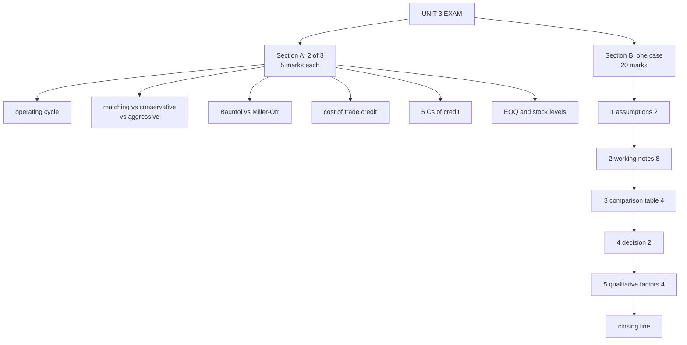

# WC-7: Unit 3 Exam Answers

Covers: what the test will ask, six 5-mark answer skeletons, and the 20-mark case layout with a model answer built on the XYZ class problem. Numbers come from WC-1 to WC-6. The receivables problems (Super Sports, XYZ Corporation) and the Arjun case are **(class)**; everything else is **(textbook)**.

## What the test will ask

One hour, 30 marks. Expected shape: Section A, two of three questions at 5 marks each (theory or a short sum); Section B, one 20-mark case. For this unit the 20-mark case is almost certainly a **credit policy evaluation** (the two problems done in class) or a cash/inventory model sum. Learn the receivables layout cold, then the formulas for Baumol, Miller-Orr, EOQ and stock levels. Half the case marks reward interpretation, so a correct number with no interpretation loses marks.

## Five-mark answer skeletons

**1. Operating cycle and its use (WC-1).** Define (RMCP + WIPCP + FGCP + RCP − PDP). Give the components in one line each. Numeric: 30 + 15 + 20 + 45 − 35 = 75 days. Use: shows WC need; shortening any stage cuts funding need. Close with one action per stage.

**2. Matching vs conservative vs aggressive financing (WC-2).** Define permanent and temporary WC. Table: source for each, cost, risk. State matching as the balanced approach. One line on the trade-off: cost vs liquidity risk.

**3. Baumol vs Miller-Orr (WC-3).** Baumol: certain, steady outflows, C\* = √(2Tb/i), one control (order size). Miller-Orr: random flows, two limits and a return point, spread depends on b, σ², i. Limitations of each in one line. Use Baumol for predictable cash, Miller-Orr for volatile.

**4. Cost of trade credit (WC-2).** Formula (d/(100−d)) × (365/(credit − discount period)). Worked 2/10 net 30 = 37.24%. Decision rule: take the discount if the cost exceeds the cost of short-term borrowing.

**5. 5 Cs of credit (WC-4).** Character, Capacity, Capital, Collateral, Conditions, one line each; add that they feed credit standards, which trade lost sales against bad debts.

**6. EOQ and stock levels (WC-5).** EOQ formula, assumptions (constant demand, constant costs, instant delivery); then ROL, minimum, maximum, average and danger level formulas with a one-line numeric each.

## 20-mark case layout (credit policy or WC case)

1. **Assumptions (2 marks):** 360 or 365 days; cost basis for investment (total, variable or sales); tax ignored; credit period = average collection period; bad debts as given.
2. **Working notes (8 marks):** for each policy, sales, turnover, average debtors, investment, cost of investment, contribution, bad debts, discount, collection cost. Show every line; method marks are given even if the arithmetic slips.
3. **Comparison table (4 marks):** incremental profit or final contribution side by side; highlight the best.
4. **Decision (2 marks):** name the policy and the amount; say why in one sentence.
5. **Qualitative factors (4 marks):** customer relationships and goodwill; competitors' terms; bad-debt risk and customer quality (5 Cs); liquidity and cost of finance; whether the sales increase is repeatable; whether existing customers will demand the longer terms too (so the cost applies to the whole base).

Close with the sentence: *the recommendation holds only under the stated cost basis and required return.*

### Model answer on the XYZ problem, laid out as the exam answer

**Data (class):** credit sales ₹50,00,000, turnover 4, bad debts ₹1,50,000; required return 25%; variable cost 70%. Option I: sales ₹60,00,000, turnover 3, bad debts ₹3,00,000. Option II: sales ₹67,50,000, turnover 2.4, bad debts ₹4,50,000.

1. **Assumptions:** investment in receivables at variable cost (70%); average receivables = sales ÷ turnover; contribution 30%; tax ignored; bad debts as given.
2. **Working notes:** average receivables 12,50,000 / 20,00,000 / 28,12,500; investment 8,75,000 / 14,00,000 / 19,68,750; cost at 25% 2,18,750 / 3,50,000 / 4,92,187.50.
3. **Comparison:**

| (₹) | Present | Option I | Option II |
|---|---|---|---|
| Contribution (30%) | 15,00,000 | 18,00,000 | 20,25,000 |
| Less bad debts | 1,50,000 | 3,00,000 | 4,50,000 |
| Less cost of investment | 2,18,750 | 3,50,000 | 4,92,187.50 |
| **Final contribution** | **11,31,250** | **11,50,000** | **10,82,812.50** |

4. **Decision:** adopt **Option I**, final contribution ₹11,50,000, ₹18,750 above the present policy.
5. **Interpretation:** Option II has the highest sales but each extra rupee of credit costs more than it earns: its extra bad debts and funding cost exceed its extra contribution, so it falls below Present.
6. **Qualitative factors:** the 5 Cs of the new customers who buy on longer terms; whether existing customers will demand the longer terms (cost applies to the whole base); competitors' terms; whether the sales increase repeats; liquidity and the cost of funding the extra ₹5,25,000 of investment.
7. **Closing line:** "Option I is recommended; the recommendation holds only under the variable-cost basis and the 25% required return."

For Super Sports the same layout gives: adopt B (60 days), incremental profit ₹0.97 lakh, because D's extra funding cost ₹2.05 lakh almost cancels its extra contribution ₹2.60 lakh.

## Time rule

If time runs short, finish the working notes, the comparison table and the decision (steps 2 to 4), then write two lines on qualitative factors.

## What to remember

- Section A: pick two of three. A definition, formula, one numeric and one line of use is enough for 5 marks.
- Case layout: assumptions, working notes, comparison table, decision, qualitative factors, closing sentence.
- Model numbers: operating cycle 75 days; trade credit 37.24%; Baumol C\* ₹42,426; Miller-Orr limits 20,000 / 25,724 / 37,171; EOQ 1,095.
- Class numbers: Super Sports B (₹0.97 lakh); XYZ Option I (₹11,50,000); Arjun closing cash ₹23,685, EOQ 500 kg.
- Always state the cost basis. Never skip the qualitative paragraph.
- Every table ends in a decision sentence.

## Concept map

## Flashcards
Q: What is the likely format of CIA3, and how long is it?
A: 1 hour, 30 marks: Section A two of three questions at 5 marks, Section B one 20-mark case.

Q: What is the 20-mark case for Unit III most likely to be?
A: A credit policy evaluation like Super Sports or XYZ, or a cash or inventory model sum.

Q: How are the 20 marks split in the credit-policy case layout?
A: Assumptions 2, working notes 8, comparison table 4, decision 2, qualitative factors 4.

Q: List the steps of the credit-policy case in order.
A: Assumptions, working notes per policy, comparison table, decision, qualitative factors, closing sentence.

Q: Name four qualitative factors to write in a credit policy case.
A: Customer relationships and goodwill, competitors' terms, bad-debt risk and customer quality (5 Cs), liquidity and cost of finance, repeatability of the sales rise, demand for longer terms from existing customers.

Q: What is the closing sentence of the case?
A: The recommendation holds only under the stated cost basis and required return.

Q: Skeleton for "Baumol vs Miller-Orr" in 5 marks?
A: Baumol: steady certain outflow, C* = √(2Tb/i), one control. Miller-Orr: random flows, two limits and a return point, spread from b, σ² and i. One limitation each and when to use which.

Q: Skeleton for "Cost of trade credit" in 5 marks?
A: Formula d/(100−d) × 365/(credit − discount period), worked 2/10 net 30 = 37.24%, rule: take the discount if its forgone cost exceeds the borrowing rate.

Q: Skeleton for "EOQ and stock levels"?
A: EOQ formula and assumptions, then ROL, minimum, maximum, average and danger level formulas with a one-line numeric each.

Q: What do you write if time runs short in the case?
A: Finish working notes, comparison and decision, then two lines on qualitative factors.

Q: Model decision line for the XYZ case?
A: Adopt Option I, final contribution ₹11,50,000, ₹18,750 above Present, under the variable-cost basis and 25% required return.

## Sources
- Faculty class material: Super Sports, XYZ Corporation, Arjun Enterprises
- Textbook method: Prasanna Chandra, I M Pandey, Khan & Jain, ICAI
- Vault note: `SFM CIA3 - Unit III Working Capital Finance` (sections 7, 8 and "What the test will ask")
- [[SFM Unit 3 - Working Capital MOC (Node Map)]]
