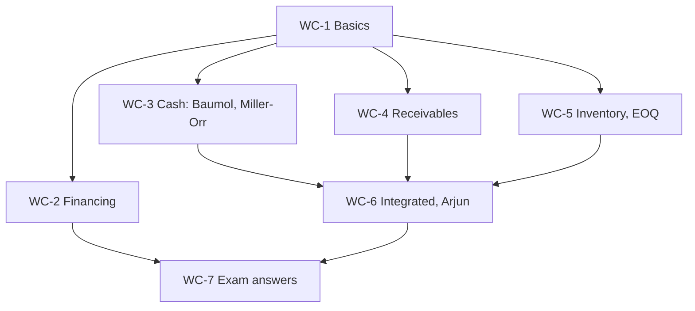

# SFM Unit 3: Working Capital Finance, node map

CIA3 is 1 hour, 30 marks: two of three 5-mark answers plus one 20-mark case. For this unit the case is most likely a credit policy evaluation. The receivables problems (Super Sports, XYZ Corporation) and the Arjun Enterprises case are **faculty class material**. Everything else is textbook method, so follow the teacher's convention if it differs.

## Nodes

| Node | Topic | Deps | Minutes | Exam focus |
|---|---|---|---|---|
| WC-1 | Working Capital Basics | none | 25 | no |
| WC-2 | Financing of Working Capital | WC-1 | 30 | no |
| WC-3 | Optimum Cash Balance Baumol and Miller-Orr | WC-1 | 35 | yes |
| WC-4 | Receivables Management and Credit Policy | WC-1 | 45 | yes |
| WC-5 | Inventory EOQ and Stock Levels | WC-1 | 35 | yes |
| WC-6 | Integrated Working Capital and Arjun Case | WC-3, WC-4, WC-5 | 45 | yes |
| WC-7 | Unit 3 Exam Answers | WC-2, WC-6 | 30 | yes |

Total reading time: about 245 minutes.

## Dependency graph

## Headline numbers to know

- Operating cycle: 30 + 15 + 20 + 45 − 35 = 75 days. Trade credit 2/10 net 30 costs 37.24% a year.
- Baumol: C\* ₹42,426, total cost ₹4,243. Miller-Orr: spread ₹17,171, return ₹25,724, upper ₹37,171 (lower ₹20,000).
- Super Sports (class): incremental profit A 0.70, B 0.97, C 0.85, D 0.55 lakh, adopt B (60 days).
- XYZ Corporation (class): Present ₹11,31,250, Option I ₹11,50,000, Option II ₹10,82,812.50, adopt Option I.
- Arjun (class): closing cash ₹18,985, ₹28,795, ₹30,975, ₹23,685; ROL 72,000, minimum 32,000, maximum 1,04,000, danger 16,000, average 56,000; EOQ 500 kg, 16 orders.
- EOQ 1,095 units, total ₹6,573; quantity discount saves ₹34,953. WC in NPV: ₹1,42,000 including WC (₹1,42,043 on exact factors) against ₹2,14,800 without.
