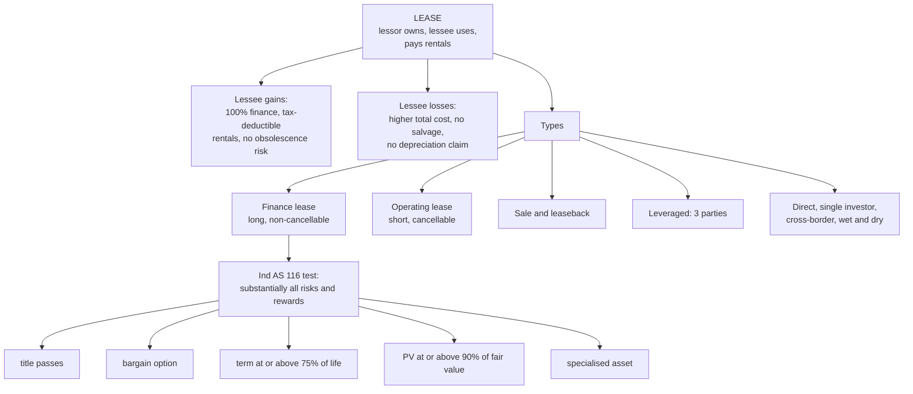

# LH-1 — Leasing Meaning, Importance and Types

Covers: what a lease is, the lessee's gains and losses, the eight lease types, finance vs operating lease, and the checklist for classifying a lease. All content here is **(textbook)**. If your teacher used a different convention in class, follow the teacher and say so in your assumptions.

## Where this fits in CIA3

CIA3 is 1 hour, 30 marks, individual. Section A is two short answers out of three (5 marks each). Section B is one 20-mark case. Unit IV feeds CO3: compare lease, buy and hire purchase and pick the best financing. Likely 5-mark questions from this node: finance vs operating lease, sale and leaseback, advantages of leasing.

## Meaning of a lease

A lease is a contract in which the **lessor** (owner) gives the **lessee** the right to use an asset for an agreed period in return for periodic **lease rentals**. Ownership stays with the lessor and the lessee gets use. A lease substitutes for borrowing to buy, which is why the lessee's evaluation (LH-3) is a debt-versus-lease comparison.

## Importance: advantages and disadvantages to the lessee

| Advantages | Disadvantages |
|---|---|
| Near 100% financing, so no down payment and cash is preserved | Total cost over the term is usually higher than buying outright |
| Rentals are fully tax deductible | Lessee loses salvage value and capital appreciation |
| Obsolescence risk sits with the lessor in operating leases | Lessee claims no depreciation; the tax shield moves to the lessor |
| Easier than a term loan for small or new firms, fewer covenants | Rentals are fixed even if the asset sits idle |
| Off-balance-sheet treatment (largely gone, see LH-2) | Under Ind AS 116 the liability now shows on the balance sheet anyway |

## Types of lease

| Type | One-line meaning |
|---|---|
| Finance lease | Long, non-cancellable; lessee bears risks and rewards of ownership; lessor is essentially a financier |
| Operating lease | Short, cancellable; lessor keeps risks and rewards and usually maintains the asset |
| Sale and leaseback | Owner sells an asset to a lessor and leases it back; releases cash while keeping use |
| Leveraged lease | Lessor funds part of the cost with a third-party lender (three parties: lessor, lessee, lender) |
| Direct lease | Lessor buys the asset from the supplier and leases it to the lessee, or a manufacturer leases its own product |
| Single investor lease | Lessor funds the whole cost from own resources; no lender |
| Cross-border lease | Lessor and lessee in different countries (aircraft and ships are typical) |
| Wet vs dry lease | Wet: lessor supplies maintenance, crew and insurance. Dry: asset only |

## Finance vs operating lease

| Basis | Finance lease | Operating lease |
|---|---|---|
| Term | Most of the asset's economic life | Much shorter than economic life |
| Cancellation | Non-cancellable | Cancellable with notice |
| Risks and rewards of ownership | Lessee | Lessor |
| Maintenance, insurance | Lessee | Lessor (usually) |
| Lessor recovers cost | Fully from rentals over the term | Only partly; re-leases or sells the asset |
| Lessor's role | Financier | Owner-trader |
| Rental | Lower, since cost is fully amortised | Higher, includes risk and service |
| Typical assets | Plant, machinery, vehicles | Computers, photocopiers, construction equipment |
| Purchase option | Often nominal or bargain | Rare |

## Classification checklist: "classify this lease"

Under Ind AS 116 (same as IFRS 16) the lessor classifies a lease as a **finance lease if it transfers substantially all the risks and rewards of ownership**, otherwise operating. Substance beats form. Work down these indicators; one strong hit is usually enough.

1. **Ownership transfer**: does title pass to the lessee by the end of the term? Yes, finance.
2. **Bargain purchase option**: can the lessee buy at a price so low that exercise is reasonably certain? Yes, finance.
3. **Lease term is a major part of the asset's economic life** (usual benchmark 75% or more). Yes, finance.
4. **PV of lease payments is substantially all of fair value** (usual benchmark 90% or more). Yes, finance.
5. **Specialised asset**: only the lessee can use it without major modification. Yes, finance.
6. Secondary signals: lessee bears the lessor's cancellation losses; residual value gains and losses fall on the lessee; lessee can renew at a much below-market rent.

### Worked classification, laid out as the exam answer

*Illustrative:* a machine with a 10-year economic life is leased for 8 years. Fair value ₹10,00,000; PV of lease payments ₹9,40,000; the lessee has no purchase option.

1. Term test: 8 ÷ 10 = 80%, which is at or above the 75% benchmark. Met.
2. PV test: 9,40,000 ÷ 10,00,000 = 94%, at or above the 90% benchmark. Met.
3. Ownership transfer and bargain option: not met. Not needed once two indicators point the same way.

**Decision line:** indicators 3 and 4 are met, so substantially all risks and rewards sit with the lessee. **Finance lease.**

The 75% and 90% figures come from older US and Indian standards. Ind AS 116 itself says "major part" and "substantially all" with no fixed percentage, so write "commonly used benchmark" and not "the rule".

## What to remember

- Lessor owns and receives rentals. Lessee uses and pays. A lease is a debt substitute.
- Finance lease: long, non-cancellable, lessee bears risk and rewards. Operating lease: short, cancellable, lessor bears them.
- Leveraged lease means three parties (lessor, lessee, lender). Single investor lease means no lender.
- Sale and leaseback releases cash while keeping the asset in use.
- Classify on substance: ownership transfer, bargain option, 75% of life, 90% of fair value, specialised asset.
- Name the indicator you used when you classify.

## Concept map

## Flashcards
Q: What is the difference between a lessor and a lessee?
A: The lessor owns the asset and receives rentals. The lessee uses the asset and pays rentals.

Q: Which lease is non-cancellable and transfers substantially all risks and rewards of ownership?
A: A finance lease.

Q: In an operating lease, who bears maintenance and obsolescence risk?
A: The lessor, usually.

Q: What is sale and leaseback?
A: The owner sells an asset to a lessor and leases it back, releasing cash while keeping use of the asset.

Q: What is a leveraged lease?
A: A lease where the lessor funds part of the cost with a third-party lender, so three parties are involved.

Q: What is the difference between a wet lease and a dry lease?
A: Wet: the lessor supplies maintenance, crew and insurance. Dry: the asset only.

Q: List the Ind AS 116 indicators that point to a finance lease.
A: Ownership transfer, bargain purchase option, lease term covering a major part of economic life, PV of payments substantially all of fair value, and a specialised asset.

Q: What are the commonly used benchmarks for "major part" and "substantially all"?
A: 75% or more of economic life, and 90% or more of fair value. They are rules of thumb from older standards, not fixed by Ind AS 116.

Q: Name three advantages and two disadvantages of leasing for the lessee.
A: Advantages: near 100% financing, tax-deductible rentals, protection against obsolescence. Disadvantages: higher total cost than buying, loss of salvage and depreciation claim.

Q: Lessor recovers its cost fully from rentals over the term. Finance or operating lease?
A: Finance lease. In an operating lease the lessor recovers the cost only partly and re-leases or sells the asset.

## Sources
- Textbook method: Prasanna Chandra, I M Pandey, Khan & Jain, ICAI SFM study material
- Built from `SFM CIA3 - Unit IV Leasing and Hire Purchase` (sections 1, 2)
- Next node: [[SFM Unit 4 - LH-2 Tax and Accounting of Leases]]
- [[SFM Unit 4 - Leasing and HP MOC (Node Map)]]
