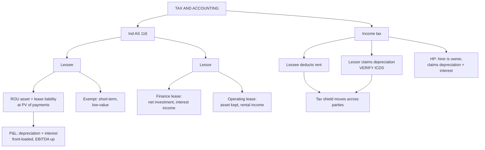

# LH-2 — Tax and Accounting of Leases

Covers: Ind AS 116 for the lessee and the lessor, the effect on ratios, the exemptions, and the Indian income-tax treatment of leases and hire purchase. All content is **(textbook)**.

## Lessee accounting under Ind AS 116 (textbook)

- One model for all leases. The lessee recognises a **right-of-use (ROU) asset** and a **lease liability** equal to the present value of future lease payments.
- Discount rate: the rate implicit in the lease or, if that is not known, the lessee's **incremental borrowing rate**.
- The P&L no longer shows a straight-line rent expense. It shows **depreciation on the ROU asset plus interest on the liability**. Total expense is front-loaded, higher in early years than the rent.
- **Exemptions:** short-term leases (12 months or less, no purchase option) and leases of low-value assets can still be expensed straight-line.

### Effect on the lessee's ratios

| Item | Direction | Why |
|---|---|---|
| Assets | Up | ROU asset recognised |
| Debt | Up | Lease liability recognised |
| EBITDA | Up | Rent leaves operating cost; depreciation and interest sit below EBITDA |
| Early-year total expense | Up | Depreciation plus interest exceeds rent |
| Debt to equity, gearing | Worse | More debt, same equity |

This ends the old **off-balance-sheet** advantage of leasing.

## Lessor accounting (textbook)

The lessor still classifies each lease using the LH-1 checklist.

| Lease | Lessor's books |
|---|---|
| Finance lease | Derecognise the asset, book a **net investment (receivable)**, recognise interest income over the term |
| Operating lease | Keep the asset on the balance sheet, depreciate it, recognise rental income straight-line |

## Indian income-tax treatment (textbook)

- **Lessee:** lease rentals are a deductible business expense.
- **Lessor:** the lessor is generally treated as owner and claims depreciation on the asset used in the business. Rental income is taxable. **[VERIFY]** whether ICDS and Finance Act amendments on finance-lease depreciation change this for your syllabus. The textbook method assumes the lessor claims depreciation and the lessee deducts rent.
- **Hire purchase:** the **hirer is treated as owner from the start**. The hirer claims depreciation on the cash price and deducts the interest element of each instalment. The principal part of an instalment is not an expense.
- Because the depreciation shield belongs to the lessor in a lease and to the buyer or hirer otherwise, the **tax shield moves across parties**. That is why the tax rate matters so much in lease vs buy (LH-3) and why a loss-making firm, which cannot use a shield, tends to favour leasing.

## Worked illustration: the P&L shape under Ind AS 116

*Illustrative figures.* A 3-year lease with rent ₹1,00,000 a year at year-end, discounted at 10%.

1. Lease liability on day 1 = 1,00,000 × annuity factor (10%, 3 years) = 1,00,000 × 2.4869 = **₹2,48,685**. This is also the ROU asset.
2. ROU depreciation (straight-line) = 2,48,685 ÷ 3 = ₹82,895 a year.
3. Year-1 interest = 10% × 2,48,685 = ₹24,869.
4. Year-1 total expense = 82,895 + 24,869 = **₹1,07,764**, against rent of ₹1,00,000.
5. Year 2: opening liability ₹1,73,554, interest ₹17,355, expense ₹1,00,250. Year 3: opening liability ₹90,909, interest ₹9,091, expense ₹91,986, below the rent.

**Reading:** total expense over three years equals total rent (₹3,00,000), but it is front-loaded: 1,07,764 then 1,00,250 then 91,986. Under the old operating-lease method the expense was a flat ₹1,00,000.

## What to remember

- Ind AS 116: lessee books an ROU asset and a lease liability for almost every lease.
- P&L shows depreciation plus interest, so expense is front-loaded and EBITDA rises.
- Exemptions: short-term (12 months or less) and low-value assets.
- Lessor: finance lease gives a net investment and interest income; operating lease keeps the asset and gives rental income.
- Tax: lessee deducts rent; lessor claims depreciation; hirer in HP claims depreciation plus the interest element.
- Off-balance-sheet financing is gone, so do not use it as a reason to lease.

## Concept map

## Flashcards
Q: How does Ind AS 116 change the lessee's accounts?
A: It recognises a right-of-use asset and a lease liability, replacing rent expense with depreciation plus interest.

Q: At what rate is the Ind AS 116 lease liability discounted?
A: The rate implicit in the lease, or the lessee's incremental borrowing rate if the implicit rate is not known.

Q: Which leases are exempt from the on-balance-sheet model for lessees?
A: Short-term leases (12 months or less, no purchase option) and leases of low-value assets.

Q: Why does Ind AS 116 raise the lessee's EBITDA?
A: Rent is removed from operating costs; the ROU depreciation and interest sit below EBITDA.

Q: Is total P&L expense under Ind AS 116 higher or lower than rent in the early years?
A: Higher. Depreciation plus interest is front-loaded.

Q: How does the lessor account for a finance lease?
A: It derecognises the asset, books a net investment (receivable), and recognises interest income over the term.

Q: How does the lessor account for an operating lease?
A: It keeps the asset on the balance sheet, depreciates it, and recognises rental income straight-line.

Q: Who claims depreciation in a lease and in HP, for income tax?
A: Lease: the lessor. HP: the hirer, who is treated as owner from the start.

Q: What is deductible for the lessee in a lease, and for the hirer in HP?
A: Lease: the rentals. HP: depreciation plus the interest element of each instalment.

Q: Why does a loss-making firm tend to favour leasing?
A: It cannot use the depreciation tax shield, so the lessor, who can, passes some of it back in the rental.
