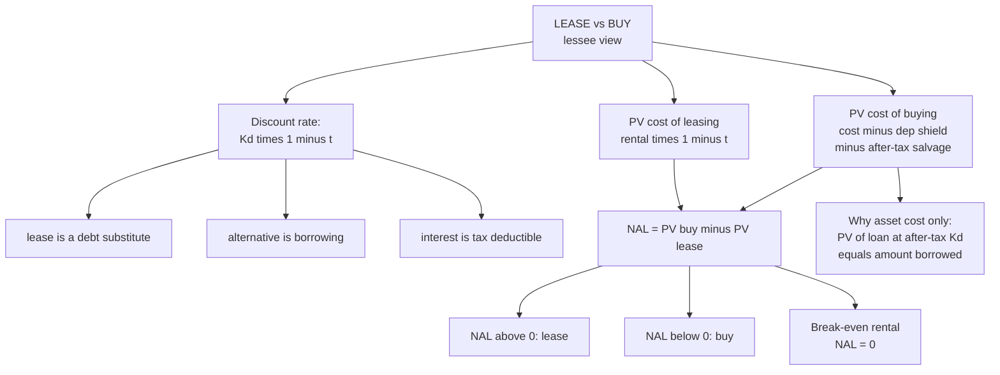

# LH-3 — Lease vs Buy: Lessee Evaluation

Covers: the logic of lease vs buy, why the discount rate is the after-tax cost of debt, the cash flows, the NAL rule, the full worked example with its decision paragraph, why the buy side shows only the asset cost, and the lessee's break-even rental. This is the most likely 20-mark case. All content is **(textbook)**.

## Logic

Leasing replaces a loan. So compare the after-tax cash cost of **leasing** with the after-tax cash cost of **borrowing and buying**, and pick the lower present value of cost.

**Discount at the after-tax cost of debt, Kd × (1 − t).** Three reasons to write in the exam:

1. The lease is a fixed, contractual, debt-like obligation, so its risk is that of debt, not of the project.
2. The alternative to leasing is borrowing, so the opportunity cost of the funds is the after-tax borrowing rate.
3. Interest is tax deductible, so the relevant rate is net of tax. Using the after-tax rate avoids double counting the shield.

Using WACC would treat a debt-like stream as equity-risk cash flow and make leasing look too cheap. *Illustration (12% taken as an assumed WACC):* in the worked example below, discounting at 12% gives PV lease 7,06,580 and PV buy 7,83,700, so NAL flips to **+₹77,120** and the answer wrongly becomes "lease". The discount rate decides the answer, which is why the rubric asks you to justify it.

## Cash flows

| Option | Cash flow |
|---|---|
| Leasing | Rental × (1 − t) each period. If rentals are in advance, the first falls at t = 0 and the last at the start of the final year |
| Buying (borrow and buy) | Cost at t = 0, less depreciation × t each year, less after-tax salvage at the end |

**Decision rule.** Choose the lower PV of cost. **NAL = PV cost of buying − PV cost of leasing.** NAL > 0: lease. NAL < 0: buy.

**Conventions to state in your answer**
- Rentals in arrears unless the question says "in advance".
- Depreciation SLM unless told WDV. If WDV, use the given rate and note that the shield falls over time.
- Salvage: take after-tax salvage at the end of life. If the lessee would keep the asset, leasing forfeits it.

## Worked example, laid out as the exam answer

**Data.** Asset cost ₹10,00,000; life 5 years; SLM depreciation; nil salvage; tax 30%; pre-tax borrowing rate 10%; lease rental ₹2,80,000 at the end of each year.

**Step 1: discount rate.** Kd(1 − t) = 10% × (1 − 0.30) = **7%**.

| Year | 1 | 2 | 3 | 4 | 5 | Sum |
|---|---|---|---|---|---|---|
| PV factor at 7% | 0.935 | 0.873 | 0.816 | 0.763 | 0.713 | 4.100 |

**Step 2: PV cost of leasing.** After-tax rental = 2,80,000 × 0.70 = ₹1,96,000 a year.

| Year | After-tax rental | Factor | PV |
|---|---|---|---|
| 1 | 1,96,000 | 0.935 | 1,83,260 |
| 2 | 1,96,000 | 0.873 | 1,71,108 |
| 3 | 1,96,000 | 0.816 | 1,59,936 |
| 4 | 1,96,000 | 0.763 | 1,49,548 |
| 5 | 1,96,000 | 0.713 | 1,39,748 |
| Total | | | **8,03,600** |

Check: 1,96,000 × 4.100 = 8,03,600.

**Step 3: PV cost of borrowing and buying.** Depreciation = 10,00,000 ÷ 5 = ₹2,00,000. Tax shield = 2,00,000 × 0.30 = ₹60,000 a year.

| Year | Item | Cash flow | Factor | PV |
|---|---|---|---|---|
| 0 | Purchase price | (10,00,000) | 1.000 | 10,00,000 |
| 1 | Depreciation shield | 60,000 | 0.935 | (56,100) |
| 2 | Depreciation shield | 60,000 | 0.873 | (52,380) |
| 3 | Depreciation shield | 60,000 | 0.816 | (48,960) |
| 4 | Depreciation shield | 60,000 | 0.763 | (45,780) |
| 5 | Depreciation shield | 60,000 | 0.713 | (42,780) |
| | Net PV of cost | | | **7,54,000** |

Check: 60,000 × 4.100 = 2,46,000; 10,00,000 − 2,46,000 = 7,54,000. Salvage is nil, so no salvage term.

**Step 4: NAL.** 7,54,000 − 8,03,600 = **−₹49,600**.

**Decision line:** NAL is negative, so **buy**. Leasing costs ₹49,600 more in PV. The annual rental is 28% of cost for five years, which is too steep for the lessee to gain from handing the depreciation shield to the lessor.

**Break-even rental for the lessee** (NAL = 0). After-tax rental PV must equal 7,54,000, so after-tax rental = 7,54,000 ÷ 4.100 = ₹1,83,902, and pre-tax rental = 1,83,902 ÷ 0.70 = **about ₹2,62,718**. The lessee should lease only if the rental is below roughly ₹2,62,700.

## Why the buy side shows only the asset cost

A loan's repayments plus interest, net of the interest tax shield, discounted at the after-tax cost of debt, always have a PV equal to the amount borrowed. So "borrow ₹10,00,000 and repay it" and "pay ₹10,00,000 today" have the same PV, and the textbook method uses the shorter form.

**Proof with the example.** Borrow ₹10,00,000 at 10%, interest only, principal repaid at the end of year 5. After-tax interest = 1,00,000 × 0.70 = ₹70,000 a year.
PV = 70,000 × 4.100 + 10,00,000 × 0.713 = 2,87,000 + 7,13,000 = **₹10,00,000**.

If the question gives a loan repayment schedule, lay it out in full (instalment, interest, interest × t, net outflow) and you will land on the same answer.

## Interpretation paragraph to write

The after-tax cost of debt is the right rate because the lease is a debt substitute. At that rate, buying is cheaper by ₹49,600 in PV. The lease would become attractive only if the rental fell below about ₹2,62,700, or if the firm could not use the depreciation shield (a loss-making firm), or if obsolescence risk or flexibility mattered more than the cost gap (LH-7 lists the qualitative factors).

## What to remember

- Discount rate = Kd(1 − t). Reason: debt-like risk, borrowing is the alternative, interest is tax deductible.
- NAL = PV cost of buying − PV cost of leasing. Positive: lease. Negative: buy.
- Lease flow = rental × (1 − t). Buy flow = cost at t = 0 less depreciation × t each year, less after-tax salvage.
- Worked example: PV lease 8,03,600, PV buy 7,54,000, NAL −49,600, buy.
- Buy side shows the asset cost because the PV of a loan at its own after-tax rate equals the amount borrowed.
- Lessee break-even rental about ₹2,62,718. Always check with annuity factor × annual amount.

## Concept map

## Flashcards
Q: Why is the lease vs buy decision discounted at the after-tax cost of debt?
A: Leasing is a debt substitute with debt-like risk, the alternative is borrowing, and interest is tax deductible.

Q: What is NAL?
A: Net Advantage of Leasing = PV cost of buying minus PV cost of leasing. Positive means lease.

Q: What is the after-tax cost of debt when pre-tax is 10% and tax is 30%?
A: 7%.

Q: In the worked example, what are the PV cost of leasing and of buying?
A: Leasing ₹8,03,600 and buying ₹7,54,000. NAL = −₹49,600, so buy.

Q: What is the annual after-tax lease cost for a ₹2,80,000 rental at 30% tax?
A: 2,80,000 × 0.70 = ₹1,96,000.

Q: How do you get the depreciation tax shield in the example?
A: Depreciation 10,00,000 ÷ 5 = 2,00,000, times 30% tax = ₹60,000 a year.

Q: Why does the buy side show only the asset cost at t = 0?
A: The PV of loan repayments and interest, net of the interest shield, discounted at the after-tax cost of debt equals the amount borrowed.

Q: What is the lessee's break-even rental in the example?
A: About ₹2,62,718 (7,54,000 ÷ 4.100 = 1,83,902 after tax, divided by 0.70).

Q: What happens if you discount lease vs buy at a higher WACC instead of Kd(1 − t)?
A: Leasing looks too cheap. In the example at an assumed 12%, NAL flips to +₹77,120 and the answer wrongly becomes lease.

Q: If rentals are paid in advance, how does the lease cash flow change?
A: The first rental falls at t = 0 (undiscounted) and the last at the start of the final year.

Q: What check should you show under every PV table?
A: Annuity factor times the annual amount, for example 1,96,000 × 4.100 = 8,03,600.
