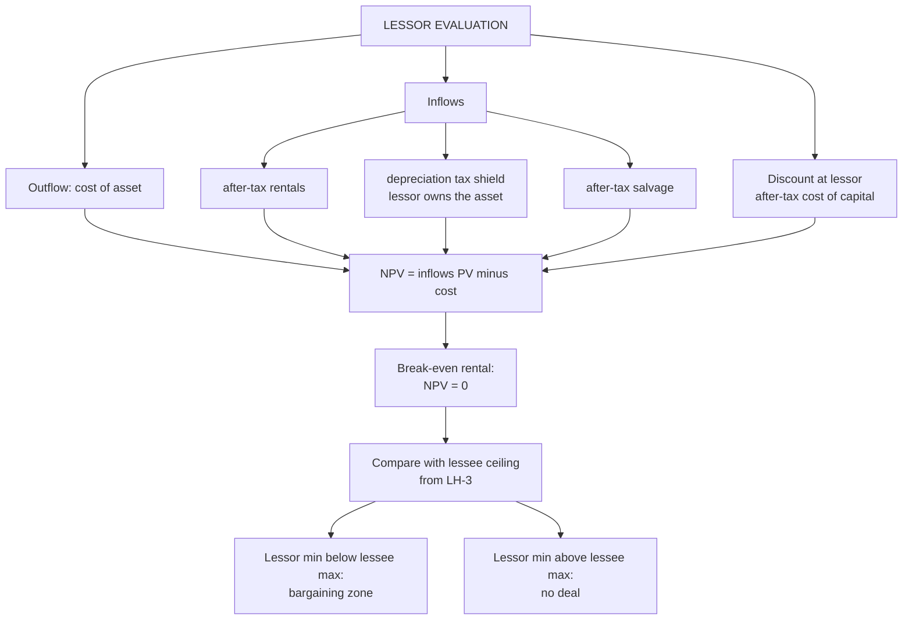

# LH-4 — Lessor Evaluation and Break-even Rental

Covers: the lessor's NPV, the minimum (break-even) lease rental, the worked example, and how the lessor's minimum meets the lessee's ceiling from LH-3. All content is **(textbook)**.

## Logic

The lessor treats a lease as an investment. It spends the cost, then receives after-tax rentals and the depreciation tax shield (the lessor owns the asset), plus after-tax salvage. Discount at the **lessor's after-tax cost of capital**.

**NPV (lessor) = − Cost + PV of after-tax rentals + PV of depreciation tax shield + PV of after-tax salvage.**

**Minimum (break-even) lease rental** is the rental at which NPV = 0. The lessor should lease only if the offered rental is above it.

## Worked example, laid out as the exam answer

**Data.** Same asset as LH-3: cost ₹10,00,000, 5 years, SLM, nil salvage, tax 30%, rental ₹2,80,000 at year-end. Lessor's after-tax required return **8%**.

**Step 1: factors at 8%.**

| Year | 1 | 2 | 3 | 4 | 5 | Sum |
|---|---|---|---|---|---|---|
| Factor | 0.926 | 0.857 | 0.794 | 0.735 | 0.681 | 3.993 |

**Step 2: NPV.**

| Item | Annual cash flow | × annuity factor 3.993 | PV |
|---|---|---|---|
| After-tax rental: 2,80,000 × 0.70 | 1,96,000 | 3.993 | 7,82,628 |
| Depreciation shield: 2,00,000 × 0.30 | 60,000 | 3.993 | 2,39,580 |
| Total inflow PV | | | 10,22,208 |
| Cost | | | (10,00,000) |
| **Lessor NPV** | | | **+22,208** |

**Decision line (offered rental):** NPV is positive, so the lessor earns more than 8% after tax at ₹2,80,000. The lease is acceptable to the lessor.

**Step 3: break-even rental.** Need PV of after-tax rental + PV of shield = 10,00,000.

1. PV of shield = 2,39,580.
2. PV of after-tax rental needed = 10,00,000 − 2,39,580 = 7,60,420.
3. After-tax rental = 7,60,420 ÷ 3.993 = ₹1,90,438.
4. Pre-tax rental = 1,90,438 ÷ 0.70 = **about ₹2,72,055**.

Check: 0.70 × 2,72,055 × 3.993 + 2,39,580 = 7,60,420 + 2,39,580 = 10,00,000.

## Reading the lessor and lessee together

| Party | Rental limit | Source |
|---|---|---|
| Lessor minimum | about ₹2,72,055 | This node, at 8% after tax |
| Lessee ceiling | about ₹2,62,718 | LH-3, at 7% after-tax cost of debt |

The lessor's minimum is **above** the lessee's maximum, so **no mutually acceptable rental exists** here. A bargaining zone appears only when the lessor's minimum is below the lessee's maximum. That happens when the parties' tax positions or costs of funds differ enough, for example when the lessee pays low tax and cannot use the depreciation shield while the lessor can.

*Note on the offered rental.* At ₹2,80,000 the lessor gains (NPV +22,208) but the lessee loses (NAL −49,600). The lease would be signed only if the lessee has a reason beyond cost (flexibility, covenants, tax position).

## What to remember

- Lessor NPV = −Cost + PV after-tax rentals + PV depreciation shield + PV after-tax salvage.
- Discount at the lessor's after-tax cost of capital (8% in the example).
- Break-even rental: set NPV = 0. Lease only if the offered rental is above it.
- Example: NPV +22,208; break-even rental about ₹2,72,055.
- Lessor minimum 2,72,055 above lessee ceiling 2,62,718 means no deal. A deal needs different tax positions or costs of funds.

## Concept map

## Flashcards
Q: Lessor NPV formula?
A: −Cost + PV of after-tax rentals + PV of depreciation tax shield + PV of after-tax salvage.

Q: At what rate does the lessor discount?
A: The lessor's after-tax cost of capital (8% in the worked example).

Q: What is the lessor's NPV in the worked example?
A: +₹22,208 (inflows 10,22,208 less cost 10,00,000).

Q: What is the lessor's break-even rental in the worked example?
A: About ₹2,72,055 at an 8% after-tax required return.

Q: How do you derive the break-even rental?
A: Set NPV = 0: PV of after-tax rental = cost − PV of shield = 7,60,420; divide by 3.993, then by (1 − t) = 0.70.

Q: Why does the lessor get a depreciation shield but the lessee does not?
A: The lessor owns the asset and claims depreciation. The lessee only deducts rentals.

Q: The lessor's minimum rental is 2,72,055 and the lessee's maximum is 2,62,718. What follows?
A: No mutually acceptable rental exists, so no lease deal on these numbers.

Q: When does a bargaining zone between lessor and lessee exist?
A: When the lessor's minimum rental is below the lessee's maximum, typically because tax positions or costs of funds differ.

Q: What is the annual depreciation tax shield in the lessor example?
A: 10,00,000 ÷ 5 = 2,00,000 depreciation, times 30% = ₹60,000, with PV 2,39,580 at 8%.

Q: Should the lessor lease if the offered rental is above its break-even rental?
A: Yes. NPV is positive above the break-even rental.
