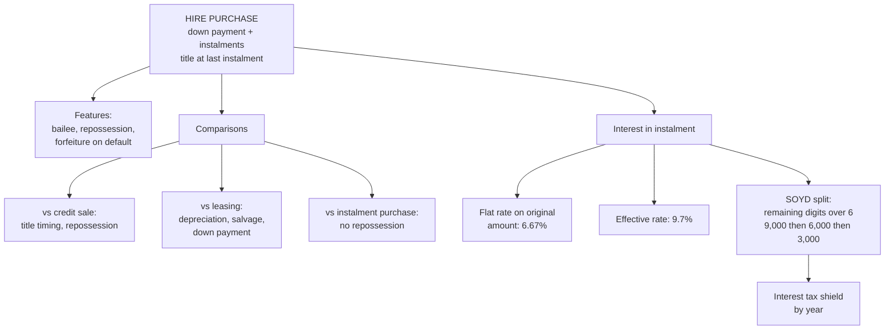

# LH-5 — Hire Purchase and Comparisons

Covers: meaning and features of hire purchase, the three comparison tables (HP vs credit sale, leasing vs HP, leasing vs instalment), flat vs effective rate, and splitting instalment interest by sum of years' digits with a worked example. All content is **(textbook)**.

## Meaning and features

**Meaning.** The hirer takes possession and use of the asset on payment of a **down payment** and fixed instalments. The hirer becomes owner only on paying the **last instalment** (or on exercising an option to purchase). Until then the asset belongs to the **hire vendor** (financier or seller), who can repossess on default.

**Features**
- Hirer, hire vendor, and a written agreement.
- Down payment plus instalments of principal and interest.
- Possession with the hirer from day one, ownership at the end.
- Hirer is a bailee until the option is exercised.
- Instalments usually include a built-in interest charge at a flat rate.
- On default the vendor may repossess, and earlier instalments are normally forfeited as hire charges.

## HP vs credit sale

| Basis | Hire purchase | Credit sale |
|---|---|---|
| Ownership | Passes on the last instalment | Passes at the time of sale |
| Hirer's right | Bailee, may return the asset | Buyer, must pay in full |
| Repossession | Vendor can repossess on default | Seller can only sue for the price |
| Risk of loss | With the owner until title passes, often shifted by contract | With the buyer from sale |
| Depreciation | Claimed by hirer for tax (deemed owner) | Buyer |
| Right to sell | Hirer cannot sell until ownership passes | Buyer can sell |

## Leasing vs hire purchase

| Basis | Leasing | Hire purchase |
|---|---|---|
| Ownership | Stays with lessor | Passes to hirer at the end |
| Depreciation claim | Lessor | Hirer |
| Tax on payments | Rentals deductible for lessee | Interest and depreciation deductible for hirer |
| Accounting | ROU asset and liability (Ind AS 116) | Asset and liability on hirer's books from day one |
| Balance sheet | On balance sheet (Ind AS 116) | On balance sheet |
| Salvage | Belongs to lessor | Belongs to hirer |
| Period | Often shorter, renewable | Fixed by instalments |
| Down payment | Usually none | Usually required |
| Financing | Close to 100% | Partial (cost less down payment) |

## Leasing vs instalment system

| Basis | Leasing | Instalment purchase |
|---|---|---|
| Ownership | Lessor | Passes to buyer at the time of sale; seller cannot repossess for non-payment (unlike HP) |
| Payments | Rentals for use | Price paid in parts, including interest |
| Depreciation | Lessor | Buyer |
| Tax on payments | Rentals deductible | Depreciation and interest deductible |
| Salvage | Lessor | Buyer |
| Right to return | Possible in operating leases | Not possible |

## Flat rate vs effective rate, and splitting the interest

Quoted HP rates are normally **flat**: interest charged on the original amount for the whole period, which makes the true (effective) rate much higher. The tax shield needs interest allocated by year. Two methods:

- **Sum of years' digits (Rule of 78):** year-wise interest = total interest × (remaining periods at the start of the year ÷ sum of digits). Quick, favours the vendor, and is the textbook default for "split the interest".
- **Effective (actuarial) rate:** interest each year = opening balance × IRR. More accurate; use when the rate is given.

### Worked split, laid out as the exam answer

**Data.** Cash price ₹1,50,000; down payment ₹60,000; balance ₹90,000 financed through 3 yearly instalments of ₹36,000.

1. Total instalments = 36,000 × 3 = ₹1,08,000.
2. Total interest = 1,08,000 − 90,000 = **₹18,000**.
3. Sum of digits for 3 years = 3 + 2 + 1 = 6.

| Year | Interest = 18,000 × | Share | Interest ₹ | Principal in instalment ₹ |
|---|---|---|---|---|
| 1 | 3/6 | 50% | 9,000 | 27,000 |
| 2 | 2/6 | 33.3% | 6,000 | 30,000 |
| 3 | 1/6 | 16.7% | 3,000 | 33,000 |
| Total | | | 18,000 | 90,000 |

4. **Flat rate** = 18,000 ÷ 90,000 ÷ 3 = **6.67%** a year.
5. **Effective rate** solves 90,000 = 36,000 × annuity factor (3 years): about **9.7%**, roughly 1.45 times the flat quote.

*Cross-check by the effective method.* Interest at 9.70% on the declining balance is about ₹8,731, ₹6,086 and ₹3,184 (total about ₹18,000). SOYD gives the larger early interest (9,000, 6,000, 3,000), so it front-loads the tax shield slightly more than the effective method.

**Interpretation line:** a 6.67% flat quote is really about 9.7% a year, because interest is charged on the full ₹90,000 even as the balance is repaid. Compare quotes on the effective rate, not the flat rate.

## What to remember

- HP: possession now, ownership at the last instalment. The hirer is a bailee until then and the vendor can repossess.
- HP vs credit sale: title at last instalment vs at sale; repossession vs only a suit for the price.
- Leasing vs HP: depreciation and salvage go to lessor vs hirer; HP needs a down payment; leasing finances close to 100%.
- Instalment purchase: title passes at sale and the seller cannot repossess.
- SOYD split = total interest × remaining periods ÷ sum of digits. Total interest = total instalments − cash price (or financed amount).
- Flat 6.67% is about 9.7% effective in the worked example.

## Concept map

## Flashcards
Q: When does ownership pass in hire purchase?
A: On payment of the last instalment, or on exercise of the option to purchase.

Q: Difference between HP and credit sale on ownership and remedy?
A: HP: title passes at the last instalment and the vendor can repossess. Credit sale: title passes at sale and the seller can only sue for the price.

Q: Who claims depreciation in a lease and in HP?
A: Lease: the lessor. HP: the hirer.

Q: Who keeps the salvage value in leasing and in HP?
A: Leasing: the lessor. HP: the hirer.

Q: Why is the hirer called a bailee?
A: The hirer holds the asset but does not own it until the option is exercised or the last instalment is paid.

Q: What is the Rule of 78 (SOYD) used for in HP?
A: To allocate total interest across instalment years in proportion to the remaining year digits.

Q: For a 3-year HP, what shares of total interest fall in years 1, 2 and 3 under SOYD?
A: 3/6, 2/6 and 1/6 (sum of digits 6).

Q: Cash price ₹1,50,000, down payment ₹60,000, 3 instalments of ₹36,000. What is the total interest?
A: Total instalments 1,08,000 minus financed amount 90,000 = ₹18,000, split 9,000, 6,000, 3,000.

Q: Why is the flat rate misleading in HP?
A: Interest is charged on the original amount, so the effective rate is far higher: 6.67% flat gave about 9.7% effective in the example.

Q: How does the instalment system differ from HP on repossession?
A: In an instalment purchase title passes at sale, so the seller cannot repossess for non-payment. In HP the vendor can.

Q: How does financing differ between leasing and HP?
A: Leasing finances close to 100%. HP is partial: cost less the down payment.
