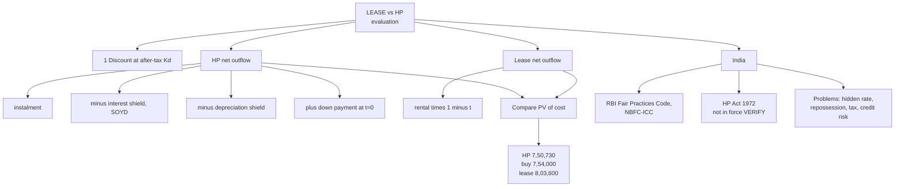

# LH-6 — Lease vs HP Evaluation, RBI Guidelines and Problems of HP

Covers: the four-step lease vs HP evaluation, a worked three-way comparison (lease, borrow-and-buy, HP), the regulatory frame for HP in India, and the problems of HP. All content is **(textbook)**.

## Evaluation outline

1. Fix the discount rate: after-tax cost of debt.
2. HP net outflow each year = instalment − tax shield on interest − tax shield on depreciation (the hirer claims depreciation on the full cost). Add the down payment at t = 0. Subtract after-tax salvage at the end.
3. Lease net outflow each year = rental × (1 − t). No depreciation, no salvage.
4. Compare PV of net outflows. The lower PV wins.

## Worked example, laid out as the exam answer

**Data.** Asset cost ₹10,00,000; SLM; nil salvage; tax 30%; discount rate 7% (after-tax cost of debt, as in LH-3). HP: down payment ₹2,00,000 at t = 0 and five year-end instalments of ₹2,10,000 on the financed ₹8,00,000.

**Assumption to state:** HP interest is allocated by sum of years' digits (SOYD).

1. Total instalments = 2,10,000 × 5 = ₹10,50,000.
2. Total interest = 10,50,000 − 8,00,000 = **₹2,50,000**.
3. Sum of digits = 1+2+3+4+5 = 15. Interest in year k = 2,50,000 × (6 − k) ÷ 15.
4. Depreciation shield = (10,00,000 ÷ 5) × 0.30 = ₹60,000 a year, as the hirer is treated as owner.

| Year | Instalment | Interest (SOYD) | Interest shield 30% | Depreciation shield | Net outflow | Factor | PV |
|---|---|---|---|---|---|---|---|
| 0 | 2,00,000 (down) | | | | 2,00,000 | 1.000 | 2,00,000 |
| 1 | 2,10,000 | 83,333 | 25,000 | 60,000 | 1,25,000 | 0.935 | 1,16,875 |
| 2 | 2,10,000 | 66,667 | 20,000 | 60,000 | 1,30,000 | 0.873 | 1,13,490 |
| 3 | 2,10,000 | 50,000 | 15,000 | 60,000 | 1,35,000 | 0.816 | 1,10,160 |
| 4 | 2,10,000 | 33,333 | 10,000 | 60,000 | 1,40,000 | 0.763 | 1,06,820 |
| 5 | 2,10,000 | 16,667 | 5,000 | 60,000 | 1,45,000 | 0.713 | 1,03,385 |
| | **PV of HP cost** | | | | | | **7,50,730** |

**Three-way comparison**

| Option | PV of cost | Source |
|---|---|---|
| Lease | 8,03,600 | LH-3 |
| Borrow and buy | 7,54,000 | LH-3 |
| Hire purchase | **7,50,730** | This table |

**Decision line:** HP is cheaper than leasing by 8,03,600 − 7,50,730 = **₹52,870**, and cheaper than borrow-and-buy by 7,54,000 − 7,50,730 = **₹3,270**. HP is the cheapest of the three.

**Interpretation:** the HP margin over borrow-and-buy is small (₹3,270 on a ₹10,00,000 asset) and depends entirely on the quoted instalment and on the SOYD allocation. State the assumption, and say a small change in the instalment or in tax rate could reverse the order of HP and buy. Leasing is clearly the dearest because the rental is 28% of cost a year.

## Regulatory frame in India (textbook)

- HP finance is offered by banks and NBFCs. Asset-financing NBFCs were once called **Asset Finance Companies (AFCs)**. RBI merged AFCs, loan companies and investment companies into one category, **NBFC-Investment and Credit Company (NBFC-ICC)**, in 2019.
- The **Hire Purchase Act, 1972** was passed but never brought into force, so HP is governed by the general law of contract, bailment and the Sale of Goods Act. **[VERIFY]** that the Act has still not been notified.
- RBI's **Fair Practices Code** for NBFCs: clear written disclosure of rate and terms, no change of terms without notice, notice before repossession, and no harassment or coercion by recovery agents. **[VERIFY]** the exact clauses and the latest circular date.
- Courts have held that forcible repossession without due process by recovery agents is unlawful (cited in the source as Citicorp Maruti Finance v. Vijayalaxmi, Supreme Court, 2007). **[VERIFY]** the case name before citing it in an exam.

## Problems of HP in India (textbook)

- High effective interest rate hidden behind a low flat rate, so borrowers misjudge cost.
- No operative HP statute: hirer protection depends on contract terms and consumer law.
- Repossession disputes and misuse of recovery agents.
- Earlier sales tax, now GST, and stamp duty on agreements add cost and complexity. How GST applies to the interest part of instalments needs care. **[VERIFY]**
- High credit risk in small-ticket vehicle and consumer-durable finance, so vendors price in risk and sometimes over-collect on default.
- Forfeiture of paid instalments on default can be harsh when most of the price is already paid.

## What to remember

- HP net outflow = instalment − interest shield − depreciation shield, plus down payment at t = 0.
- The hirer claims depreciation on the full cost; the lessee under a lease claims none.
- Worked PVs: lease 8,03,600; buy 7,54,000; HP 7,50,730. HP is cheapest, by only 3,270 over buying.
- The ranking depends on the quoted rate and rental; always state that HP interest is allocated by SOYD.
- Hire Purchase Act 1972 is not in force [VERIFY]. RBI Fair Practices Code is the partial remedy.
- Four problems to pick for 5 marks: hidden effective rate, no statute, repossession disputes, tax and stamp-duty burden.

## Concept map

## Flashcards
Q: In the worked example, what is the PV of the HP cost, and how does it compare?
A: ₹7,50,730. It beats leasing (8,03,600) by ₹52,870 and borrow-and-buy (7,54,000) by ₹3,270, so HP is cheapest.

Q: How do you compute the HP net outflow for a year?
A: Instalment minus interest tax shield minus depreciation tax shield. The down payment is added at t = 0.

Q: Why does the hirer get a depreciation shield in HP?
A: The hirer is treated as owner from the start for tax purposes.

Q: In the worked HP example, how much interest is allocated to year 1 by SOYD?
A: 2,50,000 × 5/15 = ₹83,333, giving an interest shield of ₹25,000.

Q: What assumption must you state in an HP evaluation answer?
A: That HP interest is allocated by sum of years' digits, and the discount rate is the after-tax cost of debt.

Q: Status of the Hire Purchase Act 1972?
A: Enacted but never brought into force, so HP runs on contract law, bailment and the Sale of Goods Act. [VERIFY]

Q: What did RBI merge into NBFC-ICC in 2019?
A: Asset Finance Companies, Loan Companies and Investment Companies.

Q: Name four problems of HP in India.
A: Hidden high effective rate, no operative statute, repossession disputes, and tax and stamp-duty burden (also credit risk and forfeiture of instalments).

Q: What does the RBI Fair Practices Code require of NBFCs in HP finance?
A: Written disclosure of rate and terms, no change of terms without notice, notice before repossession, no harassment by recovery agents. [VERIFY clauses]

Q: Why is the HP advantage of ₹3,270 over buying not decisive?
A: It is tiny relative to a ₹10,00,000 asset and rests on the quoted instalment and SOYD allocation; a small change could reverse the order.
