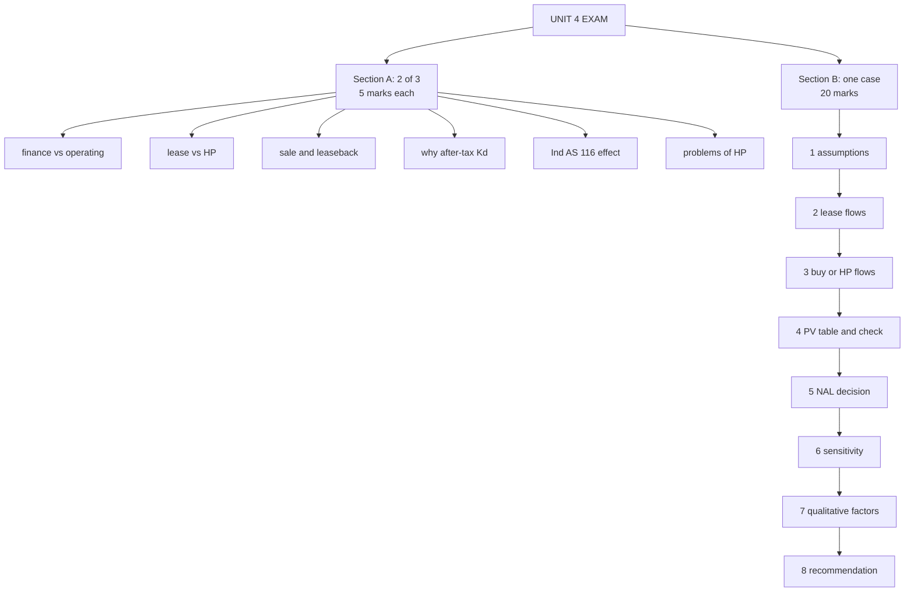

# LH-7 — Unit 4 Exam Answers

Covers: six 5-mark answer skeletons and the 20-mark case layout for Unit IV, with the model numbers from LH-3, LH-4 and LH-6. CIA3 is 1 hour and 30 marks: Section A is two of three questions at 5 marks, Section B is one 20-mark case. Unit IV feeds CO3. Half the case marks reward interpretation, so a correct number with no interpretation loses the analytical-ability rubric marks. All content is **(textbook)**.

## Likely 5-mark answers (skeletons)

**1. Finance vs operating lease.** Define each in one line. Give four contrast points: term, cancellability, who bears risks and rewards, maintenance. Close with an example (plant for finance, computers for operating). Add the Ind AS 116 point: the lessor classifies, and the lessee treats both on balance sheet.

**2. Lease vs hire purchase.** Lead with ownership (lessor keeps it; hirer gets it at the end). Then depreciation claim (lessor vs hirer), down payment, salvage, tax treatment, accounting. Four points plus one line of conclusion earns the marks.

**3. Sale and leaseback.** Meaning: the firm sells an owned asset and leases it back. Reasons: releases locked-up cash, keeps the asset in use, may improve liquidity. Risks: loses ownership and appreciation, lease commitment continues. Tax: lessee deducts rentals; lessor claims depreciation. Example: a firm sells its factory building to fund working capital.

**4. Why discount at the after-tax cost of debt?** Three reasons: a lease is a debt substitute with debt-like risk; the alternative to leasing is borrowing; interest is tax deductible, so the rate is Kd(1 − t). Add that using WACC would understate the cost of leasing.

**5. Effect of Ind AS 116 on the lessee's financials.** ROU asset and lease liability appear on the balance sheet. Rent is replaced by depreciation and interest, so EBITDA rises and early-year expense rises. Debt to equity and gearing worsen. Exemptions: short-term and low-value leases. Conclusion: off-balance-sheet financing is gone.

**6. Problems of HP in India.** Pick four: hidden high effective interest, no operative statute (the 1972 Act is not in force), repossession disputes, tax and stamp-duty burden, credit risk in small tickets. Name the RBI Fair Practices Code as the partial remedy.

## The 20-mark case: layout

The case is most likely a lease vs buy decision, possibly with a hire purchase option added.

1. **State assumptions (2 marks).** Discount rate (after-tax cost of debt, show the calculation), depreciation method, salvage, timing of rentals, tax rate. One line each.
2. **Leasing cash flows (3 marks).** Rental × (1 − t) per year. Show the year-by-year table or the annuity shortcut.
3. **Buying or HP cash flows (4 marks).** Cost or down payment and instalments, depreciation shield, interest shield, salvage. One table per option.
4. **PV table (4 marks).** Factors to 3 decimals, PV per line, total at the bottom, and a check (annuity factor × annual amount).
5. **Decision (2 marks).** NAL = PV buy − PV lease, with sign. State the choice in one sentence.
6. **Sensitivity (1 mark).** Break-even rental, or how a change in tax rate or salvage would move the answer.
7. **Qualitative factors (4 marks, do not skip).**
   - Flexibility: cancellable vs locked in.
   - Obsolescence risk shifts to the lessor in operating leases.
   - Balance-sheet effect under Ind AS 116: on balance sheet either way.
   - Covenants and debt capacity.
   - Tax position: a loss-making firm cannot use the shield, which favours leasing.
   - Strategic fit: control, customisation, residual value.
8. **Recommendation (closing line).**

### Model closing line

"On the numbers, buy by ₹49,600 in PV (lease 8,03,600 against buy 7,54,000), and no qualitative factor outweighs that margin, so I recommend purchase."

If HP is in the case, add: "HP at 7,50,730 is cheapest, but its ₹3,270 edge over buying rests on the SOYD allocation, so the recommendation is HP or buy depending on the quoted instalment."

### Time rule

If time runs short, finish steps 2 to 5 and write two lines on step 7.

## What to remember

- Section A: pick two of three. Four contrast points plus a one-line example is enough for 5 marks.
- Case layout: assumptions, lease flows, buy or HP flows, PV table with check, NAL decision, sensitivity, qualitative factors, recommendation.
- Always name the discount rate and give its three reasons.
- Model numbers: lease 8,03,600; buy 7,54,000; NAL −49,600; break-even rental 2,62,718; HP 7,50,730.
- Never skip the qualitative paragraph. It carries the interpretation marks.
- Every table ends in a decision sentence.

## Concept map

## Flashcards
Q: What is the likely format of CIA3, and how long is it?
A: 1 hour, 30 marks: Section A two of three questions at 5 marks, Section B one 20-mark case.

Q: List the steps of the 20-mark lease vs buy case in order.
A: Assumptions, lease flows, buy or HP flows, PV table with check, NAL decision, sensitivity, qualitative factors, recommendation.

Q: How are the 20 marks roughly split in the case layout?
A: Assumptions 2, lease flows 3, buy or HP flows 4, PV table 4, decision 2, sensitivity 1, qualitative factors 4.

Q: Name four qualitative factors to write in the case.
A: Flexibility, obsolescence risk, balance-sheet effect under Ind AS 116, covenants and debt capacity, tax position, strategic fit.

Q: What four contrast points earn the marks for finance vs operating lease?
A: Term, cancellability, who bears risks and rewards of ownership, maintenance and insurance.

Q: Skeleton for "Lease vs hire purchase" in 5 marks?
A: Ownership first, then depreciation claim, down payment, salvage, tax and accounting treatment, and a one-line conclusion.

Q: What are the three reasons to discount at the after-tax cost of debt?
A: Lease is a debt substitute with debt-like risk; the alternative is borrowing; interest is tax deductible.

Q: What does the Ind AS 116 5-mark answer need to cover?
A: ROU asset and liability, depreciation plus interest replacing rent, higher EBITDA, worse gearing, exemptions for short-term and low-value leases, end of off-balance-sheet financing.

Q: What is the model closing line for the worked lease vs buy case?
A: Buy by ₹49,600 in PV, and no qualitative factor outweighs that margin, so purchase.

Q: What do you write if time runs short in the case?
A: Finish steps 2 to 5 (lease flows through decision) and add two lines on the qualitative factors.
