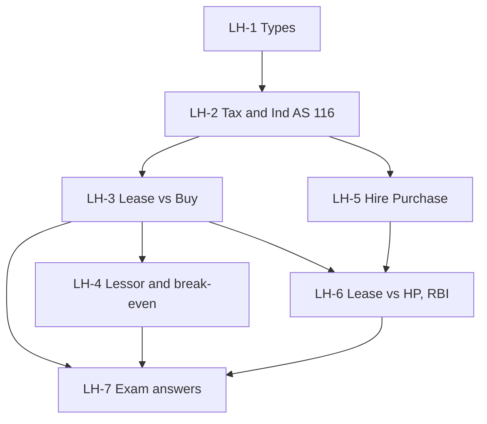

# SFM Unit 4: Leasing and Hire Purchase, node map

CIA3 scope for this unit is CO3: compare lease, buy and hire purchase to choose the most effective financing decision. Unit IV is **textbook only**, with no faculty material, so follow the teacher's convention if it differs. CIA3 is 1 hour, 30 marks: two of three 5-mark answers plus one 20-mark case.

## Nodes

| Node | Topic | Deps | Minutes | Exam focus |
|---|---|---|---|---|
| LH-1 | Leasing Meaning Importance and Types | none | 25 | no |
| LH-2 | Tax and Accounting of Leases | LH-1 | 25 | no |
| LH-3 | Lease vs Buy Lessee Evaluation | LH-2 | 40 | yes |
| LH-4 | Lessor Evaluation and Break-even Rental | LH-3 | 25 | yes |
| LH-5 | Hire Purchase and Comparisons | LH-2 | 35 | yes |
| LH-6 | Lease vs HP Evaluation, RBI Guidelines and Problems of HP | LH-3, LH-5 | 35 | yes |
| LH-7 | Unit 4 Exam Answers | LH-3, LH-4, LH-6 | 30 | yes |

Total reading time: about 215 minutes.

## Dependency graph

## Headline numbers to know

- Lease vs buy: PV lease 8,03,600, PV buy 7,54,000, NAL −49,600, buy. Lessee break-even rental about 2,62,718.
- Lessor: NPV +22,208, break-even rental about 2,72,055.
- HP vs lease vs buy: HP 7,50,730, buy 7,54,000, lease 8,03,600.
- HP interest split: 9,000, 6,000, 3,000 by SOYD; flat 6.67% is about 9.7% effective.
