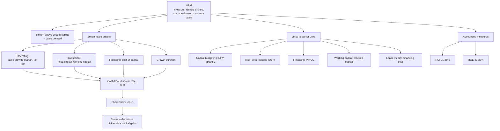

# VB-1 — VBM, Value Drivers and Links to SFM

Covers: the VBM philosophy and core rule, why accounting returns mislead, the seven value drivers and the slide-5 decision chain, how VBM links to every earlier SFM unit, and ROI and ROE as the faculty's practice slides define them. CIA3 maps this unit to CO4: explore corporate value drivers and their impact on valuation.

Source tags: **(class)** is the faculty deck or class notes and is the answer to give in the exam. **(textbook)** is background.

## Philosophy and the core rule (class)

**Philosophy:** measure value, identify value drivers, manage value drivers, maximise long-term value.

**Core rule:** return > cost of capital means value is created. Return = cost of capital means no value added. Return < cost of capital means value is destroyed.

Spread = return − cost of capital. Positive spread: growth adds value. Zero: growth is neutral. Negative: growth destroys value. A firm can show an accounting profit and still destroy value.

## The seven value drivers (class, slides 4-5)

Slide 4 lists six. The diagram on slide 5 adds fixed capital investment, which gives Rappaport's seven. The class notes list the same seven, with "growth period" for value growth duration.

| # | Driver | Management decision |
|---|---|---|
| 1 | Sales (revenue) growth | Operating |
| 2 | Operating profit margin | Operating |
| 3 | Tax rate | Operating |
| 4 | Fixed capital investment (incremental capex) | Investment |
| 5 | Working capital investment | Investment |
| 6 | Cost of capital | Financing |
| 7 | Value growth duration (growth period) | Feeds cash flow directly |

**Decision chain (slide 5):** value drivers → cash flow, discount rate and debt → shareholder value → shareholder return (dividends + capital gains).

Growth creates value only when the return on the new investment exceeds the required return (the class writes ROR > Ke). Growth that earns less than its cost destroys value.

## How VBM links to every earlier unit (class)

Likely 5-mark question. Write the chain first: **Strategy → investment → return → cost of capital → value.**

| Earlier unit | Link to VBM |
|---|---|
| Capital budgeting | NPV > 0 means return exceeds required return, so value is created |
| Risk analysis (CE, RADR, expected NPV, SD, decision tree) | Risk sets the required return, which feeds the cost of capital |
| Financing decisions | They set WACC, which is itself a value driver |
| Working capital | Excess inventory and slow collections block capital |
| Lease vs buy | The lower PV of outflows means lower financing cost, which feeds into value |

## ROI and ROE as the faculty define them (class, slides 38-41)

- **ROI = PBIT ÷ capital employed × 100.** PBIT = PAT + tax + interest. Capital employed = equity + preference capital + long-term debt. **Current liabilities are excluded.**
- **ROE = (PAT − preference dividend) ÷ (equity share capital + reserves) × 100.** **Preference capital is excluded from the denominator.**

### Practice 1: ROI, laid out as the exam answer

Equity ₹4,00,000; preference ₹2,00,000; long-term debt ₹2,00,000; current liabilities ₹1,00,000; PAT ₹1,20,000; interest ₹20,000; tax ₹30,000.

1. PBIT = 1,20,000 + 30,000 + 20,000 = **₹1,70,000**.
2. Capital employed = 4,00,000 + 2,00,000 + 2,00,000 = **₹8,00,000** (the 1,00,000 of current liabilities is excluded).
3. **ROI = 1,70,000 ÷ 8,00,000 = 21.25%.**

### Practice 2: ROE, laid out as the exam answer

Equity ₹5,00,000; preference ₹2,00,000; reserves ₹1,00,000; PAT ₹1,60,000; preference dividend ₹20,000.

1. Earnings for equity = 1,60,000 − 20,000 = ₹1,40,000.
2. Equity funds = 5,00,000 + 1,00,000 = ₹6,00,000 (preference excluded).
3. **ROE = 1,40,000 ÷ 6,00,000 = 23.33%.**

**Reading:** ROI and ROE say nothing about value until they are compared with the cost of capital (21.25% ROI against a WACC, 23.33% ROE against Ke).

**Textbook note.** The faculty's ROI is PBIT-based (before tax). In value work "ROIC" is NOPAT ÷ invested capital. Use the faculty form when the question says ROI with PAT, tax and interest given.

## Why accounting returns mislead (textbook)

- ROI and ROE ignore the cost of capital: a 12% ROE is fine until equity costs 13%.
- ROE can be raised by adding debt (higher equity multiplier) with no operational gain.
- Accrual distortions (depreciation method, provisions, inventory valuation, R&D expensing) change profit but not cash.
- Managers can lift ROI by shrinking the denominator (selling good assets, under-investing).
- Single-period and book-value based, so they ignore timing and growth.

**DuPont (textbook):** ROE = net profit margin × asset turnover × equity multiplier = (PAT ÷ Sales) × (Sales ÷ Assets) × (Assets ÷ Equity). Illustrative: sales 1,500, PAT 166.5, assets 1,200, equity 1,000 gives 11.1% × 1.25 × 1.2 = **16.65%**.

**FCFF (textbook):** EBIT(1 − t) + depreciation − capex − increase in net working capital. This is cash available to all capital providers.

## What to remember

- Philosophy: measure, identify drivers, manage drivers, maximise long-term value. Return > cost of capital creates value.
- Seven drivers: sales growth, operating margin, tax rate, fixed capital investment, working capital investment, cost of capital, growth duration.
- Slide-5 chain: drivers → cash flow, discount rate, debt → shareholder value → shareholder return.
- Link chain: strategy → investment → return → cost of capital → value.
- ROI = PBIT ÷ (equity + preference + LT debt) = 21.25% in the faculty question; current liabilities excluded.
- ROE = (PAT − preference dividend) ÷ (equity + reserves) = 23.33%; preference excluded.

## Concept map

## Flashcards
Q: What is the core condition for value creation?
A: Return on capital must exceed the cost of capital (positive spread).

Q: What is the VBM philosophy in four steps?
A: Measure value, identify value drivers, manage value drivers, maximise long-term value.

Q: List the seven value drivers as the class gives them.
A: Sales growth, operating margin, tax rate, fixed capital investment, working capital investment, cost of capital, growth period (value growth duration).

Q: Which value drivers are operating, investment and financing decisions?
A: Operating: sales growth, margin, tax rate. Investment: fixed and working capital. Financing: cost of capital. Growth duration feeds cash flow directly.

Q: What is the slide-5 decision chain?
A: Value drivers lead to cash flow, discount rate and debt, then shareholder value, then shareholder return (dividends plus capital gains).

Q: When does growth create value?
A: Only when the return on the new investment exceeds the required return (ROR > Ke).

Q: Give the strategy-to-value chain that links VBM to earlier units.
A: Strategy → investment → return → cost of capital → value.

Q: How does lease vs buy link to VBM?
A: The lower PV of outflows means a lower financing cost, which feeds into value.

Q: Faculty ROI definition and the faculty answer to the practice question?
A: ROI = PBIT ÷ (equity + preference + long-term debt), with current liabilities excluded. PBIT 1,70,000 over 8,00,000 gives 21.25%.

Q: Faculty ROE definition and the faculty answer to the practice question?
A: ROE = (PAT − preference dividend) ÷ (equity + reserves), preference excluded. 1,40,000 over 6,00,000 gives 23.33%.

Q: Give two reasons ROE can mislead.
A: It ignores the cost of equity, and leverage or buybacks can raise it without better operations.
