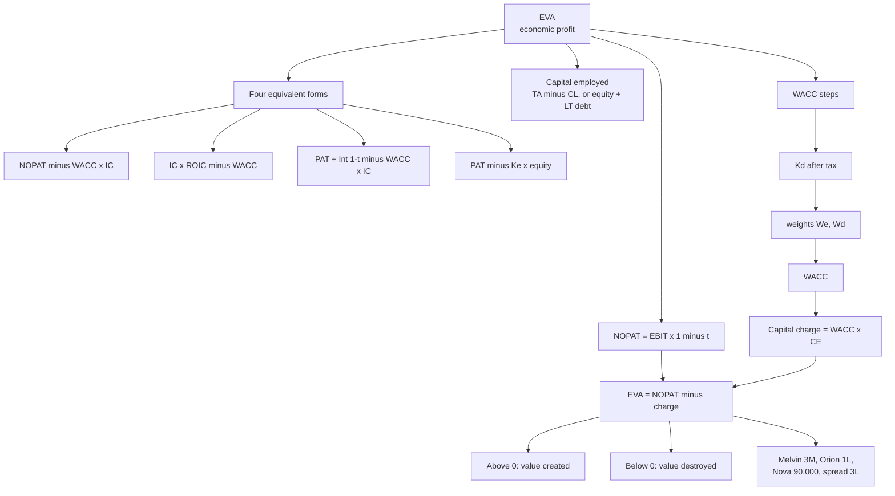

# VB-2 — Economic Value Added

Covers: the four equivalent EVA formulas, NOPAT, capital employed, the WACC steps, and the faculty and class worked problems: Melvin (₹3 million four ways), Orion (+₹1,00,000), Nova (+₹90,000) and the spread example (₹3,00,000). EVA is first in study priority for this unit. **(class)** is the answer to give in the exam.

## Definitions (class)

| Item | Class formula |
|---|---|
| NOPAT | EBIT × (1 − t) = PBIT × (1 − t) = sales − operating cost − tax |
| Capital employed | Total assets − current liabilities, **or** equity + long-term debt. Stay consistent with the question |
| After-tax Kd | Interest rate × (1 − t) |
| WACC | Ke × We + Kd(1 − t) × Wd, where We = equity ÷ (equity + debt) |
| Capital charge | WACC × capital employed |
| EVA | NOPAT − capital charge |
| ROCE / ROIC | NOPAT ÷ capital employed. The class calls ROCE − WACC the **value creation spread** |

The faculty's invested capital = debt + equity + other long-term funds. Slide 10 writes "net fixed assets **−** net current assets", which is a typo for **+**. In Melvin, fixed assets 140 + net current assets 60 = 200.

## The four equivalent EVA formulas (faculty, slide 9)

A question can hand you data for any one of them, so learn all four.

| # | Formula | Use when you are given |
|---|---|---|
| 1 | EVA = NOPAT − WACC × invested capital | EBIT/PBIT, tax and capital |
| 2 | EVA = invested capital × (ROIC − WACC) | ROIC, or NOPAT and capital |
| 3 | EVA = PAT + interest(1 − t) − WACC × invested capital | Only PAT and interest (no EBIT) |
| 4 | EVA = PAT − Ke × equity | Equity and Ke only (the equity residual) |

All four agree when interest = Kd × debt and WACC uses the same book weights. Melvin proves it.

## Faculty problem 1: Melvin Corporation (₹ million)

**Data.** Equity 100; debt 100 at 12%; fixed assets 140; net current assets 60. Sales 300; COGS 258; PBIT 42; interest 12; PBT 30; tax 30% = 9; PAT 21. Ke 18%.

1. Kd = 12% × 0.7 = **8.4%**.
2. WACC = 0.5 × 18 + 0.5 × 8.4 = **13.2%**.
3. NOPAT = 42 × 0.7 = **29.4**.
4. Invested capital = 100 + 100 = 200. ROIC = 29.4 ÷ 200 = **14.7%**.

| Method | Working | EVA |
|---|---|---|
| 1 | 29.4 − 0.132 × 200 = 29.4 − 26.4 | **₹3 million** |
| 2 | (0.147 − 0.132) × 200 | ₹3 million |
| 3 | 21 + 12 × 0.7 − 0.132 × 200 = 21 + 8.4 − 26.4 | ₹3 million |
| 4 | 21 − 0.18 × 100 = 21 − 18 | ₹3 million |

**Decision line:** EVA is positive at ₹3 million, so value is created. The ROIC of 14.7% beats WACC of 13.2% by a spread of 1.5 points on ₹200 million of capital.

## Class scenario: Orion Manufacturing

NOPAT ₹8,00,000; capital employed ₹50,00,000; WACC 14%.

1. Capital charge = 14% × 50,00,000 = ₹7,00,000.
2. **EVA = 8,00,000 − 7,00,000 = +₹1,00,000.**

**Decision line:** positive EVA, so value is created.

## Class scenario: Nova Technologies (the step order to copy)

EBIT ₹18,00,000; tax 25%; equity ₹60,00,000 at Ke 16%; debt ₹40,00,000 at 10%.

| Step | Working | Result |
|---|---|---|
| 1. NOPAT | 18,00,000 × 0.75 | ₹13,50,000 |
| 2. Capital employed | 60,00,000 + 40,00,000 | ₹1,00,00,000 |
| 3. After-tax Kd | 10% × 0.75 | 7.5% |
| 4. We / Wd | 60 ÷ 100 and 40 ÷ 100 | 0.60 / 0.40 |
| 5. WACC | 16% × 0.60 + 7.5% × 0.40 | 12.60% |
| 6. Capital charge | 12.60% × 1,00,00,000 | ₹12,60,000 |
| 7. EVA | 13,50,000 − 12,60,000 | **+₹90,000** |

**Decision line:** positive EVA, so value creation. Nova's ROIC is 13.5% against WACC of 12.6%.

## Class scenario: spread example

ROCE 18%; WACC 12%; capital ₹50,00,000.

1. Value creation spread = 18% − 12% = 6%.
2. **EVA = 6% × 50,00,000 = ₹3,00,000.**

## Textbook illustration (₹ crore, illustrative)

Equity 600 at 14%; debt 400 at 10% pre-tax; tax 25%; EBIT 200. Kd = 7.5%; WACC = 0.60 × 14 + 0.40 × 7.5 = 11.4%; NOPAT = 150; capital charge = 114; **EVA = 36**. Check: (15% − 11.4%) × 1,000 = 36.

**Stern Stewart adjustments (background, name a few):** capitalise R&D and brand spending, treat written-off goodwill as capital, add back deferred tax, treat operating leases as debt, strip out non-recurring items, exclude non-interest-bearing current liabilities.

## Interpretation to write

EVA > 0: value created. EVA = 0: the firm just earns its cost of capital. EVA < 0: value destroyed, even when accounting profit is positive, because accounting profit never charges for the cost of equity.

## What to remember

- EVA = NOPAT − WACC × capital employed = capital × (ROIC − WACC).
- Four forms: NOPAT − WACC × IC; IC × (ROIC − WACC); PAT + Int(1 − t) − WACC × IC; PAT − Ke × equity.
- NOPAT = EBIT(1 − t). Start from EBIT, never from net income.
- WACC steps: Kd(1 − t), weights, WACC, capital charge, EVA. Number them like Nova.
- Melvin ₹3 million, Orion +1,00,000, Nova +90,000, spread example 3,00,000.
- End every answer: "Positive EVA, so value creation."

## Concept map

## Flashcards
Q: EVA formula?
A: EVA = NOPAT − (WACC × capital employed) = capital employed × (ROIC − WACC).

Q: Name the four equivalent EVA formulas from slide 9.
A: NOPAT − WACC × IC; IC × (ROIC − WACC); PAT + interest(1 − t) − WACC × IC; PAT − Ke × equity.

Q: NOPAT formula?
A: EBIT × (1 − tax rate). Start from EBIT, not from net income.

Q: Which EVA formula do you use when only PAT and interest are given?
A: Formula 3: PAT + interest(1 − t) − WACC × invested capital.

Q: What is the value creation spread in the class notes?
A: ROCE − WACC, where ROCE = NOPAT ÷ capital employed.

Q: Melvin Corporation: what is the EVA and what are WACC and NOPAT?
A: EVA ₹3 million; WACC 13.2%; NOPAT 29.4 on invested capital 200 (ROIC 14.7%).

Q: Orion Manufacturing: NOPAT 8,00,000, capital 50,00,000, WACC 14%. EVA?
A: Capital charge 7,00,000, so EVA = +₹1,00,000, value created.

Q: Nova Technologies: what is the WACC and EVA?
A: WACC 12.60% (16% × 0.60 + 7.5% × 0.40); capital charge 12,60,000; EVA = 13,50,000 − 12,60,000 = +₹90,000.

Q: ROCE 18%, WACC 12%, capital ₹50,00,000. EVA?
A: Spread 6% × 50,00,000 = ₹3,00,000.

Q: What slide-10 typo should you correct in invested capital?
A: It says net fixed assets minus net current assets; it should be plus. Melvin: 140 + 60 = 200.

Q: Why can EVA be negative while profit is positive?
A: Accounting profit ignores the cost of equity; EVA charges for all capital.
