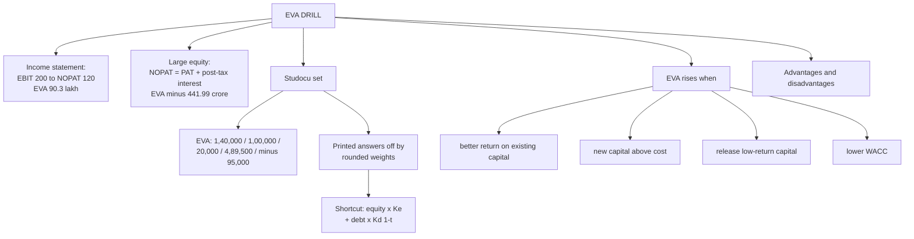

# VB-3 — EVA Problem Drill

Covers: the two faculty EVA problems (income statement ₹90.3 lakh and large equity −₹441.99 crore), the Studocu practice set with corrected answers, the capital-charge shortcut that avoids rounding, when EVA rises, and EVA's advantages and disadvantages. Step order and formulas are in VB-2.

## Faculty problem 2: income-statement EVA (₹ lakh)

**Data.** Sales 500; operating cost 300; interest 12; EBT 188; tax 40% = 75.2; EAT 112.8. Equity 150 at 15%; debt 100 at 12%.

1. EBIT = 500 − 300 = **200**. Add the interest back; never start from EAT.
2. NOPAT = 200 × 0.6 = **120**.
3. Kd = 12% × 0.6 = **7.2%**.
4. Capital employed = 150 + 100 = 250. WACC = 0.6 × 15 + 0.4 × 7.2 = **11.88%**.
5. Capital charge = 11.88% × 250 = 29.7.
6. **EVA = 120 − 29.7 = ₹90.3 lakh.**

**Decision line:** EVA is positive at ₹90.3 lakh, so value is created.

## Faculty problem 3: large-equity EVA (₹ crore, FY2012)

**Data.** Average debt 50; average equity 2,766; post-tax Kd 7.72%; Ke 16.54%; PAT before exceptional items 15.41.

1. Capital = 2,766 + 50 = 2,816.
2. WACC = (2,766 ÷ 2,816) × 16.54 + (50 ÷ 2,816) × 7.72 = **16.38%**.
3. Post-tax interest = 50 × 7.72% = 3.86.
4. NOPAT = PAT + post-tax interest = 15.41 + 3.86 = **19.27**. (This problem uses formula 3.)
5. **EVA = 19.27 − 0.1638 × 2,816 = −₹441.99 crore.**

**Decision line:** EVA is negative, so value is destroyed. A positive PAT on a large equity base can still mean heavy value destruction: the 15.41 of profit covers a tiny part of the charge of about 461 crore.

*Correction to the vault's source note:* it says that with WACC unrounded the answer is −442.08. Recomputed exactly (WACC 16.3834%), it is **−442.09**. The faculty's −441.99 with WACC rounded to 16.38% is the answer to write.

## The Studocu practice set with corrected answers

The method matches the class. The printed answers round the weights or WACC first, which **pushes four EVA answers off**. Exact figures below. Example of the cause: in EVA 2, rounding WACC to 12.34% gives a charge of 7,40,400 and EVA 99,600, the printed answer.

| Problem | Data | WACC (exact) | Capital charge | EVA (exact) | Printed answer |
|---|---|---|---|---|---|
| EVA 1 | NOPAT 5,00,000; CE 30,00,000; WACC 12% | 12% | 3,60,000 | **1,40,000** | Correct |
| EVA 2 | EBIT 12L, t 30%; equity 40L @15%; 10% debentures 20L | 12.333% | 7,40,000 | **1,00,000** | 99,600 (rounding) |
| EVA 3 | EBIT 20L, t 25%; equity 80L @14%; 12% debentures 40L | 12.333% | 14,80,000 | **20,000** | Correct |
| EVA 4 | EBIT 25L, t 35%; share capital 50L + reserves 10L @16%; 9% loans 30L; TA 1.02 cr; CL 12L | 12.617% | 11,35,500 | **4,89,500** | 4,89,650 (rounding) |
| EVA 5 | EBIT 8L, t 40%; equity 35L @13%; 8% debentures 25L | 9.583% | 5,75,000 | **−95,000** | −94,740 (rounding) |
| MVA 1 | 1,00,000 shares × ₹150; book equity 80L | | | **MVA +70,00,000** | Correct |
| EVA+MVA 2 | TA 1 cr, CL 15L, NOPAT 18L, WACC 11%; 5L shares × ₹25; book equity 65L | 11% | 9,35,000 | **EVA 8,65,000; MVA 60,00,000** | Correct |
| EVA+MVA 3 | As EVA 3; 2L shares × ₹90 | 12.333% | 14,80,000 | **EVA 20,000; MVA 1,00,00,000** | Correct |
| MVA 4 | 3L shares × ₹40; book equity 1.5 cr | | | **MVA −30,00,000** | Correct |
| MVA 5 | 4L × ₹60 + market debt 80L; book equity 1 cr + book debt 80L | | | **MVA +1,40,00,000** (full-capital method) | Correct |

The MVA rows are worked in VB-4.

### Fully worked: EVA 5 (profit but negative EVA)

1. NOPAT = 8,00,000 × (1 − 0.40) = **4,80,000**.
2. Kd = 8% × 0.6 = 4.8%. Capital employed = 35,00,000 + 25,00,000 = 60,00,000.
3. Capital charge, source by source = 35,00,000 × 13% + 25,00,000 × 4.8% = 4,55,000 + 1,20,000 = **5,75,000**.
4. WACC = 5,75,000 ÷ 60,00,000 = 9.583%.
5. **EVA = 4,80,000 − 5,75,000 = −₹95,000.**

**Decision line:** EVA is negative, so value is destroyed even though the firm earns an accounting profit. NOPAT of 4,80,000 does not cover the 5,75,000 cost of capital.

### The exam trick that avoids the rounding error

Skip WACC as a percentage. Work out the capital charge source by source:

**Capital charge = equity × Ke + debt × Kd(1 − t).**

For EVA 4: 60L × 16% + 30L × 5.85% = 9,60,000 + 1,75,500 = **11,35,500**. NOPAT = 25L × 0.65 = 16,25,000, so EVA = 16,25,000 − 11,35,500 = **4,89,500**. This is exact and equals WACC × capital employed by definition. Still show the WACC line, because the class steps include it.

### Traps this set teaches

- Reserves and surplus count as equity.
- Capital employed = TA − CL, never total assets (EVA 4: 1.02 cr − 12L = 90L = 60L + 30L).
- NOPAT uses EBIT, never net income.
- A firm can show accounting profit and still have negative EVA (EVA 5).
- A small EVA alongside a large MVA means the market is pricing in future EVA (EVA+MVA 3).

## When EVA rises (faculty)

1. The return on existing capital improves without new capital.
2. New capital earns more than the cost of capital.
3. Capital is withdrawn from activities earning inadequate returns.
4. WACC is lowered.

## EVA advantages and disadvantages (faculty)

| Advantages | Disadvantages |
|---|---|
| Shows true economic profit, including the cost of equity | WACC and Ke rest on assumptions |
| Simple | NOPAT needs adjustments, hard with many subsidiaries |
| Usable for divisions and projects | Comparisons across firms are hard |
| Links capital use to operating profit | Based on historical data |

## What to remember

- Income-statement EVA: add interest back to reach EBIT. EBIT 200, NOPAT 120, WACC 11.88%, EVA ₹90.3 lakh.
- Large-equity EVA: NOPAT = PAT + post-tax interest = 19.27; EVA −441.99 crore. Positive PAT can still destroy value.
- Capital charge = equity × Ke + debt × Kd(1 − t) gives the exact answer with no rounding drift.
- Corrected Studocu EVAs: 1,40,000; 1,00,000; 20,000; 4,89,500; −95,000.
- EVA rises with better returns on existing capital, new capital above cost, capital release, lower WACC.
- Advantages: true economic profit, simple, divisional. Disadvantages: assumptions, adjustments, hard comparisons, history.

## Concept map

## Flashcards
Q: Income-statement EVA problem: what are EBIT, NOPAT, WACC and EVA?
A: EBIT 200, NOPAT 120, WACC 11.88%, EVA = 120 − 0.1188 × 250 = ₹90.3 lakh.

Q: Why must you start from EBIT and not EAT in the income-statement EVA problem?
A: NOPAT is operating profit after tax before financing, so interest must be added back to reach EBIT.

Q: Large-equity EVA problem: NOPAT, WACC and EVA?
A: NOPAT 19.27 (PAT 15.41 + post-tax interest 3.86), WACC 16.38%, EVA = −₹441.99 crore.

Q: What does the large-equity EVA teach?
A: A positive PAT on a large equity base can still mean heavy value destruction, because the equity cost is not charged in accounting profit.

Q: What is the capital-charge shortcut that avoids rounding errors?
A: Capital charge = equity × Ke + debt × Kd(1 − t), computed source by source instead of using rounded weights.

Q: Studocu EVA 4 (EBIT 25L, t 35%, equity 60L at 16%, 9% loans 30L): exact EVA?
A: Charge 11,35,500, NOPAT 16,25,000, EVA ₹4,89,500 (printed 4,89,650 is a rounding error).

Q: Studocu EVA 5: EVA and what it shows?
A: −₹95,000 (NOPAT 4,80,000, charge 5,75,000). A profitable firm can have negative EVA.

Q: Studocu EVA 2: exact EVA and the printed answer?
A: Exact ₹1,00,000. The printed 99,600 comes from rounding WACC to 12.34%.

Q: In Studocu EVA 4, how do you get capital employed?
A: Total assets 1.02 crore minus current liabilities 12 lakh = 90 lakh (equity 60L including reserves + loans 30L).

Q: List the four ways EVA rises.
A: Better return on existing capital, new capital earning above its cost, withdrawing capital from inadequate-return activities, lowering WACC.

Q: Give two advantages and two disadvantages of EVA.
A: Advantages: shows true economic profit including the cost of equity; usable for divisions and projects. Disadvantages: WACC and Ke rest on assumptions; NOPAT needs adjustments and uses historical data.
