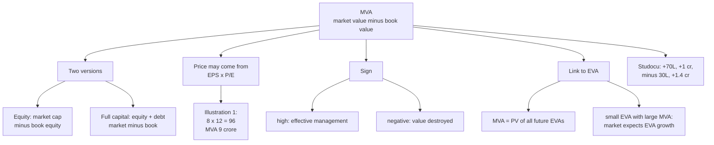

# VB-4 — Market Value Added

Covers: the two MVA formulas, the faculty illustration (₹9 crore via EPS × P/E), the Studocu MVA problems, and the link between EVA and MVA. MVA is second in study priority for this unit.

## Formulas

**Class (class):** MVA = market value of the firm − book value of the firm. Market value of equity = price × shares outstanding.

State which version you use. Two versions exist:

| Version | Formula |
|---|---|
| Equity version | MVA = market capitalisation − book equity |
| Full-capital (firm) version | MVA = (market value of equity + market value of debt) − (book equity + book debt) |

Reserves count in book equity. When debt is at book value both versions give the same answer.

**MVA in the faculty deck (class):** MVA is cumulative and external, and it rises with positive-NPV strategies.
- A high MVA means effective management.
- A low MVA means management's actions are worth less than the capital contributed.
- A negative MVA means value has been destroyed.

## Faculty illustration 1: MVA through EPS × P/E

**Data.** 10,00,000 shares; EPS ₹8; P/E 12; book capital employed ₹60,00,000.

1. Market price per share = EPS × P/E = 8 × 12 = **₹96**. This is the trap: the price is not given, it comes from EPS × P/E.
2. Market value = 10,00,000 × 96 = **₹9,60,00,000**.
3. **MVA = 9,60,00,000 − 60,00,000 = ₹9,00,00,000.**

**Decision line:** MVA is positive at ₹9 crore, so the market values the firm at ₹9 crore more than the capital invested.

## Faculty problem 5: EVA and MVA together

Same as Studocu EVA+MVA 2: total assets ₹1 crore; current liabilities ₹15 lakh; NOPAT ₹18 lakh; WACC 11%; 5,00,000 shares at ₹25; book equity ₹65 lakh.

1. Capital employed = 1,00,00,000 − 15,00,000 = ₹85,00,000.
2. Capital charge = 11% × 85,00,000 = ₹9,35,000.
3. **EVA = 18,00,000 − 9,35,000 = ₹8,65,000.**
4. Market value of equity = 5,00,000 × 25 = ₹1,25,00,000.
5. **MVA = 1,25,00,000 − 65,00,000 = ₹60,00,000.**

**Decision line:** both EVA and MVA are positive, so the firm creates value and the market agrees.

## Studocu MVA problems (answers verified)

| Problem | Data | Working | MVA |
|---|---|---|---|
| MVA 1 | 1,00,000 shares × ₹150; book equity 80L | 1,50,00,000 − 80,00,000 | **+70,00,000** |
| EVA+MVA 3 | 2,00,000 shares × ₹90; book equity 80L (EVA 20,000, see VB-3) | 1,80,00,000 − 80,00,000 | **+1,00,00,000** |
| MVA 4 | 3,00,000 shares × ₹40; book equity 1.5 cr | 1,20,00,000 − 1,50,00,000 | **−30,00,000** |
| MVA 5 | 4,00,000 × ₹60 + market debt 80L; book equity 1 cr + book debt 80L | (2,40,00,000 + 80,00,000) − (1,00,00,000 + 80,00,000) = 3,20,00,000 − 1,80,00,000 | **+1,40,00,000** (full-capital method) |

**Readings.**
- MVA 4 is negative: the market values the equity at ₹30 lakh below the capital the owners put in, so value is destroyed.
- EVA+MVA 3: EVA is only ₹20,000 but MVA is ₹1 crore. A small EVA alongside a large MVA means the market is pricing in future EVA growth.
- MVA 5 uses the full-capital method because market debt is given. Name the method you use.

## The EVA-MVA link (textbook, illustrative)

**MVA = present value of all future EVAs** (Stern Stewart). It is the market's verdict on how much future EVA the firm will deliver.

*Illustrative, ₹ crore.* EVA 36; WACC 11.4%; market cap 1,300; market debt at book 400; capital employed 1,000 (equity 600).

1. Firm MVA = 1,300 + 400 − 1,000 = **700**. Equity MVA = 1,300 − 600 = 700 (same because debt is at book).
2. A flat EVA of 36 forever is worth 36 ÷ 0.114 = **315.8** only.
3. The market pays 700, so it prices in EVA growth. Solve 36 ÷ (0.114 − g) = 700, giving g = about **6.26%** a year.

**Exam point:** high MVA relative to current EVA means expected EVA growth.

**EVA vs MVA:** EVA is a flow (one period, internal, accounting based) and can be computed for divisions. MVA is a stock (cumulative, external, market based) and exists only for listed whole firms.

## What to remember

- MVA = market value − book value. State equity or full-capital version.
- Price may need to be derived: EPS × P/E (8 × 12 = ₹96).
- Faculty illustration 1: MVA ₹9,00,00,000. EVA+MVA problem: EVA 8,65,000, MVA 60,00,000.
- Studocu MVAs: +70,00,000, +1,00,00,000, −30,00,000, +1,40,00,000.
- MVA = PV of all future EVAs. Small EVA with large MVA means the market expects growth.
- Negative MVA means value destroyed. Say it in a sentence after every number.

## Concept map

## Flashcards
Q: What is the MVA formula in the class notes?
A: MVA = market value of the firm minus book value of the firm, with market value of equity = price × shares outstanding.

Q: What are the two versions of MVA?
A: Equity version (market cap − book equity) and full-capital version (market equity + debt − book equity − book debt). Name the one you use.

Q: Faculty illustration 1: 10,00,000 shares, EPS ₹8, P/E 12, book capital ₹60,00,000. MVA?
A: Price 8 × 12 = ₹96, market value ₹9,60,00,000, MVA = ₹9,00,00,000.

Q: What is the trap in faculty illustration 1?
A: The share price is not given; it comes from EPS × P/E.

Q: EVA+MVA problem (TA 1 cr, CL 15L, NOPAT 18L, WACC 11%, 5L shares × ₹25, book equity 65L): EVA and MVA?
A: Capital employed 85L, charge 9,35,000, EVA ₹8,65,000; MVA = 1,25,00,000 − 65,00,000 = ₹60,00,000.

Q: Studocu MVA 4 (3L shares × ₹40, book equity 1.5 cr): MVA and meaning?
A: −₹30,00,000. The market values equity below the capital contributed, so value is destroyed.

Q: Studocu MVA 5 with market debt: which method and what is the answer?
A: Full-capital method: 3,20,00,000 − 1,80,00,000 = +₹1,40,00,000.

Q: What does a high, low and negative MVA mean?
A: High: effective management. Low: management's actions are worth less than the capital contributed. Negative: value destroyed.

Q: What is the link between MVA and EVA?
A: MVA equals the present value of all future EVAs.

Q: EVA is only ₹20,000 but MVA is ₹1 crore. What does it signal?
A: The market is pricing in future EVA growth.

Q: EVA vs MVA in one line?
A: EVA is an annual flow measured internally and usable by division; MVA is a cumulative stock measured by the market for whole listed firms.
