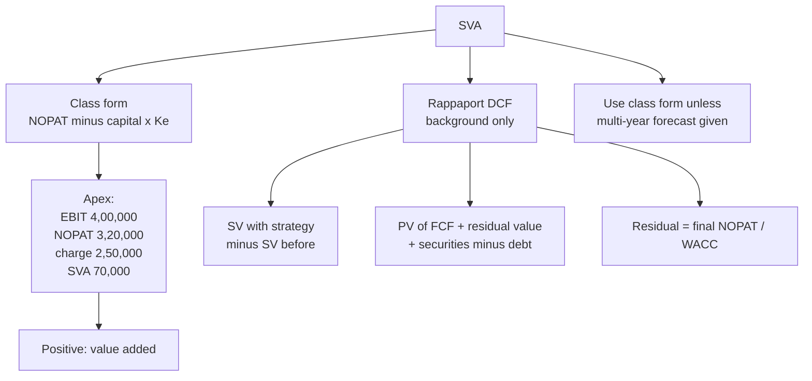

# VB-5 — Shareholder Value Added

Covers: the class form of SVA (NOPAT − capital × Ke) with the Apex problem (₹70,000), and Rappaport's DCF version in brief as background. SVA is third in study priority for this unit.

## The class form (class)

**SVA = NOPAT − capital charge**, where in the worked problem the capital charge is **capital employed × Ke**. The class calls this "a simplified expression". Use this form unless the question gives multi-year forecasts.

It is not Rappaport's DCF version. This is a point where the class and the textbook differ, so write the class form as the answer.

## Faculty problem 6: Apex Industrial Solutions

**Data.** Capital employed ₹25,00,000; revenue ₹16,00,000; EBIT margin 25%; tax 20%; Ke 10%.

1. EBIT = 25% × 16,00,000 = **₹4,00,000**.
2. NOPAT = 4,00,000 × (1 − 0.20) = **₹3,20,000**.
3. Capital charge = 25,00,000 × 10% = **₹2,50,000**.
4. **SVA = 3,20,000 − 2,50,000 = ₹70,000.**

**Decision line:** SVA is positive at ₹70,000, so the strategy adds value for shareholders. The return on capital (NOPAT 3,20,000 ÷ 25,00,000 = 12.8%) exceeds Ke of 10%.

*Caution (my note, not class).* NOPAT is before interest, so charging only equity capital × Ke treats all of the ₹25,00,000 as equity-funded. That is what the class problem does. If a question splits equity and debt, use the class form only if the question tells you to, otherwise state your assumption.

## How SVA differs from EVA (class vs textbook)

| | EVA | SVA (class form) |
|---|---|---|
| Charge | WACC × capital employed | Ke × equity capital |
| Reading | Value for all capital providers | Value for shareholders |

If Apex were all-equity funded, WACC would equal Ke (10%) and EVA would also be ₹70,000.

## Rappaport's DCF version in brief (textbook, background only)

**SVA = shareholder value with the strategy − shareholder value before it.**

Shareholder value = corporate value (PV of free cash flows + PV of residual value) + marketable securities − debt.

Method in seven steps:
1. Forecast sales, margin, tax and incremental investment for the planning period.
2. FCF = prior sales × (1 + g) × margin × (1 − tax) − investment rate × change in sales.
3. Discount each FCF at WACC.
4. Residual value (no growth after horizon) = final-year NOPAT ÷ WACC, discounted back from the end year.
5. Corporate value = PV of FCFs + PV of residual value.
6. Shareholder value = corporate value + marketable securities − debt.
7. SVA = shareholder value with strategy − shareholder value of the base case.

*Illustrative figures, ₹ crore, recomputed:* base sales 1,000; securities 50; debt 400; WACC 12%; tax 25%; incremental investment 30% of change in sales; 4 years. New strategy (growth 10%, margin 15%): shareholder value **848.3**. Base case (growth 4%, margin 14%): **612.2**. **SVA = 236.1 crore** (exact 236.05).

The first-year FCF of the new strategy is lower relative to the base because growth needs investment. The value comes from later years and the residual.

## What to remember

- Class SVA = NOPAT − capital employed × Ke.
- Apex: EBIT 4,00,000, NOPAT 3,20,000, charge 2,50,000, SVA ₹70,000, positive.
- Use the class form unless a multi-year forecast is given.
- Rappaport: SVA = shareholder value with the strategy − before it; residual value = NOPAT ÷ WACC.
- Positive SVA means the return on capital beats the cost of equity.

## Concept map

## Flashcards
Q: What is the class form of SVA?
A: SVA = NOPAT − capital charge, where the capital charge is capital employed × Ke (the class's simplified expression).

Q: When do you use the Rappaport DCF version of SVA instead?
A: Only when the question gives multi-year forecasts.

Q: Apex Industrial Solutions: what is the SVA?
A: EBIT 4,00,000, NOPAT 3,20,000, charge 25,00,000 × 10% = 2,50,000, SVA = ₹70,000, positive.

Q: In Apex, how do you get EBIT?
A: EBIT margin 25% × revenue 16,00,000 = ₹4,00,000.

Q: What does a positive SVA tell you?
A: The return on capital exceeds the cost of equity, so the strategy adds shareholder value. In Apex, 12.8% against 10%.

Q: Rappaport's definition of SVA?
A: Shareholder value with the strategy minus shareholder value before it.

Q: How is shareholder value built in Rappaport's method?
A: PV of FCF plus PV of residual value gives corporate value; add marketable securities and subtract debt.

Q: Rappaport's residual value with no growth after the horizon?
A: Final-year NOPAT divided by WACC, discounted back from the end of the planning period.

Q: In the illustrative Rappaport example, what is the SVA?
A: ₹236.1 crore (shareholder value 848.3 with the strategy against 612.2 in the base case).

Q: Why is the new strategy's first-year FCF relatively low in the Rappaport example?
A: Growth needs investment up front; the value comes from later years and the residual value.
