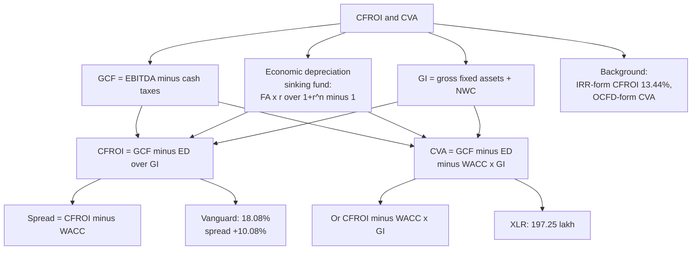

# VB-6 — CFROI and CVA

Covers: gross cash flow, gross investment and the sinking-fund economic depreciation formula, the CFROI and CVA formulas, the faculty problems Vanguard Auto Component (CFROI 18.08%) and XLR Engineering (CVA ₹197.25 lakh), and the textbook IRR version as background only. **(class)** is the answer to give in the exam.

## Formulas (class and faculty)

| Item | Formula |
|---|---|
| Gross cash flow (GCF), faculty slides | EBITDA − cash taxes paid |
| GCF, class notes | Adjusted profit + interest + depreciation |
| Gross investment (GI), faculty slides | Gross fixed assets + net working capital (NWC = CA − CL) |
| GI, class notes | Net current assets + historical initial cost of assets |
| **Economic depreciation (ED)** | Gross depreciable fixed assets × r ÷ [(1 + r)^n − 1] |
| **CFROI** | (GCF − ED) ÷ GI. A ratio, not the IRR form |
| Economic spread | CFROI − WACC |
| **CVA** | GCF − ED − capital charge |
| Capital charge | WACC × **gross investment** |
| CVA, alternative form | (CFROI − cost of capital) × gross investment |

**Economic depreciation is a sinking-fund annuity, not book depreciation.** Here r = WACC and n = economic life. The factor r ÷ [(1 + r)^n − 1] is the sinking-fund factor. It is the yearly amount that, set aside and compounded at WACC, rebuilds the fixed assets at the end of their life.

**Sinking-fund factors worth memorising (the deck uses these):**
- 8%, 8 years: **0.094015**
- 10%, 10 years: **0.062745**

Practice the hand computation: raise (1 + r) to the power n by repeated squaring, subtract 1, divide into r. For 8%, 8 years: 1.08⁸ = 1.85093; 0.08 ÷ 0.85093 = 0.094015.

**Compare CFROI with WACC.** CFROI above WACC means value is created; the gap is the economic spread.

## Faculty problem 7: Vanguard Auto Component, CFROI (₹ lakh)

**Data.** EBITDA 750; cash taxes 110; gross depreciable fixed assets 2,000; NWC 500; WACC 8%; life 8 years.

1. GCF = 750 − 110 = **640**.
2. GI = 2,000 + 500 = **2,500**.
3. ED = 2,000 × 0.08 ÷ (1.08⁸ − 1) = 2,000 × 0.094015 = **188.03**.
4. Net cash flow = 640 − 188.03 = **451.97**.
5. **CFROI = 451.97 ÷ 2,500 = 18.08%.**
6. Spread over WACC = 18.08% − 8% = **+10.08%**.

**Decision line:** CFROI of 18.08% beats WACC of 8% by 10.08 points, so value is created.

*Extra check (computed, not in the deck):* CVA = (CFROI − WACC) × GI = 0.1008 × 2,500 = ₹251.97 lakh, which equals 640 − 188.03 − 0.08 × 2,500 = 251.97.

## Faculty problem 8: XLR Engineering, CVA (₹ lakh)

**Data.** EBITDA 450; cash taxes 70; gross fixed assets 1,000; NWC 200; WACC 10%; life 10 years.

1. GCF = 450 − 70 = **380**.
2. GI = 1,000 + 200 = **1,200**.
3. ED = 1,000 × 0.10 ÷ (1.1¹⁰ − 1) = 1,000 × 0.062745 = **62.75**.
4. Capital charge = 1,200 × 10% = **120** (WACC on **gross investment**, not on fixed assets alone).
5. **CVA = 380 − 62.75 − 120 = ₹197.25 lakh.**

**Decision line:** CVA is positive at ₹197.25 lakh, so the firm generates cash above what its capital demands.

*Cross-check (computed):* CFROI = (380 − 62.75) ÷ 1,200 = 26.44%. (26.44% − 10%) × 1,200 = 197.25. Both forms agree.

## Textbook versions (background only)

**CFROI as an IRR (HOLT/BCG).** The internal rate of return of the firm's existing assets: the rate that equates gross cash flows over the average asset life, plus release of non-depreciating assets (land, working capital) at the end, with gross investment. Figures are inflation-adjusted, so CFROI is a **real** return and is compared with a real WACC.

*Illustrative:* gross investment 1,000; gross cash flow 200 a year for 8 years; non-depreciating assets of 150 released at the end of year 8. Solving 1,000 = Σ 200 ÷ (1 + r)^t + 150 ÷ (1 + r)^8 gives **CFROI = 13.44%**. Against a real WACC of 8%, the spread is about 5.4 points.

**CVA, Ottosson and Weissenrieder form.** CVA = operating cash flow − operating cash flow demand (OCFD), where OCFD is the level annuity that recovers the gross strategic investment over its life at WACC.

*Illustrative:* operating cash flow 180; investment 800; life 10 years; WACC 11.4%. OCFD = 800 × 0.114 ÷ (1 − 1.114⁻¹⁰) = **138.1**; **CVA = 41.9 crore**.

Class form first. If a question uses the textbook form, say so.

**Strengths and weaknesses.** CFROI: removes accounting depreciation and inflation distortion and is comparable across firms; but it is data heavy. CVA: cash based, so harder to manipulate; but lumpy with heavy capex.

## What to remember

- GCF = EBITDA − cash taxes. GI = gross fixed assets + NWC.
- ED = gross fixed assets × r ÷ [(1 + r)^n − 1], with r = WACC. Sinking-fund factors: 0.094015 (8%, 8 years) and 0.062745 (10%, 10 years).
- CFROI = (GCF − ED) ÷ GI. Compare with WACC. Vanguard: 18.08%, spread +10.08%.
- CVA = GCF − ED − WACC × GI = (CFROI − WACC) × GI. XLR: ₹197.25 lakh.
- Capital charge uses gross investment, not capital employed.
- The IRR-form CFROI and the OCFD-form CVA are background only.

## Concept map

## Flashcards
Q: How is gross cash flow defined on the faculty slides?
A: EBITDA minus cash taxes paid.

Q: How is gross investment defined on the faculty slides?
A: Gross fixed assets plus net working capital (current assets minus current liabilities).

Q: What is the economic depreciation formula?
A: ED = gross depreciable fixed assets × r ÷ [(1 + r)^n − 1], a sinking-fund annuity with r = WACC and n = economic life.

Q: Sinking-fund factors the deck uses?
A: 8%, 8 years: 0.094015. 10%, 10 years: 0.062745.

Q: CFROI formula and what you compare it with?
A: CFROI = (GCF − ED) ÷ GI. Compare with WACC; the gap is the economic spread.

Q: Vanguard Auto Component: GCF, GI, ED and CFROI?
A: GCF 640, GI 2,500, ED 188.03, net cash flow 451.97, CFROI 18.08%.

Q: Vanguard: what does the result say?
A: CFROI of 18.08% exceeds WACC of 8% by 10.08 points, so value is created.

Q: CVA formula (class form)?
A: CVA = GCF − ED − capital charge, with capital charge = WACC × gross investment. Alternative: (CFROI − cost of capital) × gross investment.

Q: XLR Engineering: GCF, GI, ED, capital charge and CVA?
A: GCF 380, GI 1,200, ED 62.75, charge 120, CVA = ₹197.25 lakh.

Q: On what base is the CVA capital charge computed?
A: Gross investment (fixed assets plus NWC), not capital employed.

Q: Why is the IRR-form CFROI only background in this course?
A: The class and faculty define CFROI as a ratio, (GCF − ED) ÷ GI. The IRR form is the HOLT/BCG professional method.
