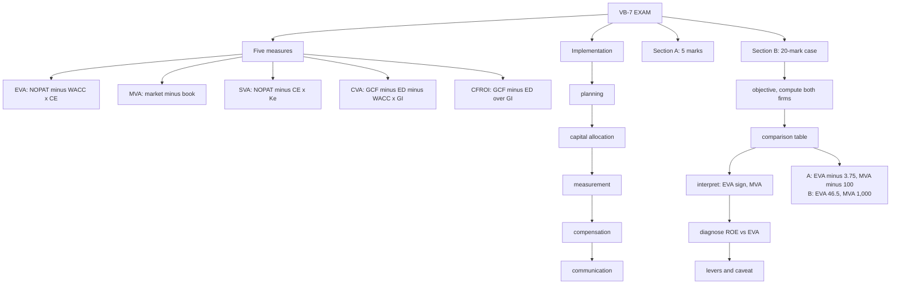

# VB-7 — VBM Comparison, Implementation and Exam Answers

Covers: the five-measure comparison table, what drives each metric, the five implementation steps, the forecasting steps, six 5-mark skeletons, and the 20-mark two-company case layout with a fully worked illustration. CIA3 is 1 hour, 30 marks: Section A is two of three questions at 5 marks, Section B is one 20-mark case. The rubric rewards analysing value creation and destruction **with financial evidence** and applying VBM concepts **accurately**.

## The five measures compared (class)

The class lists five measures: EVA, MVA, SVA, CVA, CFROI. It **does not mention SFROI**, so SFROI is background only.

| Metric | Class formula | Measures | Strengths | Weaknesses | Best for |
|---|---|---|---|---|---|
| EVA | NOPAT − WACC × capital employed | Annual economic profit | Simple, charges equity cost, usable by division | Needs adjustments, short-term bias | Performance measurement, bonuses |
| MVA | Market value − book value | Cumulative value created in the market | Direct shareholder wealth measure | Only for listed firms, market noise | Whole-firm judgement |
| SVA | NOPAT − equity capital × Ke | Value added for shareholders | Simple, links profit to equity cost | Assumes simplified capital basis | Shareholder-focused evaluation |
| CVA | GCF − ED − WACC × GI | Cash-based surplus | Cash based, less accounting distortion | Capex lumpy, less used | Cash-focused firms, planning |
| CFROI | (GCF − ED) ÷ GI | Cash return on gross investment | Removes accounting depreciation, comparable across firms | Data heavy | Cross-company comparison |

**SFROI (background):** not a standard acronym. The most defensible reading is a CFROI-type or shareholder-funds return measure. **[VERIFY with faculty]** what it stands for. Do not write a confident definition in the exam unless it matches the class definition. If asked, state your assumption in one line and then compute.

### Drivers of each metric (textbook)

| Metric | Main drivers |
|---|---|
| EVA | NOPAT (sales, margin, tax), capital employed, WACC |
| MVA | PV of expected EVAs: EVA growth, risk, market sentiment |
| SVA | The seven value drivers (VB-1) |
| CVA | Gross cash flow, investment life, WACC (via economic depreciation) |
| CFROI | Gross cash flow, gross investment, asset life |

## Implementation steps (textbook)

1. **Strategic planning:** every business plan is valued by its SVA or expected EVA; strategies with negative value are dropped.
2. **Capital allocation:** capital goes only to projects with ROIC above WACC, and is withdrawn from units that fall short.
3. **Performance measurement:** divisions are judged on EVA, not on profit or ROI.
4. **Compensation:** bonuses tied to EVA improvement, so managers bear the cost of capital like owners.
5. **Communication:** investors and staff are told the value drivers, and teams learn how daily decisions (inventory, pricing, capex) move EVA.

## Key steps in forecasting analysis for EVA and SVA (textbook)

1. Historical analysis: growth, margins, capital turnover, ROIC, tax rate over 3 to 5 years.
2. Choose forecast drivers: sales growth, margin, cash tax rate, fixed and working capital intensity.
3. Forecast NOPAT and FCF.
4. Forecast invested capital (opening capital + net investment).
5. Estimate WACC (CAPM for Ke, after-tax Kd, market-value weights).
6. Compute period figures: EVA = NOPAT − WACC × opening capital.
7. Terminal value: perpetuity of EVA or NOPAT at the horizon.
8. Discount at WACC.
9. Aggregate, interpret and test sensitivity to margin, growth and WACC.

## Likely 5-mark answers (skeletons)

**1. EVA vs accounting profit.** Accounting profit deducts only debt interest; EVA also deducts the cost of equity. So a firm can show profit and negative EVA. EVA uses NOPAT and capital employed and measures whether wealth was created for all capital providers. Example line: NOPAT 150 is "profit", EVA 36 is after the 114 capital charge.

**2. EVA vs MVA.** EVA is an annual flow, internal, usable by division. MVA is cumulative, external, whole-firm. MVA = PV of all future EVAs. High MVA with low current EVA means the market expects EVA to grow. Give the formulas and the 315.8 vs 700 example from VB-4.

**3. Value drivers.** List the seven (VB-1), group them under operating, investment and financing decisions, and state the slide-5 chain: drivers → cash flow, discount rate, debt → shareholder value → shareholder return.

**4. Value creation vs destruction.** Define the spread (return − cost of capital). Create: return > WACC (EVA > 0, MVA rising). Destroy: return < WACC even with positive profit (Studocu EVA 5). Use an *illustrative* firm. If you name a listed Indian company, keep it qualitative.

**5. Why ROE can mislead.** Ignores the cost of equity, rises with leverage and buybacks without better operations, accrual distortion, short term, ignores risk. Use DuPont to show leverage as the cause.

**6. VBM implementation and links.** Five steps (planning, capital allocation, measurement, compensation, communication) plus one line on EVA as the common metric, or the link chain strategy → investment → return → cost of capital → value.

## The 20-mark case: two-company layout

Write in this order and show every step.

1. **State the objective:** which firm creates value, tested by return on capital against WACC.
2. **Compute for each firm:** PAT, ROE, NOPAT, ROIC, Ke and Kd, WACC, capital charge, EVA, MVA. Show formulas once, then the numbers.
3. **Put everything in one comparison table.**
4. **Interpret:** sign of EVA, spread, MVA, and whether the market agrees with the EVA.
5. **Diagnose:** ROE rankings can differ from EVA rankings (use DuPont if leverage is the story).
6. **Recommend levers per firm:** margin, asset turnover, capital release, capital structure, divest.
7. **One-line caveat:** single-year EVA, adjustments, forecast uncertainty.

### Worked illustration (₹ crore, illustrative, not real companies)

| Item | Firm A | Firm B |
|---|---|---|
| EBIT | 300 | 240 |
| Interest | 45 (500 debt at 9%) | 18 (200 debt at 9%) |
| Tax rate | 25% | 25% |
| PAT = (EBIT − interest)(1 − t) | 191.25 | 166.5 |
| Equity (book) | 1,500 | 1,000 |
| **ROE** | **12.75%** | **16.65%** |
| NOPAT = EBIT(1 − t) | 225 | 180 |
| Capital employed (equity + debt) | 2,000 | 1,200 |
| **ROIC** | **11.25%** | **15.00%** |
| Cost of equity | 13% | 12% |
| After-tax Kd (9% × 0.75) | 6.75% | 6.75% |
| **WACC** | 0.75 × 13 + 0.25 × 6.75 = **11.4375%** | (1,000 ÷ 1,200) × 12 + (200 ÷ 1,200) × 6.75 = **11.125%** |
| Capital charge | 228.75 | 133.50 |
| **EVA** | **−3.75** | **+46.5** |
| Market cap | 1,400 | 2,000 |
| **MVA** (market equity + debt − capital) | 1,400 + 500 − 2,000 = **−100** | 2,000 + 200 − 1,200 = **+1,000** |

**Reading it.** Firm A has the bigger EBIT and larger asset base but earns 11.25% on capital against an 11.44% cost, so EVA is slightly negative, and its 12.75% ROE is below its 13% cost of equity. The market agrees (MVA −100). Firm B is smaller yet creates ₹46.5 crore of EVA, and the market pays 1,000 above capital.

**Recommendation.** B creates value; A should lift ROIC by about 0.2 points just to break even. Levers for A: trim capital (release idle assets), raise margin, review the 25% debt mix. For B: protect the spread and reinvest only where ROIC stays above about 11.1%.

**Caveat.** One year of EVA, unadjusted accounting figures, and a market price that can be noisy.

## What to remember

- The class has five measures (EVA, MVA, SVA, CVA, CFROI). SFROI is not in the class notes.
- Implementation: planning, capital allocation, measurement, compensation, communication.
- 5-mark favourites: EVA vs profit, EVA vs MVA, value drivers, creation vs destruction, ROE misleads, implementation.
- 20-mark case: compute ROE, NOPAT, ROIC, WACC, charge, EVA, MVA for both firms, tabulate, interpret, diagnose, recommend, caveat.
- Illustration: A has EVA −3.75 and MVA −100; B has EVA +46.5 and MVA +1,000.
- Always end a number with a sign interpretation. The rubric pays for evidence and interpretation.

## Concept map

## Flashcards
Q: Which five measures does the class list?
A: EVA, MVA, SVA, CVA and CFROI. SFROI is not mentioned.

Q: What is the status of SFROI for this course?
A: Not in the class notes and not a standard acronym; background only, with [VERIFY] before writing a definition.

Q: Give the class formulas for SVA, CVA and CFROI.
A: SVA = NOPAT − equity capital × Ke. CVA = GCF − ED − WACC × GI. CFROI = (GCF − ED) ÷ GI.

Q: List the five VBM implementation steps.
A: Strategic planning, capital allocation, performance measurement, compensation tied to EVA, communication.

Q: Why does VBM tie compensation to EVA improvement?
A: So managers bear the cost of capital like owners and do not chase profit that does not cover it.

Q: EVA vs accounting profit in one line?
A: Accounting profit deducts only debt interest; EVA also deducts the cost of equity, so profit can coexist with negative EVA.

Q: Two-company illustration: Firm A's EVA and MVA?
A: EVA −3.75 (NOPAT 225 against a charge of 228.75) and MVA −100. Firm A destroys value.

Q: Two-company illustration: Firm B's EVA and MVA?
A: EVA +46.5 (NOPAT 180 against a charge of 133.5) and MVA +1,000. Firm B creates value.

Q: Order the 20-mark case steps.
A: Objective, compute for each firm, comparison table, interpret, diagnose ROE vs EVA, recommend levers, caveat.

Q: In the illustration, why does Firm A's higher ROE still not mean value creation?
A: Its 12.75% ROE is below its 13% cost of equity and its 11.25% ROIC is below WACC of 11.44%, so it earns less than its cost of capital.

Q: Why can ROE rankings differ from EVA rankings?
A: ROE ignores the cost of capital and is inflated by leverage; EVA charges for all capital.
