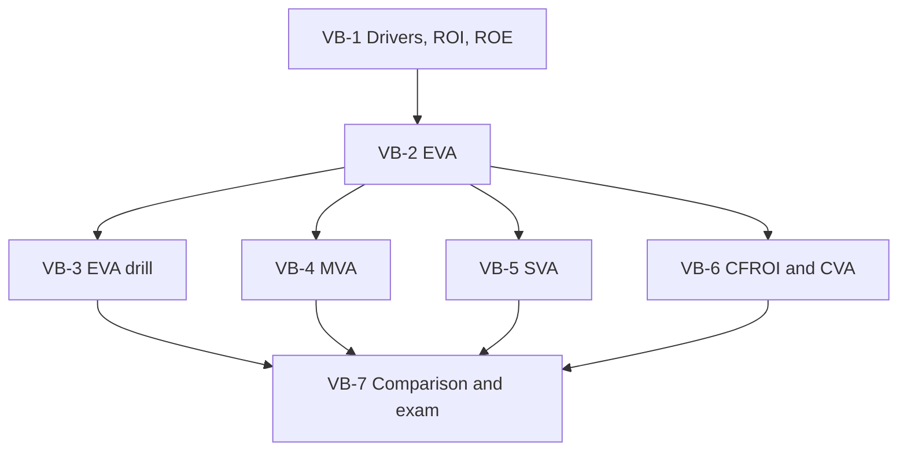

# SFM Unit 5: Value Based Management, node map

CIA3 scope for this unit is CO4: explore corporate value drivers and their impact on valuation. The faculty deck is the highest authority, then the class notes, then textbook background. The exam is mostly numerical: expect a case with two firms' financials. Study priority: EVA first, MVA second, SVA third, then CFROI and CVA and the comparison table.

## Nodes

| Node | Topic | Deps | Minutes | Exam focus |
|---|---|---|---|---|
| VB-1 | VBM Value Drivers and Links to SFM | none | 35 | no |
| VB-2 | Economic Value Added | VB-1 | 40 | yes |
| VB-3 | EVA Problem Drill | VB-2 | 40 | yes |
| VB-4 | Market Value Added | VB-2 | 30 | yes |
| VB-5 | Shareholder Value Added | VB-2 | 25 | no |
| VB-6 | CFROI and CVA | VB-2 | 40 | yes |
| VB-7 | VBM Comparison, Implementation and Exam Answers | VB-3, VB-4, VB-5, VB-6 | 40 | yes |

Total reading time: about 250 minutes.

## Dependency graph

## Headline numbers to know

- ROI 21.25%; ROE 23.33%.
- EVA: Melvin ₹3 million (four ways); Orion +1,00,000; Nova +90,000; spread example 3,00,000; income-statement 90.3 lakh; large-equity −441.99 crore.
- Studocu corrected EVAs: 1,40,000; 1,00,000; 20,000; 4,89,500; −95,000.
- MVA: ₹9 crore (EPS × P/E); EVA+MVA 8,65,000 and 60,00,000.
- SVA: Apex ₹70,000.
- CFROI: Vanguard 18.08%. CVA: XLR ₹197.25 lakh.
