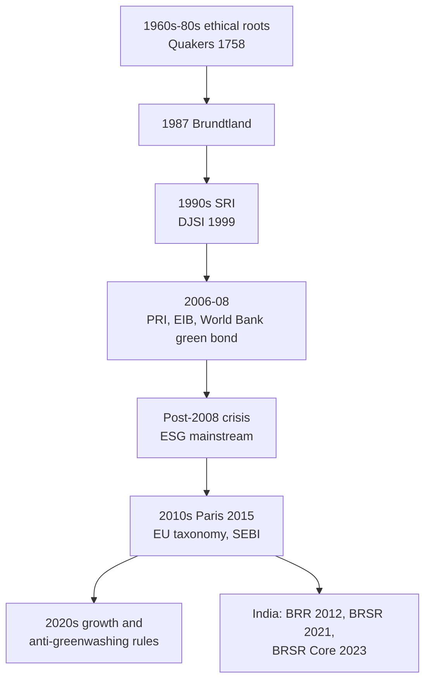

# FS-1 — History and Evolution of Sustainable Finance

Covers: the faculty timeline from ethical investing to rapid growth and regulation, the Brundtland turning point, the Indian (SEBI) journey, and corrections to your class note. **(class)**

## Where this fits in the ESE
Unit 1 is theory. "Trace the evolution of sustainable finance" is a standard 5-mark or 10-mark question. The slides give the idea in one line: it **grew gradually over decades, shaped by social movements, global policy milestones and financial innovation**. Learn the timeline as six eras with one anchor each.

## The faculty timeline (class)
| Era | What happened (slide wording) | Anchor |
|---|---|---|
| 1960s-1980s: ethical investing roots | Religious and ethical groups avoided alcohol, tobacco and weapons. CSR began influencing business practice and linked finance with social values. | Quakers, 1758: the Philadelphia Yearly Meeting barred members from the slave trade. This is the origin of socially responsible investing (SRI). |
| 1980s: ethical banking | Institutions avoided arms, tobacco and apartheid-linked businesses. | |
| 1987: Brundtland Report | Defined sustainable development; financial institutions began to weigh long-term environmental and social impact. | *Our Common Future* |
| 1990s: SRI | SRI funds and sustainability indices. Investors screened for environmental and social practice as well as financial performance. | Dow Jones Sustainability Index, 1999 |
| 2006-2008: green bonds and PRI | PRI gave a framework to integrate ESG into investment decisions. First sustainable-finance instruments. | UN PRI 2006; EIB "Climate Awareness Bond" 2007; World Bank first official green bond 2008 |
| Post-2008 crisis | Investors demanded accountability, transparency and resilience, which led to mainstream ESG integration. | |
| 2010s: mainstream ESG | Paris Agreement (2015) accelerated the push. ESG funds, impact investing, the EU taxonomy and SEBI's ESG guidelines gained traction. | Paris 2015 |
| 2020s to present: rapid growth and regulation | Assets projected at **USD 30-50 trillion by 2030**. Social bonds and green fintech emerged. Stricter ESG reporting standards introduced to combat **greenwashing**. | |
Size today, per the slide: sustainable finance represents **USD 35.3 trillion** in global assets, spanning green bonds, ESG equity funds and impact investing.

## Brundtland Report, 1987 (class)
Published by the World Commission on Environment and Development; official title *Our Common Future*.
- **Definition (write verbatim):** "development that meets the needs of the present without compromising the ability of future generations to meet their own needs."
- Slide table of contributions and impact:
| Key contribution | Impact |
|---|---|
| Definition of sustainable development | Became the global guiding principle |
| Poverty-environment link | Framed sustainability as social justice |
| Global cooperation | Paved the way for multilateral agreements; catalyst for the Earth Summit |
| Holistic policy approach | Led to Agenda 21 and UN frameworks; integrated environment, economy and society |
- It balanced **economic growth, social equity and environmental protection**, stressed intergenerational responsibility, and argued poverty drives unsustainable practices while environmental decline worsens poverty.

## SEBI's ESG journey, India (class)
| Year | Step |
|---|---|
| 2012 | Business Responsibility Report (BRR) |
| 2021 | BRSR introduced |
| 2023 | BRSR Core |
| Future | ESG assurance |
Other Indian points on the slides: India's **sovereign green bonds (2023)** raised funds for clean energy, sustainable water management and pollution control (FS-3). Slide 56 and 75 print "2026" for the same bonds; treat the issue year as 2023 and write 2023 in the exam. **[VERIFY]**

**(general) fill, verify against SEBI/MCA texts:** Companies Act 2013 section 135 made CSR (2% of average net profit for covered companies) a statutory duty; BRSR became mandatory for the top 1,000 listed companies by market capitalisation from FY 2022-23. **[VERIFY]**

## Your class note, corrected
- "160s - 1980s" should read **1960s to 1980s**.
- "Sustainable assets NPV 35.3 trillion": the slide says **global assets** (assets under management), not NPV. Your note correctly flags it for fact-checking: the figure is the slide's, so quote it as "USD 35.3 trillion (faculty slide)". **(general)** The GSIA review gives about USD 35.3 trillion for 2020 and about USD 30.3 trillion for 2022. **[VERIFY]** the latest edition.
- "Greenshing" is **greenwashing**: presenting a firm or product as more sustainable than it is.
- "Impact investing (milestone linked)": better stated as **outcome-linked**, where returns depend on measured social or environmental results.

## Worked example: classify the milestone
Task (exam style): "Place each event in an era and name the type of driver."
| Step | Event | Era | Driver |
|---|---|---|---|
| 1 | Quakers bar the slave trade, 1758 | Ethical investing roots | Religious values |
| 2 | Brundtland Report, 1987 | Turning point | Global policy; defined sustainable development |
| 3 | UN PRI, 2006 | Green bonds and PRI | Investor-led framework |
| 4 | World Bank green bond, 2008 | Green bonds and PRI | Market innovation |
| 5 | Paris Agreement, 2015 | Mainstream ESG | Intergovernmental policy |
| 6 | BRSR, 2021 | Growth and regulation | Regulator |
Decision line: the arrow runs from **values-driven exclusion** to **risk-and-return integration** to **rule-driven disclosure**. State that line in the conclusion; it is the interpretation mark.

## 5-mark skeleton: "Trace the evolution of sustainable finance"
1. 1960s-80s ethical roots, Quakers 1758 (1).
2. Brundtland 1987 and SRI/DJSI 1999 (1).
3. PRI 2006, EIB 2007, World Bank 2008 (1).
4. Post-2008 crisis, Paris 2015, EU taxonomy, SEBI guidelines (1).
5. 2020s growth, USD 30-50 trillion by 2030, stricter reporting against greenwashing (1).

## What to remember
- Ethical roots (1960s-80s, Quakers 1758) then Brundtland 1987, SRI and DJSI 1999, PRI 2006, EIB 2007, World Bank 2008, Paris 2015.
- Post-2008 crisis pushed accountability and transparency into mainstream ESG.
- Slide size figures: USD 35.3 trillion today, USD 30-50 trillion projected by 2030.
- SEBI's journey: BRR 2012, BRSR 2021, BRSR Core 2023, assurance next.
- Brundtland definition and its three balances: growth, equity, environment.

## Concept map

## Flashcards
Q: Where did socially responsible investing originate, with the dated example?
A: The Religious Society of Friends (Quakers). In 1758 the Philadelphia Yearly Meeting prohibited members from the slave trade.

Q: Which industries did early ethical investors avoid?
A: Alcohol, tobacco and weapons; in 1980s ethical banking also apartheid-linked businesses.

Q: State the Brundtland definition of sustainable development.
A: Development that meets the needs of the present without compromising the ability of future generations to meet their own needs.

Q: What happened in 1999 in SRI?
A: The Dow Jones Sustainability Index was launched; investors began screening on environmental and social practice.

Q: Give the 2006-2008 trio.
A: UN PRI 2006, EIB Climate Awareness Bond 2007, World Bank first official green bond 2008.

Q: What did the 2008 financial crisis change?
A: Investors demanded accountability, transparency and resilience, leading to mainstream ESG integration.

Q: What size figures do the slides give for sustainable finance?
A: USD 35.3 trillion in global assets today; projected USD 30-50 trillion by 2030.

Q: What is SEBI's ESG journey?
A: BRR 2012, BRSR 2021, BRSR Core 2023, ESG assurance in future.

Q: Correct your note: "sustainable assets NPV".
A: It is assets under management (global assets), not NPV.

Q: What do the stricter 2020s reporting standards target?
A: Greenwashing.

## Sources
- Faculty slides Unit 1, slides 9-19 and 79. Student notes: History of Sustainable; Sustainable Finance. GSIA reviews and SEBI/MCA texts for the **(general)** lines **[VERIFY]**.
- Next node: [[Sustainable Finance Unit 1 - FS-2 Definition Scope ESG and Triple Bottom Line]]
- [[Sustainable Finance Unit 1 - Foundations MOC (Node Map)]]
