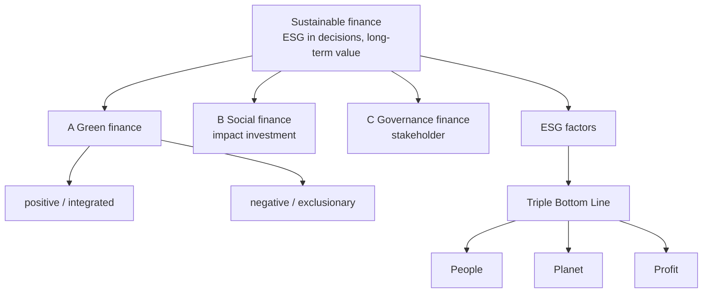

# FS-2 — Definition, Scope, ESG Factors, TBL and the 3Ps

Covers: the faculty definitions of sustainable finance, the concept of sustainability, ESG factors, finance categories A/B/C, the Triple Bottom Line and the People-Planet-Profit exercise. **(class)**

## Definitions of sustainable finance (class)
The slides give several definitions. In an exam, write **one** (conceptual or policy) and add a second line from another.
| Type | Definition (slide wording, shortened) |
|---|---|
| **Conceptual** | Integration of ESG considerations into financial decision-making to promote long-term economic growth, social well-being and environmental sustainability **while generating financial returns**. |
| **Academic** | A financial approach that directs capital toward investments, projects and business activities that contribute to sustainable development by **balancing economic performance with environmental protection, social inclusion and responsible governance**. |
| **Policy-oriented** | European Commission: "the process of taking due account of environmental, social and governance considerations in investment decisions, leading to increased investment in longer-term and sustainable activities." |
| **ESG-based** | Financial products, services and investment strategies that incorporate ESG factors into **risk assessment, capital allocation and performance evaluation** to create value for both investors and society. |
| **Sustainable development perspective** | Mobilisation and management of financial resources to support sustainable development objectives: climate action, resource efficiency, social equity, poverty reduction, inclusive growth. |
| **Comprehensive research definition** | "The strategic allocation of financial resources and investment capital toward environmentally responsible, socially inclusive, and well-governed economic activities that generate long-term financial value while contributing to sustainable development and societal well-being." |
| **Practice (one-liner)** | Directing investments and financial decisions toward activities that balance profitability with positive ESG outcomes. |
Also on the slides: sustainable finance is the **alignment of financial systems, investments and business decisions** with long-term environmental integrity, social responsibility and economic prosperity. The current international debate focuses on the environment, especially climate change.
Common thread to state: **ESG in the decision + long-term value + financial return and societal return together.**

## Concept of sustainability (class)
- From Latin *sustinere* (hold up, bear, endure): the ability to continue over a long period of time. In modern use, a state in which environment, economy and society continue to exist over a long period.
- Five core meanings: **long-term viability, resource efficiency, environmental balance, social responsibility, economic resilience.**

## ESG factors (class)
| Pillar | Slide examples (overview) | Slide examples (finance lens) |
|---|---|---|
| **Environmental** | Climate change mitigation, renewable energy adoption, biodiversity protection | Finance projects that reduce carbon emissions, protect biodiversity, promote renewables |
| **Social** | Employee welfare, diversity, community development, human rights | Support businesses that respect labour rights, promote equity, invest in communities |
| **Governance** | Corporate ethics, board independence, anti-corruption, executive pay transparency | Transparency, ethical management, accountability |
Slide tests: "Company installs rooftop solar" is **Environmental**; "CEO takes a pay cut during layoffs" is **Social/Governance**.
Link to finance **(general)**: ESG factors affect cash flows (fines, costs), the discount rate (risk) and access to capital.

## Sustainable finance categories A, B, C (class)
Each category has a **positive/integrated** form (fund the solution) and a **negative/exclusionary** form (divest from the problem).
| Category | Positive / integrated | Negative / exclusionary |
|---|---|---|
| **A. Environmental (green) finance** | Start-up or growth capital into innovative enterprises that address climate-related issues | Divest from companies that perpetuate the climate crisis |
| **B. Social (impact investment) finance** | Capital into enterprises that fix a social market failure in welfare: health, education, employment | Divest from companies that increase inequality or perpetuate welfare failures |
| **C. Governance (stakeholder) finance** | Invest in companies that follow international employee-welfare standards (such as ILO) or build purpose into governance, for example employee representation on the management board | Divest from those that do not |
- Finance deployed intentionally for social impact is *sui generis* positive social finance; over the past 20 years its new model is **impact investment**: investments made with the intention to generate positive, measurable social and environmental impact alongside a financial return (Global Impact Investing Network definition on the slide).
- Governance finance overlaps with green and social finance and links to the debate on corporate "purpose"; its distinctive feature is **organisational ownership and forms of legal incorporation**.

## Triple Bottom Line (class)
The TBL **expands the traditional financial bottom line by adding social and environmental outcomes alongside economic performance**. Coined by **John Elkington in the 1990s** so organisations measure their broader impact on society and the environment, not only financial returns. The pillars are the **3Ps**.
| P | Pillar | What it measures (slide) | Slide examples |
|---|---|---|---|
| **People** | Social sustainability | Impact on stakeholders: employees, customers, communities, society; fair labour, diversity, community engagement, human rights, well-being | Employees, farmers, communities |
| **Planet** | Environmental sustainability | Minimising environmental impact and conserving resources: responsible resource use, pollution reduction, waste management, carbon footprint, biodiversity | Emissions, waste, resource use |
| **Profit** | Economic sustainability | Financial viability and long-term economic value; responsible investment, ethical practice, contribution to community development | Financial sustainability |
**Benefits (slide):** long-term resilience and competitiveness in a socially conscious market; positive societal and environmental impact without sacrificing profitability; stakeholder trust and brand reputation.
**Key takeaway to quote:** true sustainability needs economic viability, social equity and environmental stewardship **simultaneously**.
**(general)** TBL is the firm's three-outcome reporting idea; ESG is the investor's scored factor lens. A common criticism is that the three pillars have no common unit, so they cannot be added up.

## Worked example 1: People-Planet-Profit classification (course-plan activity)
Task: classify each item by its **primary** pillar.
| # | Item | Pillar | Reason |
|---|---|---|---|
| 1 | Living wage to contract workers | People | Labour practice |
| 2 | Rooftop solar plant | Planet | Cuts emissions |
| 3 | Rise in return on equity | Profit | Economic performance |
| 4 | Employee safety training | People | Health and safety |
| 5 | Effluent treatment plant | Planet | Pollution control |
| 6 | Paying suppliers on time | Profit (and People) | Supplier incomes |
| 7 | Women on the board | People (Governance in ESG terms) | Diversity |
| 8 | Reducing packaging plastic | Planet | Waste |
| 9 | Dividend to shareholders | Profit | Economic return |
| 10 | CSR-funded community school | People | Education |
Decision line: many items touch two pillars. State the primary pillar, then note the overlap. That is the interpretation mark.

## Worked example 2: Amul cooperative, TBL (course-plan activity)
Facts are **(general), qualitative; verify any number before quoting. [VERIFY]** Amul is India's dairy cooperative brand on the Anand-pattern three tiers (village societies, district unions, state federation). The slides mention farmers as stakeholders under People.
| Step | Pillar | Evidence | Gap |
|---|---|---|---|
| 1 | People | Farmers own the cooperative; assured procurement; stable incomes for small households | Women's decision power varies |
| 2 | Planet | Some solar, biogas and packaging initiatives | Cattle methane, water and feed footprint |
| 3 | Profit | Scale, brand, professional management; large share of the consumer rupee returns to farmers | Price competition |
Decision line: strongest on **People and Profit**; Planet is the improvement area. The cooperative form builds the social outcome into ownership rather than adding it as CSR.

## Worked example 3: an ESG initiative, Kisankraft (your class note)
Your note: Kisankraft makes battery-powered farm machines (an inter-cultivator and a self-propelled reaper) and says they cut a farmer's energy cost by **more than 90%** versus petrol equipment.
- **E:** battery replaces petrol. **S:** lower running cost for small farmers.
- **SDG links (general):** 2, 7, 12, 13.
- Treat ">90%" as the company's claim needing verification. That is the greenwashing check.

## 5-mark skeleton: "Explain the Triple Bottom Line"
Definition: adds social and environmental outcomes to economic performance (1). Origin: Elkington, 1990s (1). Three Ps with one measure each (2). Benefit or takeaway (1).

## What to remember
- Faculty definitions: conceptual, academic, policy (European Commission), ESG-based, SD perspective, research. Quote one plus the EC line.
- Five core meanings of sustainable: long-term viability, resource efficiency, environmental balance, social responsibility, economic resilience.
- Categories: A green (environmental), B social (impact investment), C governance (stakeholder); each positive/integrated or negative/exclusionary.
- TBL = People, Planet, Profit; Elkington, 1990s; true sustainability needs all three at once.
- Classify by primary pillar and note overlaps.

## Concept map

## Flashcards
Q: Give the European Commission definition of sustainable finance.
A: The process of taking due account of environmental, social and governance considerations in investment decisions, leading to increased investment in longer-term and sustainable activities.

Q: Conceptual definition of sustainable finance in one line?
A: Integrating ESG considerations into financial decisions to promote long-term growth, social well-being and environmental sustainability while generating financial returns.

Q: Five core meanings of "sustainable" on the slides?
A: Long-term viability, resource efficiency, environmental balance, social responsibility, economic resilience.

Q: What does green finance do (positive and negative forms)?
A: Positive: capital into innovative enterprises addressing climate issues. Negative: divest from companies that perpetuate the climate crisis.

Q: What is social finance and what did it evolve into?
A: Capital for enterprises fixing social market failures in health, education and employment; it evolved into impact investment (positive, measurable impact alongside financial return).

Q: What does governance finance invest in, and what is its distinctive feature?
A: Companies following international employee-welfare standards (ILO) or building purpose into governance. Distinctive: organisational ownership and legal incorporation.

Q: Classify "CEO takes a pay cut during layoffs".
A: Social/Governance.

Q: Who coined the Triple Bottom Line and what does it add?
A: John Elkington, 1990s; social and environmental outcomes alongside economic performance.

Q: What are the 3Ps and what does each stand for?
A: People (social), Planet (environmental), Profit (economic).

Q: Which TBL benefits do the slides list?
A: Long-term resilience and competitiveness, positive impact without sacrificing profit, stakeholder trust and brand reputation.

## Sources
- Faculty slides Unit 1, slides 3-8, 13, 20-29. Student notes: Sustainable Finance; Tripe Bottom Line; Examples of ESG initiaves. Amul facts **[VERIFY]** with the latest annual report.
- Next node: [[Sustainable Finance Unit 1 - FS-3 SDGs Financing Gap and Seville Commitment]]
- [[Sustainable Finance Unit 1 - Foundations MOC (Node Map)]]
