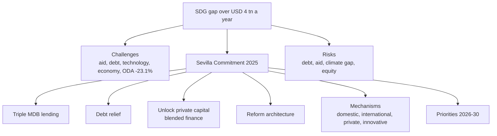

# FS-3 — UN SDGs, the Financing Gap and the Sevilla Commitment

Covers: the 17 SDGs, the poverty snapshot, the USD 4 trillion annual gap, the Sevilla Commitment (2025) with its challenges, mechanisms, risks and 2026-2030 priorities, and the slide examples of green bonds, blended finance and sustainability-linked loans. **(class)** The slides spell it "Sevilla"; the English spelling is Seville, and the file name keeps that spelling.

## The 17 SDGs (class)
The SDGs run **2015-2030**: **17 goals, 169 targets**, a universal development framework. Businesses align ESG strategies with them; investors use them for sustainable investment decisions.
| No. | Goal | Slide wording |
|---|---|---|
| 1 | No Poverty | End poverty in all its forms everywhere |
| 2 | Zero Hunger | Food security and improved nutrition for all |
| 3 | Good Health and Well-being | Healthy lives and well-being for everyone |
| 4 | Quality Education | Inclusive, equitable education for lifelong learning |
| 5 | Gender Equality | Empower women and ensure equality across genders |
| 6 | Clean Water and Sanitation | Safe water and sanitation for all |
| 7 | Affordable and Clean Energy | Sustainable energy that is affordable and reliable |
| 8 | Decent Work and Economic Growth | Inclusive growth and productive employment |
| 9 | Industry, Innovation and Infrastructure | Resilient infrastructure, foster innovation |
| 10 | Reduced Inequalities | Reduce inequality within and among countries |
| 11 | Sustainable Cities and Communities | Inclusive, safe, resilient, sustainable cities |
| 12 | Responsible Consumption and Production | Sustainable consumption and production patterns |
| 13 | Climate Action | Urgent action to combat climate change |
| 14 | Life Below Water | Conserve and sustainably use oceans and marine resources |
| 15 | Life on Land | Protect, restore, promote sustainable use of ecosystems |
| 16 | Peace, Justice and Strong Institutions | Peaceful societies and strong institutions |
| 17 | Partnerships for the Goals | Strengthen global partnerships |
**Climate-related SDGs (slide 58):** 7, 9, 11, 12, 13, 14, 15.
Memory hook **(general)**: 1-6 basic needs, 7-12 economy and infrastructure, 13-15 planet, 16-17 institutions and partnership. The course's own SDG is SDG 8 (class notes).

## Global poverty snapshot (class)
| Region | Extreme poverty rate | People | Key note |
|---|---|---|---|
| Sub-Saharan Africa | 27.7% | ~358 million | Largest share of global poor; stubbornly high |
| MENAAP | 14.4% | ~53 million | Upward revision after new Pakistan survey data |
| South Asia | <5% | ~12 million | Significant progress |
| East Asia and Pacific | <5% | ~17 million | Nearly eradicated in most countries |
| Latin America and Caribbean | ~6% | ~37 million | Moderate poverty persists |
| Europe and North America | <2% | Minimal | Largely eliminated |
The five regions with counts add to about 477 million people (358 + 53 + 12 + 17 + 37). Slide figures, not independently checked. **[VERIFY]** against the World Bank before quoting beyond Sub-Saharan Africa.

## The financing gap (class)
- SDGs face a financing gap of **over USD 4 trillion a year**, required to meet them by 2030.
- Developing countries struggle under **shrinking fiscal space, high borrowing costs and declining aid flows**.
- The UN Financing for Sustainable Development Report (2026, as cited on the slide) calls for **systemic reform, including tripling multilateral development bank (MDB) lending capacity and unlocking private capital at scale**. **[VERIFY]** the report wording.
- Scale **(general)**: USD 4 trillion a year over 2026-2030 is USD 20 trillion (4 × 5).

### Current context: challenges (class)
1. Declining aid flows and geopolitical divides.
2. Rising debt distress in developing countries.
3. Uneven access to technology and innovation.
4. Global economy: inflation, weak investment prospects and climate risks constrain financing.

## The Sevilla Commitment, 2025 (class)
- **What:** outcome document of the **Fourth International Conference on Financing for Development**, Sevilla, Spain, **30 June to 3 July 2025**. Renews the global financing framework for sustainable development; aims to close the USD 4 trillion annual gap through **systemic reforms, debt relief and mobilisation of public and private capital**. Adopted by UN Member States.
- **Calls for:**
  1. **Tripling the lending capacity** of multilateral development banks.
  2. **Scaling up debt relief** instruments to reduce vulnerabilities.
  3. **Unlocking private capital** through blended finance and risk-sharing mechanisms.
  4. **Reforming the international financial architecture** to reflect current realities.
- **Financing actions:** innovative financing (green bonds, blended finance, sustainability-linked loans); predictable and accessible funding, with concessional flows for least developed countries; private-sector engagement that recognises the comparative advantage of private finance in scaling investment.
- **Challenges highlighted:** the USD 4 trillion annual gap; **ODA decline: Official Development Assistance fell by 23.1% between 2024 and 2025**, worsening the gap; geopolitical risks (conflicts, trade measures, systemic shocks).

### Financing mechanisms (class)
| Mechanism | Slide wording |
|---|---|
| Domestic resource mobilisation | Strengthen tax systems; reduce illicit financial flows |
| International cooperation | Enhance tax transparency and global financial governance |
| Private sector engagement | Leverage ESG investments, impact bonds, blended finance |
| Innovative instruments | Green bonds, sustainability-linked loans, debt-for-climate swaps |

### Risks and trade-offs (class)
| Risk | Meaning |
|---|---|
| **Debt sustainability** | Many low-income countries risk default if financing is not concessional |
| **Aid decline** | Donor support is shrinking, so new partnerships are needed |
| **Climate finance gap** | Current flows are insufficient for adaptation and mitigation |
| **Equity concerns** | Structures often favour middle-income over least developed countries |

### Strategic priorities, 2026-2030 (class)
1. Reform global financial governance to give developing countries stronger representation.
2. Scale up concessional finance for vulnerable economies.
3. Integrate climate and SDG financing into national budgets.
4. Promote blended finance to crowd in private investment.
5. Enhance accountability through transparent reporting and monitoring.

## Slide examples of instruments (class)
| Instrument | Slide examples |
|---|---|
| **Green bonds** | World Bank green bonds (2008 to present): renewable energy, efficiency, climate resilience. India's sovereign green bonds (2023): clean energy, water management, pollution control. Apple green bonds (2016, 2019, 2022): renewable energy and low-carbon facilities. |
| **Blended finance** (mobilises private capital by combining concessional finance with commercial investment) | Sustainable Development Investment Partnership; Global Infrastructure Facility (donor and MDB funds de-risk private investment in sustainable infrastructure); agriculture finance blends (public guarantees plus private loans for smallholder farmers in Africa). |
| **Sustainability-linked loans (SLLs)** (loan terms tied to sustainability targets) | Enel (2019): terms tied to renewable energy targets. Suzano (2020): interest rate linked to cutting carbon emissions. Singapore Airlines (2021): fuel efficiency and carbon reduction targets. |
Use these as named examples in answers. No figures are attached to them in the slides, and none are added here.

## Worked example: why the gap persists and what closes it (exam layout)
| Step | Content |
|---|---|
| 1. State the gap | Over USD 4 trillion a year to 2030 |
| 2. Causes (slide) | Falling aid (ODA down 23.1%, 2024-25), debt distress, uneven technology, weak investment, climate risk, geopolitical shocks |
| 3. Match cause to lever | Aid decline: triple MDB lending, concessional flows. Debt distress: debt relief, debt-for-climate swaps. Weak private investment: blended finance and risk-sharing. System bias: reform the financial architecture |
| 4. Name the Sevilla calls | Triple MDB lending, scale debt relief, unlock private capital, reform architecture |
| 5. State risks | Debt sustainability, aid decline, climate finance gap, equity concerns |
Decision line: the gap is a **mismatch of risk, return and access**, not a global shortage of savings. Public and concessional money must de-risk private money, and it must reach the least developed countries, not only middle-income ones. That sentence earns the interpretation mark.

## 5-mark skeleton: "Explain the SDG financing gap and the Sevilla Commitment"
Gap figure (1); challenges (1); four Sevilla calls (2); one risk or priority (1).

## What to remember
- 17 SDGs, 169 targets, 2015-2030; climate-related SDGs are 7, 9, 11, 12, 13, 14, 15.
- Gap: over USD 4 trillion a year; ODA fell 23.1% between 2024 and 2025.
- Sevilla (FfD4, 30 June to 3 July 2025): triple MDB lending, scale debt relief, unlock private capital via blended finance, reform the architecture.
- Four mechanisms, four risks, five 2026-2030 priorities (see tables).
- Named examples: World Bank, India sovereign and Apple green bonds; GIF blended finance; Enel, Suzano, Singapore Airlines SLLs.

## Concept map

## Flashcards
Q: How big is the SDG financing gap?
A: Over USD 4 trillion a year, to meet the SDGs by 2030.

Q: How many SDGs and targets, and which period?
A: 17 goals, 169 targets, 2015-2030.

Q: Which SDGs are the climate-related ones on the slide?
A: 7, 9, 11, 12, 13, 14 and 15.

Q: What is the Sevilla Commitment?
A: Outcome of the Fourth International Conference on Financing for Development (Sevilla, 30 June to 3 July 2025), a renewed framework to close the gap through reform, debt relief and public plus private capital.

Q: What four things does Sevilla call for?
A: Tripling MDB lending capacity, scaling up debt relief, unlocking private capital through blended finance and risk-sharing, reforming the international financial architecture.

Q: By how much did ODA fall, and when?
A: 23.1% between 2024 and 2025.

Q: Name the four financing mechanisms.
A: Domestic resource mobilisation, international cooperation, private sector engagement, innovative instruments (green bonds, SLLs, debt-for-climate swaps).

Q: Name the four risks and trade-offs.
A: Debt sustainability, aid decline, climate finance gap, equity concerns.

Q: Give three of the five 2026-2030 priorities.
A: Reform financial governance for stronger developing-country voice; scale up concessional finance; integrate climate and SDG financing into budgets; blended finance to crowd in private money; transparent reporting and monitoring.

Q: Slide examples of sustainability-linked loans?
A: Enel (2019), Suzano (2020), Singapore Airlines (2021).

## Sources
- Faculty slides Unit 1, slides 30-43 and 58. UN FSDR (2026) and FfD4 outcome text **[VERIFY wording]**. Student notes: SDGs; Sevillia Commitment; risk and trade offs.
- Next node: [[Sustainable Finance Unit 1 - FS-4 International Agreements and the Financial System]]
- [[Sustainable Finance Unit 1 - Foundations MOC (Node Map)]]
