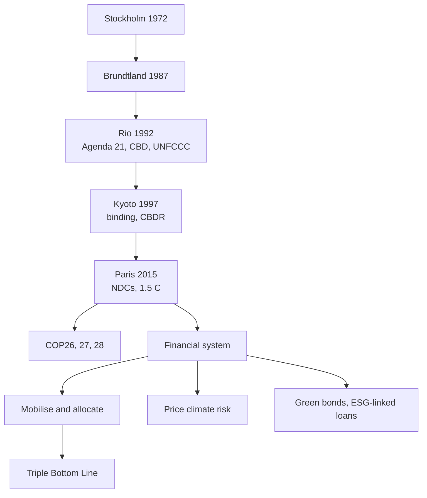

# FS-4 — International Agreements and the Role of the Financial System

Covers: why agreements matter, the 1972-2023 timeline, Stockholm, Brundtland, Rio, UNFCCC, Kyoto and CBDR, Paris, COP21/26/27/28, implementation challenges, and the role of the financial system. **(class)** Detail on Paris and the COPs returns in Unit 2.

## Why international agreements matter (class)
- Climate change is the greatest environmental and economic challenge of the 21st century. Rising temperatures, biodiversity loss, water scarcity, pollution and natural disasters threaten sustainable growth.
- No country can solve it alone because **greenhouse gases cross borders**. Agreements give governments, businesses, investors and citizens a common framework.
- Six reasons (slide): climate change affects every nation regardless of its contribution; promotes collective rather than individual responsibility; sets common environmental standards; encourages technology transfer and financial assistance; protects vulnerable countries; promotes sustainable development while protecting future generations.
- **Key message to quote:** "Climate change is a global problem requiring global solutions through international cooperation."

## Timeline of agreements (class)
| Year | Agreement | Significance (slide) |
|---|---|---|
| 1972 | Stockholm Conference | Beginning of global environmental governance |
| 1987 | Brundtland Report | Defined sustainable development |
| 1992 | Rio Earth Summit | Agenda 21, Rio Declaration, UNFCCC |
| 1997 | Kyoto Protocol | Legally binding emission reduction targets |
| 2000 | Millennium Development Goals | Global development agenda |
| 2015 | Paris Agreement | Limit global warming below 2 °C |
| 2015 | UN SDGs | 17 global goals for 2030 |
| 2021 | Glasgow Climate Pact (COP26) | Net-zero commitments |
| 2022 | Sharm El-Sheikh (COP27) | Loss and Damage Fund |
| 2023 | Dubai Consensus (COP28) | Transition away from fossil fuels |
Evolution chain on the slide: environmental protection, then climate change, then sustainable development, then ESG and sustainable finance, then a net-zero economy.
Net zero (slide): reduce emissions as close to zero as possible and offset the remainder to limit warming to 1.5 °C; formula **net zero = emissions produced − emissions removed = 0**.

## The major agreements (class)
| Agreement | Points to write |
|---|---|
| **Stockholm 1972** | Theme "Only One Earth". First global environmental conference; environmental protection as a global responsibility; led to **UNEP**; foundation of international environmental law. |
| **Brundtland 1987** | World Commission on Environment and Development. Definition of sustainable development (FS-1). Balances economic growth, social equity, environmental protection. |
| **Rio Earth Summit 1992** | Sustainability as a global development agenda. **Agenda 21** (action plan: environment, economy, social inclusion). **Rio Declaration** (27 principles). **Convention on Biological Diversity** (conserve biodiversity, sustainable use, fair benefit-sharing). **UNFCCC**. Principle: "Think Globally, Act Locally." |
| **UNFCCC 1992** | Objective: stabilise greenhouse gas concentrations. Annual COP meetings; foundation of global climate governance. |
| **Kyoto 1997** | First legally binding treaty under the UNFCCC; required **developed countries** to cut emissions through binding targets. Principle **CBDR**: all share responsibility, but developed countries bear more because of larger historical emissions and greater financial and technological capacity. |
| **Paris 2015** | See below. |

### Paris Agreement, 2015 (class)
- Goals: limit warming **well below 2 °C**; pursue efforts for **1.5 °C**; achieve **net zero around 2050**; climate finance support for developing countries.
- Significance: unlike Kyoto, **every country submits Nationally Determined Contributions (NDCs)**. Kyoto bound developed countries only; Paris asks all countries for pledges.
- Slide note: current pledges are insufficient to meet 1.5 °C.

### COPs (class)
COP is the annual meeting of parties under the UNFCCC.
| COP | Outcome (slide) |
|---|---|
| COP21 Paris | Paris Agreement adopted |
| COP26 Glasgow | Net-zero commitments; Methane Pledge; coal phase-down; private climate finance |
| COP27 Egypt | Loss and Damage Fund established; focus on adaptation |
| COP28 Dubai | Global Stocktake; agreement to "transition away from fossil fuels"; more emphasis on renewables and energy efficiency |

### Financing and implementation; key challenges (class)
- **Green Climate Fund:** supports developing countries in adaptation and mitigation. **Global Environment Facility:** grants for biodiversity, climate and pollution control. **Sevilla Commitment (2025):** triple MDB lending, scale debt relief, mobilise private capital (FS-3).
- Challenges: **equity** (developed vs developing responsibilities); **financing gap** (over USD 4 trillion a year for SDGs); **implementation** (turning commitments into national policy); **climate urgency** (pledges short of 1.5 °C).

### Climate basics from your class notes
- Climate change: long-term alteration of Earth's average weather caused by natural processes and human activity, especially GHG emissions. Natural drivers: volcanic eruptions, solar radiation, ocean circulation, natural variability.
- Your note says "Migration finance". Correct is **mitigation finance** (cuts emissions, for example solar farms). **Adaptation finance** helps vulnerable countries cope (flood defences, drought-resistant crops). **(general)** Adaptation earns little revenue, so it leans on grants and concessional money.

## Role of the financial system (class)
- The financial system **mobilises, allocates and manages** financial resources to support long-term growth, environmental protection and social well-being. It is a **bridge between investors, businesses, governments and society** to finance sustainable development.
- **Flow on the slide:** savings and investments, then financial institutions (banks, capital markets, insurance, asset managers, development banks), then mobilise and allocate capital, then green projects (renewable energy, sustainable agriculture, social infrastructure, ESG-focused businesses), then sustainable development, giving economic growth + environmental protection + social inclusion (the Triple Bottom Line).
- **Role bullets (slide):** mobilises capital for green projects; **prices climate risk into credit ratings**; innovates with green bonds and ESG-linked loans; example India's sovereign green bonds (slide prints 2026 here and 2023 elsewhere; use 2023, **[VERIFY]**).

### The eight "Key Roles" from your class notes (beyond the slides)
Mobilise capital; allocate resources efficiently; manage sustainability risks; enhance financial inclusion; improve transparency; encourage sustainable business practices; support climate and development policies; ensure long-term financial stability. Use them to extend a 10-mark answer; lead with the slide's three verbs and four bullets.

## Worked example: how the financial system funds a rooftop solar target (exam layout)
| Step | Slide element | Action |
|---|---|---|
| 1 | Savings and investments | Households and institutions place savings in banks, funds, insurers |
| 2 | Mobilise capital | Government sovereign green bonds; banks' green loans |
| 3 | Allocate | Funds go to renewable energy and green projects |
| 4 | Price risk | Lenders price climate and credit risk into ratings and loan terms |
| 5 | Innovate | Green bonds, ESG-linked loans |
| 6 | Outcome | Economic growth + environmental protection + social inclusion |
Decision line: finance turns an agreement goal (Paris, NDC) into funded projects. Agreements set the **goals**, the financial system supplies the **money and price signals**. State one agreement and one instrument in every paragraph.

## 10-mark skeleton: "Discuss the role of the financial system in sustainable development"
Intro: mobilise, allocate, manage; bridge between investors and society (2). Flow of savings to green projects (2). Role bullets with green bonds and ESG-linked loans (3). Link to agreements and TBL outcome (2). Challenge or closing view (1).

## What to remember
- Timeline: Stockholm 1972, Brundtland 1987, Rio 1992, Kyoto 1997, MDGs 2000, Paris and SDGs 2015, COP26 2021, COP27 2022, COP28 2023.
- Rio 1992 produced Agenda 21, the Rio Declaration (27 principles), the CBD and the UNFCCC.
- Kyoto: binding targets, developed countries only, CBDR. Paris: all countries submit NDCs; well below 2 °C, pursue 1.5 °C, net zero around 2050.
- COP27 Loss and Damage Fund; COP28 transition away from fossil fuels.
- Financial system: mobilises, allocates, manages; prices climate risk; green bonds and ESG-linked loans.
- Mitigation cuts emissions; adaptation helps the vulnerable.

## Concept map

## Flashcards
Q: Why can no country solve climate change alone?
A: Greenhouse gases cross national borders, so a common framework and collective action are needed.

Q: What did Stockholm 1972 achieve?
A: First global environmental conference; theme "Only One Earth"; led to UNEP; foundation of international environmental law.

Q: What came out of the Rio Earth Summit 1992?
A: Agenda 21, the Rio Declaration (27 principles), the Convention on Biological Diversity and the UNFCCC.

Q: What is CBDR?
A: Common but differentiated responsibilities: all countries share responsibility but developed countries bear more because of historical emissions and greater capacity.

Q: Kyoto vs Paris in one line?
A: Kyoto set legally binding targets for developed countries; Paris has every country submit NDCs.

Q: Paris Agreement goals?
A: Well below 2 °C, pursue 1.5 °C, net zero around 2050, climate finance for developing countries.

Q: Give the net zero formula.
A: Emissions produced minus emissions removed equals zero.

Q: Outcome of COP26, COP27, COP28?
A: COP26 net-zero commitments, Methane Pledge, coal phase-down; COP27 Loss and Damage Fund; COP28 Global Stocktake and transition away from fossil fuels.

Q: What do the Green Climate Fund and GEF do?
A: GCF supports developing-country adaptation and mitigation; GEF gives grants for biodiversity, climate and pollution control.

Q: What are the role bullets of the financial system on the slide?
A: Mobilises capital for green projects; prices climate risk into credit ratings; innovates with green bonds and ESG-linked loans.

Q: Correct your note: "Migration finance".
A: Mitigation finance, which cuts carbon emissions.

## Sources
- Faculty slides Unit 1, slides 44-60 and 73-75. Student notes: Sustainable Finance; Key Roles; Financial System. Sovereign green bond year **[VERIFY]**.
- Next node: [[Sustainable Finance Unit 1 - FS-5 ESG Risk Management and the Risk Matrix]]
- [[Sustainable Finance Unit 1 - Foundations MOC (Node Map)]]
