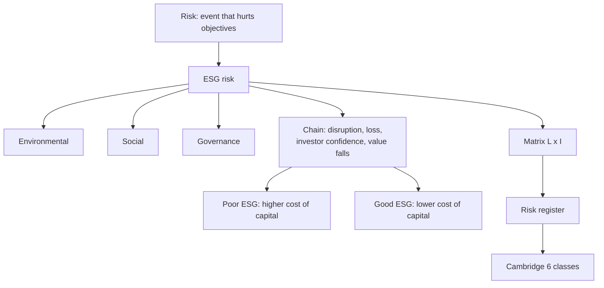

# FS-5 — ESG Risk Management Fundamentals and the Risk Matrix

Covers: what risk and ESG risk are, the E, S and G risk lists, why ESG risk matters financially, the good-ESG versus poor-ESG chain, a risk-matrix worked example, and a Cambridge lens (six risk classes and the risk register). **(class)** for slide content; the Cambridge section sits on top and never overrides the slides.

## Learning outcomes on the slides (class)
Explain ESG risk and its importance; classify E, S and G risks; analyse ESG risks faced by businesses; evaluate their impact on financial performance; suggest strategies to manage them.

## From risk to ESG risk (class)
- **Risk** = the possibility that an event negatively affects organisational objectives (uncertainty, loss, failure, threat).
- Businesses already face **financial, operational, market, political and legal** risks. Pollution, corruption and employee strikes do not fit those labels neatly, which introduces **ESG risks**.
- **ESG** = Environmental, Social, Governance. Opening question on the slide: "Which company would you invest in?" Company A has huge profits, pollutes rivers, faces child-labour allegations and pays its CEO 100 crore. Company B has lower profits, uses renewable energy, treats employees well and has transparent governance. The point: profit alone does not make a company sustainable.
- **Environmental risks become financial risks.** Slide example: severe flooding in Bengaluru means factories, supply chains and customers are hit, insurance costs rise and production stops.

## ESG risk lists (class)
| Pillar | Examples on the slide |
|---|---|
| **Environmental** | Climate change, floods, drought, water scarcity, air pollution, carbon emissions, waste management, biodiversity loss |
| **Social** | Strikes, low productivity, bad reputation, poor labour practices, child labour, human rights violations, gender discrimination, unsafe workplace, poor customer safety, data privacy, community protests. Example: a food company sells contaminated products and consumer trust disappears. |
| **Governance** | Fraud, corruption, poor leadership. Bribery, accounting fraud, board failure, conflict of interest, executive misconduct, weak internal controls, poor disclosures. |
ESG risk governance view (slide 76): E = carbon emissions, water, waste, biodiversity; S = labour, human rights, diversity, community; G = ethics, transparency, board independence, anti-corruption.
**Corporate failures used on the slides (qualitative, no figures):** Volkswagen Dieselgate, Satyam, Enron, BP oil spill, the Adani-Hindenburg ESG debate. Message: "financial risk today includes climate risk, social risk and governance risk", which is why governments created sustainable finance regulations (FS-6).

## Why ESG risk matters, and the link to finance (class)
Chain: **ESG risks, then business disruption, then financial loss, then investor confidence falls, then company value falls.**
| Poor ESG | Good ESG |
|---|---|
| High risk | Investor trust |
| Higher interest rates | Green finance |
| Lower share prices | Lower cost of capital |
| Less investment | Higher company value |
| Lower firm value | |
Interpretation line for the exam: poor ESG raises the **cost of capital and lowers value**; good ESG does the reverse.

## Managing ESG risk: a five-step routine (general)
The slides ask students to "suggest strategies" but list none. A standard routine: **identify** the ESG issues, **assess** materiality, **score** likelihood × impact, **respond** (avoid, reduce, transfer by insurance, or accept) with owners and targets, **monitor and report** (BRSR, ISSB; FS-6). Memory hook I-A-S-R-M.
**(general)** Outside-in risk (ESG factors hurt the firm) and inside-out risk (the firm harms society and the damage returns as fines or boycotts) together make up double materiality, an EU idea; how BRSR treats it is **[VERIFY]**.

## Worked example: mini ESG risk register and matrix (course-plan activity)
Illustrative firm (fictional): **Sahyadri Dyeing Mills Ltd**, a textile processor that discharges effluent, runs coal boilers and has a family-dominated board. Scale: likelihood (L) 1-5, impact (I) 1-5, score = L × I. Bands (our convention, state it in the exam): 1-5 low, 6-11 medium, 12-19 high, 20-25 critical.
| Step | Risk | Pillar | L | I | Score | Band | Response |
|---|---|---|---|---|---|---|---|
| 1 | Untreated effluent, river pollution | E | 4 | 5 | 20 | Critical | Effluent treatment plant; zero-liquid-discharge target |
| 2 | Coal-boiler emissions and carbon cost | E | 4 | 3 | 12 | High | Biomass or electric boilers; energy audit |
| 3 | Worker safety in chemical handling | S | 3 | 4 | 12 | High | Safety training, PPE, incident reporting |
| 4 | Weak board independence | G | 3 | 3 | 9 | Medium | Independent directors; board committees |
| 5 | Related-party dealings | G | 2 | 4 | 8 | Medium | Audit-committee approval; disclosure |
| 6 | Customer data privacy | S | 2 | 2 | 4 | Low | Basic controls; monitor |
Priority: effluent (20), then safety before boilers (tie at 12, safety first because it risks life), then governance, then privacy.
Decision line: **one critical and two high risks, two of the three in the E pillar.** Fund the effluent plant first; a lender would treat the firm as high ESG risk, with higher interest rates (slide chain), until it is fixed. Limit to state: scores are judgemental, so name the scale and the evidence.

| Likelihood \ Impact | 2 | 3 | 4 | 5 |
|---|---|---|---|---|
| 4 | | Boilers (12) | | Effluent (20) |
| 3 | | Board independence (9) | Worker safety (12) | |
| 2 | Privacy (4) | | Related party (8) | |

## Cambridge lens (layered on the slides)
Source: Cambridge Centre for Risk Studies (2019), *Cambridge Taxonomy of Business Risks*, v2.0. Use this as a second layer for the 15-mark case; the slide E/S/G lists remain the answer base.

**What it is.** A checklist of threats to a company's business plan, organised as **Class : Family : Type** by cause. **6 classes, 37 families, 175 risk types**; each type is placed once. It was built from companies' published risk registers, cases of corporate distress and a literature review.

| Cambridge class | Definition (shortened) | Link to the slides |
|---|---|---|
| **Financial** | Threats from the macroeconomy, financial markets, value chains, or industry/company events | Slide's "financial, market" risks, and the money effect of every ESG risk |
| **Geopolitical** | Political and criminal deterioration, regime or regulatory change, conflict between states | Slide's "political" risk |
| **Technology** | Cyber attacks, infrastructure collapse, industrial accidents, failure to keep up with technology | Data privacy, plant accidents |
| **Environmental** | Acute natural hazards, climate change, human exploitation of the environment | Slide's **E** list: floods, drought, waste, biodiversity |
| **Social** | Socioeconomic trends, preferences, norms, demographics, disease and public health | Part of slide's **S** list: reputation, community, consumer trust |
| **Governance** | Compliance with existing and emerging regulation, litigation, strategic and management decisions | Slide's **G** list: fraud, board failure, controls |
Overlaps to note: in Cambridge, **Climate Change is a family inside Environmental** with physical, liability and transition types (physical = flood, heat; transition = move to a lower-carbon economy). The slide's "unsafe workplace" sits under Cambridge **Governance** (family Non-Compliance, type Occupational Health and Safety), because the Cambridge classes are by cause. **[VERIFY]** the placement against the taxonomy chart (the chart text extracts unevenly).

**Risk register idea.** Companies keep a **risk register** of strategic threats, mainly for internal use, and publish a sanitised version for investors. Cambridge's warnings:
- Registers are **inconsistent**, even between firms in the same sector.
- Registers often mix **causes and effects**. "Reputational damage" is usually a consequence (a cyber data breach can cause it), not a root risk. Name the cause in the register.
- Definitions: **principal risk** threatens the business model, future performance, solvency, liquidity or reputation (UK FRC wording); **emerging risk** is a new, changing or novel combination of risks whose impacts, likelihoods and costs are not yet well understood; **strategic risk** can significantly alter long-term valuation or viability.
- **Finding:** Governance risk is the most under-recognised class: it causes far more corporate distress than companies report. Technology risk is also under-reported. Environmental risk is reported more often than it causes distress. Financial and Geopolitical risk are likely over-represented (Cambridge summary).

**How to use it in the Sahyadri register:** add a column for Cambridge class and family.
| Risk | Slide pillar | Cambridge class : family |
|---|---|---|
| Effluent pollution | E | Environmental : Environmental Degradation (waste and pollution) |
| Coal boilers and carbon cost | E | Environmental : Climate Change (transition) |
| Worker safety | S | Governance : Non-Compliance (occupational health and safety) |
| Weak board independence | G | Governance : Management Performance (ineffective board) |
| Related-party dealings | G | Governance : Non-Compliance (closest fit; internal corruption and fraud if abused) |
| Customer data privacy | S | Technology : Cyber (data exfiltration) |
Reading: in Cambridge terms the six risks split 3 Governance, 2 Environmental, 1 Technology, and none Social. Half the register is governance, which fits Cambridge's finding that governance risk is under-recognised. It justifies giving the board and controls real weight even though the effluent plant scores highest.
Add one line to a case answer: "ESG is a subset of the wider business-risk picture: financial, geopolitical and technology risks also hit the firm, so the register should cover all six classes."

## 5-mark skeleton: "Explain ESG risk management"
Define risk and ESG risk (1); E, S and G examples (1.5); chain from ESG risk to lower company value (1); matrix scoring and response, or the Cambridge register point (1.5).

## What to remember
- Risk = possibility that an event negatively affects objectives; ESG risks are the E, S and G ones that old risk labels missed.
- Environmental risks become financial risks (Bengaluru flood example).
- Chain: ESG risk, disruption, loss, investor confidence down, value down. Poor ESG means higher interest and lower value; good ESG means trust and lower cost of capital.
- Matrix score = L × I; effluent example 4 × 5 = 20, critical.
- Cambridge (2019): 6 classes, 37 families, 175 types; governance risk is the most under-recognised; registers mix causes and effects.

## Concept map

## Flashcards
Q: Define risk as on the slide.
A: The possibility that an event negatively affects organisational objectives.

Q: Why do environmental risks become financial risks?
A: Floods, for example, stop production, hit supply chains and customers and raise insurance costs, so the loss shows up in the accounts.

Q: Name four environmental, four social and four governance risks from the slides.
A: E: floods, water scarcity, carbon emissions, biodiversity loss. S: child labour, unsafe workplace, data privacy, community protests. G: bribery, accounting fraud, board failure, weak internal controls.

Q: Give the ESG risk chain from the slide.
A: ESG risks, business disruption, financial loss, investor confidence falls, company value falls.

Q: Poor ESG vs good ESG outcomes?
A: Poor: high risk, higher interest rates, lower share prices, less investment, lower firm value. Good: investor trust, green finance, lower cost of capital, higher company value.

Q: Name the corporate failures on the slide.
A: Volkswagen Dieselgate, Satyam, Enron, BP oil spill, Adani-Hindenburg ESG debate.

Q: How is a risk matrix score computed?
A: Likelihood × impact, each 1-5, then banded; likelihood 4 and impact 5 gives 20, critical.

Q: Four responses to a risk?
A: Avoid, reduce, transfer (insurance) or accept.

Q: What are Cambridge's six risk classes?
A: Financial, Geopolitical, Technology, Environmental, Social, Governance (Cambridge Centre for Risk Studies, 2019).

Q: Which risk class does Cambridge say is most under-recognised in company risk registers?
A: Governance.

Q: What mistake does Cambridge warn about in risk registers?
A: Mixing causes and effects, such as listing reputational damage instead of the cyber breach that causes it.

## Sources
- Faculty slides Unit 1, slides 61-71 and 76. Cambridge Centre for Risk Studies (2019), Cambridge Taxonomy of Business Risks v2.0, sections 1.2, 3.5, 4 and Appendix A. Sahyadri Dyeing Mills is a fictional, illustrative firm; all matrix scores are illustrative.
- Next node: [[Sustainable Finance Unit 1 - FS-6 Reporting Regulation and Responsible Investment]]
- [[Sustainable Finance Unit 1 - Foundations MOC (Node Map)]]
