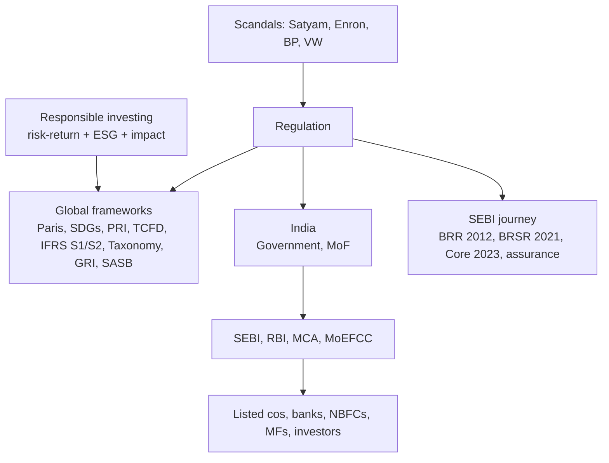

# FS-6 — Reporting, Regulatory Frameworks, Governing Bodies and Responsible Investment

Covers: why regulation arose, the eight global frameworks, India's regulatory chain and governing bodies, SEBI's ESG journey (BRSR), and responsible investing. **(class)** Detail marked **(general)** fills gaps the slides leave.

## Why regulation (class)
Question on the slide: "Can a company make huge profits and still destroy society?" Examples: Volkswagen Dieselgate, Satyam, Enron, BP oil spill, the Adani-Hindenburg ESG debate. Financial risk today includes climate, social and governance risk, so **governments created sustainable finance regulations**.

## Major global frameworks (class)
| Framework | Purpose (slide) |
|---|---|
| Paris Agreement | Climate action |
| UN SDGs | Sustainable development |
| PRI | Responsible investment |
| TCFD | Climate risk disclosure |
| IFRS S1 and S2 | Sustainability reporting |
| EU Taxonomy | Green investment classification |
| GRI Standards | ESG reporting |
| SASB | Industry-specific ESG reporting |
Discussion question on the slide: "Which one is mandatory?" Answer: **it depends on the country**. Voluntary frameworks become mandatory when a regulator adopts them (for example SEBI adopting BRSR).
**(general) one-line detail, verify before quoting dates:**
- **TCFD:** four pillars, **governance, strategy, risk management, metrics and targets**.
- **IFRS S1 / S2 (ISSB):** S1 general sustainability-related financial disclosures; S2 climate-related disclosures, built on TCFD. ISSB aims at a **global baseline** because there are too many standards. **[VERIFY]** issue and effective dates.
- **GRI** looks at the firm's impact on all stakeholders; **SASB** gives industry-specific metrics that matter to investors.

## India's regulatory framework (class)
Chain on the slide: **Government, then Ministry of Finance, then SEBI, RBI, MCA and MoEFCC, then the regulated entities: listed companies, banks, NBFCs, mutual funds and investors.**
| Institution | Role (slide) |
|---|---|
| **SEBI** | ESG disclosure (BRSR) |
| **RBI** | Climate risk in banking |
| **MCA** | Corporate governance |
| **MoEFCC** | Environmental policies |
| **NITI Aayog** | SDG implementation |
| **IFSCA** | Sustainable finance hub |
| **NABARD** | Green rural finance |
| **SIDBI** | MSME sustainability |
Spelling corrections to your note: "SEBO" is SEBI; "MICA" is MCA (Ministry of Corporate Affairs). Your note left SIDBI blank; the slide gives **MSME sustainability**. "SEBI history" was empty in your note; it is the journey below.
**(general)** Global bodies behind the standards: ISSB (IFRS Foundation), FSB, UNEP FI, GRI, ICMA. **[VERIFY]** before listing them as faculty content.

## SEBI's ESG journey (class)
**2012** Business Responsibility Report (BRR), **2021** BRSR introduced, **2023** BRSR Core, **future** ESG assurance. Slide 18 adds that SEBI's ESG guidelines gained traction in the 2010s-2020s.
**(general), verify against SEBI circulars:** BRSR means Business Responsibility and Sustainability Report; mandatory for the top 1,000 listed companies by market capitalisation from FY 2022-23; three sections (A general disclosures, B management and process, C principle-wise performance); BRSR Core is a short set of key metrics with assurance, phased in for the largest companies. **[VERIFY]**

## Responsible investing (class)
- **Definition (slide):** investing while considering **financial returns + ESG impact**.
- Traditional investing = **risk-return**. Responsible investing = **risk-return + ESG + impact**.
**(general)** The PRI (2006) are six voluntary principles for investors: incorporate ESG into analysis and decisions; be active owners; seek ESG disclosure from investees; promote the principles in the industry; work together; report on progress. Common strategies: negative screening, positive (best-in-class) screening, norms-based screening, ESG integration, themed investing, impact investing, engagement and voting.

## Worked example: which framework for which user (exam layout)
Task: "A listed Indian steel company wants to report to its regulator, its global investors, its lender and the public. Recommend the frameworks."
| Step | User | Need | Framework (slide purpose) |
|---|---|---|---|
| 1 | Indian regulator (SEBI) | Statutory ESG disclosure | BRSR (mandatory where SEBI requires) |
| 2 | Global investors | Sustainability reporting | IFRS S1 and S2, with SASB industry metrics |
| 3 | Lender | Climate risk disclosure | TCFD (pillars sit inside S2) |
| 4 | Public and NGOs | ESG impact reporting | GRI Standards |
| 5 | EU customers or lenders | Green classification | EU Taxonomy |
| 6 | Asset-manager shareholders | Responsible investment | PRI signatories read the same data |
Decision line: **BRSR is the compliance base; ISSB is the investor layer; GRI is the stakeholder layer.** Report once and present several views, and add assurance (the "future" step on SEBI's journey), because unassured claims invite greenwashing questions.

## 10-mark skeleton: "Explain regulatory frameworks and governing bodies for sustainable finance"
Why regulation: scandals and ESG risk (2). Global frameworks table (3). India chain and governing bodies (3). SEBI journey to BRSR (1). Responsible investing and closing view (1).

## What to remember
- Scandals (Dieselgate, Satyam, Enron, BP, Adani-Hindenburg debate) led to regulation.
- Eight frameworks: Paris, SDGs, PRI, TCFD, IFRS S1/S2, EU Taxonomy, GRI, SASB; mandatory or not depends on the country.
- India: Government, MoF, then SEBI, RBI, MCA, MoEFCC; plus NITI Aayog, IFSCA, NABARD, SIDBI.
- SEBI: BRR 2012, BRSR 2021, BRSR Core 2023, assurance next.
- Responsible investing = risk-return + ESG + impact.

## Concept map

## Flashcards
Q: Which corporate failures does the slide use to motivate regulation?
A: Volkswagen Dieselgate, Satyam, Enron, the BP oil spill and the Adani-Hindenburg ESG debate.

Q: Name the eight global frameworks on the slide.
A: Paris Agreement, UN SDGs, PRI, TCFD, IFRS S1 and S2, EU Taxonomy, GRI Standards, SASB.

Q: Which framework is mandatory?
A: It depends on the country; a framework becomes mandatory when a regulator adopts it.

Q: Purpose of TCFD, EU Taxonomy, SASB?
A: TCFD: climate risk disclosure. EU Taxonomy: green investment classification. SASB: industry-specific ESG reporting.

Q: Give the India regulatory chain.
A: Government, Ministry of Finance, then SEBI, RBI, MCA and MoEFCC, then listed companies, banks, NBFCs, mutual funds and investors.

Q: Role of SEBI, RBI, MCA, MoEFCC?
A: SEBI: ESG disclosure (BRSR). RBI: climate risk in banking. MCA: corporate governance. MoEFCC: environmental policies.

Q: Role of NITI Aayog, IFSCA, NABARD, SIDBI?
A: SDG implementation; sustainable finance hub; green rural finance; MSME sustainability.

Q: SEBI's ESG journey in order?
A: BRR 2012, BRSR 2021, BRSR Core 2023, future ESG assurance.

Q: Define responsible investing.
A: Investing while considering financial returns plus ESG impact.

Q: Traditional vs responsible investing?
A: Traditional: risk-return. Responsible: risk-return plus ESG plus impact.

## Sources
- Faculty slides Unit 1, slides 71-72 and 76-80. Student notes: Financial System frameworks and institutions. **(general)** lines: TCFD, ISSB, BRSR detail, PRI **[VERIFY]**.
- Next node: [[Sustainable Finance Unit 1 - FS-7 Unit 1 Exam Answers]]
- [[Sustainable Finance Unit 1 - Foundations MOC (Node Map)]]
