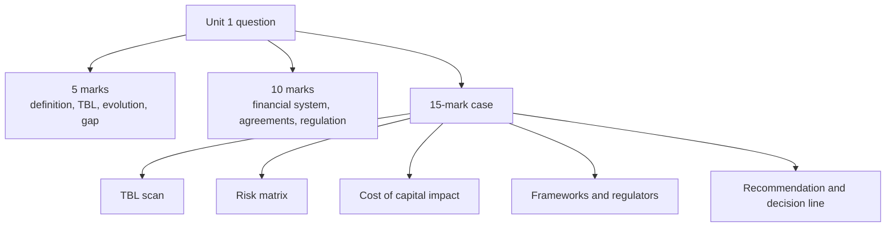

# FS-7 — Unit 1 Exam Answers

Covers: likely 5-mark and 10-mark questions with answer skeletons, and the 15-mark case layout with a worked case. **(class)** content, from the faculty slides.

## The paper (from the plan)
ESE: 50 marks, 2 hours. **Section A:** 3 of 5 × 5. **Section B:** 2 of 3 × 10. **Section C:** one compulsory 15-mark case. Budget about 7 minutes per 5-mark answer, 15 per 10-mark, 30 for the case. Unit 1 is theory, so it feeds mostly Sections A and B and the opening paragraph of the case.

## 5-mark answers (about 120-150 words, one table or list)
| Likely question | Skeleton (marks) |
|---|---|
| Define sustainable finance and explain its scope | Conceptual definition (1); European Commission quote (1); ESG in risk assessment, allocation, evaluation (1); categories A green, B social, C governance (2) |
| Explain the Triple Bottom Line | Adds social and environmental outcomes to profit; Elkington, 1990s (1); People, Planet, Profit with one measure each (2); benefits (1); takeaway: all three simultaneously (1) |
| Trace the evolution of sustainable finance | Ethical roots and Quakers 1758 (1); Brundtland 1987 and DJSI 1999 (1); PRI 2006, EIB 2007, World Bank 2008 (1); Paris 2015, EU taxonomy, SEBI (1); 2020s growth and greenwashing rules (1) |
| Explain the SDG financing gap | Over USD 4 trillion a year (1); challenges (1); Sevilla's four calls (2); one risk (1) |
| Kyoto vs Paris | Kyoto: binding, developed countries, CBDR (2); Paris: all countries, NDCs, well below 2 °C, pursue 1.5 °C, net zero around 2050 (2); one-line conclusion (1) |
| Explain ESG risk with examples | Define risk and ESG risk (1); E, S, G examples (2); chain to lower company value (1); one slide example such as Bengaluru floods (1) |
| Role of SEBI and other Indian bodies | Chain Government to MoF to SEBI, RBI, MCA, MoEFCC (1); one role each for eight bodies (3); BRSR journey (1) |
| Responsible investing | Definition: returns plus ESG impact (1); traditional vs responsible diagram (2); PRI or screening **(general)** (1); example (1) |
| Blended finance and SLLs | Define each (2); slide examples: GIF, agriculture blends; Enel, Suzano, Singapore Airlines (2); role in Sevilla (1) |
| Short notes: Brundtland, Rio, COPs | Date, body, definition or outcomes, significance |

## 10-mark answers (about 300-350 words)
**Layout:** introduction (1-2), body in headed points or a table (6), interpretation or conclusion (1-2).
| Likely question | Skeleton |
|---|---|
| Discuss the evolution and importance of sustainable finance, global and Indian | Eras table (4), Brundtland definition (1), SEBI journey and sovereign green bonds 2023 (2), importance via ESG risk and cost of capital (2), conclusion: exclusion to integration to disclosure (1) |
| Explain the role of the financial system in sustainable development | Bridge and mobilise-allocate-manage (2); flow from savings to green projects to TBL (2); role bullets: prices climate risk, green bonds, ESG-linked loans (3); link to agreements (2); challenge (1) |
| Discuss international agreements on climate and sustainable development | Why needed (2); timeline 1972-2023 (3); Rio, Kyoto and CBDR, Paris (3); COP outcomes and challenges (2) |
| Explain the UN SDGs financing gap and the Sevilla Commitment | 17 SDGs overview, 169 targets (1); gap and challenges (2); Sevilla calls and actions (3); mechanisms or risks (2); 2026-2030 priorities (2) |
| Explain ESG risk management and how poor ESG changes the cost of capital | Risk and ESG risk (1); E, S, G lists (3); chain and Poor vs Good ESG table (3); matrix or Cambridge register point (2); conclusion (1) |
| Explain the regulatory frameworks, governing bodies and responsible investing | Why regulation (1); eight frameworks (3); India chain and bodies (3); SEBI journey (1); responsible investing (2) |

## 15-mark case layout (Section C)
The case will describe a firm or a country and ask for an assessment plus recommendations, probably across Units 1-5. Unit 1 supplies the **frame**. Use this layout and spend about 30 minutes.
| Block | Marks | What to write |
|---|---|---|
| 1. Context and definition | 2 | Two lines on the firm; sustainable finance definition (ESG in decisions, long-term value and return) |
| 2. TBL and ESG scan | 3 | Table: People, Planet, Profit with evidence from the case; E, S, G risks found |
| 3. Risk matrix | 3 | Likelihood × impact for 4-6 risks, band, rank; say the scale is judgemental |
| 4. Financial impact | 2 | Chain: ESG risk, disruption, loss, investor confidence, value; poor ESG raises cost of capital |
| 5. Frameworks and regulators | 2 | BRSR for compliance (SEBI), ISSB/GRI for investors and stakeholders; RBI or MCA if a bank or governance issue |
| 6. Financing and recommendations | 2 | Name the instrument (green bond, SLL, blended finance) and 2-3 actions with owners |
| 7. Decision line and interpretation | 1 | One sentence that ranks the actions and says what changes in value or cost of capital |
Optional Cambridge layer (one line, not a block): "Cambridge Centre for Risk Studies (2019) classes the risks as Environmental, Governance and Technology, and flags governance as the class firms most under-record." Use it only if time remains.

### Worked case (illustrative, fictional firm)
**Question.** Nilgiri Agro Foods Ltd, a listed packaged-food company (fictional), faces a river-pollution notice at its main plant, a report of unsafe working conditions at a contractor unit, and a related-party loan not disclosed to the board. It has applied for a ₹200 crore term loan at 10% and has been offered a sustainability-linked loan at 9.25% if it hits emission and safety targets. Assess the ESG position and advise. (All figures are illustrative.)

**Answer layout.**
1. **Context.** Sustainable finance integrates ESG into financial decisions for long-term value and return. Nilgiri's loan decision is one such decision.
2. **TBL scan.**
| Pillar | Evidence | Verdict |
|---|---|---|
| People | Unsafe contractor unit | Weak |
| Planet | River-pollution notice | Weak |
| Profit | Listed, profitable, but exposed to fines and loss of investor trust | At risk |
3. **Risk matrix** (illustrative scale 1-5; bands as in FS-5).
| Risk | Pillar | L | I | Score | Band |
|---|---|---|---|---|---|
| River pollution notice | E | 4 | 5 | 20 | Critical |
| Unsafe contractor unit | S | 3 | 4 | 12 | High |
| Undisclosed related-party loan | G | 3 | 4 | 12 | High |
Rank: pollution first (20), then safety and the loan (12 each; the loan is a governance control failure that can become a Satyam-type problem, the safety issue risks life, so safety first).
4. **Financial impact.** Poor ESG means higher risk, higher interest and lower value. The loan offer shows it in rupees: a 0.75 percentage point cut on ₹200 crore saves 200 × 0.0075 = **₹1.5 crore a year** in interest (₹20 crore at 10%, ₹18.5 crore at 9.25%). That is the price the market puts on credible ESG improvement.
5. **Frameworks and regulators.** Report through BRSR (SEBI) if in scope; MoEFCC and the pollution authority enforce the notice; MCA rules cover the related-party disclosure; lender may require ISSB or GRI-style data.
6. **Recommendations.** (a) Fund an effluent treatment plant and report the milestone; (b) bring the contractor unit under the safety policy with audits; (c) disclose and ratify the related-party loan through the audit committee; (d) accept the sustainability-linked loan with targets Nilgiri can verify, and avoid greenwashing by getting the data assured.
7. **Decision line.** Fix pollution first, then governance and safety; take the 9.25% sustainability-linked loan only if the targets are realistic, because a missed target would erase the ₹1.5 crore saving and damage credibility. Interpretation: ESG performance here changes the **cost of capital**, not just reputation.

## Interpretation phrases that earn marks
- "This shows ESG risk is a financial risk, because it moves cash flows and the cost of capital."
- "The slide chain runs from disruption to loss to lower investor confidence to lower company value."
- "Agreements set the goals; the financial system supplies the money and the price signals."
- "Governance risk is the most under-recognised class (Cambridge Centre for Risk Studies, 2019), so I would give the board and controls priority alongside the highest-scoring environmental risk."

## Common slips to avoid
- Writing "NPV" for sustainable assets; it is assets under management.
- "Migration finance" for mitigation finance; "SEBO" and "MICA" for SEBI and MCA.
- Naming the Brundtland or Sevilla dates wrongly: Brundtland 1987; Sevilla 30 June to 3 July 2025.
- Stating Paris as "below 2 °C" only; write well below 2 °C and pursue 1.5 °C.
- Quoting the Indian sovereign green bond year as 2026; the slides mostly say 2023 **[VERIFY]**.

## What to remember
- Section C is 15 marks: use the seven blocks and always end with a decision line.
- Cite the slide wording for definitions; add (general) detail only to extend.
- Tables score: TBL scan, risk matrix, framework table.
- Always connect ESG risk to cost of capital or company value.
- Name one agreement, one instrument and one Indian body in long answers.

## Concept map

## Flashcards
Q: What is the ESE pattern?
A: 50 marks, 2 hours: 3 of 5 × 5, 2 of 3 × 10, one compulsory 15-mark case.

Q: What are the seven blocks of the 15-mark case layout?
A: Context and definition; TBL and ESG scan; risk matrix; financial impact; frameworks and regulators; financing and recommendations; decision line.

Q: What earns the interpretation mark in the case?
A: A sentence that ranks the actions and links ESG performance to cost of capital or company value.

Q: What 5-mark skeleton fits "Explain the Triple Bottom Line"?
A: Definition, Elkington 1990s, People-Planet-Profit with measures, benefits, takeaway.

Q: How would you structure a 10-mark answer?
A: Introduction, body in headed points or a table, interpretation or conclusion.

Q: Illustrative sum: 0.75 percentage points off a ₹200 crore loan saves how much a year?
A: 200 × 0.0075 = ₹1.5 crore (₹20 crore at 10% versus ₹18.5 crore at 9.25%).

Q: Which spelling slips from class notes should you correct?
A: NPV to assets under management, migration to mitigation finance, SEBO to SEBI, MICA to MCA.

Q: What Cambridge point can sit on top of a risk-matrix answer?
A: Six classes (Financial, Geopolitical, Technology, Environmental, Social, Governance) and governance risk being the most under-recognised (Cambridge Centre for Risk Studies, 2019).

## Sources
- Faculty slides Unit 1; plan assessment pattern; Cambridge Centre for Risk Studies (2019). Nilgiri Agro Foods Ltd and all its numbers are fictional and illustrative.
- Back to: [[Sustainable Finance Unit 1 - FS-6 Reporting Regulation and Responsible Investment]]
- [[Sustainable Finance Unit 1 - Foundations MOC (Node Map)]]
