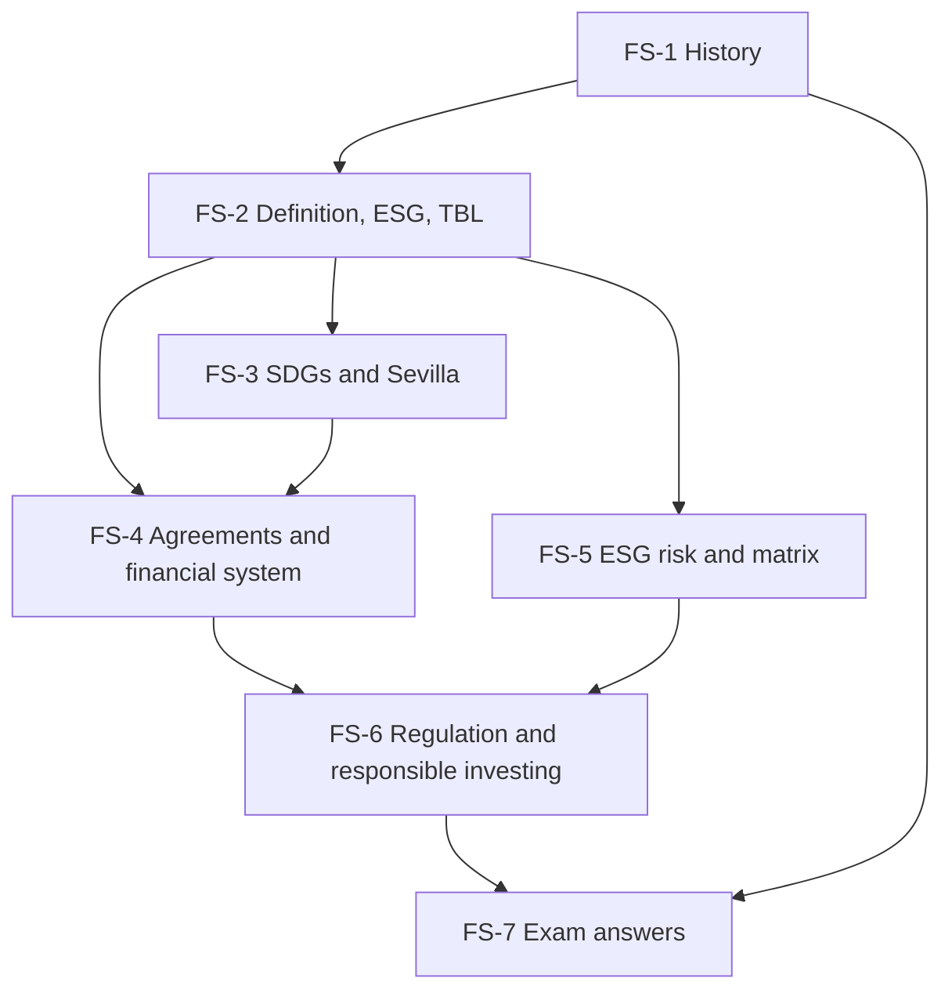

# Sustainable Finance Unit 1: Foundations of Sustainable Finance, node map

ESE: 50 marks, 2 hours. Section A 3 of 5 × 5, Section B 2 of 3 × 10, Section C one compulsory 15-mark case. Unit 1 is mostly theory (CO1). The **faculty slides are the single source**; class notes and general knowledge only fill gaps and are tagged. FS-5 adds a labelled Cambridge lens (Cambridge Centre for Risk Studies, 2019). Company and matrix examples are **illustrative**.

## Nodes

| Node | Topic | Deps | Minutes | Exam focus |
|---|---|---|---|---|
| FS-1 | History and Evolution | none | 30 | yes |
| FS-2 | Definition, Scope, ESG and Triple Bottom Line | FS-1 | 40 | yes |
| FS-3 | SDGs, Financing Gap and Sevilla Commitment | FS-2 | 40 | yes |
| FS-4 | International Agreements and the Financial System | FS-2, FS-3 | 40 | yes |
| FS-5 | ESG Risk Management and the Risk Matrix (with Cambridge lens) | FS-2 | 40 | yes |
| FS-6 | Reporting, Regulation, Governing Bodies and Responsible Investment | FS-4, FS-5 | 40 | yes |
| FS-7 | Unit 1 Exam Answers (5, 10 and 15-mark case layouts) | FS-1 to FS-6 | 30 | yes |

Total reading time: about 260 minutes.

## Dependency graph

## Headline facts to know

- Quakers 1758; Brundtland 1987; PRI 2006; EIB 2007; World Bank green bond 2008; Paris 2015.
- Sustainable finance assets USD 35.3 trillion (slide); USD 30-50 trillion projected by 2030.
- SDGs: 17 goals, 169 targets, 2015-2030; gap over USD 4 trillion a year; ODA down 23.1% (2024-25).
- Sevilla Commitment: 30 June to 3 July 2025; triple MDB lending, debt relief, private capital, reform architecture.
- SEBI journey: BRR 2012, BRSR 2021, BRSR Core 2023, assurance next.
- Cambridge (2019): 6 risk classes, 37 families, 175 types.

## Links
- [[Sustainable Finance MOC]]
