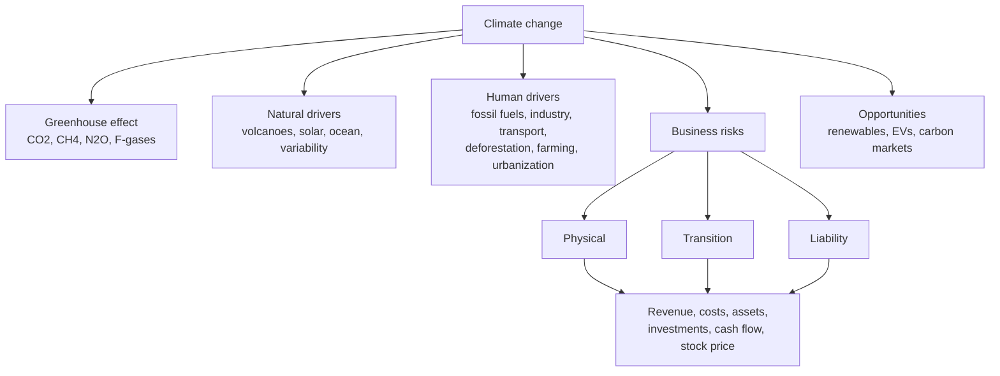

# CC-1 — Climate Change, Drivers and Impact on Corporate Financial Performance

Covers: the class definition, greenhouse effect, natural and human drivers, physical, transition and liability risk, the six-line financial-impact table, the faculty's corporate examples, climate opportunities, and a worked P&L example. **(class)** unless tagged.

## Where this fits in the ESE

The syllabus line reads "define climate change and its drivers; impact of climate change on corporate financial performance". Expect a 5-marker (define, greenhouse effect, drivers) or a 10-marker (risk types and the financial table with examples). The faculty's opening message is the thesis for every answer: **climate change is now a financial risk, not just an environmental issue.** Tags: **(class)** from the faculty slides, **(general)** from standard knowledge, **[VERIFY]** to check.

## Definition (class)

Climate change is the **long-term alteration of Earth's average weather patterns, caused by natural processes and human activities, particularly the emission of greenhouse gases (GHGs).** Write this sentence first. The slide adds: human activities account for the majority of recent global warming.

Key features (class): rising global temperature, extreme weather events, rising sea levels, melting glaciers, biodiversity loss, changes in rainfall patterns.

## Greenhouse effect (class)

Sunlight reaches Earth, Earth absorbs heat, some heat is reflected back, and greenhouse gases trap part of it. Trapped heat gives global warming, and warming gives climate change. The gases the faculty lists: **carbon dioxide (CO2), methane (CH4), nitrous oxide (N2O) and fluorinated gases.**

## Drivers (class)

| Natural drivers | Human drivers (major contributors) |
|---|---|
| Volcanic eruptions | Burning fossil fuels |
| Solar radiation | Industrial emissions |
| Ocean circulation | Transportation |
| Natural climate variability | Deforestation |
| | Agriculture and livestock |
| | Urbanization |

Exam point: the slide marks human drivers as the major contributors. Natural drivers explain past swings, not the rapid recent warming. **(general)**

Warming facts on the slides: mean annual temperature is up about 1°C since 1960, with models predicting a further rise of 1.8°C by the 2050s and 3.7°C by the 2100s. **[VERIFY]** the baseline and source before quoting. Impacts shown with examples: heat damaging roads and bridges and cutting crop yields (food security), more frequent floods and droughts (Ethiopia 2020 floods displaced over 500,000 people), sea-level rise (low-lying Maldives islands submerging), and biodiversity loss (disrupts farming and natural resources). Poverty, growth and ocean health suffer badly if warming passes 1.5°C.

## Mitigation, adaptation and loss and damage (class, with a correction)

The faculty groups climate financing by objective: **mitigation** (cut GHGs, renewable energy and efficiency, green transport and infrastructure), **adaptation** (climate-smart agriculture, disaster risk management, water security, resilience) and **loss and damage** (help vulnerable countries recover and rebuild). Sources and instruments are in Unit 1 (see [[Sustainable Finance Unit 1 - FS-4 International Agreements and the Financial System]]).

Your note has "Migration Finance: cut carbon emissions". Correct is **mitigation**, because migration means movement of people.

## Climate risks faced by businesses (class)

| Physical risk | Transition risk | Liability risk |
|---|---|---|
| Floods | Carbon tax | Climate-related lawsuits |
| Cyclones | Environmental regulations | Investor claims |
| Heatwaves | Changing consumer preferences | Environmental penalties |
| Water scarcity | Technological disruption | |
| Wildfires | Renewable energy transition | |

One-line test: physical risk is damage **from** the climate; transition risk is cost **of moving to** a low-carbon economy; liability risk is being **sued or fined** over either. Acute versus chronic physical risk (storm versus sea-level rise) is a useful refinement. **(general)**

## Impact on corporate financial performance (class)

"Climate change affects almost every financial metric."

| Area | Impact (slide) | One-line reasoning |
|---|---|---|
| Revenue | Lower sales due to disrupted markets | Floods and heat stop output; customers shift |
| Costs | Higher energy, insurance and compliance costs | Premiums, carbon rules and cooling rise |
| Assets | Damage from disasters | Plant and stock lost; collateral value falls |
| Investments | Lower returns on carbon-intensive assets | Stranded assets: written off early **(general)** |
| Cash flow | Operational interruptions | Shutdowns delay receipts, repairs drain cash |
| Stock price | Investors react negatively to climate risks | Higher required return, lower valuation |

## Real corporate examples (class)

Use these four as named in the slide, qualitatively only:

- **Toyota:** supply-chain disruption after floods (physical risk, revenue and cash flow).
- **Nestlé:** water scarcity affecting production (physical, chronic).
- **Tata Steel:** high carbon-reduction investments (transition risk, capex).
- **Adani Green:** benefited from renewable-energy investments (opportunity).

Class discussion: why do investors prefer renewable-energy companies today? Answer: lower transition risk, policy support, growing demand, and lower exposure to stranded assets and carbon cost.

## Financial opportunities from climate action (class)

"Climate risk = investment opportunity." Areas listed: renewable energy, electric vehicles, carbon markets, green buildings, sustainable agriculture, ESG investing.

## Cambridge lens

Cambridge Centre for Risk Studies (2019) sorts business threats into six classes: Financial, Geopolitical, Technology, **Environmental**, Social and Governance. Its Environmental class has families for Extreme Weather (flood, windstorm, drought, heatwave, wildfire), Geophysical, Space, **Climate Change**, Environmental Degradation and Natural Resource Deficiency. The Climate Change family has exactly the faculty's three types, **Physical, Liability and Transition**, and defines physical risk as acute (extreme weather) or chronic (long-term shifts), and transition risk as financial and reputational risk from policy, legal, technology and market change. The slide's physical list (floods, cyclones, heatwaves, wildfires) sits in the Cambridge Extreme Weather family. This is a classification aid; answer in the faculty's words. One finding worth a line: Environmental risks are reported in company risk registers more often than they are shown to cause corporate distress (Cambridge Centre for Risk Studies, 2019, section 3.5).

## Worked example: a climate P&L bridge (illustrative)

Aarav Fabrics Ltd (illustrative, not a real company) has revenue ₹1,000 crore, EBITDA margin 20%, depreciation ₹60 crore, interest ₹54 crore, tax 25%. A coastal flood closes the plant for 15 days; contribution margin is 40%.

1. Base EBITDA = 1,000 × 20% = **₹200 crore**.
2. Lost sales = 1,000 × 15 ÷ 365 = ₹41.10 crore.
3. Lost contribution = 41.10 × 40% = **₹16.44 crore**.
4. Stressed EBITDA = 200 − 16.44 = **₹183.56 crore**.
5. Base PAT = (200 − 60 − 54) × 0.75 = **₹64.50 crore**.
6. Stressed PAT = (183.56 − 60 − 54) × 0.75 = **₹52.17 crore**, a fall of 19.1%.

| | Base | After flood |
|---|---|---|
| EBITDA (₹ crore) | 200.00 | 183.56 |
| PAT (₹ crore) | 64.50 | 52.17 |

**Decision line:** a two-week outage cuts profit by about a fifth although sales fall only 4.1%, because fixed costs and interest do not stop. This is the faculty's "revenue, costs, cash flow" rows in numbers. Respond as in the opening activity: buy insurance, diversify sites, or invest in resilience, each with a cost, so price flood risk into site choice and inventory buffers.

## What to remember

- Climate change = long-term shift in average weather from natural processes and human activity, particularly GHGs (CO2, CH4, N2O, F-gases).
- Natural drivers: volcanoes, solar radiation, ocean circulation, variability. Human drivers: fossil fuels, industry, transport, deforestation, farming and livestock, urbanization.
- Three business risks: physical, transition, liability.
- Six financial lines hit: revenue, costs, assets, investments, cash flow, stock price. Examples: Toyota, Nestlé, Tata Steel, Adani Green.
- Climate risk is also opportunity: renewables, EVs, carbon markets, green buildings, sustainable agriculture, ESG investing.
- It is mitigation (not "migration") finance; climate change is a financial risk, not only an environmental issue.

## Concept map

## Flashcards
Q: Define climate change in the class wording.
A: Long-term alterations in Earth's average weather patterns caused by natural processes and human activities, particularly the emission of greenhouse gases.

Q: Name the four greenhouse gases on the faculty slide.
A: Carbon dioxide, methane, nitrous oxide and fluorinated gases.

Q: List the four natural drivers and three or more human drivers.
A: Natural: volcanic eruptions, solar radiation, ocean circulation, natural variability. Human: fossil fuels, industrial emissions, transportation, deforestation, agriculture and livestock, urbanization.

Q: Name the three climate risks faced by businesses.
A: Physical (floods, cyclones, heatwaves, water scarcity, wildfires), transition (carbon tax, regulation, consumer shift, technology, renewable transition) and liability (lawsuits, investor claims, penalties).

Q: List the six financial areas climate change affects.
A: Revenue, costs, assets, investments, cash flow and stock price.

Q: Match the company to the climate issue: Toyota, Nestlé, Tata Steel, Adani Green.
A: Toyota, supply-chain disruption after floods; Nestlé, water scarcity hitting production; Tata Steel, high carbon-reduction investment; Adani Green, gains from renewable investment.

Q: A student wrote "Migration Finance". What is the correct term?
A: Mitigation finance, which cuts emissions. Migration means movement of people.

Q: Name four financial opportunities from climate action.
A: Renewable energy, electric vehicles, carbon markets, green buildings (also sustainable agriculture and ESG investing).

Q: Aarav Fabrics loses 15 days of sales at ₹1,000 crore a year and 40% contribution margin. Lost contribution?
A: 1,000 × 15 ÷ 365 × 40% = ₹16.44 crore (illustrative).

Q: In the Cambridge taxonomy, which family holds physical, liability and transition risk?
A: The Climate Change family inside the Environmental class (Cambridge Centre for Risk Studies, 2019).

## Sources
- Faculty deck, Unit 2 (slides 81-91, 111-112, 125, 148-152)
- Student class notes (corrections only); Cambridge Centre for Risk Studies (2019), Cambridge Taxonomy of Business Risks
- Next node: [[Sustainable Finance Unit 2 - CC-2 Paris Agreement and COP 26 27 28]]
- [[Sustainable Finance Unit 2 - Climate Change MOC (Node Map)]]
