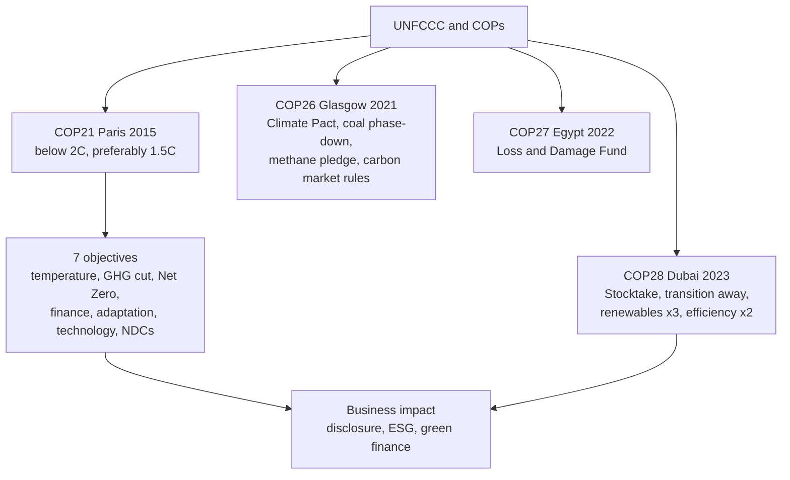

# CC-2 — Paris Agreement and COP 26/27/28

Covers: the Paris Agreement's vision and seven objectives, Net Zero, the outcomes of COP26 Glasgow, COP27 Egypt and COP28 Dubai, why agreements matter to business, and a worked NDC progress check. **(class)** unless tagged.

## Where this fits in the ESE

The syllabus names "objectives of the Paris Agreement (2015) and COP 26, 27 and 28". A 5-marker asks for the objectives or one COP; a 10-marker asks for Paris plus all three COPs and their business meaning. Tags: **(class)** faculty slides, **(general)** background, **[VERIFY]** to check.

## Paris Agreement 2015 (class)

Adopted during **COP21 in Paris**; nearly every country signed. Vision: keep global warming **below 2°C, preferably 1.5°C, above pre-industrial levels.** Background: the treaty text says "well below 2°C" and pursues 1.5°C. Give the slide wording in the exam. **(general)**

Objectives (class), learn as seven:

1. Limit temperature rise.
2. Reduce greenhouse gas emissions.
3. Achieve **Net Zero** around mid-century.
4. Climate finance for developing countries.
5. Promote adaptation.
6. Technology transfer.
7. **Nationally Determined Contributions (NDCs)**: each country sets its own pledge.

Background **(general)**: NDCs are renewed every five years with higher ambition; developed countries pledged USD 100 billion a year for developing countries; Article 6 allows carbon markets; a global stocktake every five years checks progress. A newer, larger finance goal was reported at COP29 **[VERIFY]**. In the exam, give the seven slide objectives and add these as a bonus line.

## What is Net Zero? (class)

Net Zero means **GHG emitted = GHG removed from the atmosphere.** Slide example: 100 tons emitted, 100 tons absorbed, net emissions zero. Removal comes from forests, soils and technologies such as carbon capture. Net zero is not zero emissions. **(general)**

## COP26, Glasgow, 2021 (class)

- **Glasgow Climate Pact.**
- **Coal phase-down** (the wording is phase-down, not phase-out).
- **Methane pledge.**
- **Carbon market rules.**
- **Climate finance discussions.**

India announced Panchamrit and net zero by 2070 at COP26 (see CC-3).

## COP27, Egypt (Sharm el-Sheikh), 2022 (class)

- Historic achievement: creation of the **Loss and Damage Fund** to support vulnerable nations hit by climate disasters.
- Focus areas: climate justice, adaptation, developing countries.

## COP28, Dubai, 2023 (class)

- **First Global Stocktake.**
- **Transition away from fossil fuels.**
- **Renewable energy tripling by 2030.**
- **Energy efficiency doubled** (rate of improvement, by 2030).
- Increased climate finance.

Slide 136 repeats this as the "UAE Consensus (2023)" and adds an **ICJ ruling (2025): 1.5°C legally binding**. Treat the second part carefully: the ICJ gave an advisory opinion, which is not a binding judgment, though it stresses states' obligations on the 1.5°C goal. **[VERIFY]** the exact wording. For the exam, quote the slide and add "(advisory opinion)" if confident.

## One-line comparison

| COP | Place, year | One line to remember |
|---|---|---|
| 21 | Paris, 2015 | Framework: below 2°C, preferably 1.5°C; NDCs; finance; Net Zero mid-century |
| 26 | Glasgow, 2021 | Glasgow Climate Pact, coal phase-down, methane pledge, carbon market rules |
| 27 | Egypt, 2022 | Loss and Damage Fund created |
| 28 | Dubai, 2023 | First Global Stocktake; transition away from fossil fuels; renewables x3, efficiency x2 by 2030 |

## Why agreements matter for finance and business (class)

- Agreements are **more than environmental treaties**: they shape global trade, international finance, corporate governance, investment decisions, energy transition, innovation, sustainable development and future growth.
- They have encouraged green bonds, ESG investing, carbon markets, sustainable banking, impact investing, renewable energy financing and net-zero investing, backed by institutions such as the World Bank, IMF, Asian Development Bank, Green Climate Fund and Global Environment Facility.
- Companies now disclose carbon emissions, climate risks, ESG performance and net-zero plans, through BRSR and TCFD/ISSB reporting (see [[Sustainable Finance Unit 1 - FS-6 Reporting Regulation and Responsible Investment]]).
- Business impact: companies must cut their carbon footprint, improve ESG ratings, adopt the circular economy, invest in renewables, ensure responsible supply chains and enhance transparency. Investors prefer strong ESG performance, low climate risk, responsible governance and long-term sustainability.
- Strategic areas touched: strategy, governance, risk management, supply chains, investment decisions, innovation, ESG reporting, competitive advantage.

The faculty's closing line: the future of business is decided not only by profitability but by how well firms align with global sustainability commitments.

## Cambridge lens

In the Cambridge taxonomy (Cambridge Centre for Risk Studies, 2019), the agreements act mainly through the **Geopolitical** class (change in government and regulation, government business policy) and the **Governance** class (non-compliance with existing and emerging regulation). The Paris/COP chain therefore turns a Transition risk (Environmental class) into policy, legal and disclosure obligations for the firm. Use this only as a framing sentence. The COP outcomes above stay as the faculty gave them.

## Worked example: how far is a country from its NDC? (illustrative)

Question style: "A country pledges to cut emissions intensity of GDP by 45% from 2005 by 2030. Assume (illustrative, not official) that intensity in 2020 was 70 on a 2005 = 100 index. What annual cut is needed?"

1. Target index in 2030 = 100 × (1 − 0.45) = **55**.
2. Gap from 2020 = 70 − 55 = 15 points, which is 15 ÷ 70 = **21.4%** of the 2020 level.
3. Years left = 10.
4. Required compound annual cut = (55 ÷ 70)^(1/10) − 1 = **−2.38% a year**.

| Item | Value |
|---|---|
| 2005 index | 100 |
| 2020 index (assumed) | 70 |
| 2030 target | 55 |
| Needed cut per year | 2.38% compound |

**Decision line:** the country must keep cutting intensity by about 2.4% a year. If the past decade averaged less, the NDC is at risk, so firms should expect tighter regulation, a carbon price and more disclosure (transition risk). The 2020 figure is assumed for practice only. The 45% target is India's updated NDC intensity goal **[VERIFY]**.

## What to remember

- Paris (COP21, 2015): below 2°C, preferably 1.5°C; seven objectives from temperature limit to NDCs.
- Net Zero = emitted equals removed.
- COP26 Glasgow: Climate Pact, coal phase-down, methane pledge, carbon market rules.
- COP27 Egypt: Loss and Damage Fund.
- COP28 Dubai: first Global Stocktake, transition away from fossil fuels, renewables x3 and efficiency x2 by 2030.
- Agreements reshape business strategy, finance, governance and disclosure, not just the environment.

## Concept map

## Flashcards
Q: State the Paris Agreement vision in the class wording.
A: Keep global warming below 2°C, preferably 1.5°C, above pre-industrial levels.

Q: List the objectives of the Paris Agreement.
A: Limit temperature rise; reduce GHG emissions; Net Zero around mid-century; climate finance for developing countries; promote adaptation; technology transfer; NDCs.

Q: What is Net Zero?
A: GHG emitted equals GHG removed from the atmosphere, for example 100 tons emitted and 100 tons absorbed.

Q: What is an NDC?
A: A Nationally Determined Contribution: each country's own climate pledge under Paris.

Q: Name the five outcomes of COP26 Glasgow.
A: Glasgow Climate Pact, coal phase-down, methane pledge, carbon market rules, climate finance discussions.

Q: What was the historic outcome of COP27 in Egypt?
A: Creation of the Loss and Damage Fund for vulnerable nations hit by climate disasters.

Q: Give the key outcomes of COP28 Dubai.
A: First Global Stocktake, transition away from fossil fuels, renewable energy tripling by 2030, energy efficiency doubled, increased climate finance.

Q: Why are international climate agreements more than environmental treaties?
A: They shape trade, finance, governance, investment, energy transition, innovation and growth, and push firms to disclose and cut emissions.

Q: Target index 55, current 70, 10 years left. Annual compound cut?
A: (55 ÷ 70)^(1/10) − 1 = −2.38% a year (illustrative).

Q: How does the slide's ICJ 2025 point need care?
A: The ICJ gave an advisory opinion on the 1.5°C goal, not a binding judgment; quote the slide and flag [VERIFY].

## Sources
- Faculty deck, Unit 2 (slides 86, 92-97, 103, 106-107, 113-114, 136)
- UNFCCC Paris Agreement and COP decisions (background); Cambridge Centre for Risk Studies (2019)
- Next node: [[Sustainable Finance Unit 2 - CC-3 Government of India Climate Regulations]]
- [[Sustainable Finance Unit 2 - Climate Change MOC (Node Map)]]
