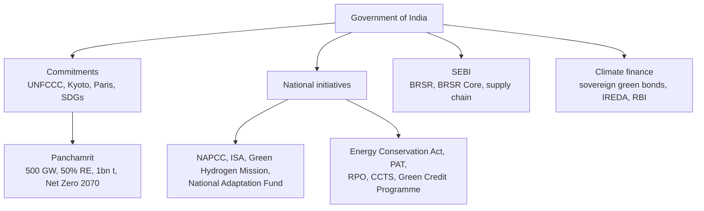

# CC-3 — Government of India Climate Regulations

Covers: India's commitments, Panchamrit, the national initiatives list (NAPCC, Energy Conservation Act, PAT, Green Hydrogen Mission, RPO, CCTS, ISA, Adaptation Fund, Green Credit Programme), SEBI's BRSR and BRSR Core, climate finance in India, and a worked carbon-credit decision. **(class)** unless tagged.

## Where this fits in the ESE

The syllabus line is "regulations set by the GoI to mitigate climate risks". Expect a 5-marker on one instrument (BRSR, CCTS, Panchamrit) or a 10-marker that lists several initiatives with the risk each addresses. Tags: **(class)** faculty slides, **(general)** background, **[VERIFY]** dates, thresholds or status that may have moved.

## India's commitments under global agreements (class)

India is a signatory to the **UNFCCC, Kyoto Protocol, Paris Agreement and the SDGs.**

## Panchamrit commitments, COP26 (class)

1. **500 GW** non-fossil fuel energy capacity (by 2030).
2. **50% electricity from renewables** (by 2030).
3. Reduce **emissions intensity**.
4. Reduce projected carbon emissions by **one billion tonnes** by 2030.
5. **Net Zero by 2070.**

Two precision notes. The slide's item 3 has no number; the official figure is a **45% cut in the emissions intensity of GDP by 2030 from the 2005 level**. For item 2, the official statement is 50% of **energy requirements** from renewable sources, while the updated NDC says about 50% of cumulative electric power **capacity** from non-fossil sources. Write the slide wording and add the official figure as a bracket. **[VERIFY]** whether a newer NDC cycle has replaced these. **(general)**

## National initiatives (class)

Slide 99 (regulations) and slide 105 (key initiatives) together give ten items. Learn them as one list.

| Initiative | One-line meaning |
|---|---|
| National Action Plan on Climate Change (NAPCC) | India's umbrella climate plan, launched 2008 with eight national missions (solar, energy efficiency, habitat, water, Himalayan ecosystem, Green India, agriculture, strategic knowledge) **(general)** |
| Energy Conservation Act | Legal base for energy-efficiency rules, run by the Bureau of Energy Efficiency (BEE) |
| Perform Achieve Trade (PAT) | Efficiency targets for energy-intensive units; over-achievers earn tradable certificates **(general)** |
| National Green Hydrogen Mission | Build green hydrogen production and use |
| Renewable Purchase Obligations (RPO) | Utilities and large buyers must source a share of power from renewables |
| Carbon Credit Trading Scheme (CCTS) | India's carbon market; one credit certificate is one tonne CO2e **(general)** |
| International Solar Alliance (ISA) | India-led alliance promoting solar energy |
| National Adaptation Fund | Funds adaptation in vulnerable regions |
| Green Credit Programme | Rewards voluntary pro-environment action with tradable green credits **(general)** |
| SEBI BRSR framework | Mandatory sustainability disclosure for listed firms |

## SEBI and climate disclosure (class)

Slide frameworks: **BRSR** (Business Responsibility and Sustainability Report), **BRSR Core**, **ESG disclosure**, **supply chain sustainability.** Why important: investors demand transparency.

- BRSR is the broad report; it replaced the older BRR. Mandatory for the top 1,000 listed companies by market capitalisation from FY2022-23. **(general)** **[VERIFY]** threshold.
- BRSR Core is a smaller set of key indicators with independent assurance. The slide (143) says it mandates ESG disclosures for the **top 250 firms.** Phasing by market-cap tier is the background. **[VERIFY]**
- Supply-chain disclosures extend reporting to value-chain partners, phased in for the largest firms. **[VERIFY]**
- Slide 143 also says ESG debt securities require ICMA-aligned reviews. SEBI's ESG debt framework is aligned with global practice; confirm the exact reference before quoting. **[VERIFY]**
- Link: global reporting standards (GRI, SASB, TCFD, ISSB) are in [[Sustainable Finance Unit 1 - FS-6 Reporting Regulation and Responsible Investment]].

## Climate change financing in India (class)

- National Action Plan on Climate Change (NAPCC).
- **Sovereign Green Bonds** issued by the Government of India (first auctions in early 2023, about ₹16,000 crore in two tranches **[VERIFY]**).
- Renewable-energy financing through agencies such as the **Indian Renewable Energy Development Agency (IREDA).**
- Green financing initiatives by the **Reserve Bank of India** and financial institutions.
- Promotion of ESG investments and sustainable finance frameworks.

Indian perspective (slide 143): SEBI BRSR Core; ESG debt securities with ICMA-aligned reviews; **RBI climate risk stress testing**; **NITI Aayog (2026) net-zero financing pathways for Viksit Bharat 2047.** Slide 146 adds sovereign green bonds funding renewable energy. Global figures on the same slide ($670 billion a year still flowing to fossil fuels; $7.25 trillion cumulative global green bonds by Q1 2026) are class facts to **[VERIFY]**.

RBI items beyond the slides **(general)**, one line each and **[VERIFY]** status: a draft climate-related financial risk disclosure framework (2024) and a green deposits framework (2023). Climate stress testing is covered in CC-4.

## Who regulates what (class notes, corrected)

Your regulator note maps: SEBI for ESG disclosure and BRSR; RBI for climate risk in banking; MCA for corporate governance; MoEFCC for environmental policy; NITI Aayog for SDG monitoring; IFSCA for the GIFT City hub; NABARD for green rural finance. Corrections: "MICA" is **MCA** (Ministry of Corporate Affairs); "SEBO" is **SEBI**. The financial system's three verbs from your note, **mobilise, allocate, manage**, fit the faculty's ten roles in [[Sustainable Finance Unit 1 - FS-4 International Agreements and the Financial System]].

## Cambridge lens

In Cambridge Centre for Risk Studies (2019) terms, GoI instruments turn Transition risk (Environmental class) into **Governance** obligations. The Governance class includes Non-Compliance, defined as the risk of not complying with existing or emerging regulation or reporting requirements, and Litigation. Cambridge also finds Governance risk the most under-recognised class: actual corporate distress from governance failure is much larger than companies report in their risk registers. Exam use: when you list BRSR, CCTS and RPO, add one line that firms must treat compliance as a risk-register item, since regulation is where transition risk becomes legal liability.

## Worked example: a CCTS-style position (illustrative)

Rathnam Alloys (illustrative) produces 10 lakh tonnes a year. Its sector intensity target is 1.80 tCO2 per tonne; actual is 1.90. Credit price assumed ₹1,000 per tonne CO2; a kiln heat-recovery project cuts 0.10 t/t at ₹6 crore a year.

1. Allowed emissions = 10,00,000 × 1.80 = 18,00,000 t.
2. Actual emissions = 10,00,000 × 1.90 = 19,00,000 t.
3. Shortfall = **1,00,000 t**.
4. Cost of buying credits = 1,00,000 × ₹1,000 = ₹1,00,00,000 = **₹10 crore**.
5. Cost of abating = **₹6 crore** a year.

| Option | Annual cost |
|---|---|
| Buy credits | ₹10 crore |
| Abate through project | ₹6 crore |

**Decision line:** abatement saves ₹4 crore a year, so invest. After the project, extra cuts earn certificates that can be sold. If credit prices rose to ₹1,500, buying would cost ₹15 crore, which strengthens the case. Price, target and project cost are illustrative. Trading mechanics are in Unit 3.

## What to remember

- India is a signatory to UNFCCC, Kyoto, Paris and the SDGs.
- Panchamrit: 500 GW non-fossil, 50% renewable electricity, lower emissions intensity (45% officially), 1 billion tonne cut by 2030, Net Zero 2070.
- National list: NAPCC, Energy Conservation Act, PAT, Green Hydrogen Mission, RPO, CCTS, ISA, National Adaptation Fund, Green Credit Programme, BRSR.
- SEBI: BRSR, BRSR Core (top 250 per slide), ESG disclosure, supply chain sustainability. Reason: investors demand transparency.
- Climate finance in India: NAPCC, sovereign green bonds, IREDA, RBI initiatives, ESG frameworks; NITI Aayog net-zero pathways for Viksit Bharat 2047.
- Regulator map correction: MCA not MICA, SEBI not SEBO.

## Concept map

## Flashcards
Q: Which global agreements is India a signatory to, per the faculty slide?
A: UNFCCC, Kyoto Protocol, Paris Agreement and the SDGs.

Q: List India's Panchamrit commitments from COP26.
A: 500 GW non-fossil capacity; 50% electricity from renewables; lower emissions intensity; one billion tonnes cut in projected emissions by 2030; Net Zero by 2070.

Q: Name the national climate initiatives on the faculty slides.
A: NAPCC, Energy Conservation Act, PAT, National Green Hydrogen Mission, RPO, Carbon Credit Trading Scheme, International Solar Alliance, National Adaptation Fund, Green Credit Programme, SEBI BRSR.

Q: What does SEBI's disclosure framework cover and why does it matter?
A: BRSR, BRSR Core, ESG disclosure and supply chain sustainability; investors demand transparency.

Q: How does BRSR Core differ from BRSR?
A: BRSR Core is a smaller set of key ESG indicators, with independent assurance, phased in for the largest firms (top 250 per the slide).

Q: How is climate change financed in India, per the slide?
A: NAPCC, sovereign green bonds, IREDA renewable financing, RBI and bank green initiatives, and ESG investment and sustainable finance frameworks.

Q: What are the Indian perspective items on slide 143?
A: BRSR Core for top 250 firms, ICMA-aligned reviews for ESG debt securities, RBI climate risk stress testing, NITI Aayog 2026 net-zero financing pathways for Viksit Bharat 2047.

Q: Correct the acronym "MICA" in a regulator list.
A: MCA, the Ministry of Corporate Affairs, responsible for corporate governance.

Q: What is one carbon credit certificate under CCTS?
A: One tonne of CO2 equivalent avoided or removed.

Q: 1,00,000 tCO2 shortfall at ₹1,000 a tonne versus an abatement project at ₹6 crore a year. Which option?
A: Buying costs ₹10 crore, abating costs ₹6 crore, so abate and save ₹4 crore a year (illustrative).

## Sources
- Faculty deck, Unit 2 (slides 99-100, 103-105, 142-143, 146); student regulator-map notes
- SEBI, RBI, BEE materials (background; verify on the regulator's site); Cambridge Centre for Risk Studies (2019)
- Next node: [[Sustainable Finance Unit 2 - CC-4 Scenario Analysis Stress Testing and Credit Ratings]]
- [[Sustainable Finance Unit 2 - Climate Change MOC (Node Map)]]
