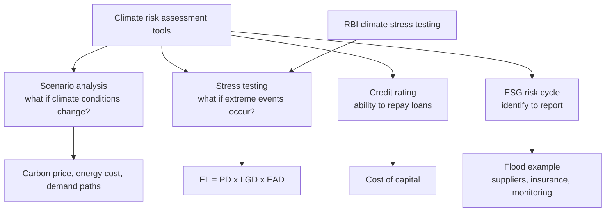

# CC-4 — Scenario Analysis, Stress Testing and Credit Ratings

Covers: the faculty's three climate risk assessment tools, how each is run, the ESG risk-management cycle with the flood example, the risk matrix, RBI's role, and a worked example that applies all three to one firm and one loan. **(class)** unless tagged.

## Where this fits in the ESE

The syllabus line is "regulatory and testing strategies (scenario analysis, stress testing, credit rating)". A 5-marker asks you to define the three tools and say how they differ. A 10-marker asks you to apply them with a small example. The faculty's one-line definitions are the answer skeleton. Tags: **(class)**, **(general)**, **[VERIFY]**.

## The three tools (class)

"Banks and companies use" these climate risk assessment tools:

| Tool | Faculty question | What it tells you |
|---|---|---|
| Scenario analysis | "What if climate conditions change?" | Outcomes under several plausible climate and policy futures |
| Stress testing | "What if extreme climate events occur?" | Losses from a severe but plausible shock |
| Credit rating | How climate risk affects ability to repay loans | Whether the borrower can still service debt |

Exam sentence: scenario analysis looks at **gradual paths**, stress testing at **sudden shocks**, credit rating at the **repayment result**. Slide 126 groups the tools as "scenario analysis, stress testing, disclosure frameworks" under ESG risk management, and cites **RBI's 2025 systemic risk report** as an example. Slide 143 lists **RBI climate risk stress testing** among India's measures. **[VERIFY]** details of the RBI exercise before quoting.

## How to run a scenario analysis (general)

1. Pick scenarios. Common set: **orderly transition** (early, steady policy), **disorderly transition** (late, sharp policy), and **hot house** (little policy, high physical damage). Central-bank network scenarios follow this pattern. **[VERIFY]** names if asked.
2. Choose drivers: carbon price, energy cost, demand, temperature path, flood frequency.
3. Translate drivers into revenue, cost, asset and cash-flow effects (the CC-1 table).
4. Compare outcomes across scenarios and decide capex, pricing and hedging.

Scenarios are not forecasts. They test whether the strategy survives different futures.

## How to run a stress test (general)

1. Define one severe event, for example a 1-in-100-year flood or a sudden carbon-price jump.
2. Apply it to the balance sheet and P&L, or to a loan book.
3. For a bank, measure the effect on **probability of default (PD), loss given default (LGD) and exposure at default (EAD)**; expected loss = PD × LGD × EAD (detail in Unit 4, RK-2).
4. Compare with capital and set limits, buffers or insurance.

## Credit rating and climate (class, with general detail)

The slide: climate risk affects **ability to repay loans.** Rating agencies and lenders look at cash flow cover, leverage, asset quality and governance, and they add climate factors: exposure to carbon cost, physical-site risk, transition plan and disclosure quality. **(general)** A weaker rating raises borrowing cost, which is the same point as the slide 126 claim that strong ESG firms enjoy a **lower cost of capital** (the slide says 10%; **[VERIFY]** the source, and read it as 10% lower in relative terms, so a 10% rate would fall to about 9%).

## ESG risk-management cycle and the flood example (class)

The cycle (slides 122-123): **Identify** the ESG issues, **Assess** likelihood and impact, **Prioritize** material risks, **Mitigate** with policies and controls, **Monitor** indicators, **Report** to stakeholders, then continuous improvement. Full treatment is in [[Sustainable Finance Unit 1 - FS-5 ESG Risk Management and the Risk Matrix]].

Faculty example (slide 124): **flood risk → supply chain disruption → alternative suppliers → insurance → quarterly monitoring.** Reuse it as the mitigation chain in any case answer.

Risk matrix (slide 155): rows are labelled Impact; the Low/Medium/High columns are unlabelled on the slide and read as likelihood. High impact gives Medium, High, Critical risk across Low to High likelihood; Medium impact gives Low, Medium, High; Low impact gives Low, Low, Medium.

## Cambridge lens

Cambridge Centre for Risk Studies (2019) offers three ideas that sharpen these tools.

- **Risk register.** It builds a taxonomy of 6 classes, 37 families and 175 risk types as a checklist for company risk registers. Use it to make the scenario list complete: climate sits in Environmental (Climate Change family) but also links to Financial (Credit Rating Downgrade under Company Outlook) and Governance (Non-Compliance, Litigation).
- **Correlation.** The taxonomy treats the six classes as broadly independent at the trigger (first-order independence), while noting that one event can trigger another class, such as a flood (Environmental) causing a supply failure and a credit downgrade (Financial). That is the logic of a multi-risk stress test.
- **Mis-weighted registers.** Environmental risks are reported more often than they cause distress, and Governance risks are under-reported. So do not let a climate-only stress test hide governance or disclosure weakness.

These support the faculty's tools; they do not replace the three definitions above.

## Worked example: scenario, stress and rating for one firm and one loan (illustrative)

Siddhi Cements Ltd (illustrative, not a real company) emits 1,00,000 tCO2 a year, has EBITDA ₹120 crore and interest ₹30 crore. Its bank has a ₹500 crore exposure to a coastal manufacturer. All inputs are assumed for practice.

**Part A: scenario analysis (carbon price).**

1. Carbon cost = 1,00,000 t × price. At ₹500 a tonne = ₹5 crore; ₹1,000 = ₹10 crore; ₹2,000 = ₹20 crore.
2. Scenario EBITDA = 120 − carbon cost = 115, 110, 100.
3. Interest cover = EBITDA ÷ interest = 4.00x base, then 3.83x, 3.67x, 3.33x.

| Scenario (carbon price) | Cost (₹ crore) | EBITDA (₹ crore) | Fall in EBITDA | Interest cover |
|---|---|---|---|---|
| Base | 0 | 120 | 0% | 4.00x |
| Orderly (₹500) | 5 | 115 | 4.2% | 3.83x |
| Mid (₹1,000) | 10 | 110 | 8.3% | 3.67x |
| Disorderly (₹2,000) | 20 | 100 | 16.7% | 3.33x |

**Part B: stress test (bank loan, coastal flood).**

4. Base: PD 2%, LGD 40%, EAD ₹500 crore. EL = 500 × 0.02 × 0.40 = **₹4.00 crore**.
5. Flood shock: PD rises to 5%, LGD to 55% because collateral is damaged. EL = 500 × 0.05 × 0.55 = **₹13.75 crore**, 3.4 times the base.

**Part C: rating view.** Cover stays above 3x in all scenarios, so Siddhi can still service debt, but the stressed loan loses margin of safety.

**Decision line:** Siddhi's debt service survives even the ₹2,000 carbon price, but profit falls by one-sixth, so it should invest in efficiency and a transition plan to protect its rating. The bank should treat the coastal borrower as higher risk: its expected loss more than triples under the flood shock, so it should price the loan higher, take insurance or cap exposure, and monitor quarterly (the faculty mitigation chain). Every input here is illustrative; the method is what earns marks.

## What to remember

- Scenario analysis: "what if climate conditions change?" Stress testing: "what if extreme climate events occur?" Credit rating: how climate risk affects ability to repay.
- Scenarios test paths and strategy; stress tests test sudden shocks and capital; ratings show the repayment outcome.
- Stress effect on a loan: EL = PD × LGD × EAD, and climate raises PD and LGD.
- ESG cycle: identify, assess, prioritize, mitigate, monitor, report. Flood mitigation chain: alternative suppliers, insurance, quarterly monitoring.
- RBI uses climate stress testing; the slide cites its 2025 systemic risk report [VERIFY].
- Cambridge lens: use the taxonomy as a risk-register checklist and watch cross-class triggers.

## Concept map

## Flashcards
Q: Name the three climate risk assessment tools on the faculty slide.
A: Scenario analysis, stress testing and credit rating.

Q: What question does scenario analysis ask?
A: "What if climate conditions change?"

Q: What question does stress testing ask?
A: "What if extreme climate events occur?"

Q: What does a climate-aware credit rating assess?
A: How climate risk affects the borrower's ability to repay loans.

Q: Give the faculty's flood-risk mitigation chain.
A: Flood risk, supply chain disruption, alternative suppliers, insurance, quarterly monitoring.

Q: Write the ESG risk-management cycle.
A: Identify, assess, prioritize, mitigate, monitor, report, then continuous improvement.

Q: Siddhi Cements: EBITDA ₹120 crore, interest ₹30 crore, carbon cost ₹10 crore. Interest cover?
A: (120 − 10) ÷ 30 = 3.67x, down from 4.00x (illustrative).

Q: Loan ₹500 crore, PD 2%, LGD 40%. Then PD 5%, LGD 55% after a flood. Expected loss each way?
A: ₹4.00 crore base and ₹13.75 crore stressed, about 3.4 times (illustrative).

Q: Name three orderly-to-extreme scenario types used in climate scenario analysis.
A: Orderly transition, disorderly transition and hot house (general).

Q: What do the Cambridge classes add to a stress test?
A: A risk-register checklist and the idea that one class can trigger another, such as flood leading to a credit downgrade (Cambridge Centre for Risk Studies, 2019).

## Sources
- Faculty deck, Unit 2 (slides 101, 110, 119-124, 126, 143, 155)
- Cambridge Centre for Risk Studies (2019), Cambridge Taxonomy of Business Risks; central-bank scenario practice (background)
- Next node: [[Sustainable Finance Unit 2 - CC-5 ESG in Managerial Decisions and Greenwashing]]
- [[Sustainable Finance Unit 2 - Climate Change MOC (Node Map)]]
