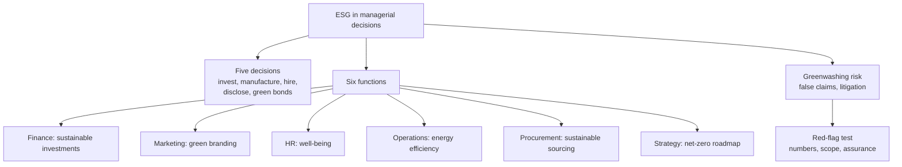

# CC-5 — ESG in Managerial Decisions and Greenwashing

Covers: the five decisions managers now face, ESG influence across six business functions, what companies must do and what investors prefer, the CEO coastal-factory activity, an ESG-adjusted capex decision, and greenwashing with a red-flag test. **(class)** unless tagged.

## Where this fits in the ESE

The syllabus ends Unit 2 with "impact of climate change and ESG on managerial decisions and corporations". A 5-marker asks for the six functions or the five decisions. A 10-marker asks you to explain with examples and a decision. Greenwashing is not on the slides, so it is **(general)**, but it is a natural 5-marker and a case-answer risk. Tags: **(class)**, **(general)**, **[VERIFY]**.

## ESG and managerial decisions (class)

Managers now decide:

- **Where to invest?**
- **How to manufacture?**
- **Whom to hire?**
- **How much to disclose?**
- **Whether to issue green bonds?**

Each decision carries an ESG cost and an ESG benefit, which is why the faculty frames ESG as business risk and opportunity, not charity.

## ESG influence across business functions (class)

| Department | Decision |
|---|---|
| Finance | Sustainable investments |
| Marketing | Green branding |
| HR | Employee well-being |
| Operations | Energy efficiency |
| Procurement | Sustainable sourcing |
| Strategy | Net-zero roadmap |

Memory hook: **F-M-H-O-P-S**, "Finance Makes Honest Operations Pay Steadily". Give one sentence of reasoning per row in a 10-marker: for example, Operations cuts energy cost and emissions together; Procurement reduces supply-chain risk (the flood and water examples in CC-1).

## What companies must do and what investors prefer (class)

| Companies must now | Investors prefer |
|---|---|
| Reduce carbon footprint | Strong ESG performance |
| Improve ESG ratings | Low climate risk |
| Adopt the circular economy | Responsible governance |
| Invest in renewable energy | Long-term sustainability |
| Ensure responsible supply chains | |
| Enhance transparency | |

Agreements influence business strategy, corporate governance, risk management, supply chains, investment decisions, innovation, ESG reporting and competitive advantage (CC-2).

## The CEO activity (class)

Your factory is near the coast and sea level is predicted to rise in 20 years. Options: **A ignore, B buy insurance, C relocate, D invest in green technologies.** The faculty's point: every option has financial consequences. A guide answer: ignoring leaves an unpriced tail risk; insurance transfers risk but premiums rise; relocation is costly now but removes the exposure; green technology cuts emissions but does not stop flooding. A sound CEO combines B and D now and builds a relocation option into capex planning. **(general)** The slide-level lesson is the line itself: climate change is a financial risk, not just an environmental issue.

Related class examples: KisanKraft's battery-powered farm equipment (company says energy cost falls from about ₹170 to about ₹10 an hour, over 90%) shows operations and product strategy turned green **[VERIFY]** the claim is the company's own; Hitachi Energy's work on electric flying vehicles shows innovation as a response.

## Worked example: an ESG-adjusted capex decision (illustrative)

Anaya Packaging Ltd (illustrative) considers a rooftop solar plant: capex ₹10 crore, saves ₹2.2 crore a year in power cost for 10 years, no salvage value, cost of capital 10%. Use the 10-year, 10% annuity factor of 6.145.

1. PV of savings = 2.2 × 6.145 = **₹13.52 crore**.
2. NPV = 13.52 − 10 = **₹3.52 crore** (3.519 unrounded to 3 decimals of the factor).
3. Simple payback = 10 ÷ 2.2 = **4.55 years**.
4. Add (not in NPV above): lower carbon cost under a future carbon price, a cleaner BRSR profile and possible green-bond eligibility.

| Item | ₹ crore |
|---|---|
| Capex | 10.00 |
| PV of savings at 10% | 13.52 |
| NPV | 3.52 |

**Decision line:** NPV is positive at 10% even before any carbon benefit, so invest. The ESG gains are upside and reduce transition risk. The case fails only if savings fall below ₹1.63 crore a year (10 ÷ 6.145), a 26% margin of safety. Inputs are illustrative.

## Greenwashing (general)

**Greenwashing** is making environmental or sustainability claims that are false, exaggerated or unsupported, so a product, firm or fund looks greener than it is. Why a manager should care: regulators, investors and customers now test claims, and false claims create liability, the third climate risk in CC-1.

Red-flag test (use as a checklist in a case):

| Red flag | Question to ask |
|---|---|
| Vague words | "Eco-friendly", "green": what is measured? |
| No numbers or baseline | Cut of what, from which year? |
| Cherry-picked scope | Are Scope 3 and the supply chain left out? |
| Offsets over cuts | Net-zero claim with no real reduction plan? |
| No assurance | Is the data independently verified (BRSR Core assurance)? |
| Green bond proceeds | Do they go to eligible projects, with reporting? |

How to reduce it: verified data, assured disclosures (BRSR Core), clear targets and baselines, and an exit from misleading labels. Link: reporting rules in CC-3 and Unit 1 FS-6.

## Cambridge lens

In Cambridge Centre for Risk Studies (2019), greenwashing is not one risk type but crosses classes. A false claim is a **Social** risk (Brand Perception: negative media, consumer activism), a **Governance** risk (Litigation such as class action; Non-Compliance with disclosure rules) and a driver of **Financial** risk (investor negative outlook). Cambridge also finds Governance the class most under-recognised in company risk registers, which is the managerial lesson: put misleading-claims risk in the register, owned by the board. This lens adds context only; the six functions and five decisions above are the faculty answer.

## What to remember

- Managers decide where to invest, how to manufacture, whom to hire, how much to disclose and whether to issue green bonds.
- Six functions: Finance (sustainable investments), Marketing (green branding), HR (well-being), Operations (energy efficiency), Procurement (sustainable sourcing), Strategy (net-zero roadmap).
- Companies must cut carbon, improve ESG ratings, adopt circular economy, invest in renewables, secure supply chains and be transparent; investors prefer strong ESG, low climate risk and good governance.
- CEO activity: every option (ignore, insure, relocate, green technology) has financial consequences.
- Capex logic: NPV first, ESG benefit as upside and risk reduction.
- Greenwashing = unsupported green claims; test with numbers, scope, offsets and assurance (general).

## Concept map

## Flashcards
Q: List the five decisions managers now face under ESG, per the faculty slide.
A: Where to invest, how to manufacture, whom to hire, how much to disclose, whether to issue green bonds.

Q: Name the six business functions and the ESG decision of each.
A: Finance, sustainable investments; Marketing, green branding; HR, employee well-being; Operations, energy efficiency; Procurement, sustainable sourcing; Strategy, net-zero roadmap.

Q: What must companies now do because of climate agreements?
A: Reduce carbon footprint, improve ESG ratings, adopt the circular economy, invest in renewable energy, ensure responsible supply chains and enhance transparency.

Q: What do investors prefer?
A: Strong ESG performance, low climate risk, responsible governance and long-term sustainability.

Q: In the CEO coastal-factory activity, what is the faculty's lesson?
A: Every option has financial consequences; climate change is a financial risk, not just an environmental issue.

Q: Rooftop solar: capex ₹10 crore, saving ₹2.2 crore a year for 10 years at 10%. NPV?
A: 2.2 × 6.145 − 10 = ₹3.52 crore, positive, so invest (illustrative).

Q: What is the minimum annual saving for that solar plant to break even at 10%?
A: 10 ÷ 6.145 = ₹1.63 crore a year.

Q: Define greenwashing.
A: Making false, exaggerated or unsupported environmental claims so a product or firm looks greener than it is.

Q: Name three greenwashing red flags.
A: Vague words with no measure, no baseline or numbers, and no independent assurance (also cherry-picked scope and offsets in place of cuts).

Q: Why does Cambridge say boards should watch governance risk?
A: Governance is the class most under-recognised in risk registers compared with how often it causes corporate distress (Cambridge Centre for Risk Studies, 2019).

## Sources
- Faculty deck, Unit 2 (slides 82, 90-91, 98, 102, 106-108, 114-115, 118)
- Cambridge Centre for Risk Studies (2019), Cambridge Taxonomy of Business Risks; greenwashing and capex method (general)
- Next node: [[Sustainable Finance Unit 2 - CC-6 Unit 2 Exam Answers]]
- [[Sustainable Finance Unit 2 - Climate Change MOC (Node Map)]]
