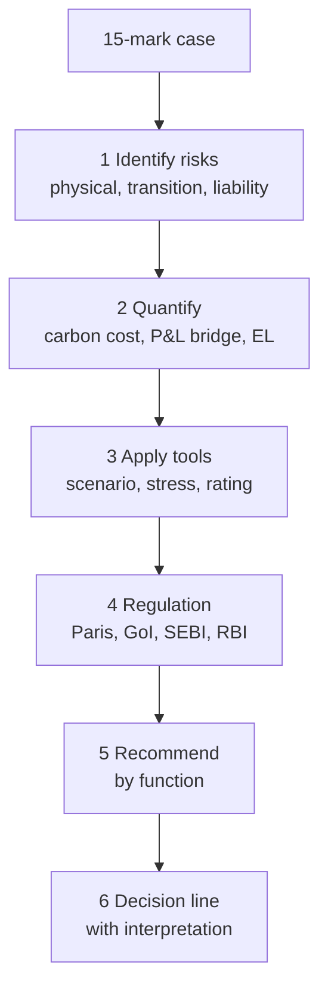

# CC-6 — Unit 2 Exam Answers

Covers: likely 5-mark skeletons, 10-mark skeletons, the 15-mark case layout, a worked climate case with numbers, and a last-hour checklist for Unit 2.

## The exam shape

ESE is 50 marks in 2 hours. Section A: 3 of 5 questions × 5 marks. Section B: 2 of 3 × 10 marks. Section C: one compulsory 15-mark case. Budget about 7 minutes per 5-marker, 14 per 10-marker and 30 for the case. Always use the faculty's wording first (class), then add one line of background or **(general)** if time allows. Give examples by name: Toyota, Nestlé, Tata Steel, Adani Green.

## 5-mark skeletons (about 150 words)

| Likely question | Skeleton |
|---|---|
| Define climate change and its drivers | Definition sentence (CC-1); greenhouse gases (CO2, CH4, N2O, F-gases); natural drivers (4); human drivers (6); one line: humans are the major contributor |
| Physical, transition and liability risks | Three columns with the faculty lists; one example each; one line on how each hits cash flow |
| Impact on corporate financial performance | Six rows: revenue, costs, assets, investments, cash flow, stock price; then Toyota or Nestlé as example |
| Objectives of the Paris Agreement | Vision (below 2°C, preferably 1.5°C); seven objectives; define NDC and Net Zero |
| COP26, COP27, COP28 | One table: Glasgow (Climate Pact, coal phase-down, methane pledge, carbon market rules), Egypt (Loss and Damage Fund), Dubai (Global Stocktake, transition away from fossil fuels, renewables x3, efficiency x2) |
| India's Panchamrit | Five commitments; Net Zero 2070; one line on signatory status (UNFCCC, Kyoto, Paris, SDGs) |
| SEBI and climate disclosure | BRSR, BRSR Core, ESG disclosure, supply chain sustainability; reason: investor transparency |
| Climate risk assessment tools | Scenario analysis, stress testing, credit rating with the faculty questions; one RBI line |
| ESG across business functions | Six-row table (Finance to Strategy) plus the five managerial decisions |
| Greenwashing | Definition, two red flags, one remedy (assurance) |

## 10-mark skeletons (about 350 words)

1. **Climate change as a financial risk.** Opening line (financial risk, not only environmental); definition; drivers briefly; three risks; six financial lines with a table; two named examples; one opportunity paragraph; closing interpretation line.
2. **Paris Agreement and COPs.** Paris vision and objectives; Net Zero; COP26, 27, 28 table; business implications (disclosure, ESG ratings, green finance); closing: agreements are strategic frameworks, not only treaties.
3. **GoI regulations to mitigate climate risk.** Commitments and Panchamrit; table of national initiatives with one risk each addresses (CCTS: carbon price; BRSR: disclosure; RPO: renewables share; NAPCC: adaptation); climate finance in India; closing view on gaps (enforcement, data, private finance).
4. **Scenario analysis, stress testing and credit rating.** Definitions with faculty questions; how each is run; a small numeric illustration (CC-4 style); link to PD, LGD and EAD; RBI line.
5. **ESG and managerial decisions.** Five decisions; six functions; what firms must do and what investors prefer; one NPV-style decision (CC-5) and a greenwashing warning.

## 15-mark case layout

Use a fixed order so no mark is left on the table. About 450 to 550 words plus a table.

1. **Case facts (2 lines).** Name firm, sector, location, the climate trigger.
2. **Identify the risks (3 marks).** Physical, transition, liability, each tied to a fact in the case. Add the opportunity if the case gives one.
3. **Quantify (4 marks).** Numbered steps, a table, correct units (₹ crore). Show the formula. Use the CC-1 P&L bridge, a carbon-price scenario or EL = PD × LGD × EAD. State assumed inputs.
4. **Apply the tools (2 marks).** Name scenario analysis, stress test and credit effect; say which suits the problem.
5. **Regulation and disclosure (2 marks).** Paris/NDC link, relevant GoI or SEBI rule (BRSR, BRSR Core, CCTS), RBI where a lender is involved.
6. **Managerial recommendation (2 marks).** Decisions by function; mitigation chain (alternatives, insurance, monitoring); greenwashing caution.
7. **Decision line with interpretation (2 marks).** One sentence: what to do, why, and what would change the answer.

Tip: if the case gives no number for a figure you need, write "assumed" and state the value. Do not skip the step.

## Worked example: a 15-mark case answer (illustrative)

Case: Sagar Steel Ltd (illustrative, not a real company) has a coastal plant. Revenue ₹2,000 crore, EBITDA ₹280 crore (14%), interest ₹70 crore, emissions 3,00,000 tCO2 a year. A carbon price of ₹1,500 a tonne is expected, and a cyclone could close the plant for 10 days at a 30% contribution margin. Advise the board.

**1. Risks.** Physical: cyclone and flood (coastal site). Transition: carbon price. Liability: possible disclosure claims if climate risk is not reported under BRSR. Opportunity: efficiency and green-steel demand.

**2. Quantify.**

- Carbon cost = 3,00,000 × ₹1,500 = ₹45,00,00,000 = ₹45 crore.
- Cyclone: lost sales = 2,000 × 10 ÷ 365 = ₹54.79 crore; lost contribution = 54.79 × 30% = ₹16.44 crore.
- Interest cover = EBITDA ÷ interest.

| Case | EBITDA (₹ crore) | Fall | Interest cover |
|---|---|---|---|
| Base | 280.00 | 0% | 4.00x |
| Carbon price only | 235.00 | 16.1% | 3.36x |
| Carbon price + cyclone | 218.56 | 21.9% | 3.12x |

(235 ÷ 280 gives a 16.1% fall; 218.56 ÷ 280 gives 21.9%; 235 ÷ 70 = 3.36x; 218.56 ÷ 70 = 3.12x.)

**3. Tools.** Scenario analysis for the carbon-price path; stress test for the cyclone; credit rating view: cover stays above 3x, so debt service holds, but the margin of safety is thinner.

**4. Regulation.** India's Net Zero 2070 and Panchamrit signal tighter policy; CCTS will price carbon; BRSR and BRSR Core require assured disclosure; an RBI-regulated lender will run climate stress tests.

**5. Recommendation.** Finance: green capex and a green bond; Operations: energy efficiency and heat recovery; Procurement: alternative suppliers; Strategy: net-zero roadmap; insurance and quarterly monitoring for the cyclone; HR and Marketing: avoid unverified claims (greenwashing).

**Decision line:** combined carbon and cyclone stress cut EBITDA by about 22% but interest cover stays 3.12x, so the firm is solvent; it should still invest in abatement and insurance because both costs repeat, and revisit the plan if the carbon price rises above ₹3,000 a tonne (carbon cost ₹90 crore). All figures are illustrative.

## Cambridge lens

For a case, one Cambridge sentence earns interpretation marks: classify the trigger (Environmental: Climate Change and Extreme Weather families), name the knock-on classes (Financial: credit rating downgrade; Governance: non-compliance and litigation; Social: brand perception) and note that registers under-weight Governance (Cambridge Centre for Risk Studies, 2019). Never replace the faculty's physical, transition and liability labels.

## Last-hour checklist

- Say "financial risk, not just an environmental issue" in the first paragraph of every climate answer.
- Paris: below 2°C, preferably 1.5°C; seven objectives. COPs: Glasgow, Egypt, Dubai, each with its headline.
- India: Panchamrit (5), signatory (UNFCCC, Kyoto, Paris, SDGs), NAPCC, CCTS, BRSR Core.
- Tools: scenario (what if conditions change), stress (what if extreme events), rating (ability to repay).
- Show numbers with units and a decision line; mark assumed inputs.

## What to remember

- Answer in faculty wording first, then add one background line tagged as such.
- 5-markers need a definition or list, one example and one interpretation line.
- 10-markers need a table plus a closing view.
- The 15-mark case order: facts, risks, numbers, tools, regulation, recommendation, decision line.
- Always compute: carbon cost, lost contribution, interest cover or expected loss.
- Flag figures from slides that need checking: 1.8°C and 3.7°C projections, 10% lower cost of capital, ICJ 2025, $670 billion and $7.25 trillion.

## Concept map

## Flashcards
Q: What is the Section C case layout in order?
A: Facts, risks, quantify, tools, regulation, managerial recommendation, decision line with interpretation.

Q: What opening line anchors every Unit 2 answer?
A: Climate change is now a financial risk, not just an environmental issue.

Q: Give the skeleton for a 5-mark answer on COP26, 27 and 28.
A: Table: Glasgow (Climate Pact, coal phase-down, methane pledge, carbon market rules), Egypt (Loss and Damage Fund), Dubai (Global Stocktake, transition away from fossil fuels, renewables x3, efficiency x2).

Q: Which six rows form the financial-impact table?
A: Revenue, costs, assets, investments, cash flow and stock price.

Q: Sagar Steel: 3,00,000 t at ₹1,500 a tonne. Carbon cost?
A: ₹45 crore (illustrative).

Q: Sagar Steel EBITDA ₹280 crore, carbon cost ₹45 crore, cyclone loss ₹16.44 crore, interest ₹70 crore. Interest cover after both?
A: (280 − 45 − 16.44) ÷ 70 = 218.56 ÷ 70 = 3.12x (illustrative).

Q: What should a decision line contain?
A: The action, the reason in one number, and what would change the answer.

Q: Which slide figures should you flag as needing verification?
A: The 1.8°C and 3.7°C projections, the 10% lower cost of capital, the ICJ 2025 point, and the $670 billion and $7.25 trillion global figures.

Q: Name the classes a Cambridge-style case answer might link a cyclone to.
A: Environmental (trigger), Financial (credit downgrade), Governance (non-compliance, litigation) and Social (brand perception).

Q: What budget of time suits Sections A, B and C?
A: About 7 minutes per 5-marker, 14 per 10-marker and 30 for the case.

## Sources
- Faculty deck, Unit 2 (slides 81-155); ESE pattern from the course plan and docs/sustainable-finance-plan.md
- Cambridge Centre for Risk Studies (2019), Cambridge Taxonomy of Business Risks
- Previous node: [[Sustainable Finance Unit 2 - CC-5 ESG in Managerial Decisions and Greenwashing]]
- [[Sustainable Finance Unit 2 - Climate Change MOC (Node Map)]]
