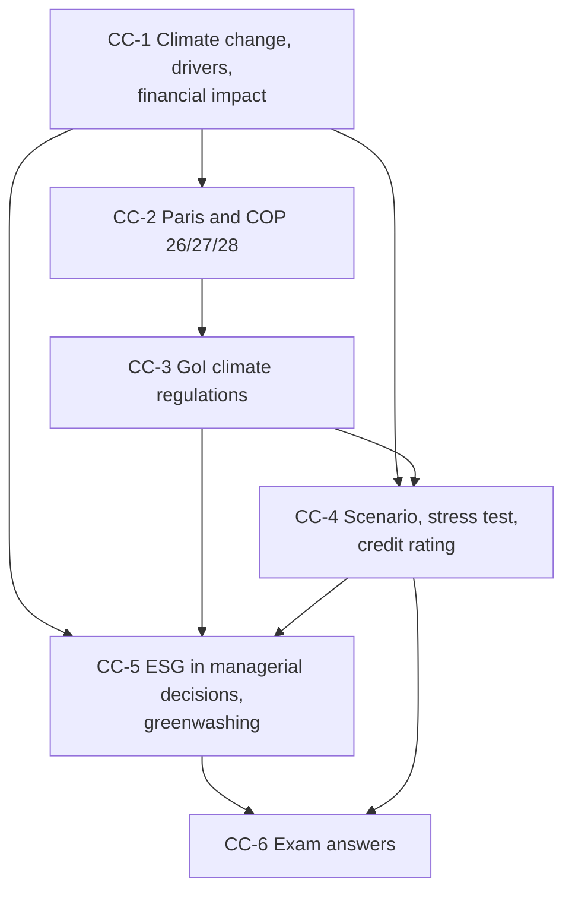

# Sustainable Finance Unit 2: Climate Change and ESG in Decisions, node map

ESE: 50 marks, 3 of 5 × 5, 2 of 3 × 10, one compulsory 15-mark case. Unit 2 is mostly theory plus small sums (P&L bridge, carbon cost, interest cover, expected loss, NPV). The faculty deck is the source of truth; examples with numbers are **illustrative**; items marked [VERIFY] need a check. Slide repeats of Unit 1 material (climate finance sources, financial-system roles, ESG risk cycle) are linked, not duplicated.

## Nodes

| Node | Topic | Deps | Minutes | Exam focus |
|---|---|---|---|---|
| CC-1 | Climate Change, Drivers and Impact on Corporate Financial Performance | none | 35 | yes |
| CC-2 | Paris Agreement and COP 26/27/28 | CC-1 | 30 | yes |
| CC-3 | Government of India Climate Regulations | CC-2 | 35 | yes |
| CC-4 | Scenario Analysis, Stress Testing and Credit Ratings | CC-1, CC-3 | 30 | yes |
| CC-5 | ESG in Managerial Decisions and Greenwashing | CC-1, CC-3, CC-4 | 30 | yes |
| CC-6 | Unit 2 Exam Answers | CC-1 to CC-5 | 25 | yes |

Total reading time: about 185 minutes.

## Dependency graph

## Headline numbers and facts to know

- Aarav Fabrics flood: EBITDA ₹200 → ₹183.56 crore; PAT ₹64.50 → ₹52.17 crore (-19.1%).
- NDC practice: index 70 to 55 in 10 years needs -2.38% a year.
- Rathnam Alloys CCTS: shortfall 1,00,000 t; buy ₹10 crore vs abate ₹6 crore, abate and save ₹4 crore.
- Siddhi Cements: interest cover 4.00x to 3.33x at ₹2,000 a tonne; bank loan EL ₹4.00 → ₹13.75 crore.
- Anaya Packaging solar: NPV ₹3.52 crore at 10%, payback 4.55 years.
- Sagar Steel case: EBITDA ₹280 → ₹218.56 crore; interest cover 4.00x → 3.12x.
- Faculty facts: Paris below 2°C, preferably 1.5°C; Loss and Damage Fund (COP27); renewables x3 by 2030 (COP28); Panchamrit 500 GW and Net Zero 2070.

## Links
- [[Sustainable Finance MOC]]
