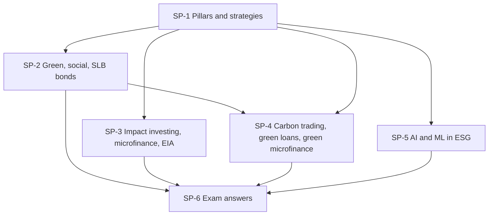

# Sustainable Finance Unit 3: Products, node map

ESE: 50 marks, 3 × 5, 2 × 10, one 15-mark case. Unit 3 follows the faculty deck: pillars, labelled bonds, climate finance and carbon markets, green loans, impact investing, EIA, AI and ML. Examples are **illustrative** unless they are the faculty's own; regulatory thresholds carry [VERIFY]. A short Cambridge lens (Cambridge Centre for Risk Studies, 2019) sits in each node.

## Nodes

| Node | Topic | Deps | Minutes | Exam focus |
|---|---|---|---|---|
| SP-1 | Strategies and Pillars of Sustainable Finance | none | 25 | yes |
| SP-2 | Green, Social and Sustainability-Linked Bonds | SP-1 | 40 | yes |
| SP-3 | Impact Investing, Microfinance and EIA | SP-1 | 45 | yes |
| SP-4 | Carbon Trading, Green Loans and Green Microfinance | SP-1, SP-2 | 45 | yes |
| SP-5 | AI and ML in Sustainable Finance | SP-1 | 25 | no |
| SP-6 | Unit 3 Exam Answers | SP-1 to SP-5 | 30 | yes |

Total reading time: about 210 minutes.

## Dependency graph

## Headline numbers and facts to know

- Four pillars: Environmental, Social, Governance, Economic.
- Green = where the money goes; social = who benefits; SLB = what the issuer achieves. Four SLB elements: KPI, SPT, trigger event, financial consequence.
- SLB step-up: 0.50% on ₹1,000 crore = ₹5 crore a year; 25 bps = ₹2.5 crore a year.
- Cheap ambition: 10% target against an 8% regulatory path adds 2 points.
- ICMA GBP: use of proceeds, project evaluation and selection, management of proceeds, reporting.
- Carbon: 1 credit = 1 tCO2e; 10,000 → 7,000 t = 3,000 credits × ₹800 = ₹24,00,000.
- EIA: nine steps; Category A (MoEFCC, no screening), Category B (SEIAA; B1 EIA, B2 no EIA).
- Promise-vs-actual: should be 88, reported 97, 25% of required cut delivered.

## Links
- [[Sustainable Finance MOC]]
