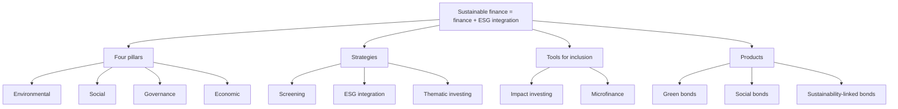

# SP-1 — Strategies and Pillars of Sustainable Finance

Covers: the faculty's definition, objective and scope of sustainable finance, its four pillars (E, S, G, Economic), the three strategies on the takeaway slide, the product map for Unit 3, and a Cambridge risk lens. Tags: **(class)** is the faculty deck, **(class notes)** is your notebook, **(general)** fills a gap.

## Where this fits

ESE is 50 marks: 3 of 5 × 5, 2 of 3 × 10, one compulsory 15-mark case. SP-1 is the opening slide set of Unit 3. A 5-mark "pillars of sustainable finance" or "overview and products" is likely. Every other SP node hangs off the product map below.

## Overview (class)

| Item | Faculty wording |
|---|---|
| **Definition** | Integration of environmental, social and governance (ESG) factors into financial decision-making |
| **Objective** | Align capital flows with the sustainable development goals (SDGs) |
| **Scope** | Investment, lending, insurance and risk management practices that promote sustainability |
| **Importance** | Addresses climate change, social inequality and long-term economic resilience |

One-line takeaway **(class)**: sustainable finance = finance + ESG integration.

## The four pillars (class)

| Pillar | Content on the slide |
|---|---|
| **Environmental** | Climate action, biodiversity, pollution reduction |
| **Social** | Human rights, labour standards, community development |
| **Governance** | Transparency, accountability, ethical corporate practices |
| **Economic** | Long-term value creation and financial stability |

The faculty has **four** pillars: E, S, G and Economic. Your notebook splits the subject by the ESG letter alone. Both are given below; in the exam lead with the faculty four.

**(class notes)** Finance-type view of E, S and G:
- **Green finance (E):** capital for climate and environmental solutions, or divestment from firms that worsen the climate crisis.
- **Social finance (S):** finance deployed intentionally for social impact (health, education, employment); impact investing is its evolution.
- **Governance finance (G):** investing in firms that follow international employee-welfare standards or build purpose into strategy.
- **Climate finance** has two directions: **mitigation finance** (cut emissions) and **adaptation finance** (help communities cope with climate impacts).

**Your note has "Migration Finance"; correct is "Mitigation Finance", because it is the cut-emissions side of climate finance.**

## Strategies and tools (class)

The takeaway slide lists:
- **Strategies:** screening, ESG integration, thematic investing.
- **Tools for inclusion:** impact investing, microfinance.
- **Products:** green bonds, social bonds, sustainability-linked bonds.

| Strategy | Meaning (general) | Example (general) |
|---|---|---|
| **Screening** | Filter the investable list by ESG criteria, excluding or ranking firms | Exclude thermal coal; keep the highest ESG scorer in a sector |
| **ESG integration** | Add ESG factors to ordinary financial analysis and valuation | Adjust cash flows for expected carbon-cost exposure |
| **Thematic investing** | Invest in a sustainability theme | Clean energy or water funds |

The faculty names three; fuller lists (seven strategies in the GSIA classification) exist in textbooks, so use the three above unless the question asks for more. [VERIFY] before quoting the longer list.

## Unit 3 product map (class)

| Slide topic | Where in these notes |
|---|---|
| Green, social, sustainability-linked and sustainability bonds | SP-2 |
| Impact investing, microfinance, EIA | SP-3 |
| Climate finance, carbon credits and trading, green loans, green microfinance | SP-4 |
| AI and ML in ESG analysis | SP-5 |
| Exam answers | SP-6 |

## Cambridge lens

Cambridge Centre for Risk Studies (2019) groups business risks into six classes: Financial, Geopolitical, Technology, Environmental, Social, Governance (6 classes, 37 families, 175 risk types). The faculty's E, S, G pillars line up with three of the six classes. The Economic pillar lines up with the Financial class. This mapping is our reading of the framework, for context only; the faculty four-pillar list remains the exam answer.

| Faculty pillar | Nearest Cambridge class |
|---|---|
| Environmental | Environmental (Climate Change, Environmental Degradation) |
| Social | Social (Socioeconomic Trends, Human Capital, Brand Perception) |
| Governance | Governance (Non-Compliance, Litigation, Management Performance) |
| Economic | Financial (Economic Outlook, Company Outlook) |

## Exam skeleton (5 marks): "Explain the pillars of sustainable finance"

1. Definition: integration of ESG factors into financial decisions; objective: align capital with SDGs (1 mark).
2. Four pillars with the slide wording (2 marks).
3. Strategies: screening, ESG integration, thematic; tools: impact investing, microfinance (1 mark).
4. Products: green, social, sustainability-linked bonds (1 mark).

## What to remember

- Definition: integrating ESG into financial decisions; objective: align capital flows with the SDGs.
- Four pillars **(class)**: Environmental, Social, Governance, Economic.
- Strategies: screening, ESG integration, thematic investing. Tools for inclusion: impact investing, microfinance.
- Products: green, social and sustainability-linked bonds.
- Climate finance = mitigation (cut emissions) + adaptation (cope with impacts); your note's "Migration" is a slip.

## Concept map

## Flashcards

Q: Define sustainable finance as in the faculty deck.
A: Integration of environmental, social and governance (ESG) factors into financial decision-making.

Q: What is the objective of sustainable finance?
A: To align capital flows with the sustainable development goals (SDGs).

Q: What is the scope of sustainable finance?
A: Investment, lending, insurance and risk management practices that promote sustainability.

Q: Name the four pillars on the faculty slide with one theme each.
A: Environmental (climate action, biodiversity, pollution); Social (human rights, labour standards, community development); Governance (transparency, accountability, ethics); Economic (long-term value creation, financial stability).

Q: Which strategies does the takeaway slide list?
A: Screening, ESG integration and thematic investing.

Q: Which two tools support inclusion?
A: Impact investing and microfinance.

Q: Your notebook says "Migration Finance". Correct term?
A: Mitigation finance: funding that cuts emissions. The pair is mitigation and adaptation finance.

Q: Which Cambridge risk class lines up with the Economic pillar?
A: Financial (Cambridge Centre for Risk Studies, 2019); this is a context mapping, not the faculty answer.

## Sources
- Faculty deck, BBA304F-5 Unit 3, slides 156-160, 185
- Student class notes (Sustainable Finance); Cambridge Centre for Risk Studies (2019), Cambridge Taxonomy of Business Risks
- Next node: [[Sustainable Finance Unit 3 - SP-2 Green Social and Sustainability-Linked Bonds]]
- [[Sustainable Finance Unit 3 - Products MOC (Node Map)]]
