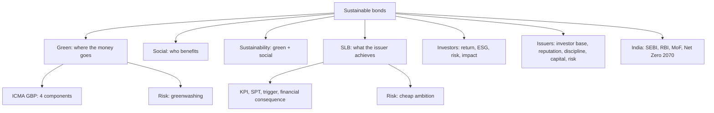

# SP-2 — Green, Social and Sustainability-Linked Bonds

Covers: green, social, sustainability and sustainability-linked bonds, the Company A/B/C story, the faculty comparison table, Green Bond vs SLB, the four SLB elements, why investors buy and companies issue, greenwashing and "cheap ambition", India, the "4-Bond Framework", and ICMA Green Bond Principles. Tags: **(class)** is the faculty deck, **(general)** fills a gap.

See also: [[Bond Market Unit 5 - FB-1 Green and Sustainability-Linked Bonds]] for the greenium example and SEBI framework in more depth.

## Where this fits

Very likely 5-mark ("distinguish green bond and SLB") or part of a 10-marker ("labelled bonds, their features and risks"). The 15-mark case often asks which instrument a firm should issue. The faculty's slogan to memorise: **Green = where the money goes. Social = who benefits. SLB = what the issuer achieves.**

## Green bond (class)

A **green bond** is a debt instrument through which an organisation raises money to **finance or refinance environmentally beneficial projects**. The issuer repays principal and interest (coupon) as for any bond, with one extra requirement: **the funds must go to eligible green projects.**

**Faculty example:** an Indian company builds a solar power project costing ₹1,000 crore. It issues ₹1,000 crore of green bonds and uses the proceeds for solar plants, energy-efficient equipment, battery storage, green buildings and clean transportation. Investors receive interest as they would from a normal bond.

| Area | Typical green bond projects (class) |
|---|---|
| Renewable energy | Solar, wind, hydro |
| Clean transportation | EVs, metro, electric buses |
| Energy efficiency | Efficient industrial equipment |
| Green buildings | Energy-efficient buildings |
| Waste management | Recycling, waste-to-energy |
| Water | Water conservation, wastewater treatment |
| Sustainable agriculture | Sustainable farming |
| Climate adaptation | Flood-resilient infrastructure |
| Biodiversity | Conservation projects |

## Social bond (class)

A **social bond** is a debt instrument whose proceeds finance or refinance projects with **positive social outcomes**, particularly for vulnerable or underserved populations. Green bonds address environmental problems; social bonds address social problems.

Uses: affordable housing, healthcare, education, employment generation, food security, financial inclusion, basic infrastructure, support for economically disadvantaged communities, MSME financing, women entrepreneurship, community development.

**Faculty example:** a financial institution raises ₹500 crore of social bonds to give affordable housing loans to low-income households. Investors earn interest and the financing creates measurable social benefit.

**Impact indicators (class):** number of affordable houses built, people receiving healthcare, students benefiting, jobs created, women entrepreneurs financed, low-income households reached. Key principle: **social bonds = capital + social impact.**

## Sustainability-linked bond, SLB (class)

The faculty warns that students confuse this with green and social bonds. In an SLB the proceeds **need not** go to a specific green or social project. Instead the **bond's financial characteristics are linked to the issuer's achievement of predefined sustainability targets.**

**Faculty example:** a steel company issues ₹1,000 crore of SLBs with a target to cut greenhouse-gas emissions intensity by 30% by 2030. If it achieves the target, the coupon stays normal. If it fails, the coupon increases by, say, 0.50%.

### The four SLB elements (class)

1. **KPI (Key Performance Indicator):** something measurable. Examples: CO2 emissions, energy consumption, renewable energy percentage, water consumption, waste recycling, gender diversity, occupational safety.
2. **SPT (Sustainability Performance Target):** the specific target, for example reduce Scope 1 and 2 emissions intensity by 40% by 2030.
3. **Trigger event:** what happens if the target is missed, for example the coupon rises by 25 basis points.
4. **Financial consequence:** higher interest/coupon and so higher financing cost, which creates an economic incentive for sustainability performance.

Background (general): ICMA's Sustainability-Linked Bond Principles add reporting and independent verification as further components. Faculty list is the four above.

### Worked example: SLB step-up (faculty figures; coupon and tenor illustrative)

Steel company issues ₹1,000 crore SLBs. Faculty step-up: 0.50% on a miss. Assume a base coupon of 8% and a three-year period at the higher rate (assumed, not given; state the assumption in the exam).

1. Base coupon = 8% × 1,000 = ₹80 crore a year.
2. Step-up = 0.50% × 1,000 = **₹5 crore a year**.
3. Coupon after a miss = 8.50% × 1,000 = ₹85 crore a year.
4. Over three years the extra cost = 5 × 3 = **₹15 crore**.
5. With the faculty's 25 bps trigger instead: 0.25% × 1,000 = ₹2.5 crore a year; three years = ₹7.5 crore.

| Outcome | Coupon | Annual interest (₹ crore) | Three-year extra (₹ crore) |
|---|---|---|---|
| Target met | 8.00% | 80 | 0 |
| Missed, +25 bps | 8.25% | 82.5 | 7.5 |
| Missed, +50 bps | 8.50% | 85 | 15 |

Decision line: a miss costs ₹5 crore a year (0.50% step-up), 6.25% more interest than the ₹80 crore base (5 ÷ 80). Interpretation: management feels a real cost, so the target gets attention. The incentive only works if the SPT is ambitious (see "cheap ambition" below); a tiny step-up on an easy target adds little.

## Company A, B, C: the big difference (class)

Each company raises ₹1,000 crore.

| Company | Purpose | Instrument | What matters |
|---|---|---|---|
| A | Build a solar power plant | Green bond | Where the money goes |
| B | Affordable housing for low-income families | Social bond | Who benefits |
| C | General corporate purposes, but commits to cut carbon emissions by 30% | Sustainability-linked bond | Whether the target is achieved |

## Faculty comparison table (slide 171)

| Feature | Green bond | Social bond | Sustainability-linked bond |
|---|---|---|---|
| Primary purpose | Environmental projects | Social projects | Improve sustainability performance |
| Proceeds restricted? | Yes | Yes | Generally, no |
| Project-specific? | Usually | Usually | Not necessarily |
| Sustainability target | Project impact | Social impact | Issuer-level KPI/target |
| Coupon linked to performance? | Usually no | Usually no | Yes, potentially |
| Example | Solar plant | Affordable housing | Carbon reduction target |
| Main question | "Where is the money spent?" | "Who benefits?" | "Did the company achieve its target?" |

## Green bond vs SLB: the most important distinction (class)

- **Green bond:** the use of funds is the central issue. "I promise to use your ₹100 crore to finance eligible green projects." **Project-based.**
- **SLB:** the issuer's performance is the central issue. "I can use the ₹100 crore for general purposes, but I promise to achieve this sustainability target." **Performance-based.**

## Sustainability bond and the 4-Bond Framework (class)

A **sustainability bond** combines green and social: proceeds finance eligible environmental and social projects.

| Instrument | Money | Impact |
|---|---|---|
| Green bond | Green projects | Environmental |
| Social bond | Social projects | Social |
| Sustainability bond | Green + social projects | Environmental + social |
| Sustainability-linked bond | Flexible/general use | Linked to sustainability performance |

**City story (class):** a city needs ₹1,000 crore. Solar power plant: green bond. Affordable housing for economically weaker sections: social bond. General financing with a promise to cut municipal carbon emissions by 40% by 2030, with a higher borrowing cost on failure: SLB.

**Bonds and ESG (class):** green bonds are mainly E; social bonds mainly S; SLBs can address E, S and G (carbon emissions is E, gender diversity is S, board sustainability objectives is G).

## Why investors buy, why companies issue (class)

| Investors buy for | Detail |
|---|---|
| **Financial return** | Interest income, principal repayment, risk-adjusted returns |
| **ESG objectives** | Institutions want portfolios to reflect ESG goals |
| **Risk management** | Environmental and social issues affect revenue, costs, regulation, reputation, asset values, creditworthiness |
| **Impact** | Measurable environmental or social outcomes |

Companies issue for: (1) **access to a broader investor base**; (2) **reputation**; (3) **strategic discipline** (SLBs force measurable targets); (4) **capital mobilisation** towards sustainability; (5) **risk management** (sustainability linked to financial decisions).

## Greenwashing and cheap ambition (class)

**Greenwashing:** a company advertises itself as "green" without delivering meaningful environmental benefit. Faculty example: a company issues a ₹2,000 crore "green" bond but picks projects with weak environmental benefit or reports poorly.

**How investors protect themselves (class):** examine use of proceeds, eligibility criteria, external review, impact reporting, transparency, verification, KPIs, sustainability targets, materiality, governance.

**The SLB weakness: "cheap ambition" (class).** Target: cut emissions by 10% over five years. But regulation already implies an 8% cut. The additional effort is 10 − 8 = **2 percentage points**, only 20% of the headline target (2 ÷ 10). The bond looks sustainable without producing much extra impact, so the **materiality and ambition of KPIs and SPTs are critical.**

## India (class) and ICMA principles

**Indian context (class):** the ecosystem involves SEBI, RBI, the Ministry of Finance, stock exchanges, banks and financial institutions, corporate issuers and institutional investors. SEBI's framework for green debt securities is central to India's green bond market. Link: Net Zero 2070, renewable energy, energy transition, green infrastructure, sustainable finance. The faculty deck shows SEBI's ESG Debt Securities statistics page (green bond issuances as on 31/07/2026) [VERIFY current data on sebi.gov.in].

**Faculty slide 213:** green bonds are "certified under ICMA Green Bond Principles" and "India issued $1B sovereign green bonds in 2023". Write these as the class answer if asked, with one line of background: ICMA's principles are voluntary guidelines, so safer wording is "aligned with the ICMA GBP", and India's first sovereign green bond auctions in early 2023 were sized in rupees (₹16,000 crore) [VERIFY]. Your faculty deck, not the background, is what your answer should lead with.

### ICMA Green Bond Principles (class, slides 214-221)

Four components:
1. **Use of proceeds.** Eligible Green Project categories (listed in no specific order, not limited to): renewable energy; energy efficiency; pollution prevention and control; environmentally sustainable management of living natural resources and land use; clean transportation; sustainable water and wastewater management; climate change adaptation; circular-economy adapted products, production technologies and processes; green buildings meeting recognised standards. That is **nine categories**.
2. **Process for project evaluation and selection.** The issuer tells investors the environmental objectives, how projects fit the eligible categories, and how it identifies and manages social and environmental risks of the projects.
3. **Management of proceeds.** Net proceeds (or an equal amount) go to a **sub-account or sub-portfolio**, tracked and attested by the issuer in a formal internal process.
4. **Reporting.** Up-to-date information on use of proceeds, **renewed annually until fully allocated**, and promptly after material developments.

Purpose (class): GBP-aligned issuance gives transparent green credentials alongside an investment and tracks funds to environmental projects.

## Cambridge lens

Source: Cambridge Centre for Risk Studies (2019), Cambridge Taxonomy of Business Risks. Mapping is our application, to add one line to a 10 or 15-mark answer, never to replace the faculty content.

| Instrument or problem | Cambridge risk it helps with | Class |
|---|---|---|
| Green bond | Climate Change family (Transition risk, Lower Carbon Economy); Environmental Degradation | Environmental |
| Social bond | Socioeconomic Trends (wealth inequality, poor educational standards); Health Trends | Social |
| SLB | Strategic Performance and Management Performance; Non-Compliance (emerging regulation) | Governance |
| Issuer cost of capital | Company Outlook (credit rating downgrade, investor negative outlook) | Financial |
| Greenwashing | Brand Perception (negative media coverage); Litigation (class action) | Social, Governance |

## Exam skeleton (5 marks): "Differentiate green bonds and sustainability-linked bonds"

1. Definition of each (green: use of proceeds; SLB: performance-linked terms) (1 mark).
2. Comparison table using the faculty rows (2 marks).
3. Examples: ₹1,000 crore solar plant vs steel firm cutting emissions intensity 30% by 2030 with a 0.50% step-up (1 mark).
4. Closing line: green = project-based, SLB = performance-based; one risk each (greenwashing, cheap ambition) (1 mark).

## What to remember

- Green = where the money goes; social = who benefits; SLB = what the issuer achieves. Sustainability bond = green + social.
- SLB four elements: KPI, SPT, trigger event, financial consequence.
- Green bond = project-based; SLB = performance-based. Coupon linked to performance: green/social usually no, SLB potentially yes.
- Risks: greenwashing (green bonds), cheap ambition (SLBs: 10% target against an 8% regulatory path adds only 2 points).
- ICMA GBP: use of proceeds, project evaluation and selection, management of proceeds, reporting. Say "aligned with" ICMA.
- Step-up: 0.50% on ₹1,000 crore = ₹5 crore a year; 25 bps = ₹2.5 crore a year.

## Concept map

## Flashcards

Q: Define a green bond in the faculty's words.
A: A debt instrument through which an organisation raises money to finance or refinance environmentally beneficial projects; funds must go to eligible green projects.

Q: What is a social bond?
A: A debt instrument whose proceeds finance projects with positive social outcomes, particularly for vulnerable or underserved populations. Capital plus social impact.

Q: How is an SLB different from a green bond?
A: SLB proceeds need not fund a specific project; its financial terms (coupon) depend on the issuer meeting predefined sustainability targets. Green is project-based, SLB is performance-based.

Q: Name the four elements of an SLB.
A: KPI, SPT (sustainability performance target), trigger event, financial consequence.

Q: Steel firm, ₹1,000 crore SLB, coupon rises 0.50% on a miss. Extra interest per year?
A: 0.50% × 1,000 = ₹5 crore a year.

Q: Give the Company A, B and C story.
A: A: ₹1,000 crore for a solar plant, green bond. B: ₹1,000 crore for affordable housing, social bond. C: ₹1,000 crore general purposes with a 30% emissions cut commitment, SLB.

Q: What does a sustainability bond combine?
A: Green and social: proceeds finance eligible environmental and social projects.

Q: What is "cheap ambition"?
A: An SLB target that is too easy: for example a 10% cut target when regulation already implies 8%, so only 2 points are additional.

Q: How can investors guard against greenwashing?
A: Check use of proceeds, eligibility criteria, external review, impact reporting, transparency, verification, KPIs, targets, materiality and governance.

Q: List the four ICMA Green Bond Principles components.
A: Use of proceeds; process for project evaluation and selection; management of proceeds (sub-account); reporting (annual until fully allocated).

Q: Why do companies issue sustainable bonds?
A: Broader investor base, reputation, strategic discipline, capital mobilisation, risk management.

## Sources
- Faculty deck, BBA304F-5 Unit 3, slides 158, 161-185, 213-221
- ICMA, RBI background (general) [VERIFY]; Cambridge Centre for Risk Studies (2019), Cambridge Taxonomy of Business Risks
- Previous: [[Sustainable Finance Unit 3 - SP-1 Strategies and Pillars of Sustainable Finance]]; next: [[Sustainable Finance Unit 3 - SP-3 Impact Investing Microfinance and EIA]]
- [[Bond Market Unit 5 - FB-1 Green and Sustainability-Linked Bonds]]
- [[Sustainable Finance Unit 3 - Products MOC (Node Map)]]
