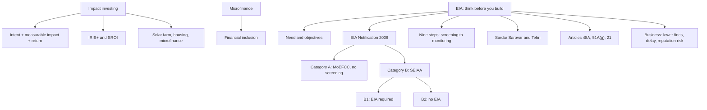

# SP-3 — Impact Investing, Microfinance and EIA

Covers: impact investing (GIIN, IRIS+, SROI), microfinance, and Environmental Impact Assessment in depth: meaning, need, objectives, basic process, EIA Notification 2006, Category A and B, two dam cases, constitutional basis, stakeholders, the nine steps, with and without EIA, and EIA for business. Tags: **(class)** is the faculty deck, **(general)** fills a gap.

## Where this fits

EIA has the longest slide run in Unit 3 (slides 226-260), so a 10-mark "explain the EIA process" or a 5-mark "Category A and B projects" is likely. The Sardar Sarovar and Tehri cases are the faculty's examples for any EIA or development-versus-environment trade-off. Impact investing is a likely 5-marker.

## Impact investing (class)

**Definition:** investments made with the **intention to generate measurable social and environmental impact alongside financial returns.**
- **Key sectors:** renewable energy, affordable housing, microfinance (slide 222); sustainable agriculture also appears on slide 224.
- **Measurement frameworks:** GIIN's **IRIS+** (Global Impact Investing Network) and **Social Return on Investment (SROI)**. IRIS+ is a system for impact investors to measure, manage and optimise impact, adding social and environmental considerations to investment decisions alongside risk and return.
- **Practical metrics:** how many tonnes of CO2 reduced? how many families housed? how many jobs created?
- **Slogan:** "Doing well by doing good: can finance solve social problems?"

**How it works in practice (class):**

| Sector | Example | Outcome |
|---|---|---|
| Renewable energy | Investor funds a solar farm | Community gets clean power; investor earns from electricity sales |
| Affordable housing | Investment in low-cost housing | Families get safe homes; investor earns rental income |
| Microfinance | Small loans to rural women entrepreneurs | Local businesses grow; investor earns interest; community thrives |

Also: a fund financing affordable solar panels in rural India (slide 224).

### Worked example: SROI (illustrative; the slides name SROI but give no formula)

Formula (general): **SROI = present value of social benefits ÷ amount invested.** An affordable-housing fund invests ₹2 crore. Estimated present value of social benefits (health savings, school attendance, rent savings) is ₹3.1 crore.

1. SROI = 3.1 ÷ 2.0 = **1.55**.
2. Each ₹1 invested creates ₹1.55 of social value.
3. The investor's financial return (for example rent) is reported separately.

Decision line: SROI above 1 means social value exceeds capital invested. Interpretation: the fund creates value, but check that benefits are attributable to the project and that the discount rate is stated. Numbers illustrative.

## Microfinance (class)

**Microfinance:** small loans and financial services to low-income individuals or communities to promote **financial inclusion and poverty reduction**. With impact investing it is a **tool for inclusion** (SP-1). Microfinance institutions (MFIs) deliver it; the green version (green loans for solar lanterns, biogas) is in SP-4. Background (general): self-help groups and NBFC-MFIs are the common Indian channels; over-indebtedness is the main risk.

## Environmental Impact Assessment (EIA)

### Meaning (class)

An **EIA** evaluates the likely ecological impacts of a proposed project or development, considering inter-related **socio-economic, cultural and human-health impacts, both beneficial and adverse.** It is the formal process used to **predict the environmental consequences (positive or negative) of a plan, policy, programme or project before deciding whether to proceed.**

**UNEP definition (class):** a tool used to identify a project's environmental, social and economic impacts prior to decision-making.

**Simple version (class):** EIA = study the possible damage, find solutions, decide whether the project should proceed. Faculty slogan: **"Think before you build."**

**Your note has "Fin solutions"; read it as "find solutions" (mitigation), not financial solutions.**

### Why we need EIA (class)

A company wants a large factory near a river. **Without EIA:** factory, pollution, river contamination, damage to agriculture and health. **With EIA:** study impacts, identify risks, take preventive measures, a better project. Questions asked: will it pollute air or water? will trees be cut? what happens to local communities? can the project be made greener?

### Objectives (class)

Protect the environment; reduce pollution; protect biodiversity; protect human health; identify environmental risks early; promote sustainable development; support informed decision-making.

### The basic process (class, slide 233 flowchart)

Proposal identification, then **screening**. Screening has three exits: **no EIA required**, **Initial Environmental Examination (IEE)**, or **EIA required**. Then scoping, impact analysis, mitigation, review, final EIS (environmental impact statement), record of decision. **Public involvement** usually comes at scoping and at review, and a **feedback loop** runs from review back to impact analysis.

### The nine steps (class, slides 246-257)

| # | Step | Question or content | Example from the slides |
|---|---|---|---|
| 1 | **Screening** | "Does this project need a detailed EIA?" Check size, industry type, location, sensitivity of area, risks | Small office: limited impact. Large mining project: detailed assessment |
| 2 | **Scoping** | "What exactly should we study?" Fix the important issues | Highway: air, noise, trees, wildlife, water, land acquisition, communities |
| 3 | **Baseline study** | Collect existing conditions: air, water, soil, forests, wildlife, people, noise | River already at pollution level X; future impact compared with X |
| 4 | **Impact prediction** | "What could happen if the project goes ahead?" | Air: emissions; water: pollution; soil: degradation; forest: vegetation loss; wildlife: habitat disturbance; noise; climate: GHG; society: displacement |
| 5 | **Mitigation measures** | Actions to reduce or prevent negative impacts | Air pollution: control equipment. Wastewater: effluent treatment plant. Tree loss: compensatory plantation or green belt. High energy use: efficient technology plus renewables |
| 6 | **EIA report** | Project description, existing conditions, impacts, risk assessment, mitigation, Environmental Management Plan, monitoring, consultation outcomes | |
| 7 | **Public consultation** | Residents, farmers, community groups, NGOs, local authorities can voice views: water? farmland? jobs? pollution? | Local people often know the area best |
| 8 | **Decision / environmental clearance** | Approved, approved with conditions, or rejected (impacts unacceptable or cannot be mitigated) | |
| 9 | **Monitoring** | EIA does not end at permission: air emissions, water quality, waste, noise, biodiversity, compliance. Before: assess. During: monitor. After: review and correct | |

Faculty's own slide 260 infographic uses the same chain with names *screening, scoping, data collection (baseline), impact prediction, mitigation, reporting, public consultation, monitoring*. **Note on your earlier six-step list** (screening, scoping, baseline, impact identification, assessment, mitigation): it is a shorter version. In the exam write the faculty nine.

### EIA Notification 2006: Category A and B (class)

The notification (issued under the Environment Protection Act 1986, general [VERIFY]) classes projects by impact potential into **Category A** and **Category B**.

| | Category A | Category B |
|---|---|---|
| Size and impact | Large-scale; significant, widespread impacts | Smaller; localised impacts |
| Approval by | Central Government through MoEFCC, on advice of the Expert Appraisal Committee (EAC) | State level: SEIAA on advice of the SEAC |
| Screening | **Not required**; goes directly to scoping, since significance is already established | **Required**; sorts into B1 and B2 |
| Sub-types | None | **B1**: a full EIA is required. **B2**: no detailed EIA, exempted by nature and location |

**Category A examples (class, thresholds as on slide; [VERIFY] against the current schedule):** nuclear power plants of all capacities; thermal power plants of 500 MW and above; major ports and harbours; airports with runways of 2,500 m or more; highway projects exceeding 100 km that involve forest land; mining with a lease area of 500 hectares or more; river valley projects; primary metallurgical industries (iron, steel, copper); petrochemical complexes.

**Category B examples (class):** industrial estates (25-500 hectares); thermal power plants of 25 to 500 MW; smaller mining; building and construction of 20,000 sq m built-up area or more; townships of 50 hectares and above.

**Slide inconsistency to handle.** Slide 242 says B1 projects go through "all four stages: screening, scoping, public consultation and appraisal, just like Category A", yet slides 235 and 245 say Category A skips screening. Exam answer: **Category A goes scoping, public consultation, appraisal; Category B1 goes screening first and then the same stages.**

The faculty deck also shows a generic three-category chart (slide 229): Category I (DIA, less negative impact), Category II (EIA semi-detailed, moderate impact) and Category III (EIA, significant impact). This is a generic international scheme and its labels differ from the Indian A/B/B1/B2 system. Use the Indian notification in an India question [VERIFY the label "DIA" with your faculty].

### Worked example: classify the project (exam layout; thresholds from the slides)

Three proposals. Classify and state the route.

1. **600 MW thermal power plant.** At 500 MW or above the faculty places it in Category A. No screening; goes to scoping; MoEFCC clears on EAC advice.
2. **300 MW thermal power plant.** Between 25 and 500 MW, so Category B. Screening decides: B1 (full EIA) or B2 (no detailed EIA). SEIAA clears on SEAC advice.
3. **Residential complex of 25,000 sq m built-up area.** At 20,000 sq m or more, Category B; screening again decides B1 or B2.

| Project | Category | Screening? | Authority |
|---|---|---|---|
| 600 MW thermal | A | No | MoEFCC with EAC |
| 300 MW thermal | B | Yes (B1 or B2) | SEIAA with SEAC |
| 25,000 sq m building | B | Yes (B1 or B2) | SEIAA with SEAC |

Decision line: A is decided by the schedule, B by screening. Interpretation: a lender or investor should ask for the clearance letter and its conditions at due diligence, because a project built without the right clearance can face delay, penalty or closure (see EIA and business).

### Case: Sardar Sarovar (Narmada) Project (class)

| Heading | Class content |
|---|---|
| **Purpose** | Irrigation, drinking water, hydroelectric power, flood control |
| **Positive impacts** | Improved water supply, agricultural development, electricity, regional development |
| **Negative environmental impacts** | Submergence of forests and farmland; loss of biodiversity; changed river ecology; risk of soil salinity and waterlogging |
| **Social impacts** | Displacement of villages and tribal communities; loss of livelihoods |
| **Mitigation** | Resettlement and rehabilitation, compensatory afforestation, catchment-area treatment, environmental monitoring |
| **Conclusion** | Significant development benefits, but needs strong environmental protection and proper rehabilitation |

**Your note has "soil sanity"; correct is "soil salinity"** (salt build-up in irrigated soil). Dates and court rulings are not in the slides: leave them out or mark [VERIFY].

### Case: Tehri Dam (class, figures from slides 238-240 [VERIFY]; do not add numbers to an answer unless asked)

- **Overview:** Tehri Garhwal district, Uttarakhand; on the Bhagirathi River (a Ganga tributary); height 260.5 m (India's tallest dam); reservoir about 3,540 million cubic metres; commissioned 2006; managed by THDC India Limited.
- **Positives:** 1,000 MW underground powerhouse plus Koteshwar (400 MW) and pumped storage (1,000 MW); irrigation for 2.7 lakh hectares new and 6.04 lakh hectares stabilised; drinking water to about 4 million people in Delhi and about 3 million in Uttar Pradesh and Uttarakhand; a flood control pool; 95% sediment trap efficiency designed for 150 years.
- **Negatives:** seismic risk in a highly earthquake-prone Himalayan zone; over 100,000 people displaced with delayed, criticised rehabilitation; submergence of forests and loss of biodiversity; cultural loss (historic Tehri town); stagnant water risking eutrophication and reduced downstream flow affecting Ganga ecology.

Two dams, one pattern: **benefits wide and national, costs concentrated on local communities and ecosystems.** Mitigation, rehabilitation and monitoring decide whether the trade-off is acceptable.

### Constitutional foundations (class)

- **Article 48A:** the State shall protect and improve the environment and safeguard forests and wildlife (directive principle).
- **Article 51A(g):** fundamental duty of every citizen to protect the natural environment.
- **Article 21:** right to life, held through judicial interpretation to include the right to a clean and healthy environment.

### Stakeholders (class)

The project proponent; the environmental consultant who prepares the EIA for the proponent; the Pollution Control Board (State or National); the public, who have the right to express opinion; the Impact Assessment Agency; the regional centre of the MoEFCC.

### With and without EIA (class)

| Without proper EIA | With EIA |
|---|---|
| Risks may be ignored | Risks identified early |
| Pollution may increase | Pollution-control measures planned |
| Community concerns overlooked | Public consultation |
| Environmental costs appear later | Costs considered before implementation |
| Possible legal conflicts | Better regulatory compliance |
| Reactive approach | Preventive approach |

### EIA and business (class)

Poor environmental management leads to fines and penalties, project delays, higher operating costs, reputation damage, community opposition, investor concerns, loss of market opportunities and ESG risks. A good EIA helps a business reduce risk, improve reputation, improve sustainability and protect long-term value. This is why lenders care about EIA in sustainable finance.

## Cambridge lens

Source: Cambridge Centre for Risk Studies (2019). Our mapping, for one line in a case answer.

| EIA concern | Cambridge family or type | Class |
|---|---|---|
| Pollution, biodiversity loss, deforestation, soil degradation | Environmental Degradation | Environmental |
| Dam in earthquake zone (Tehri) | Geophysical: Earthquake | Environmental |
| Pollution or structural failure at the plant | Industrial Accident | Technology |
| Breach of clearance conditions, fines | Non-Compliance (emerging regulation); Litigation | Governance |
| Licence cancelled | Government Business Policy: License Revocation | Geopolitical |
| Community opposition, bad press | Brand Perception (negative media coverage) | Social |

EIA is a preventive control that lowers the likelihood of these risks before capital is committed.

## Exam skeleton (10 marks): "Explain the EIA process and its relevance to sustainable finance"

1. Definition (predict consequences before deciding) and UNEP line; objectives in one line (2 marks).
2. Nine steps in a table with one phrase each (4 marks).
3. EIA Notification 2006: Category A (no screening, MoEFCC) and B (B1, B2; SEIAA), with two examples each (2 marks).
4. Example (Sardar Sarovar or Tehri): benefits, costs, mitigation; link to business and lenders (2 marks).

## What to remember

- Impact investing = intent for measurable social and environmental impact plus financial return; measured by IRIS+ and SROI.
- EIA = predict environmental, social and economic consequences before deciding; "think before you build".
- Nine steps: screening, scoping, baseline, impact prediction, mitigation, EIA report, public consultation, decision/clearance, monitoring.
- Category A: central clearance via MoEFCC and EAC, no screening. Category B: state SEIAA and SEAC; B1 needs EIA, B2 does not.
- Dams: wide benefits (water, power), concentrated costs (displacement, ecology); mitigation is R&R, afforestation, catchment treatment, monitoring.
- Article 48A, 51A(g) and 21 give the constitutional basis.

## Concept map

## Flashcards

Q: Define impact investing as in the faculty deck.
A: Investments made with the intention to generate measurable social and environmental impact alongside financial returns.

Q: Which tools measure impact investing?
A: GIIN's IRIS+ and Social Return on Investment (SROI).

Q: SROI of ₹2 crore invested with ₹3.1 crore present value of social benefits?
A: 3.1 ÷ 2.0 = 1.55; each ₹1 creates ₹1.55 of social value (illustrative).

Q: Define EIA.
A: A process to evaluate the likely environmental effects of a proposed project, including socio-economic, cultural and health impacts, before deciding whether to proceed.

Q: List the nine EIA steps.
A: Screening, scoping, baseline study, impact prediction, mitigation measures, EIA report, public consultation, decision/environmental clearance, monitoring.

Q: What does your note's "Fin solutions" mean?
A: "Find solutions", meaning mitigation, not financial solutions.

Q: Category A vs Category B under EIA Notification 2006?
A: A: large, significant impact, central clearance through MoEFCC on EAC advice, no screening, straight to scoping. B: smaller, SEIAA on SEAC advice, screened into B1 (EIA required) and B2 (no EIA).

Q: Name three Category A examples.
A: Nuclear power plants, thermal power plants of 500 MW and above, river valley projects (also major ports, mining of 500 hectares or more, petrochemical complexes).

Q: Sardar Sarovar: benefits, costs, mitigation?
A: Benefits: irrigation, drinking water, power, flood control. Costs: submergence of forests and farmland, biodiversity loss, soil salinity, displacement of villages and tribal communities. Mitigation: resettlement and rehabilitation, compensatory afforestation, catchment-area treatment, monitoring.

Q: Your note says "soil sanity". Correct term?
A: Soil salinity.

Q: Which constitutional provisions support EIA?
A: Article 48A (State to protect environment), Article 51A(g) (citizen's duty), Article 21 (right to a clean and healthy environment by judicial interpretation).

Q: Give three business risks of skipping a proper EIA.
A: Fines and penalties, project delays, reputation damage (also higher costs, community opposition, investor concern, ESG risk).

## Sources
- Faculty deck, BBA304F-5 Unit 3, slides 159, 222-260
- Student class notes (Sardar Sarovar Narmada Projects, Environmental Impact Investing); Environment Protection Act 1986 and EIA Notification 2006 (general) [VERIFY thresholds]
- Cambridge Centre for Risk Studies (2019), Cambridge Taxonomy of Business Risks
- Previous: [[Sustainable Finance Unit 3 - SP-2 Green Social and Sustainability-Linked Bonds]]; next: [[Sustainable Finance Unit 3 - SP-4 Carbon Trading Green Loans and Green Microfinance]]
- [[Sustainable Finance Unit 3 - Products MOC (Node Map)]]
