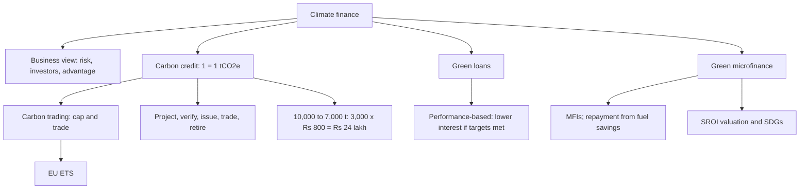

# SP-4 — Carbon Trading, Green Loans and Green Microfinance

Covers: climate finance from a business view, carbon credits, carbon trading (cap-and-trade), credit trading vs carbon trading, the faculty's 10,000 t worked example, green loans and performance-based instruments, green microfinance, and an instrument comparison. Tags: **(class)** is the faculty deck, **(general)** fills a gap. Figures not on the slides are **illustrative**.

## Where this fits

The most numerical node in Unit 3, though the faculty sums are simple. A 10-mark "explain carbon credits and carbon trading with an example" or a 5-mark "green loans and green microfinance" is likely. The 10,000 t example is the one to learn by heart.

## Climate finance and business (class)

Climate finance is "no longer just about funding green projects": it is a strategic lever for competitiveness, risk management and long-term resilience. Firms that integrate it guard against regulatory and reputational risk and open growth in sustainable markets.

**Why it matters (class):**
- **Risk management:** physical, transition and liability risks are material financial risks; capital must be allocated against extreme weather, carbon pricing and supply chain disruption.
- **Investor expectations:** ESG investors demand transparency; firms that miss net-zero pathways risk losing access to capital.
- **Competitive advantage:** early movers gain reputation, attract talent, secure partnerships with governments and multilaterals.

**Climate finance from the current business perspective (class):**

| Perspective | Implication | Example |
|---|---|---|
| Decarbonisation investment | Renewables, electrification, efficiency cut long-term cost and carbon exposure | Tech giants investing in solar-powered data centres |
| Supply chain resilience | Financing adaptation keeps supply chains running | FMCG firms funding regenerative agriculture |
| Green innovation | Funds R&D, creates new revenue | Automotive firms moving to EVs with green bonds |
| Policy alignment | Compliance and access to subsidies | Indian firms using government incentives for renewables |
| Reputation and branding | Builds brand equity and trust | Luxury brands issuing sustainability-linked loans |

**Why green finance matters now (class):** billion-dollar climate disasters have nearly doubled in five years (World Meteorological Organization, as quoted on the slide [VERIFY]); climate risk is now financial risk.

## Carbon credit (class)

- **One credit = 1 tonne of CO2 (or equivalent greenhouse gas)**, written tCO2e.
- **Earn:** a project that reduces or removes emissions (planting trees, a wind farm) earns credits.
- **Use:** polluters buy credits to balance out their emissions.
- **Trade:** credits sell in a market like stocks, giving value to climate-friendly action.
- A credit is like a "coupon" for the reduction or removal of 1 tonne of CO2.

**Slide wording to reconcile.** Slide 192 describes credits as "permits to emit"; slide 194 as proof of a "reduction or removal". Both mean 1 credit = 1 tCO2e. Background (general): the permit is an *allowance* issued under a cap; the reduction certificate is a *credit* from a verified project.

**Factory example (class):** a factory emits 10 tonnes of CO2 but is allowed only 8. It must buy **2 credits** from another company that reduced emissions (say a solar farm). Total emissions stay within the limit.

**Relationship to climate finance (class):** carbon credits are the *units* (1 credit = 1 tCO2e avoided or removed). Climate finance is the *money* that funds the projects. Finance funds projects (renewables, reforestation, carbon capture); the projects generate credits; credit sales bring returns; returns encourage more climate investment, a cycle.

**Leading players (class, slides 196-198):** Tesla (sells regulatory credits to other automakers that miss emission standards; the slide says over $10.4 billion since 2017 [VERIFY]); South Pole (voluntary carbon markets: forestry, renewables, removal projects); Climeworks (Direct Air Capture, durable removal credits); Indigo Agri (regenerative agriculture, soil carbon); Drax Group (BECCS, industrial-scale removal); Pachama (forest monitoring using AI and satellite data). Countries: EU members, China, with India and Japan emerging. Use these qualitatively; quote no money figure other than the slide's own, with [VERIFY].

**Carbon credits in business (class):**

| Aspect | Implication | Example |
|---|---|---|
| Cost control | Trade instead of reducing directly | Steel firm buys credits from a renewable firm |
| Innovation incentive | Invest in clean tech to earn credits | Automakers developing EVs |
| Global integration | Links developed and developing economies | EU ETS linking with other markets |
| Reputation | Signals responsibility | Carbon-neutral product claims |
| Risk management | Hedges future carbon taxes and rules | Energy firms offsetting regulatory exposure |

**Your note has "carbon manufacturing", "south ole", "table credits"; correct are "carbon markets", "South Pole", "tradable credits".**

## Carbon trading and cap-and-trade (class)

Carbon trading (emissions trading, **cap-and-trade**) is a market-based system that reduces greenhouse gas emissions by **putting a price on carbon.**

1. **Regulator sets a cap:** a maximum total of CO2 and other greenhouse gases companies may emit.
2. **Allowances are distributed:** companies receive or buy permits; one allowance typically permits **1 metric tonne of CO2e**.
3. **Companies trade:** emit less than the limit and you can sell unused allowances; exceed it and you must buy from others or face penalties.
4. **Incentive:** cutting pollution can be cheaper than buying extra permits.

Example (class): the **EU Emissions Trading System (ETS)**. Why it matters: a money incentive to cut pollution; cost-effective emission reduction. The slide 205 diagram shows Company A (below the cap) selling unused credits through a carbon market to Company B (above the cap), which buys credits for excess emissions.

## Carbon credit trading, step by step (class, slides 206-209)

1. **Emission reduction project:** solar or wind replacing fossil fuel, afforestation or reforestation, methane capture, energy efficiency, improved agriculture.
2. **Measurement and verification:** reduction measured against a baseline and independently verified.
3. **Credits issued:** verified reductions can result in credits.
4. **Credits traded:** sold to companies, investors or others seeking to offset or comply.
5. **Retirement:** when a buyer uses a credit for a claim it is retired so it cannot be reused.

**Why companies buy credits (class):** to handle emissions hard to eliminate immediately; to meet carbon-market regulation; to support reduction projects; to make climate claims where permitted and substantiated; to prepare for a carbon-constrained economy. **Buying credits is not a substitute for cutting a company's own emissions.**

### Carbon trading vs carbon credit trading (class)

| | Carbon trading | Carbon credit trading |
|---|---|---|
| Scope | Broader: markets in which carbon-related instruments are bought and sold | Specific: buying and selling credits from eligible reduction or removal activities |

Faculty summary: carbon market = broader ecosystem; carbon trading = the trading activity; carbon credits = one important instrument traded in some markets. The terms are often used interchangeably but are not identical.

### Worked example: 10,000 tonne reduction (faculty example, recomputed)

A company normally emits 10,000 tCO2e. After installing renewable energy technology, emissions fall to 7,000 tCO2e. Market price is ₹800 per credit.

1. Emission reduction = 10,000 − 7,000 = **3,000 tCO2e** (a 30% cut, 3,000 ÷ 10,000).
2. If eligible under the crediting standard and verified: 3,000 t = potentially **3,000 credits** (1 credit = 1 tCO2e).
3. Revenue = 3,000 × 800 = ₹24,00,000 = **₹24 lakh**.

| Item | Value |
|---|---|
| Baseline emissions | 10,000 tCO2e |
| New emissions | 7,000 tCO2e |
| Verified reduction and credits | 3,000 |
| Price per credit | ₹800 |
| Revenue | ₹24,00,000 |

Decision line: the cut earns ₹24 lakh, so carbon reduction becomes an extra source of economic value. Interpretation: this is revenue only if the reduction is verified against a baseline and eligible under a standard; if verification fails, the credits and the revenue do not exist. The credits are then retired by the buyer.

### Supporting example: why trading cuts total cost (general, illustrative)

Two plants each hold 1,00,000 allowances (cap 2,00,000 t in total). Plant A emits 1,00,000 t and abates at ₹800 per tonne. Plant B would emit 1,20,000 t and abates at ₹2,500 per tonne. Allowance price: ₹1,500.

1. Without trading B cuts 20,000 t itself: 20,000 × 2,500 = ₹5,00,00,000 = **₹5 crore**.
2. With trading A cuts 20,000 t extra: 20,000 × 800 = **₹1.6 crore**, and sells 20,000 allowances at ₹1,500 = ₹3 crore. B buys them for ₹3 crore.
3. Total cost falls from ₹5 crore to ₹1.6 crore: a saving of **₹3.4 crore** (A gains 3 − 1.6 = ₹1.4 crore; B saves 5 − 3 = ₹2 crore). Total emissions stay at the cap, 80,000 + 1,20,000 = 2,00,000 t.

Decision line: trade is mutually beneficial whenever the price lies between the two abatement costs (₹800 to ₹2,500). The cap fixes the environmental outcome; trading only chooses who cuts.

## Green loans and performance-based instruments (class)

**Green loan:** a loan tied to environmental projects (solar panels, waste recycling, renewable energy, waste management). Borrowers get funds for green projects, and **pay lower interest if sustainability targets are met.** Often linked to **performance-based instruments**: loan terms change with how well the borrower meets green targets. Why it matters: encourages businesses and households to go green.

**Performance-based instruments (class):** loan terms depend on the borrower's ESG performance, for example **sustainability-linked loans with interest-rate reductions.**

**Green bonds (class):** debt funding eco-friendly projects, aligned with ICMA Green Bond Principles (SP-2). The slide also cites India's 2023 sovereign green bonds; see the SP-2 note on that figure.

Background (general, one line): textbooks separate a plain **green loan** (defined by use of proceeds) from a **sustainability-linked loan** (price moves with KPIs); the faculty slide merges the two, so write both features and name the second "sustainability-linked".

### Worked example: SLL interest effect (general, illustrative)

₹100 crore, five years, base rate 9.00%, interest yearly. Pricing: −25 bps if the KPI is met, +10 bps if missed.

1. Base interest = 9% × 100 = ₹9 crore a year.
2. KPI met: 8.75%, interest ₹8.75 crore; saving ₹0.25 crore a year; over five years = **₹1.25 crore**.
3. KPI missed: 9.10%, interest ₹9.10 crore; extra ₹0.10 crore a year; five years = **₹0.50 crore**.

Decision line: best-to-worst swing is 1.25 + 0.50 = ₹1.75 crore over the loan, small against ₹45 crore of base interest (9 × 5). Interpretation: the incentive is real but modest, so the KPI must be audited and ambitious for the link to matter.

## Green microfinance (class, slides 275-277)

| Heading | Faculty content |
|---|---|
| **Fundamentals** | Small loans for eco-friendly solutions (solar lanterns, biogas plants, clean cookstoves), aimed at low-income households |
| **Mechanism** | Microfinance institutions (MFIs) integrate environmental criteria; **repayment is linked to savings from reduced fuel costs** (energy efficiency) |
| **Benefits and valuation** | Reduces energy poverty; improves health (less smoke inhalation); builds resilience to climate shocks; valued by **SROI** (social, environmental and financial returns) |
| **Principles** | Aligns with UN SDGs (affordable clean energy, climate action) |
| **Assessment** | Borrower's repayment capacity plus environmental impact and community benefit |
| **Example** | Rural households using microloans to buy solar pumps |

Question the faculty poses: "Can small loans drive big climate action?"

### Worked example: affordability check (general, illustrative)

A household buys a ₹6,000 solar lantern system on a 0% donor-funded microloan. It saves ₹150 a month on kerosene and phone charging.

1. Payback = 6,000 ÷ 150 = **40 months**.
2. A 24-month loan needs 6,000 ÷ 24 = ₹250 a month, ₹100 more than the saving.
3. A 40-month tenor needs ₹150 a month, equal to the saving.

Decision line: the loan is self-financing only if the tenor is about 40 months or a subsidy covers the gap. Interpretation: this is the faculty's "repayment linked to savings" idea; design depends on tenor and affordability, not only a low rate.

## Instrument comparison (synthesis of slides)

| Instrument | What the money funds | Link to performance | Test question |
|---|---|---|---|
| Green bond | Eligible green projects | Usually none | Where is the money spent? |
| SLB | General purposes | Coupon depends on KPI/SPT | Did the issuer hit the target? |
| Green loan | Eco-friendly projects | Lower interest if targets met (class) | Is the project green? |
| Sustainability-linked loan | Often general purposes | Interest changes with ESG performance | Did the borrower hit KPIs? |
| Green microfinance | Small clean-energy assets | Repayment from fuel savings | Can the household repay? |
| Carbon credit | Not a financing instrument: a unit of verified reduction | Tradable at a market price | Is it verified and retired? |

## Cambridge lens

Source: Cambridge Centre for Risk Studies (2019); our mapping.

| Instrument | Cambridge risk it hedges or manages | Class |
|---|---|---|
| Carbon trading and credits | Climate Change family: Transition, Lower Carbon Economy; Government Business Policy: Emerging Regulation | Environmental, Geopolitical |
| Green loans, green bonds | Climate Change: Physical, Increase in Extreme Weather; Company Outlook: investor negative outlook | Environmental, Financial |
| Green microfinance | Climate Change (Physical); Socioeconomic Trends (wealth inequality) | Environmental, Social |
| Carbon credit claims | Brand Perception: negative media coverage (credibility of claims) | Social |

## Exam skeleton (10 marks): "Explain carbon credits and carbon trading with an example"

1. Definition: 1 credit = 1 tCO2e; earn, use, trade (2 marks).
2. Cap-and-trade mechanics: cap, allowances, trading; EU ETS (2 marks).
3. Five-step credit trading: project, verification, issue, trade, retire (2 marks).
4. Example: 10,000 to 7,000 tCO2e; 3,000 credits × ₹800 = ₹24 lakh (2 marks).
5. Credits do not replace own reduction; link to climate finance cycle (2 marks).

## What to remember

- 1 credit = 1 tCO2e. Earn by reducing or removing; buy to offset; retire after use.
- Cap-and-trade: regulator sets cap, allowances issued, firms trade surplus and shortfall; example EU ETS.
- Faculty sum: 10,000 − 7,000 = 3,000 credits × ₹800 = ₹24,00,000.
- Carbon trading is the broad market; credit trading is the buying and selling of credits.
- Green loan: eco-friendly projects, lower interest if targets met, performance-based. Green microfinance: small clean-energy loans repaid from fuel savings, valued by SROI.
- Climate finance funds projects, projects earn credits, credit sales fund more projects.

## Concept map

## Flashcards

Q: What does one carbon credit represent?
A: One tonne of CO2 (or equivalent greenhouse gas, tCO2e) reduced, avoided or removed.

Q: Factory emits 10 tonnes but is allowed 8. What must it do?
A: Buy 2 credits from another company that reduced emissions, so total emissions stay within the limit.

Q: How does cap-and-trade work?
A: Regulator sets a cap, allowances (1 = 1 tCO2e) are distributed, firms that emit less sell surplus and firms that emit more buy or face penalties.

Q: A company cuts emissions from 10,000 to 7,000 tCO2e and sells credits at ₹800. Revenue?
A: 3,000 credits × ₹800 = ₹24,00,000 (₹24 lakh), if verified and eligible.

Q: Five steps of carbon credit trading?
A: Emission reduction project, measurement and verification, credits issued, credits traded, retirement.

Q: Carbon trading vs carbon credit trading?
A: Carbon trading is the broader activity across carbon instruments; carbon credit trading is specifically buying and selling credits from eligible reduction or removal activities.

Q: Why should credits not replace a company's own cuts?
A: Faculty: buying credits should not be viewed as a substitute for reducing the company's own emissions.

Q: How are carbon credits linked to climate finance?
A: Climate finance funds reduction projects; the projects earn credits; credit sales return money that funds more projects.

Q: What is a green loan, per the faculty?
A: A loan for eco-friendly projects such as solar panels or recycling; lower interest if sustainability goals are met; often linked to performance-based instruments.

Q: Mechanism and valuation of green microfinance?
A: MFIs lend small amounts for solar lanterns, biogas and cookstoves; repayment comes from fuel savings; value measured by SROI; assessed on repayment capacity and environmental and community impact.

Q: Name three carbon credit players from the deck and what each does.
A: South Pole (voluntary project credits), Climeworks (direct air capture removal), Tesla (sells regulatory credits to other automakers).

Q: Correct your note's "carbon manufacturing" and "south ole".
A: Carbon markets; South Pole.

## Sources
- Faculty deck, BBA304F-5 Unit 3, slides 187-221, 275-277
- Student class notes (Carbon Credit and Companies, Green Loans); LMA/APLMA/LSTA loan principles (general, background only)
- Cambridge Centre for Risk Studies (2019), Cambridge Taxonomy of Business Risks
- Previous: [[Sustainable Finance Unit 3 - SP-3 Impact Investing Microfinance and EIA]]; next: [[Sustainable Finance Unit 3 - SP-5 AI and ML in Sustainable Finance]]
- [[Sustainable Finance Unit 3 - Products MOC (Node Map)]]
