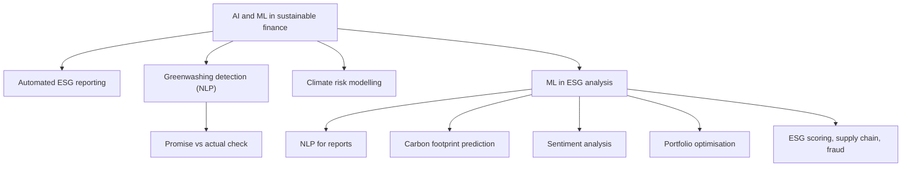

# SP-5 — AI and ML in Sustainable Finance

Covers: the role of AI in sustainable finance, applications of machine learning in ESG analysis (NLP, carbon footprint prediction, sentiment analysis, portfolio optimisation and more), a promise-vs-performance check, and limits. Tags: **(class)** is the faculty deck, **(general)** fills a gap.

## Where this fits

Likely a 5-mark "role of AI in sustainable finance" or "applications of ML in ESG analysis", or one paragraph in the 15-mark case (how to detect greenwashing). It links to Unit 4's future-trends node (RK-4); keep Unit 3 answers to the slide content below.

## Role of AI in sustainable finance (class)

**AI:** technology that enables computers and machines to learn from data, understand information, make decisions and perform tasks that normally need human intelligence. In sustainable finance it helps banks, investors and companies make decisions while considering ESG factors.

Core roles (slides 261-263):
- **Automates ESG data collection and reporting:** reduces manual error, speeds compliance. Example: tools scan thousands of company reports and produce compliance summaries, saving analysts weeks.
- **Detects greenwashing:** algorithms compare corporate claims with actual data. Example: **natural language processing (NLP)** compares claims with actual emissions data and flags inconsistencies. Tools flag firms overstating "net-zero" progress.
- **Supports climate risk modelling and scenario analysis:** AI simulates floods and droughts for insurers and banks.

Faculty line: "AI acts like a watchdog, spotting hidden risks."

**Applications list (class, slide 264):** climate risk (floods, droughts); carbon emissions (track and predict a company's emissions); ESG analysis (large volumes of ESG information); greenwashing (misleading claims); investment decisions (find companies with better ESG performance); risk assessment (banks assess borrowers' sustainability risks); prediction (future environmental and financial risks).

## Machine learning in ESG analysis (class)

**Machine learning (ML):** computers learning from data to make predictions or decisions. It can learn from company reports, carbon emissions, news and ESG data to predict ESG performance and risks. Faculty chain: **ML collects ESG data, analyses patterns, predicts ESG risks, supports better investment decisions.**

| Application | What it does | Faculty example |
|---|---|---|
| **ESG scoring** | Calculates a company's ESG performance | |
| **Greenwashing detection** | Identifies false or exaggerated green claims | NLP checks a "net-zero" claim against emission data |
| **Climate risk prediction** | Predicts floods, droughts, heatwaves | |
| **Carbon emission / footprint prediction** | Forecasts future greenhouse gas emissions from energy use, production, transport and fuel | Factory with rising electricity, fuel and output: predict future CO2; if electricity rises 10%, estimate the effect on the footprint |
| **NLP for reports** | Scans thousands of annual, sustainability and BRSR reports; finds references to emissions, diversity, board independence; turns text into structured ESG data | A human team reading 5,000 reports vs NLP as a research assistant |
| **Sentiment analysis** | Uses NLP and AI to judge tone (positive, negative, neutral, concerning) of news and social media; converts words into signals about ESG perception, reputation and risk | Spotting negative sentiment after an oil spill |
| **News analysis** | Reads news and social media for positive or negative ESG information | |
| **Supply chain monitoring** | Detects ESG risks among suppliers | |
| **Fraud detection** | Identifies unusual governance-related activity | |
| **Portfolio optimisation** | Integrates ESG scores into investment decisions; recommends shifting funds to strong ESG performers | Shift toward firms with strong renewable energy adoption |

Four-point summary on the slide 272: NLP for sustainability reports; predictive models for carbon footprint estimation; sentiment analysis of stakeholder communications; portfolio optimisation integrating ESG scores. Faculty line: "ML is a smart detective: reading, predicting, listening, guiding."

## Worked example: promise vs actual (illustrative, course exercise)

Course exercise: **ESG promise vs actual performance.** A firm promises to cut emissions intensity by **20% over 5 years** from a base of **100 tCO2e per ₹ crore of revenue**. After year 3 reported intensity is **97**. (Straight-line path is an assumption; state it.)

1. Required cut per year = 20% ÷ 5 = 4 points of the base a year.
2. Expected after 3 years = 3 × 4 = 12 points, so intensity should be 100 − 12 = **88**.
3. Actual cut = 100 − 97 = **3 points** (3%).
4. Gap = 97 − 88 = **9 points** above the path.
5. Delivery ratio = 3 ÷ 12 = **25%** of the required cut.

| Item | Promise path | Reported |
|---|---|---|
| Intensity after year 3 | 88 | 97 |
| Cut achieved | 12% | 3% |

Decision line: the firm has delivered a quarter of the required reduction at 60% of the timeline (3 of 5 years), so it is behind schedule. An NLP tool comparing the report's "on track" wording with this figure would flag the claim for review. Interpretation: a flag, not proof of greenwashing. Check boundary changes, base-year restatement and output growth before concluding.

## Limits (general)

Self-reported data are inconsistent (garbage in, garbage out); models can be biased toward firms that disclose more; ESG ratings from providers disagree; text models can invent figures. Remedy: human review and assurance of the underlying data. Faculty deck does not discuss limits, so keep this to one sentence.

## Cambridge lens

Source: Cambridge Centre for Risk Studies (2019). In the taxonomy, Artificial Intelligence is a risk type in the Technology class (Disruptive Technology family), and the report lists "artificial intelligence and big data" and "ethical consideration regarding the use of technology" among key emerging risks. So AI helps manage ESG risk and is also a risk to manage. Greenwashing and misleading claims sit under Governance (Non-Compliance, Litigation) and Social (Brand Perception). Our mapping, context only.

## Exam skeleton (5 marks): "Explain the role of AI and ML in sustainable finance"

1. Definition of AI and ML in one line each (1 mark).
2. AI roles: automated ESG reporting, greenwashing detection (NLP), climate risk modelling (2 marks).
3. Four ML applications: NLP for reports, carbon footprint prediction, sentiment analysis, portfolio optimisation, with the faculty examples (1.5 marks).
4. One limit (0.5 mark).

## What to remember

- AI automates ESG reporting, detects greenwashing by comparing claims with data, and supports climate risk modelling.
- ML = learning from data to predict; ESG scoring, greenwashing detection and climate risk prediction are its headline uses.
- Faculty four ML applications: NLP for reports, carbon footprint prediction, sentiment analysis, portfolio optimisation.
- Promise-vs-actual example: should be 88, reported 97, delivered 25% of the required cut.
- AI outputs are flags, not verdicts: human review needed.

## Concept map

## Flashcards

Q: Define AI in the faculty's words.
A: Technology that enables computers and machines to learn from data, understand information, make decisions and perform tasks that normally require human intelligence.

Q: How does AI help ESG reporting?
A: It scans thousands of company reports and generates compliance summaries, cutting manual error and saving analysts weeks.

Q: How does NLP detect greenwashing?
A: It compares company claims in text with actual emissions data and flags inconsistencies.

Q: Define machine learning in one line.
A: Computers learning from data to make predictions or decisions.

Q: List four ML applications in ESG analysis from the faculty summary slide.
A: NLP for sustainability reports, carbon footprint prediction, sentiment analysis, portfolio optimisation.

Q: What is carbon footprint prediction?
A: Using AI, ML and historical data to forecast future greenhouse gas emissions from energy use, production, transport and fuel; for example estimating the effect of a 10% rise in electricity use.

Q: What is sentiment analysis?
A: NLP and AI judging the tone of news and social media (positive, negative, neutral or concerning), turning words into signals about ESG perception, reputation and risk.

Q: A firm promises a 20% intensity cut over 5 years from 100. After 3 years it reports 97. Where should it be?
A: 88 on a straight line; it is 9 points behind and has delivered 3 of the 12 required points, 25%.

Q: Why is an AI greenwashing flag not proof?
A: Differences can come from boundary or base-year changes or higher output; a human must check.

Q: Which Cambridge class contains Artificial Intelligence as a risk type?
A: Technology (Cambridge Centre for Risk Studies, 2019).

## Sources
- Faculty deck, BBA304F-5 Unit 3, slides 261-274
- Student class notes (AI In Sustainable Finance); Cambridge Centre for Risk Studies (2019), Cambridge Taxonomy of Business Risks
- Previous: [[Sustainable Finance Unit 3 - SP-4 Carbon Trading Green Loans and Green Microfinance]]; next: [[Sustainable Finance Unit 3 - SP-6 Unit 3 Exam Answers]]
- [[Sustainable Finance Unit 3 - Products MOC (Node Map)]]
