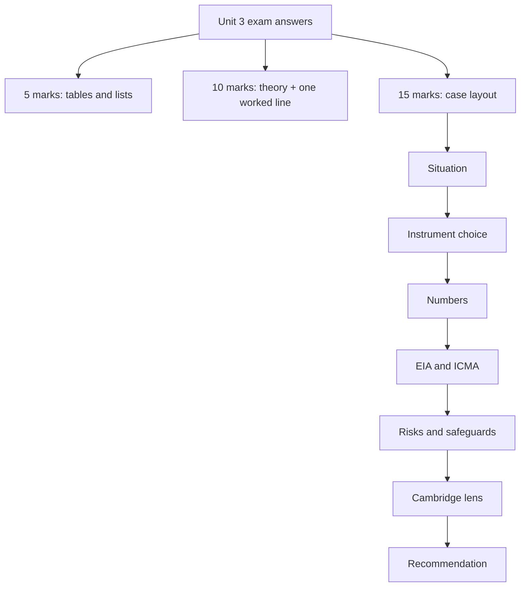

# SP-6 — Unit 3 Exam Answers

Covers: likely 5-mark skeletons, 10-mark skeletons, and a layout for the 15-mark case with a fully worked illustrative case. Everything follows the faculty deck; extras are tagged **(general)**.

## The exam shape

ESE is 50 marks in 2 hours. Section A: 3 of 5 × 5 marks. Section B: 2 of 3 × 10 marks. Section C: one compulsory 15-mark case. About 6 minutes per 5-marker, 14 per 10-marker, 25 for the case. Unit 3 is the heaviest product unit, so expect a bonds or EIA question in Section B and an instrument-choice or climate-finance case in Section C.

## 5-mark skeletons (aim for about 150 words, one table or list)

| Likely question | Skeleton | Node |
|---|---|---|
| Pillars of sustainable finance | Definition + objective; E, S, G, Economic with slide wording; strategies (screening, ESG integration, thematic); tools (impact investing, microfinance) | SP-1 |
| Differentiate green bond and SLB | One-line definitions; faculty comparison rows (proceeds, project-specific, coupon link, main question); example; "project-based vs performance-based" | SP-2 |
| Four elements of an SLB with an example | KPI, SPT, trigger event, financial consequence; steel firm 30% by 2030, +0.50% coupon | SP-2 |
| ICMA Green Bond Principles | Four components with one line each; "aligned with" wording | SP-2 |
| Greenwashing in sustainable bonds and how to guard | Definition; ₹2,000 crore weak-project example; protections list; SLB cheap ambition (10% vs 8%) | SP-2 |
| Carbon credit and carbon trading | 1 credit = 1 tCO2e; cap-and-trade steps; factory 10 vs 8 example; EU ETS | SP-4 |
| Carbon credit trading worked example | 10,000 → 7,000 t; 3,000 × ₹800 = ₹24,00,000; five steps | SP-4 |
| Green loans and green microfinance | Green loan features; performance-based; microfinance mechanism, benefits, SROI, assessment | SP-4 |
| Impact investing with examples | Definition; sectors; IRIS+ and SROI; solar farm, housing, microfinance | SP-3 |
| Why EIA is needed and its objectives | Factory-near-river story; seven objectives; with vs without EIA | SP-3 |
| Category A and B under EIA Notification 2006 | Table: impact, authority, screening; B1 and B2; two examples each | SP-3 |
| Role of AI and ML in ESG analysis | AI and ML one-liners; reporting, greenwashing, climate risk; four ML applications | SP-5 |

## 10-mark skeletons

### 1. "Explain green, social and sustainability-linked bonds and the risks of each" (SP-2)

1. Definitions with faculty examples: ₹1,000 crore solar green bond; ₹500 crore affordable-housing social bond; steel SLB (2 marks).
2. Comparison table, seven faculty rows; the 4-Bond Framework adds the sustainability bond (3 marks).
3. SLB mechanics: four elements and step-up arithmetic (0.50% on ₹1,000 crore = ₹5 crore a year) (2 marks).
4. Why investors buy, why issuers issue, one line each (1 mark).
5. Risks: greenwashing and cheap ambition; ICMA four components as the safeguard (2 marks).

### 2. "Explain EIA and its process" (SP-3)

1. Definition, UNEP line, "think before you build", objectives (2 marks).
2. Nine steps in a table (4 marks).
3. EIA Notification 2006: Category A, B, B1, B2 with examples; resolve the screening point (2 marks).
4. Sardar Sarovar or Tehri as example: benefit, cost, mitigation; EIA and business (2 marks).

### 3. "Explain carbon trading, carbon credits and the link with climate finance" (SP-4)

1. Credit definition and earn, use, trade (1.5 marks).
2. Cap-and-trade mechanics; EU ETS; carbon trading vs credit trading (2.5 marks).
3. Five-step process (1.5 marks).
4. Worked example with ₹24 lakh and a decision line (2 marks).
5. Climate finance cycle; credits are not a substitute for own cuts (1.5 marks).
6. Leading players: South Pole, Climeworks, Tesla (1 mark).

### 4. "Impact investing, microfinance and green microfinance" (SP-3, SP-4)

Definition; sectors; IRIS+ and SROI with the 1.55 example; microfinance definition; green microfinance mechanism (repayment from fuel savings), benefits, assessment; affordability line (40-month payback).

## Decision-line bank (use at the end of any calculation)

- **SLB step-up:** the miss costs ₹5 crore a year on ₹1,000 crore, enough for management to feel it; it works only if the SPT is ambitious.
- **Carbon credits:** 3,000 credits earn ₹24 lakh only if verified against a baseline; credits do not replace cutting own emissions.
- **SROI above 1:** social value exceeds capital invested; check attribution and discount rate.
- **EIA Category A:** schedule decides, no screening; Category B: screening decides B1 or B2.
- **Promise vs actual:** a flag for review, not proof of greenwashing.

## 15-mark case layout (about 25 minutes)

Case questions in this unit usually give a firm, a funding need and a sustainability angle, then ask what to issue, what risks arise and what to do. Use this order:

1. **Situation in two lines** (1 mark): restate amount, purpose, sector, and the issue (instrument choice, target setting, project clearance).
2. **Instrument choice** (4 marks): green bond if funds go to a defined green project; social bond if for a social outcome; SLB if purposes are general and the firm wants to commit to a target; green loan or SLL if bank funding. Justify with the "where the money goes / who benefits / what the issuer achieves" test.
3. **Numbers** (3 marks): coupon step-up, credit revenue, SROI or loan interest, laid out in numbered steps with a table.
4. **Regulatory and project clearance** (2 marks): EIA category and authority if a new plant is involved; ICMA GBP four components if a green bond.
5. **Risks and safeguards** (2 marks): greenwashing, cheap ambition, verification; investor checks list.
6. **Cambridge lens** (1 mark): name the risk class the plan reduces (Environmental: Climate Change transition; Governance: Non-Compliance; Social: Brand Perception). Cambridge Centre for Risk Studies (2019).
7. **Recommendation with interpretation** (2 marks): one clear decision, one condition, one warning.

### Worked case (fully illustrative: fictional company, assumed figures)

*Ridgeway Steel Ltd needs ₹1,000 crore. It plans a ₹400 crore captive solar and energy-efficiency programme and a ₹600 crore general capacity upgrade at an existing site. Its board wants to attract ESG investors, and a new blast furnace unit is under discussion. The retrofit will cut one site's emissions from 10,000 to 7,000 tCO2e. Advise.*

**Step 1: Situation.** ₹1,000 crore, steel, hard-to-abate emissions; two uses of funds with different character.

**Step 2: Instrument choice.**
- ₹400 crore for solar and efficiency has defined green projects: **green bond** (use of proceeds restricted; ICMA GBP: use of proceeds, project evaluation and selection, sub-account, annual reporting).
- ₹600 crore for general capacity has no green project: **SLB** with a KPI such as Scope 1 and 2 emissions intensity and an SPT such as a 30% cut by 2030 (faculty steel example). 400 + 600 = 1,000.

**Step 3: Numbers.**
1. SLB step-up (assumed 0.50%): 0.50% × 600 = ₹3 crore a year. If missed for three years: 3 × 3 = ₹9 crore. With the faculty's 25 bps trigger: 0.25% × 600 = ₹1.5 crore a year.
2. Carbon credits from the retrofit: 10,000 − 7,000 = 3,000 tCO2e; 3,000 × ₹800 = ₹24,00,000 = ₹0.24 crore, if verified and eligible.

| Item | Amount |
|---|---|
| Green bond | ₹400 crore |
| SLB | ₹600 crore |
| SLB step-up on a miss, per year | ₹3 crore |
| Carbon credit revenue (one-off, illustrative) | ₹0.24 crore |

**Step 4: Clearance.** Primary metallurgical industries are a Category A example (faculty list), so the new blast furnace needs MoEFCC clearance via the EAC, skipping screening and going to scoping, public consultation and appraisal. Run the nine EIA steps before committing bond money to it; a green bond should not fund it without a separate assessment [VERIFY thresholds against the schedule].

**Step 5: Risks.** Greenwashing: tag only the solar and efficiency spend as green and report allocation. Cheap ambition: if regulation already forces roughly a 20% intensity cut by 2030, a 30% SPT adds only 10 points; calibrate against that path. Credits: buying or selling credits is not a substitute for own cuts.

**Step 6: Cambridge lens.** The structure reduces Environmental risk (Climate Change: Transition), Governance risk (Non-Compliance via clearances) and Social risk (Brand Perception) (Cambridge Centre for Risk Studies, 2019).

**Step 7: Recommendation.** Issue a ₹400 crore green bond and a ₹600 crore SLB. Interpretation: the ₹3 crore a year miss cost dwarfs the ₹0.24 crore credit revenue (about 8% of one year's penalty), so credits cannot fund the target; real emission cuts decide success. Condition: an ambitious, verified SPT. Warning: complete the EIA for the new furnace before any proceeds are allocated to it.

## What to remember

- Section A is theory with a table; Section B needs a worked line; Section C needs a recommendation with interpretation.
- Bonds: where the money goes, who benefits, what the issuer achieves; green project-based, SLB performance-based.
- EIA: nine steps; Category A skips screening; B splits into B1 and B2.
- Carbon: 1 credit = 1 tCO2e; 10,000 → 7,000 t at ₹800 = ₹24,00,000.
- Case order: situation, instrument, numbers, clearance, risks, Cambridge lens, recommendation.
- State assumptions you add (tenor, coupon, price) and tag illustrative figures.

## Concept map

## Flashcards

Q: In what order should a 15-mark Unit 3 case answer run?
A: Situation, instrument choice, numbers, clearance and principles, risks and safeguards, Cambridge lens, recommendation with interpretation.

Q: Funds for a solar plant vs funds for general purposes with a 30% emissions target: which instruments?
A: Green bond for the solar plant (use of proceeds); SLB for the general-purpose funds (performance-linked).

Q: Extra annual interest on a ₹600 crore SLB with a 0.50% step-up?
A: 0.50% × 600 = ₹3 crore a year.

Q: Revenue from cutting 10,000 tCO2e to 7,000 at ₹800 a credit?
A: 3,000 × 800 = ₹24,00,000.

Q: Which EIA category does a primary metallurgical industry fall in, and what is skipped?
A: Category A (faculty list); screening is skipped and the project goes straight to scoping.

Q: What closing elements earn interpretation marks?
A: A clear recommendation, a condition (ambitious verified target), and a warning (EIA before allocation, greenwashing risk).

Q: Which risk classes can you name for the Cambridge lens in Unit 3?
A: Environmental (Climate Change transition), Governance (Non-Compliance), Social (Brand Perception), Financial (Company Outlook).

Q: How should you word ICMA in an exam?
A: "Aligned with the ICMA Green Bond Principles"; the faculty slide says "certified under", which is the class wording if the question uses it.

## Sources
- Built from SP-1 to SP-5 and the faculty deck, Unit 3 slides 156-277
- Exam pattern: docs/sustainable-finance-plan.md; Cambridge Centre for Risk Studies (2019)
- Previous: [[Sustainable Finance Unit 3 - SP-5 AI and ML in Sustainable Finance]]
- [[Sustainable Finance Unit 3 - Products MOC (Node Map)]]
