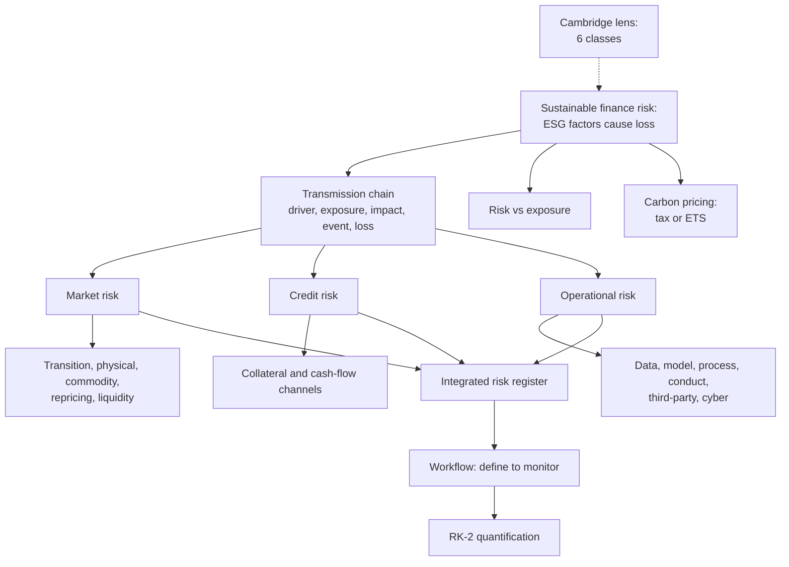

# RK-1 — Risk Identification

Covers: the faculty definition of risk in sustainable finance, risk vs exposure, carbon pricing and markets, market, credit and operational risk (meaning, ESG drivers, impacts, identification tools, mini cases), the transmission chain, the integrated ESG risk register, the comparative view, the six-step workflow, common challenges, managerial and India points, and a Cambridge lens on risk taxonomy. **(class)**

## Where this fits in the ESE

ESE: Section A 3 of 5 × 5 marks, Section B 2 of 3 × 10 marks, Section C one compulsory 15-mark case. Module 4 names the Bhopal gas tragedy, so every risk tool here is a tool for that case (see RK-5). Likely 5-markers: "three major risks with impact", "risk vs exposure", "ESG transmission chain", "risk register". **(syllabus)**

## What is risk in sustainable finance

**(class)** Sustainable finance risk is the possibility that ESG-related factors may cause financial loss, reduced returns, regulatory problems or reputational damage.

**Why identification comes first (class):** sustainable finance allocates capital while considering ESG factors. ESG factors become financially material through **revenues, costs, asset values, financing conditions and reputation**. Risk identification is the first control point: an unidentified risk cannot be measured, priced, mitigated or monitored.

**Key principle (class):** ESG risk is *often* a driver of conventional financial risk, **not necessarily a separate risk silo**. Your earlier note read "ESG risk is not a separate risk class". The slide is softer: "often" and "not necessarily". Write the slide wording.

Module 4 focus areas (class): risk identification, ESG risk quantification, risk metrics and reporting, corporate disclosure, AI and blockchain in risk management, emerging trends in ESG analysis. Your note had "ESG Risk Qualification"; the slide word is **Quantification**.

### Risk vs exposure (class)

| | Risk | Exposure |
|---|---|---|
| Meaning | Probability and potential impact of an uncertain event | Degree to which a person, firm or asset is vulnerable to that risk |
| Focus | Potential for loss or harm | What is at stake and how much can be affected |
| Measured by | Statistical or analytical methods (likelihood × impact) | Conditions, positions or circumstances |
| Managed by | Reducing probability or mitigating impact | Reducing vulnerability (diversification, safety measures) |
| Finance example | Market volatility creates risk | Portfolio allocation decides exposure |
| Health example | Likelihood of contracting a disease | Conditions that raise contact with the disease agent |

One line to remember: **risk is the chance and size of the hit; exposure is how much of you is in the line of fire.**

## Carbon pricing and carbon markets

**(class)** Carbon pricing is a method for governments to mitigate climate change by putting a monetary cost on greenhouse gas emissions, so that polluters cut fossil-fuel combustion, the main driver of climate change. It usually takes the form of a **carbon tax** or an **emissions trading scheme (ETS)** that requires firms to buy allowances to emit. The slides link two videos on how carbon markets work and give no further text.

Gap-fill **(class notes)**: in cap and trade a regulator sets a cap, issues allowances (one allowance usually permits one tonne of CO2), and firms that emit less than their allowance sell the surplus. Full treatment in SP-4. For risk purposes, a carbon price is a **market (transition) risk** driver: it raises costs for emitters.

*Course-plan activity, carbon buy/sell simulation (illustrative; price ₹800 per tonne is not a quote).* Firm A emits 1,20,000 t against 1,00,000 t allowed; Firm B emits 85,000 t. A is short 20,000 t, B has 15,000 t spare.
1. A buys 20,000 t at ₹800: 20,000 × 800 = ₹1.60 crore. Abating itself at ₹1,100 per tonne would cost 20,000 × 1,100 = ₹2.20 crore.
2. B sells 15,000 t: 15,000 × 800 = ₹1.20 crore.
3. Demand 20,000 t exceeds supply 15,000 t, so the price rises. At ₹1,000: A pays 15,000 × 1,000 = ₹1.50 crore plus abates 5,000 t at ₹1,100 = ₹0.55 crore, total **₹2.05 crore**. B earns **₹1.50 crore**.
4. Decision line: trading moves abatement to the cheapest cutter (A pays ₹2.05 crore, not ₹2.20 crore). For A the volatile carbon price is a market risk.

## The three major risks (class)

| | Market risk | Credit risk | Operational risk |
|---|---|---|---|
| Meaning | Loss from changes in prices, interest rates, carbon prices or market conditions, influenced by ESG factors | Borrower cannot meet obligations because of ESG-related factors | Loss from inadequate or failed people, processes, systems or external events |
| ESG examples | Carbon-intensive firms lose value after stricter climate rules; oil prices fall as the world shifts to renewables; carbon price rise hits profit; investors shift to ESG-compliant firms | Pollution penalties; climate-related business disruption; poor labour practices; governance failures; regulatory violations | Weak environmental compliance systems; greenwashing from weak reporting controls; cyber failure in ESG data systems; supply-chain labour violations; inaccurate sustainability data |
| Impact | Share-price volatility; lower investment returns; asset valuation changes | Loan default; higher PD; higher cost of borrowing; lower credit rating | Financial loss; legal penalties; reputation damage; loss of stakeholder trust |
| Slide example | A coal company's valuation declines as economies move to clean energy | A manufacturer with repeated environmental penalties becomes a higher-risk borrower | (see the water-reliant manufacturer below) |

**Overlap matters (class):** one ESG event can trigger all three at once.

## Taxonomy and the transmission chain

**Risk taxonomy (class):** a hierarchical classification framework that organises the risks an organisation may face into defined categories and subcategories with consistent terminology and clear boundaries. Embedded in enterprise risk management, it gives risk teams a shared language to identify, assess and prioritise risks across business units, geographies and functions.

**Slide taxonomy (class):** MARKET (adverse moves in prices, rates, spreads, currencies, commodity values), CREDIT (borrower or counterparty failure or deterioration in credit quality), OPERATIONAL (losses from failed processes, people, systems or external events). **Cross-cutting ESG drivers:** climate transition, physical hazards, pollution, resource scarcity, labour issues, governance failures, greenwashing.

**Transmission chain (class):**

ESG driver → business or asset exposure → financial impact → risk event → loss or capital impact

| Driver | Chain |
|---|---|
| Carbon regulation | High-emission plant → higher operating or capex cost → margin pressure → lower credit quality |
| Flood risk | Damaged collateral → production interruption → weaker cash flow → higher default probability |
| Governance failure | Misreporting → regulatory action or reputation loss → funding constraints |

ESG risk should be integrated into enterprise risk management **(class)**. Factor to impact (slide table; the last column is garbled in the PDF text, so the pairing is inferred): climate change → production disruption → revenue loss and higher costs; pollution → regulatory penalty → financial loss; poor labour practices → employee turnover → productivity loss; weak governance → fraud or corruption → legal and reputation risk; data failure → incorrect disclosure → legal and reputation risk.

## Market risk: drivers and identification

**Meaning (class):** possibility of financial loss from adverse changes in market variables. Portfolios may hold ESG-sensitive equities, bonds, commodities, currencies, interest-rate positions and carbon-related assets. ESG information can alter investor expectations, risk premia, valuations and liquidity.

**Key question (class):** Which ESG developments could materially change the market value or liquidity of the portfolio?

**Five ESG drivers (class):**
1. **Transition risk:** carbon pricing, regulation, technology shifts, changing consumer preferences.
2. **Physical risk:** floods, heat, drought, storms, water stress hitting issuers and assets.
3. **Commodity risk:** energy and raw-material price shocks linked to climate policy or supply disruption.
4. **Repricing risk:** sudden revision of market expectations about an issuer's sustainability performance.
5. **Liquidity risk:** reduced market depth for controversial, stranded or rapidly repriced assets.

Your earlier note called liquidity a separate risk head and made reputational and legal risk separate heads. The slides file liquidity under market risk and put legal penalties and reputation damage among the **impacts** of operational risk. Follow the slides.

**Identification tools (class):** ESG exposure mapping (sectors, geographies, assets sensitive to ESG drivers); materiality heat map (rank by probability, financial impact, time horizon); sensitivity analysis (portfolio impact of carbon, energy or interest-rate changes); scenario analysis (orderly transition, disorderly transition, high-physical-risk pathways); stress testing (severe but plausible shocks on valuation, liquidity, capital). Both are developed in RK-2.

**Lender's lens (class):** core question: can an ESG factor alter market conditions so as to reduce borrower revenue or asset value, thereby affecting repayment? **Cement manufacturer example:** construction firms shift to low-carbon alternatives under new rules, so demand falls. Environmental factor: carbon taxes raise production costs and cut competitiveness. Social factor: consumer preference for sustainable housing materials moves demand away from cement. Governance factor: poor disclosure of emissions risk triggers investor sell-offs and lowers market valuation.

## Credit risk: channels and identification framework

Meaning, PD/LGD/EAD and expected loss are in RK-2. Here is the identification side.

**Core question (class):** Can an ESG factor weaken the borrower's ability or willingness to repay?

**Transmission channels (class):** Environmental (climate damage, pollution liabilities, resource scarcity, transition costs). Social (labour disputes, safety failures, community conflict, supply-chain disruption). Governance (fraud, weak controls, corruption, poor board oversight, regulatory breaches). **Collateral channel:** physical climate damage reduces collateral value and recovery rates. **Cash-flow channel:** ESG shocks reduce revenue, raise costs and weaken debt-service capacity.

**Identification framework (class), five steps:**
1. Borrower profile: sector, geography, business model, ESG dependence.
2. Exposure assessment: emissions, water intensity, supply-chain concentration, workforce practices, governance quality.
3. Financial linkage: EBITDA, cash flow, leverage, interest coverage, refinancing capacity.
4. Forward-looking review: transition plan, capex needs, adaptation measures, scenario resilience.
5. Decision output: ESG-adjusted credit rating, risk grade, covenants, pricing or exposure limit.

## Operational risk: sources and controls

**Meaning (class):** inadequate or failed internal processes, people and systems, or external events. In sustainable finance it covers ESG-data errors, reporting failures, weak controls, supply-chain incidents and greenwashing. Outcomes: financial loss, regulatory penalties, litigation, reputation damage, loss of stakeholder trust.

**Key question (class):** Can our ESG-related processes, data, people or systems fail, and what would be the consequence? (Lender version: can an ESG factor disrupt the borrower's operations in a way that threatens repayment capacity?)

**Six major ESG sources (class):** data risk (incomplete, inconsistent, unreliable ESG data); model risk (wrong assumptions in ESG scores, climate models, scenarios); process risk (weak due diligence, approvals, documentation); conduct risk (misleading sustainability claims, mis-selling ESG products); third-party risk (poor data providers, vendors, assurance providers, supply-chain partners); cyber or system risk (manipulation, loss or unavailability of sustainability information).

**Identification and controls (class):** map the end-to-end process (data → validation → analysis → decision → reporting); use a **Risk and Control Matrix (RCM)** linking each risk to controls and owners; maker-checker, data validation, audit trails, exception reporting; periodic internal audit, model validation, third-party due diligence; track **KRIs**: data-error rate, overdue reviews, control failures, complaints, incidents.

**Water-reliant manufacturer (class):** may face shutdowns from environmental regulation or community protests over water use. Environmental: water scarcity or pollution fines raise costs and halt production. Social: strikes or unsafe conditions cut productivity and revenue. Governance: weak compliance systems lead to fraud or penalties.

## Three mini cases (class)

| | Market | Credit | Operational |
|---|---|---|---|
| Case | A fund holds bonds of a coal-intensive power company | A manufacturer in a flood-prone industrial zone | A water-reliant manufacturer |
| Trigger | Rapid tightening of emissions rules, higher carbon cost | More frequent, severe extreme rainfall | Water scarcity, regulation, community protest |
| Transmission | Higher compliance and capex cost → weaker profit → wider credit spreads → bond price falls | Plant disruption → lower production → weaker cash flow → delayed debt service; damaged machinery and collateral → higher LGD | Shutdown or higher cost → lower revenue → weaker repayment capacity |
| Indicators | Emissions intensity, regulatory exposure, asset age, transition plan, capex needs | Flood exposure, cash-flow cover, collateral location | Water intensity, compliance record, incident and complaint count |
| Response | Exposure limits, engagement, diversification, transition-risk monitoring | Insurance, business-continuity plan, site adaptation, collateral review, climate scenario testing | Compliance systems, water-efficiency capex, community engagement, controls and KRIs |

Slide wording note: the credit and operational cases give the response as mitigation and controls; the operational case's indicators and response are my compression of the slide's E/S/G bullets and the RCM list **(general)**.

## Comparative view and workflow

**Comparative view (class):** Market: value or price sensitivity; indicators volatility, spreads, liquidity, concentration. Credit: repayment or counterparty deterioration; indicators PD, LGD, leverage, coverage, rating migration. Operational: process, system or external-event failure; indicators incidents, control breaches, data errors, losses.

**Six-step workflow (class), learn the verbs:**
1. **Define:** risk taxonomy, scope, portfolio, materiality.
2. **Identify:** ESG drivers, exposures, vulnerabilities, transmission channels.
3. **Assess:** likelihood, impact, time horizon, financial materiality.
4. **Quantify:** sensitivity, scenarios, stress tests, risk metrics.
5. **Mitigate:** limits, diversification, covenants, controls, insurance, engagement.
6. **Monitor:** KRIs, thresholds, escalation, periodic reassessment.

## Integrated ESG risk register (class)

Columns: Risk ID | ESG driver | Risk type | Exposure | Likelihood | Impact | Existing control | Owner | KRI | Response. Prioritise with one scoring scale and documented assumptions; record current and emerging risks over short, medium and long horizons; link high-priority risks to business decisions, capital allocation and management accountability.

### Worked example: register built from the three mini cases

*Illustrative scores. The slides give no scoring scale, so state this in the exam: score = likelihood (1 to 5) × impact (1 to 5); bands 1 to 6 low, 7 to 12 medium, 13 to 25 high (general).*

| ID | Driver | Type | Exposure | L | I | Score | Control | Owner | KRI | Response |
|---|---|---|---|---|---|---|---|---|---|---|
| R1 | Carbon regulation | Market (transition) | Coal-power bonds | 4 | 4 | 16 | Sector limit | Portfolio head | Emissions intensity | Cut limit, engage |
| R2 | Extreme rainfall | Credit (physical) | Flood-zone borrower | 3 | 5 | 15 | Property insurance | Credit head | Share of loans in flood zones | Collateral review, scenario test |
| R3 | Water scarcity, protest | Operational | Water-reliant plant | 3 | 4 | 12 | Compliance audit | Plant head | Water per unit, complaints | Efficiency capex, engagement |
| R4 | Unreliable ESG data | Operational (data) | ESG reporting | 2 | 4 | 8 | Maker-checker | Reporting head | Data-error rate | Validation, audit |

1. Multiply: 4 × 4 = 16; 3 × 5 = 15; 3 × 4 = 12; 2 × 4 = 8.
2. Rank: R1 (16), R2 (15), R3 (12), R4 (8).
3. Decision line: **R1 and R2 are high and get action first; R3 is medium and needs a dated plan; R4 is medium-low and is handled by control upgrades.**
4. Interpretation: R1 and R2 start as ESG events but land as market and credit losses. That is the key principle: ESG is a driver of conventional risk, and the register ties each driver to an owner and a KRI so that it can be managed.

## Cambridge lens

*This section enriches the slide taxonomy. It does not replace it. In the exam, use the slide's market, credit, operational taxonomy first. Source: Cambridge Centre for Risk Studies (2019), Cambridge Taxonomy of Business Risks, v2.0.*

- **Structure:** a three-rank hierarchy, Class : Family : Type, with room for sub-types. It has 6 classes, 37 families and 175 risk types. Each risk type is placed only once, grouped by **cause** ("causal similarity"), not by consequence.
- **The six classes:** Financial (macroeconomy, markets, company events); Geopolitical (political and criminal deterioration, conflict, regulation by authorities); Technology (cyber attacks, infrastructure failure, industrial accidents, failing to keep up with technology); Environmental (natural hazards, climate change, exploitation of the environment); Social (demographics, preferences, norms, public health); Governance (compliance, litigation, management decisions).
- **E, S and G appear as three of the six classes.** The slide's cross-cutting ESG drivers sit across all of Cambridge's classes, which is a useful way to see why ESG risk is a driver and not a silo. Climate change appears in Cambridge as an Environmental family with Physical, Liability and Transition types, matching the slide's physical and transition split.
- **Causes versus consequences:** Cambridge argues that reputational damage is a consequence of many threats (a cyber breach, a scandal, a lawsuit), so it belongs to the impact side, not the cause list. This matches the slide, which lists reputation damage under operational-risk impact.
- **Risk register findings:** company risk registers are inconsistent even within a sector. Governance risk is the most under-recognised class: it causes a much larger share of corporate distress than it gets in registers. Environmental risk is reported more often than it causes distress, and technology risk is under-reported. Link to Bhopal in RK-5, a governance and safety failure.
- **Terms:** a **principal risk** threatens the business model, future performance, solvency, liquidity or reputation; an **emerging risk** is new, changing or a novel combination, with impacts and likelihoods not yet well understood. Risk registers should carry both.
- **Use:** the taxonomy is a checklist to test and prioritise which risks matter to a given firm, which is exactly the Define and Identify steps of the workflow above.

## Common identification challenges (class)

1. Long time horizons versus short financial planning cycles.
2. Data gaps, inconsistent definitions and limited historical observations.
3. Complex attribution: ESG drivers interact and transmit through multiple channels.
4. Model uncertainty and scenario dependence.
5. Greenwashing and inconsistent sustainability claims.
6. Difficulty translating qualitative ESG information into financially material risk metrics.

## Managerial and governance implications (class)

- Board and senior management set risk appetite and accountability for material ESG risks.
- Risk functions integrate ESG drivers into the existing market, credit and operational frameworks.
- Business units own first-line identification and mitigation.
- Independent risk, compliance and internal audit provide challenge and assurance.
- Good governance needs clear escalation, documentation, data ownership and transparent reporting.

## India context: practical lens (class)

Banks, NBFCs, asset managers and corporates increasingly need to connect sustainability information with financial risk management. Relevant context: RBI guidance on climate-related financial risks and disclosures, SEBI's BRSR framework and sustainable-finance developments **[VERIFY current circulars]**. For Indian portfolios, consider sectoral and geographic exposure to heat, floods, water stress, energy transition and supply-chain disruption. Use BRSR and annual-report disclosures as inputs, but validate materiality, consistency and reliability before relying on them.

## Key takeaways (class)

- ESG risk identification is about finding financially material ESG drivers and tracing their transmission into financial risk.
- Market risk affects value and liquidity; credit risk affects repayment and recovery; operational risk affects processes, systems and external-event resilience.
- The strongest approach combines exposure mapping, materiality assessment, scenario analysis, stress testing and continuous monitoring.
- **Integration, not isolation, is the central principle of sustainable-finance risk management.**

Slide references (class): BIS and Basel Committee, NGFS (climate scenarios), RBI, SEBI (BRSR), TCFD and IFRS Foundation, UNEP FI.

## 5-mark answer skeletons

*Q1: Explain the three major risks in sustainable finance with their impact.* (about 150 words) Definition of ESG risk (1); market with example and impact (1); credit with example and impact (1); operational with example and impact (1); overlap and the key principle (1).

*Q2: Distinguish risk from exposure.* Definitions (1); focus (1); measurement (1); management (1); finance example, portfolio allocation (1).

*Q3: Explain the ESG-to-finance transmission chain.* Five-link chain (2); carbon, flood and governance examples (2); link to PD or valuation (1).

*Q4: Describe the risk identification workflow.* Six steps with one phrase each (5).

## What to remember

- ESG risk is often a driver of conventional financial risk, not necessarily a separate silo; identification is the first control point.
- Three major risks: market (prices, carbon prices), credit (borrower fails because of ESG), operational (failed people, processes, systems, external events).
- Market risk drivers: transition, physical, commodity, repricing, liquidity.
- Chain: ESG driver, exposure, financial impact, risk event, loss or capital impact.
- Risk register columns: ID, driver, type, exposure, L, I, control, owner, KRI, response. Workflow: Define, Identify, Assess, Quantify, Mitigate, Monitor.
- Integration, not isolation, is the central principle. Cambridge lens: 6 classes, 37 families, 175 types; governance is the most under-recognised class.

## Concept map

## Flashcards
Q: Define risk in sustainable finance (class).
A: The possibility that ESG-related factors may cause financial loss, reduced returns, regulatory problems or reputational damage.

Q: Why is risk identification called the first control point?
A: An unidentified risk cannot be measured, priced, mitigated or monitored.

Q: State the slide's key principle on ESG and conventional risk.
A: ESG risk is often a driver of conventional financial risk, not necessarily a separate risk silo.

Q: Risk vs exposure in one line each.
A: Risk is the probability and potential impact of an uncertain event; exposure is the degree to which a person, firm or asset is vulnerable to it.

Q: Name the three major risks and give the impact of each.
A: Market (share-price volatility, lower returns, valuation changes); credit (default, higher PD, higher borrowing cost, lower rating); operational (financial loss, legal penalties, reputation damage, loss of trust).

Q: List the five ESG drivers of market risk on the slides.
A: Transition, physical, commodity, repricing and liquidity risk.

Q: Write the ESG transmission chain.
A: ESG driver, business or asset exposure, financial impact, risk event, loss or capital impact.

Q: Name the two credit-risk channels besides E, S and G.
A: The collateral channel (lower collateral value and recovery) and the cash-flow channel (lower revenue, higher costs, weaker debt service).

Q: Name the six major ESG sources of operational risk.
A: Data, model, process, conduct, third-party and cyber or system risk.

Q: List the six steps of the risk identification workflow.
A: Define, identify, assess, quantify, mitigate, monitor.

Q: Likelihood 4, impact 4 on a 1-5 scale. Score and band (1-6 low, 7-12 medium, 13-25 high)?
A: 4 × 4 = 16, high band.

Q: Cambridge Taxonomy of Business Risks: structure and classes?
A: Class : Family : Type hierarchy with 6 classes (Financial, Geopolitical, Technology, Environmental, Social, Governance), 37 families, 175 types; governance risk is the most under-recognised in company registers (Cambridge Centre for Risk Studies, 2019).

## Sources
- Faculty deck Unit 4 (pp 282-291, 317-318, 332-375)
- Cambridge Centre for Risk Studies (2019), Cambridge Taxonomy of Business Risks
- BBA304F-5 course plan, Module 4
- Next node: [[Sustainable Finance Unit 4 - RK-2 ESG Risk Quantification]]
- [[Sustainable Finance Unit 4 - Risk MOC (Node Map)]]
