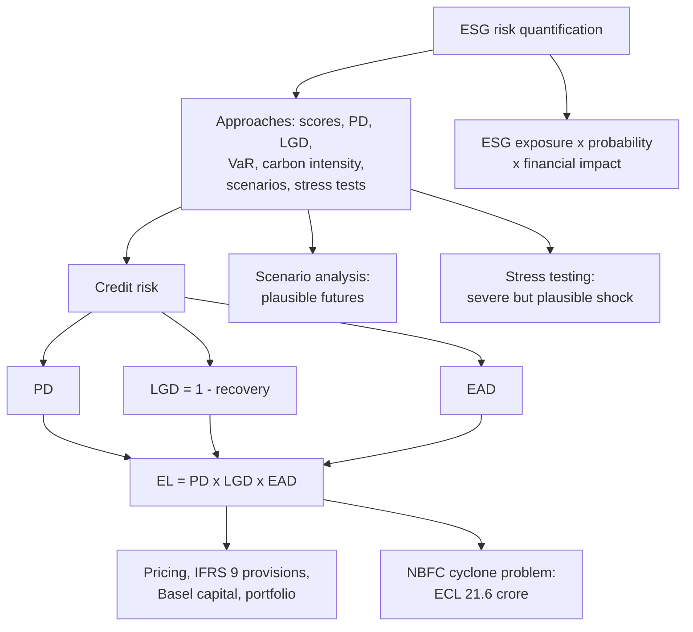

# RK-2 — ESG Risk Quantification

Covers: what quantification means and the slide's approaches, credit risk (PD, LGD, EAD), expected loss with the slide example, why the measures matter, how ESG moves each component, the faculty's NBFC cyclone problem solved step by step, and climate scenario analysis versus stress testing. **(class)**

## What quantification means

**(class)** ESG risk quantification means converting ESG risks into measurable financial or risk indicators.

**Common approaches (class):** ESG scores and ratings; Probability of Default (PD); Loss Given Default (LGD); Value at Risk (VaR); carbon intensity; scenario analysis; stress testing.

**Slide formula (class):** ESG exposure × probability × financial impact = ESG risk estimate.

Expected loss (below) is this formula in credit form: exposure is EAD, probability is PD, financial impact is LGD.

Carbon intensity is emissions divided by revenue, which lets firms of different sizes be compared. **(general)** Scope 1 (direct), Scope 2 (purchased energy) and Scope 3 (value chain) and portfolio WACI are not on the slides. They appear in RK-3 as metrics context and in CC-1; do not spend exam time on them here.

## Credit risk: the three components

**(class)** Credit risk is the possibility that a borrower or counterparty fails to meet contractual obligations or experiences deterioration in creditworthiness. ESG factors influence PD, LGD and EAD.

| Component | Slide definition |
|---|---|
| **PD**, probability of default | Likelihood that a borrower defaults over a given period, usually one year, as a percentage. A PD of 2% means roughly a 1-in-50 chance within the year. Estimated from credit ratings, scoring models and historical default data |
| **LGD**, loss given default | Proportion of the exposure the lender expects to lose if the borrower defaults, after recoveries from collateral, guarantees or the insolvency process. LGD of 40% means the lender recovers 60% and loses 40% |
| **EAD**, exposure at default | Total amount the lender is exposed to at the moment of default. For a simple loan, close to the outstanding balance. For credit cards or undrawn facilities, it also estimates how much of the available limit the borrower will have drawn by default |

**Expected Loss = PD × LGD × EAD (class).** It is the average loss a lender can expect and typically provisions for as a cost of doing business. Losses beyond it, **unexpected losses**, are what capital is held against.

**LGD = 1 − recovery rate (class, from the board solution).**

**Slide example (class):** exposure 1,000,000, PD 2%, LGD 40%. EL = 0.02 × 0.40 × 1,000,000 = **8,000** (checked). The currency symbol is garbled in the PDF text; present it as "a 10 lakh exposure, EL ₹8,000" or leave the unit as on the slide.

## Why the measures matter (class)

1. **Loan pricing:** the lender prices to cover expected loss plus a return, so higher PD or LGD means a higher charge.
2. **Provisioning:** accounting standards such as IFRS 9 require provisions for expected credit losses, built on these components.
3. **Regulatory capital:** under the Basel framework, banks using internal models estimate PD, LGD and EAD to compute capital held against credit risk.
4. **Portfolio management:** aggregating expected losses shows where credit risk is concentrated and how it may behave in a downturn.

## How ESG moves PD, LGD and EAD (class)

| Parameter | Slide wording | Example |
|---|---|---|
| **PD** | ESG factors can raise default likelihood | Poor environmental practices bring fines or reputational damage, weakening cash flow and repayment ability |
| **LGD** | Weak governance or social controversy can reduce collateral value or recovery | Stranded fossil-fuel assets have lower liquidation value |
| **EAD** | ESG risks can alter borrower behaviour | A firm under social pressure may restructure obligations or withdraw from markets, changing exposure at default |

Your earlier note said ESG raises EAD because borrowers draw down credit lines. The slide's EAD point is about restructuring and market withdrawal. Use the slide version.

**Central lens (class):** can an ESG factor weaken the borrower's *ability* or *willingness* to repay? Ability links to financial materiality (climate disrupting supply chains, labour unrest cutting productivity). Willingness links to governance: corruption or unethical practice erodes trust and raises **strategic default** risk.

**Coal-based power company (class):** environmental, carbon pricing raises operating cost, so higher PD. Social, community opposition delays projects and cuts inflows. Governance, weak board oversight leads to misreported liabilities, so higher LGD.

**Practical integration in lending (class):** borrower ESG profiling (water in textiles, emissions in cement); materiality mapping; stress testing ESG shocks on PD, LGD or EAD; disclosure frameworks to judge transparency and governance.

## Worked example 1: the faculty's NBFC cyclone problem

**Question (class):** An NBFC has a loan book of ₹2,000 crore, of which 18% is exposed to coastal real-estate developers. A cyclone is projected to damage collateral and cut its recoverable value by 40%. Identify the exposed portion and discuss how the 40% decline affects recovery if borrowers default.

**Board solution (class, p 325), recomputed:**

| Step | Working | Result |
|---|---|---|
| 1. Exposed loan book | 2,000 × 0.18 | **₹360 crore** = EAD |
| 2. Assumption (stated on the board) | Collateral value = loan exposure | 360 = 360 |
| 3. Value unable to be recovered | 360 × 0.40 | ₹144 crore |
| 4. Post-cyclone recoverable collateral | 360 − 144 | **₹216 crore** |
| 5. Recovery rate | 216 ÷ 360 | **60%** |
| 6. LGD | 1 − 0.60 | **40%** |
| 7. Expected credit loss (PD 15% on the board) | 0.15 × 0.40 × 360 | **₹21.6 crore** |
| 8. LTV before cyclone | 360 ÷ 360 × 100 | 100% |
| 9. LTV after cyclone | 360 ÷ 216 × 100 | **166.7%** |

Corrections and flags:
- The board writes LTV after as **166%**; the exact figure is 166.67%, so 166.7% (truncation, not an error in method).
- **PD = 15% and "collateral = loan exposure" are not in the question.** The faculty supplies both. In the exam, write "Assume PD 15% and collateral value equal to the loan, as in class"; if your question gives different numbers, use those.
- ECL as a share of the whole book: 21.6 ÷ 2,000 = 1.08% (my addition, general).

**Part II on the board (class, not solved there):** actual collateral value ₹450 crore, loan exposure ₹360 crore, 40% not recoverable, PD 15%. Find ECL and LTV before and after the cyclone. My working **(general; the board leaves it open, so confirm with faculty)**, treating the 40% as a fall in collateral value as in the question:

| Step | Working | Result |
|---|---|---|
| LTV before | 360 ÷ 450 | **80%** |
| Collateral after | 450 × (1 − 0.40) | ₹270 crore |
| LTV after | 360 ÷ 270 | **133.3%** |
| Recovery rate after | min(270, 360) ÷ 360 | 75% |
| LGD after | 1 − 0.75 | 25% |
| ECL after | 0.15 × 0.25 × 360 | **₹13.5 crore** |

Before the cyclone the collateral (450) exceeded the loan (360), so recovery is 100%, LGD 0% and collateral-based ECL is nil. If your faculty instead applies the 40% to the loan as in Part I, LGD stays 40% and ECL is again ₹21.6 crore; state which reading you used.

**Decision line and interpretation (write this):** **₹360 crore (18% of the book) is exposed. After the cyclone only ₹216 crore of collateral backs a ₹360 crore loan, so recovery falls to 60%, LGD is 40%, LTV rises from 100% to 166.7% and expected loss is ₹21.6 crore.** The loans become under-collateralised, so the NBFC should raise provisions (the IFRS 9 link), reprice or cap coastal real-estate exposure, require insurance and top-up collateral, diversify away from the coast and run cyclone scenarios. This is the **collateral channel** of RK-1 in numbers.

## Extra practice: ESG-adjusted expected loss (illustrative, general)

A bank lends ₹10 crore. Before ESG analysis PD 2%, LGD 45%, EAD ₹10 crore: EL = 0.02 × 0.45 × 10 = **₹0.09 crore (₹9 lakh)**. After ESG analysis (carbon-tax exposure, flood-zone plant) PD 3.5%, LGD 55%: EL = 0.035 × 0.55 × 10 = **₹0.1925 crore (₹19.25 lakh)**, up (0.1925 − 0.09) ÷ 0.09 = **113.9%**. The EL rate is 1.925% against 0.90%, so the margin should rise by about 1.0 percentage point or the bank should ask for covenants and collateral. Because PD and LGD multiply, both rising together more than doubles EL.

## Climate scenario analysis (class)

**Meaning:** examining how different future climate scenarios could affect a company or financial institution. **Purpose:** to prepare organisations for different possible futures. It asks how risk could evolve under different plausible futures.

**Scenarios on the first slides:**
1. **Business as usual:** limited climate action, higher physical climate risks.
2. **Gradual transition:** moderate climate policies, moderate transition costs.
3. **Rapid net-zero transition:** strict climate policies, higher short-term transition costs.

**Scenarios on the lecture slide:** transition, orderly vs delayed or disorderly; physical, moderate vs severe hazard pathways. Market-risk tools name orderly, disorderly and high-physical-risk pathways. Both sets say the same thing: low transition risk with high physical risk, or the reverse. Learn the first set and mention the second.

**Outputs (class):** changes in revenue, costs, asset values, PD and LGD, spreads, liquidity and capital adequacy.

## Stress testing (class)

Evaluates how an organisation performs under **extreme but plausible** conditions. Examples: a 30% increase in carbon price; a severe flood affecting production; sudden climate regulation; a sharp fall in the value of fossil-fuel assets; a major ESG-related legal penalty. Core question: *can the company remain financially stable if a severe ESG event occurs?*

| | Scenario analysis | Stress testing |
|---|---|---|
| Asks | How could risk evolve under different plausible futures? | What happens to financial resilience under a severe but plausible shock? |
| Nature | Several pathways, longer horizon | One severe shock, point of impact |
| Output | Range of revenue, cost, asset value, PD and LGD paths | Pass or fail against a threshold (coverage, capital) |

CC-4 covers the same tools with credit-rating links.

### Worked example 2: a carbon-price stress test

*Illustrative figures for a borrower. Not real data. Covenant threshold of 2.0 times is an assumption stated for the example.*

EBITDA before carbon cost ₹120 crore; emissions 3,00,000 t paid at ₹800 per tonne; interest ₹40 crore. Interest cover = (EBITDA − carbon cost) ÷ interest.

1. Base carbon cost: 3,00,000 × 800 = ₹24,00,00,000 = ₹24 crore. Cover = (120 − 24) ÷ 40 = **2.40 times**.
2. Shock 1, carbon price up 30% (class stress example): cost = 24 × 1.30 = ₹31.2 crore, extra ₹7.2 crore. Cover = (120 − 31.2) ÷ 40 = **2.22 times**.
3. Shock 2 added, flood shutdown cuts EBITDA by ₹15 crore (class stress example): (120 − 31.2 − 15) ÷ 40 = 73.8 ÷ 40 = **1.85 times**.

| Case | Carbon cost (₹ crore) | EBITDA after cost (₹ crore) | Interest cover | Versus 2.0 |
|---|---|---|---|---|
| Base | 24.0 | 96.0 | 2.40 | Pass |
| Carbon +30% | 31.2 | 88.8 | 2.22 | Pass, thin headroom |
| Carbon +30% and flood | 31.2 | 73.8 | 1.85 | **Breach** |

Decision line: **a carbon shock alone is survivable, but a carbon shock plus a flood breaks the covenant, so the bank should add a transition plan, insurance and a lower limit before lending.** Interpretation: stress testing shows combined shocks matter, which is the slide's "one ESG event can trigger all three risks" point.

## 5-mark answer skeletons

*Q: Explain expected loss with an ESG illustration.* Credit risk and three components (1); EL = PD × LGD × EAD (1); slide example 0.02 × 0.40 × 1,000,000 = 8,000 (1); ESG raises PD, LGD, EAD with one example each (1); uses: pricing, provisioning, capital, portfolio (1).

*Q: Differentiate scenario analysis and stress testing.* Definitions (2); examples from the slides (2); outputs (1).

*Q: Explain how ESG factors affect PD, LGD and EAD.* Three parameters with slide examples (3); ability and willingness to repay (1); lender action (1).

## What to remember

- Quantification converts ESG risk into measurable indicators; ESG exposure × probability × financial impact.
- PD (one year, 2% is about 1 in 50), LGD (1 − recovery), EAD (balance, plus likely drawdown). EL = PD × LGD × EAD.
- Slide example 0.02 × 0.40 × 1,000,000 = 8,000. NBFC problem: ₹360 crore exposed, collateral ₹216 crore, recovery 60%, LGD 40%, ECL ₹21.6 crore, LTV 100% to 166.7%.
- PD 15% and collateral equal to loan are assumptions in the board solution, not in the question: state them.
- Scenario analysis explores plausible futures; stress testing hits one severe but plausible shock.
- Measures drive pricing, IFRS 9 provisions, Basel capital and portfolio concentration.

## Concept map

## Flashcards
Q: Define ESG risk quantification.
A: Converting ESG risks into measurable financial or risk indicators.

Q: Give the slide formula for an ESG risk estimate.
A: ESG exposure × probability × financial impact.

Q: Define PD and say what a 2% PD means.
A: Likelihood of default over a period, usually one year; a 2% PD is roughly a 1-in-50 chance within the year.

Q: Define LGD and its link to recovery.
A: Proportion of exposure lost if the borrower defaults, after recoveries; LGD = 1 − recovery rate.

Q: What is EAD for a credit card or undrawn facility?
A: The amount exposed at default, including the part of the limit the borrower is likely to have drawn by then.

Q: Slide example: exposure 1,000,000, PD 2%, LGD 40%. EL?
A: 0.02 × 0.40 × 1,000,000 = 8,000.

Q: Name four uses of PD, LGD and EAD.
A: Loan pricing, provisioning (IFRS 9), regulatory capital (Basel internal models) and portfolio management.

Q: How does ESG raise LGD according to the slides?
A: Weak governance or controversy and stranded assets reduce collateral value and recovery prospects.

Q: NBFC: book ₹2,000 crore, 18% coastal real estate. Exposed amount and EAD?
A: 2,000 × 0.18 = ₹360 crore.

Q: Same NBFC, collateral falls 40%. Recovery rate and LGD?
A: Collateral 216 on a loan of 360, recovery 60%, LGD 40%.

Q: With PD 15%, what are the NBFC's ECL and LTV after the cyclone?
A: ECL = 0.15 × 0.40 × 360 = ₹21.6 crore; LTV = 360 ÷ 216 = 166.7% (board writes 166%).

Q: Scenario analysis versus stress testing?
A: Scenario analysis asks how risk evolves under different plausible futures; stress testing asks what happens to resilience under one severe but plausible shock.

## Sources
- Faculty deck Unit 4 (pp 296, 300-302, 319-324, 349-359, 369) and the board solution (p 325)
- Previous node: [[Sustainable Finance Unit 4 - RK-1 Risk Identification]]
- Next node: [[Sustainable Finance Unit 4 - RK-3 Risk Metrics Reporting and Disclosure]]
- [[Sustainable Finance Unit 4 - Risk MOC (Node Map)]]
