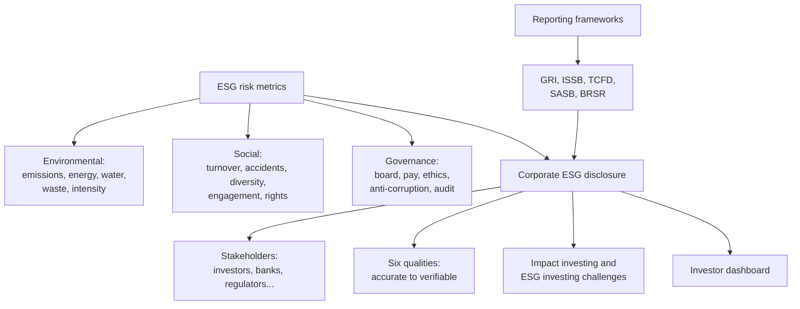

# RK-3 — Risk Metrics, Reporting Frameworks and Corporate Disclosure

Covers: the slide's E, S and G metrics, operational KRIs, the five reporting frameworks named in class, corporate ESG disclosure and the six qualities of good disclosure, the impact-investing definitions and challenges of ESG investing, and the investor dashboard activity. **(class)**

## Where this fits in the ESE

"Sustainable finance risk metrics and corporate disclosure practices" is a named Module 4 topic. Expect a 5-mark "list E, S and G metrics" or "what makes good disclosure", or a 10-mark "reporting frameworks and disclosure". The slides name the frameworks and give one line each, so learn the one-liners first and use the (general) detail for extra marks. **(syllabus)**

## ESG risk metrics (class)

| Pillar | Metrics on the slides |
|---|---|
| **Environmental** | Carbon emissions; energy consumption; water usage; waste generation; carbon intensity |
| **Social** | Employee turnover; workplace accidents; gender diversity; employee engagement; human-rights incidents |
| **Governance** | Board independence; executive remuneration; ethics violations; anti-corruption incidents; audit quality |

A metric becomes a risk control only with a **threshold, an owner and a review frequency** **(general)**. For operational risk the slides give the KRIs: data-error rate, overdue reviews, control failures, complaints and incidents. Credit indicators are PD, LGD, leverage, coverage and rating migration; market indicators are volatility, spreads, liquidity and concentration (RK-1).

**ESG scores and ratings (class: listed as a quantification approach).** Providers differ on scope, measurement and weights, so two providers can rate the same firm differently. **(general)** Treat a rating as an input, check the pillar scores and use more than one source. This is also a data and model risk (RK-1).

## ESG reporting frameworks (class)

ESG reporting helps stakeholders understand an organisation's sustainability performance and risks. The slide lists five:

| Framework | Slide one-liner | Extra (general) |
|---|---|---|
| **GRI** | Global Reporting Initiative | Widest stakeholder reporting of impact on economy, environment and people (impact materiality) |
| **ISSB** | International Sustainability Standards Board | Global baseline for investors; IFRS S1 general, S2 climate **[VERIFY]** |
| **TCFD** | Climate-related financial disclosures | Four pillars below; its monitoring passed to the ISSB **[VERIFY]** |
| **SASB** | Industry-specific sustainability information | Metrics that affect enterprise value (financial materiality) |
| **BRSR** | Business Responsibility and Sustainability Reporting in India | SEBI format for listed companies; check scope and phase-in **[VERIFY]** |

**TCFD four pillars (general; learn the order):** Governance (board oversight); Strategy (risks and opportunities, resilience under scenarios, which links to RK-2); Risk management (identify, assess, manage and join enterprise risk management, the RK-1 workflow); Metrics and targets (including emissions).

**Memory aid (general):** GRI asks what impact the firm has on the world; SASB and ISSB ask what sustainability issues change the firm's value; the EU's double materiality asks both. FS-6 has the full treatment.

## Corporate ESG disclosure (class)

**Definition:** communicating material environmental, social and governance information to stakeholders.

**Stakeholders (class):** investors, banks, regulators, employees, customers, suppliers, society.

**Good disclosure should be (class), six words:** **Accurate, Relevant, Comparable, Consistent, Transparent, Verifiable.**

Mnemonic: "ARC CTV" (Accurate, Relevant, Comparable, Consistent, Transparent, Verifiable). Link to risk: poor disclosure is an operational (data and conduct) risk and, as the cement example showed, a governance factor that triggers investor sell-offs (RK-1).

### Worked example 1: scoring a disclosure against the six tests

*Illustrative sustainability report of a manufacturer. Not a real firm.* The report gives Scope 1 emissions for this year only, with no method note, no assurance, a different boundary from last year, a vague "net zero soon" claim, and a clear list of material issues.

| Test | Evidence | Result |
|---|---|---|
| Accurate | Figures not reconciled to source data | Fail |
| Relevant | Material issues identified clearly | Pass |
| Comparable | Boundary changed, no peer metric | Fail |
| Consistent | Prior-year basis differs | Fail |
| Transparent | No method; claim has no target or date | Fail |
| Verifiable | No third-party assurance | Fail |

1. Count: 1 pass out of 6.
2. Decision line: **the report fails five of six tests, so an investor or bank should not rely on it for pricing risk.** The lender should ask for restated, assured data and treat the claim as a greenwashing flag (an operational conduct risk).
3. Interpretation: disclosure quality decides whether ESG metrics can feed PD or valuation at all. This is why the slides pair frameworks with disclosure.

## Impact investing and challenges of ESG investing (class)

The deck lists definitions, all of which share two ideas: intention and measurable impact alongside return. Full treatment of impact investing is in SP-3.

| Source | Core of the definition |
|---|---|
| JP Morgan Private Bank | Made with the intention to generate measurable positive social or environmental impact alongside a financial return |
| GIIN | Investments made to generate positive, measurable social and environmental impact alongside a financial return |
| World Economic Forum | Approach that intentionally seeks both financial return and measurable positive social or environmental impact |
| Harvard Business School | Intention to generate social or environmental outcomes and measuring them, with returns from principal to above-market |
| Royal Bank of Canada | Impact comes first; the investor may accept a capital loss if a tangible result is seen |
| Cambridge Institute for Sustainability Leadership | Creates long-term social, environmental and economic value; combines financial and non-financial value; or correctly prices social, environmental and economic risk |
| PRI | As quoted: incorporating ESG factors in investment decisions and active ownership |

Exam version of the JP Morgan line: **impact investing is investing with the intention to generate measurable positive social or environmental impact alongside a financial return.** The PRI wording on the slide describes ESG integration and active ownership more than impact investing **(general)**, so use it only to show the range of definitions.

**Challenges of ESG investing (class):**
1. Lack of good data quality and availability.
2. Regulation and consistency with fiduciary responsibilities.
3. Impact reporting and verification of desired results.
4. Limited choice of instruments and small market capitalisation.
5. High concentration of issuers in the impact investment market.

## Activity: ESG investor dashboard (course plan)

One page that an investor uses to monitor ESG risk. Suggested panels **(general)**: portfolio ESG score and trend; top-five risk holdings; controversy alerts; rating changes; disclosure quality (the six tests); engagement log.

### Worked example 2: portfolio score and traffic light

*Illustrative.* Four holdings, ESG score out of 100.

| Holding | Weight | Score | Weight × score |
|---|---|---|---|
| H1 | 40% | 78 | 31.2 |
| H2 | 30% | 64 | 19.2 |
| H3 | 20% | 52 | 10.4 |
| H4 | 10% | 45 | 4.5 |
| **Portfolio** | 100% | | **65.3** |

Rule (illustrative): green 70 and above, amber 50 to 69, red below 50. Portfolio 65.3 is **amber**; H1 green, H2 and H3 amber, H4 red. Decision line: **put H4 on the watch list and ask for a transition plan; the portfolio reaches green only if H2 and H3 improve.** Check: if H2 rises to 75 and H3 to 65, the score is 31.2 + 22.5 + 13.0 + 4.5 = 71.2, green. Interpretation: a dashboard turns metrics into thresholds and actions, not numbers alone.

## 5-mark and 10-mark skeletons

*5 marks: What makes good corporate ESG disclosure?* Definition (1); stakeholders (1); six qualities (3).

*5 marks: List ESG risk metrics under E, S and G.* Five environmental, five social and five governance metrics (any 3 each), with one threshold example (5).

*10 marks: Discuss reporting frameworks and disclosure practice for ESG risk.* Need for reporting (1); GRI, ISSB, TCFD, SASB, BRSR one line each (4); TCFD pillars (1); stakeholders (1); six qualities (2); a challenge such as data quality or greenwashing (1).

## What to remember

- Metrics: E (emissions, energy, water, waste, carbon intensity); S (turnover, accidents, diversity, engagement, human-rights incidents); G (board independence, pay, ethics, anti-corruption, audit quality).
- Frameworks named in class: GRI, ISSB, TCFD, SASB, BRSR.
- TCFD pillars: Governance, Strategy, Risk management, Metrics and targets.
- Good disclosure: accurate, relevant, comparable, consistent, transparent, verifiable.
- Impact investing (JP Morgan): intention to generate measurable positive impact alongside a financial return.
- Challenges: data quality, fiduciary and regulation, impact verification, limited instruments, issuer concentration.

## Concept map

## Flashcards
Q: List the five environmental metrics on the slide.
A: Carbon emissions, energy consumption, water usage, waste generation and carbon intensity.

Q: List the five social metrics on the slide.
A: Employee turnover, workplace accidents, gender diversity, employee engagement and human-rights incidents.

Q: List the five governance metrics on the slide.
A: Board independence, executive remuneration, ethics violations, anti-corruption incidents and audit quality.

Q: Which five reporting frameworks does the slide name?
A: GRI, ISSB, TCFD, SASB and BRSR.

Q: Name the four TCFD pillars.
A: Governance, Strategy, Risk management, Metrics and targets.

Q: Define ESG disclosure.
A: Communicating material environmental, social and governance information to stakeholders.

Q: Who are the stakeholders of ESG disclosure on the slide?
A: Investors, banks, regulators, employees, customers, suppliers and society.

Q: Good disclosure should be which six things?
A: Accurate, relevant, comparable, consistent, transparent and verifiable.

Q: State the JP Morgan definition of impact investing.
A: Investment made with the intention to generate measurable positive social or environmental impact alongside a financial return.

Q: Give three challenges of ESG investing from the slide.
A: Poor data quality and availability; regulation and fiduciary consistency; impact reporting and verification (also limited instruments and issuer concentration).

Q: Dashboard weights 40/30/20/10 and scores 78/64/52/45. Portfolio score and colour (green 70+, amber 50-69)?
A: 31.2 + 19.2 + 10.4 + 4.5 = 65.3, amber.

Q: Which KRIs does the slide give for operational risk?
A: Data-error rate, overdue reviews, control failures, complaints and incidents.

## Sources
- Faculty deck Unit 4 (pp 292-294, 297-299, 303-305, 332, 363)
- BBA304F-5 course plan, Module 4
- Related: [[Sustainable Finance Unit 3 - SP-3 Impact Investing Microfinance and EIA]], [[Sustainable Finance Unit 1 - FS-6 Reporting Regulation and Responsible Investment]]
- Previous node: [[Sustainable Finance Unit 4 - RK-2 ESG Risk Quantification]]
- Next node: [[Sustainable Finance Unit 4 - RK-4 Future Trends in ESG Risk Management]]
- [[Sustainable Finance Unit 4 - Risk MOC (Node Map)]]
